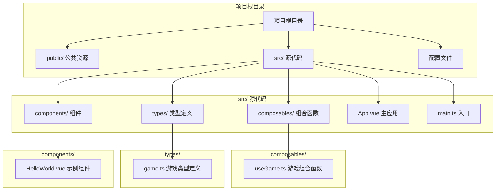
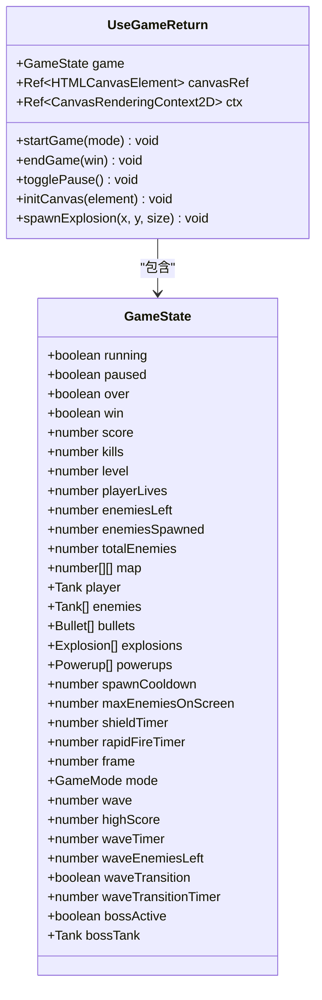
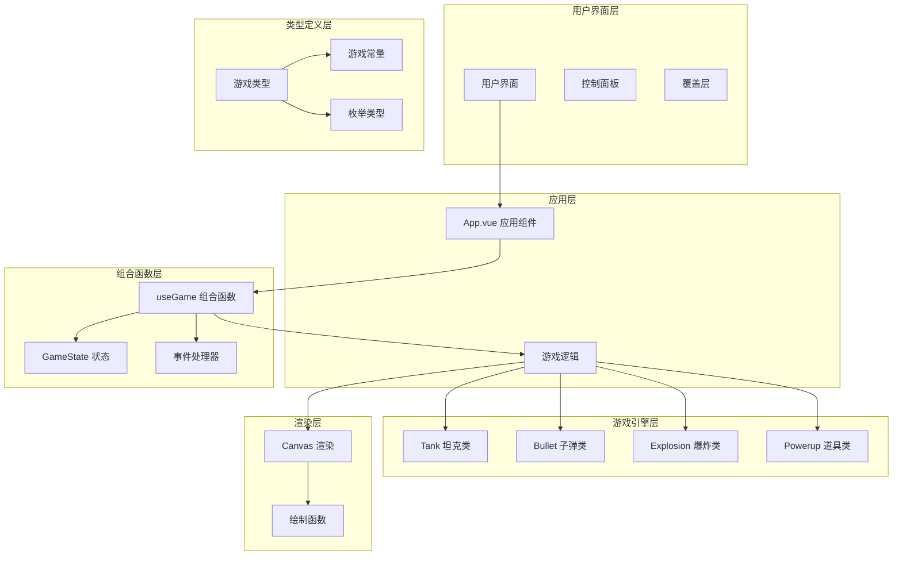
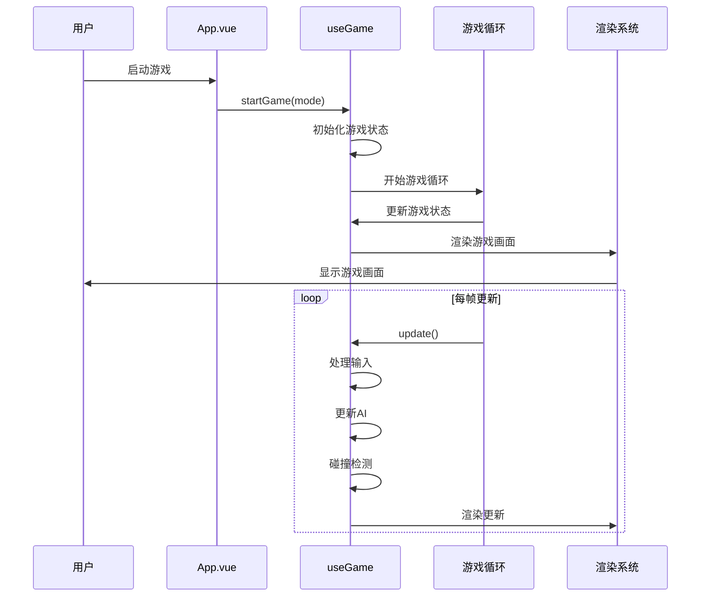
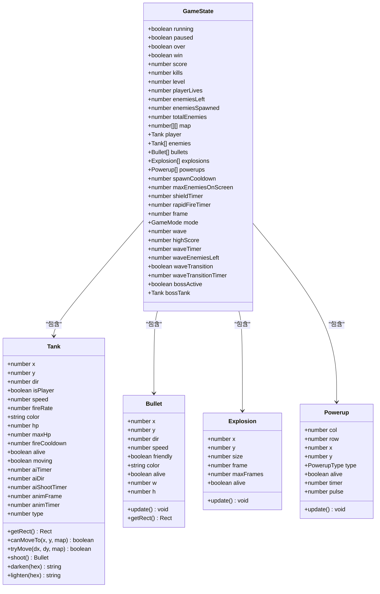
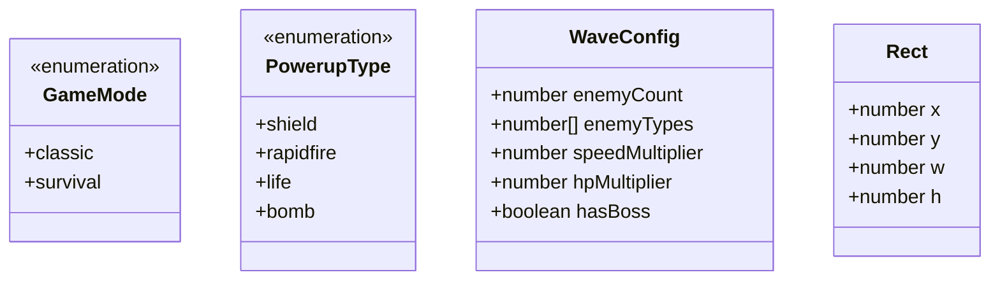
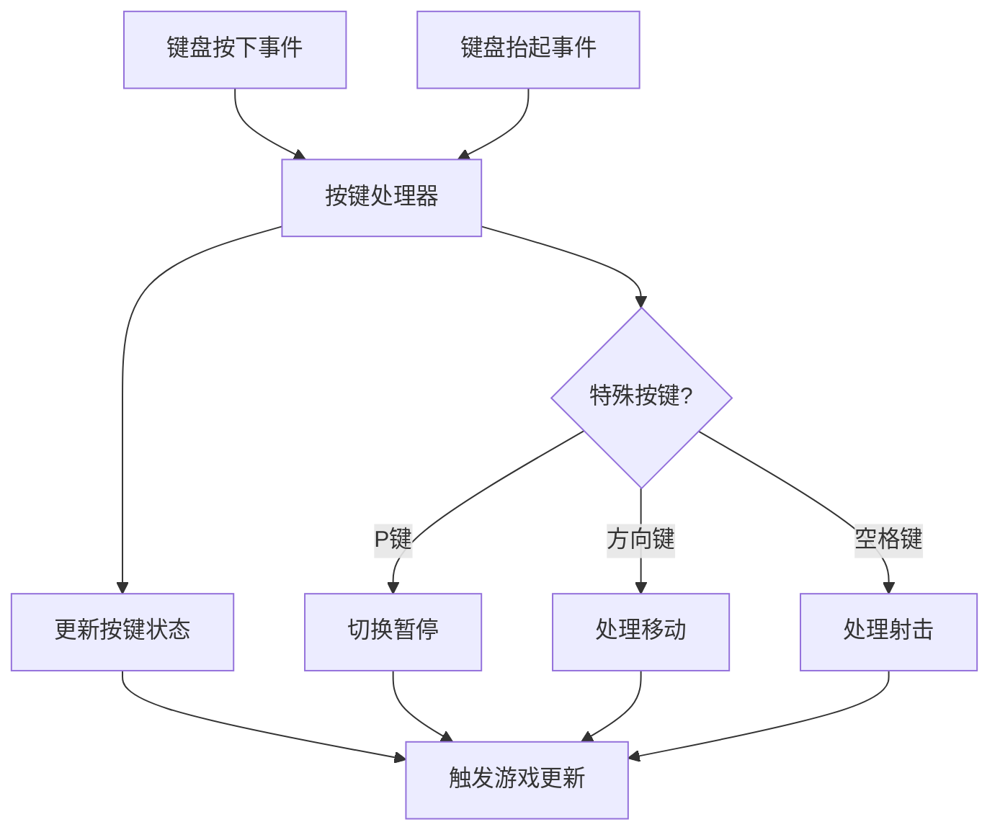
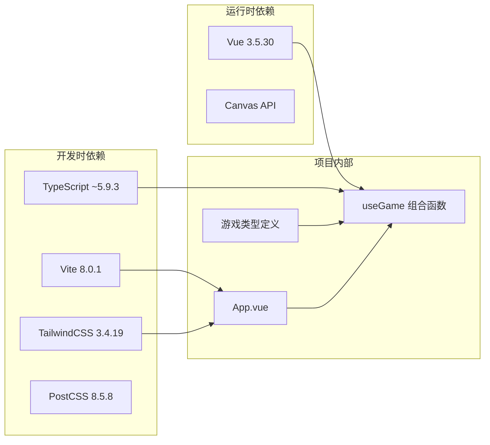
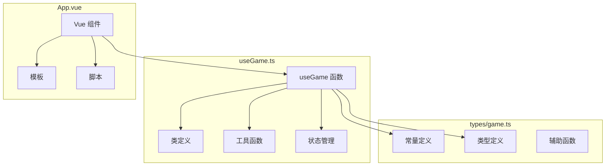
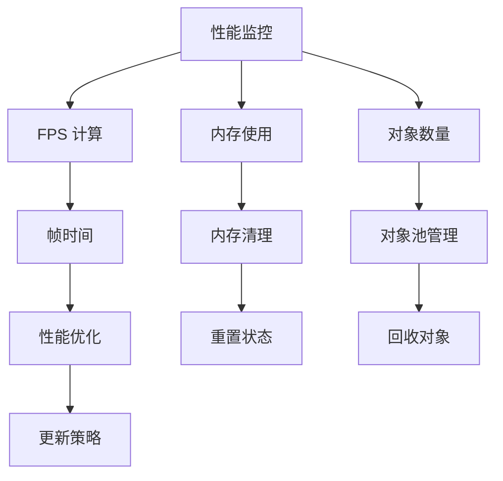

# API 参考

<cite>
**本文档引用的文件**
- [useGame.ts](file://src/composables/useGame.ts)
- [game.ts](file://src/types/game.ts)
- [App.vue](file://src/App.vue)
- [package.json](file://package.json)
- [README.md](file://README.md)
</cite>

## 目录
1. [简介](#简介)
2. [项目结构](#项目结构)
3. [核心组件](#核心组件)
4. [架构概览](#架构概览)
5. [详细组件分析](#详细组件分析)
6. [依赖关系分析](#依赖关系分析)
7. [性能考虑](#性能考虑)
8. [故障排除指南](#故障排除指南)
9. [结论](#结论)
10. [附录](#附录)

## 简介

Reimagined Journey 是一个基于 Vue 3 和 TypeScript 的坦克大战游戏，实现了经典的 Battle City 游戏玩法。该项目提供了完整的游戏组合函数 `useGame`，该函数封装了整个游戏的状态管理、事件处理和渲染逻辑。

本 API 参考文档详细记录了 `useGame` 组合函数的所有公共接口，包括函数签名、参数说明、返回值类型和使用示例。同时涵盖了游戏常量、配置项、TypeScript 类型定义、事件系统、状态管理模式和数据流设计。

## 项目结构

项目采用标准的 Vue 3 + TypeScript + Vite 项目结构，主要文件组织如下：



**图表来源**
- [package.json:1-26](file://package.json#L1-L26)
- [README.md:1-6](file://README.md#L1-L6)

**章节来源**
- [package.json:1-26](file://package.json#L1-L26)
- [README.md:1-6](file://README.md#L1-L6)

## 核心组件

### useGame 组合函数

`useGame` 是项目的核心组合函数，提供了完整的坦克大战游戏功能。它返回一个包含游戏状态和控制方法的对象。

#### 主要功能模块

1. **游戏状态管理** - 管理游戏运行状态、玩家状态、敌人状态等
2. **事件处理** - 处理键盘输入和游戏事件
3. **渲染系统** - 使用 Canvas API 进行游戏画面渲染
4. **碰撞检测** - 实现子弹、坦克、地形的碰撞逻辑
5. **AI 系统** - 实现敌人 AI 行为和决策
6. **波次管理** - 支持经典模式和生存模式的不同游戏流程

#### 返回对象结构



**图表来源**
- [useGame.ts:229-301](file://src/composables/useGame.ts#L229-L301)
- [useGame.ts:1272-1282](file://src/composables/useGame.ts#L1272-L1282)

**章节来源**
- [useGame.ts:264-1282](file://src/composables/useGame.ts#L264-L1282)

## 架构概览

### 系统架构图



**图表来源**
- [useGame.ts:16-138](file://src/composables/useGame.ts#L16-L138)
- [useGame.ts:229-262](file://src/composables/useGame.ts#L229-L262)
- [game.ts:1-300](file://src/types/game.ts#L1-L300)

### 数据流设计



**图表来源**
- [useGame.ts:1155-1160](file://src/composables/useGame.ts#L1155-L1160)
- [useGame.ts:731-792](file://src/composables/useGame.ts#L731-L792)

## 详细组件分析

### 游戏常量和配置

#### 基础游戏常量

| 常量名称 | 类型 | 默认值 | 描述 |
|---------|------|--------|------|
| TILE | number | 48 | 方块尺寸（像素） |
| COLS | number | 13 | 地图列数 |
| ROWS | number | 13 | 地图行数 |
| W | number | 624 | 游戏画布宽度 |
| H | number | 624 | 游戏画布高度 |
| DIR | object | {UP: 0, RIGHT: 1, DOWN: 2, LEFT: 3} | 方向常量 |
| DX | number[] | [0, 1, 0, -1] | X轴方向增量 |
| DY | number[] | [-1, 0, 1, 0] | Y轴方向增量 |

#### 地图元素常量

| 常量名称 | 类型 | 默认值 | 描述 |
|---------|------|--------|------|
| TILE_EMPTY | number | 0 | 空地 |
| TILE_BRICK | number | 1 | 砖墙 |
| TILE_STEEL | number | 2 | 钢墙 |
| TILE_WATER | number | 3 | 水域 |
| TILE_FOREST | number | 4 | 森林 |
| TILE_BASE | number | 5 | 基地 |

#### 道具类型

| 道具类型 | 描述 | 效果 |
|---------|------|------|
| shield | 盾牌 | 获得临时护盾，免疫一次伤害 |
| rapidfire | 加特林 | 短时间内大幅提升射速 |
| life | 生命 | 增加一条额外生命 |
| bomb | 炸弹 | 清除屏幕上的所有敌人 |

**章节来源**
- [game.ts:1-17](file://src/types/game.ts#L1-L17)
- [game.ts:19-21](file://src/types/game.ts#L19-L21)

### TypeScript 类型定义

#### GameState 接口



**图表来源**
- [useGame.ts:229-262](file://src/composables/useGame.ts#L229-L262)
- [useGame.ts:16-138](file://src/composables/useGame.ts#L16-L138)

#### 游戏模式类型



**图表来源**
- [game.ts:23-24](file://src/types/game.ts#L23-L24)
- [game.ts:19-21](file://src/types/game.ts#L19-L21)
- [game.ts:27-33](file://src/types/game.ts#L27-L33)
- [useGame.ts:58-63](file://src/composables/useGame.ts#L58-L63)

**章节来源**
- [useGame.ts:229-262](file://src/composables/useGame.ts#L229-L262)
- [game.ts:23-33](file://src/types/game.ts#L23-L33)

### API 方法详解

#### startGame 方法

**函数签名**: `startGame(mode?: GameMode): void`

**参数说明**:
- `mode`: 游戏模式，默认为 `'classic'`
  - `'classic'`: 经典模式，15关闯关制
  - `'survival'`: 生存模式，无限波次挑战

**返回值**: `void`

**功能描述**: 初始化并启动游戏，根据指定模式加载相应的游戏配置和地图。

**使用示例路径**: 
- [App.vue:19-26](file://src/App.vue#L19-L26)

**章节来源**
- [useGame.ts:1162-1176](file://src/composables/useGame.ts#L1162-L1176)

#### endGame 方法

**函数签名**: `endGame(win: boolean): void`

**参数说明**:
- `win`: 是否获胜标志

**返回值**: `void`

**功能描述**: 结束游戏，停止游戏循环，设置游戏结束状态。

**使用示例路径**:
- [useGame.ts:1230-1235](file://src/composables/useGame.ts#L1230-L1235)

**章节来源**
- [useGame.ts:1230-1235](file://src/composables/useGame.ts#L1230-L1235)

#### togglePause 方法

**函数签名**: `togglePause(): void`

**参数说明**: 无

**返回值**: `void`

**功能描述**: 切换游戏暂停状态，支持 P 键快捷操作。

**使用示例路径**:
- [useGame.ts:1237-1241](file://src/composables/useGame.ts#L1237-L1241)

**章节来源**
- [useGame.ts:1237-1241](file://src/composables/useGame.ts#L1237-L1241)

#### initCanvas 方法

**函数签名**: `initCanvas(el: HTMLCanvasElement): void`

**参数说明**:
- `el`: Canvas 元素实例

**返回值**: `void`

**功能描述**: 初始化 Canvas 渲染上下文，建立绘图环境。

**使用示例路径**:
- [App.vue:46-50](file://src/App.vue#L46-L50)

**章节来源**
- [useGame.ts:1267-1270](file://src/composables/useGame.ts#L1267-L1270)

#### spawnExplosion 方法

**函数签名**: `spawnExplosion(x: number, y: number, size: 'big' | 'medium' | 'small'): void`

**参数说明**:
- `x`: 爆炸位置 X 坐标
- `y`: 爆炸位置 Y 坐标
- `size`: 爆炸大小，可选值：'big' | 'medium' | 'small'

**返回值**: `void`

**功能描述**: 创建并添加爆炸效果到游戏场景中。

**使用示例路径**:
- [useGame.ts:356-358](file://src/composables/useGame.ts#L356-L358)

**章节来源**
- [useGame.ts:356-358](file://src/composables/useGame.ts#L356-L358)

### 游戏事件系统

#### 键盘事件处理



**图表来源**
- [useGame.ts:307-316](file://src/composables/useGame.ts#L307-L316)
- [useGame.ts:1244-1257](file://src/composables/useGame.ts#L1244-L1257)

#### 游戏循环机制

```mermaid
sequenceDiagram
participant Loop as 游戏循环
participant Update as 更新逻辑
participant Render as 渲染系统
participant Events as 事件处理
Loop->>Events : 处理输入事件
Loop->>Update : 更新游戏状态
Update->>Update : 更新玩家状态
Update->>Update : 更新敌人AI
Update->>Update : 碰撞检测
Update->>Update : 道具管理
Update->>Render : 请求渲染
Render->>Render : 绘制游戏画面
Render->>Loop : 下一帧
```

**图表来源**
- [useGame.ts:1155-1160](file://src/composables/useGame.ts#L1155-L1160)
- [useGame.ts:731-792](file://src/composables/useGame.ts#L731-L792)

**章节来源**
- [useGame.ts:307-316](file://src/composables/useGame.ts#L307-L316)
- [useGame.ts:1155-1160](file://src/composables/useGame.ts#L1155-L1160)

### 状态管理模式

#### 游戏状态层次结构

```mermaid
graph TB
subgraph "顶层状态"
Running[running: boolean]
Paused[paused: boolean]
Over[over: boolean]
Win[win: boolean]
end
subgraph "游戏统计"
Score[score: number]
Kills[kills: number]
PlayerLives[playerLives: number]
end
subgraph "关卡信息"
Level[level: number]
EnemiesLeft[enemiesLeft: number]
TotalEnemies[totalEnemies: number]
end
subgraph "模式特定"
Mode[mode: GameMode]
Wave[wave: number]
HighScore[highScore: number]
BossActive[bossActive: boolean]
end
subgraph "游戏对象"
Map[map: number[][]]
Player[player: Tank]
Enemies[enemies: Tank[]]
Bullets[bullets: Bullet[]]
Explosions[explosions: Explosion[]]
Powerups[powerups: Powerup[]]
end
Running --> Mode
Mode --> Wave
Mode --> BossActive
Level --> EnemiesLeft
EnemiesLeft --> TotalEnemies
Player --> Map
Enemies --> Map
Bullets --> Map
```

**图表来源**
- [useGame.ts:268-301](file://src/composables/useGame.ts#L268-L301)
- [useGame.ts:229-262](file://src/composables/useGame.ts#L229-L262)

**章节来源**
- [useGame.ts:268-301](file://src/composables/useGame.ts#L268-L301)

## 依赖关系分析

### 外部依赖



**图表来源**
- [package.json:11-24](file://package.json#L11-L24)

### 内部模块依赖



**图表来源**
- [useGame.ts:1-10](file://src/composables/useGame.ts#L1-L10)
- [game.ts:1-300](file://src/types/game.ts#L1-L300)

**章节来源**
- [package.json:11-24](file://package.json#L11-L24)

## 性能考虑

### 渲染优化

1. **Canvas 渲染**: 使用 Canvas 2D API 进行高效图形渲染
2. **对象池**: 复用游戏对象，避免频繁创建销毁
3. **批量更新**: 每帧统一处理所有游戏对象的状态更新
4. **条件渲染**: 仅渲染可见的游戏对象

### 内存管理

1. **垃圾回收**: 及时清理死亡的子弹、爆炸和道具
2. **数组过滤**: 使用过滤操作移除无效对象
3. **状态重置**: 游戏结束后重置所有状态

### 性能监控



## 故障排除指南

### 常见问题及解决方案

#### 游戏无法启动

**症状**: 点击开始按钮后游戏无响应

**可能原因**:
1. Canvas 元素未正确初始化
2. 键盘事件监听器未绑定
3. 游戏循环未启动

**解决方案**:
- 检查 Canvas 元素是否存在
- 确认 `initCanvas` 方法被调用
- 验证 `startGame` 方法执行正常

#### 游戏卡顿或性能问题

**症状**: 游戏画面卡顿，帧率下降

**可能原因**:
1. 对象数量过多
2. 碰撞检测效率低
3. 渲染频率过高

**解决方案**:
- 限制同时存在的敌人数量
- 优化碰撞检测算法
- 调整游戏循环频率

#### 输入无响应

**症状**: 键盘输入无法控制坦克

**可能原因**:
1. 键盘事件监听器失效
2. 游戏处于暂停状态
3. 游戏结束状态

**解决方案**:
- 检查键盘事件绑定
- 确认游戏未暂停
- 验证游戏状态为运行中

**章节来源**
- [useGame.ts:1244-1265](file://src/composables/useGame.ts#L1244-L1265)

## 结论

Reimagined Journey 项目通过 `useGame` 组合函数提供了一个完整、可扩展的坦克大战游戏解决方案。该组合函数封装了复杂的游戏逻辑，包括状态管理、事件处理、渲染系统和碰撞检测等功能。

项目的主要优势包括：
1. **模块化设计**: 清晰的模块分离和职责划分
2. **类型安全**: 完整的 TypeScript 类型定义
3. **可扩展性**: 易于添加新功能和修改现有逻辑
4. **性能优化**: 高效的渲染和状态管理机制

对于开发者而言，`useGame` 提供了简单易用的 API 接口，可以快速集成到 Vue 3 应用中，同时保持了足够的灵活性来满足不同的游戏需求。

## 附录

### 版本兼容性信息

**当前版本**: 0.0.0

**兼容性要求**:
- Vue 3.5.30 或更高版本
- TypeScript 5.9.3 或更高版本
- 现代浏览器支持 Canvas API

### 迁移指南

由于项目处于早期版本 (0.0.0)，目前没有正式的版本迁移指南。随着项目的发展，将在后续版本中提供详细的迁移文档。

### 使用场景示例

#### 基础集成示例

```typescript
// 在 Vue 组件中使用 useGame
import { useGame } from '@/composables/useGame'

const { game, startGame, initCanvas } = useGame()

// 初始化 Canvas
onMounted(() => {
  if (canvasRef.value) {
    initCanvas(canvasRef.value)
  }
})

// 开始游戏
function startClassicGame() {
  startGame('classic')
}
```

#### 高级定制示例

```typescript
// 自定义游戏配置
const customConfig = {
  playerSpeed: 3,
  enemySpawnRate: 60,
  maxEnemies: 10
}

// 扩展 useGame 功能
function createCustomGame() {
  const baseGame = useGame()
  
  // 添加自定义逻辑
  const customMethods = {
    ...baseGame,
    customUpdate: () => {
      // 自定义更新逻辑
    }
  }
  
  return customMethods
}
```

**章节来源**
- [App.vue:19-26](file://src/App.vue#L19-L26)
- [useGame.ts:1267-1282](file://src/composables/useGame.ts#L1267-L1282)