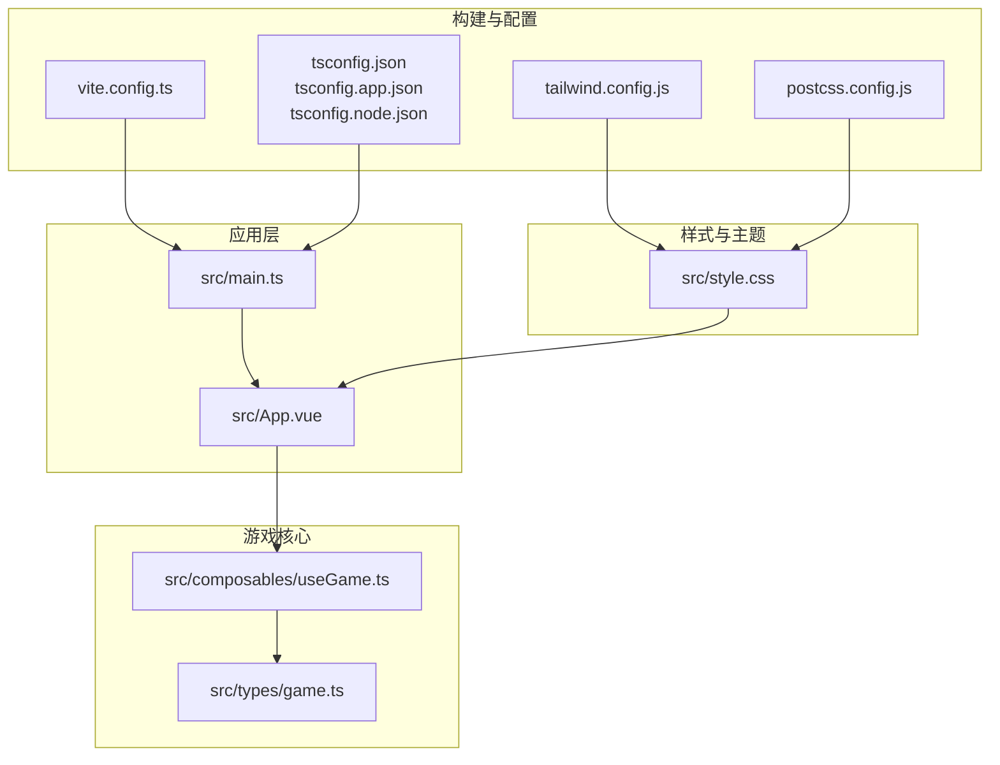
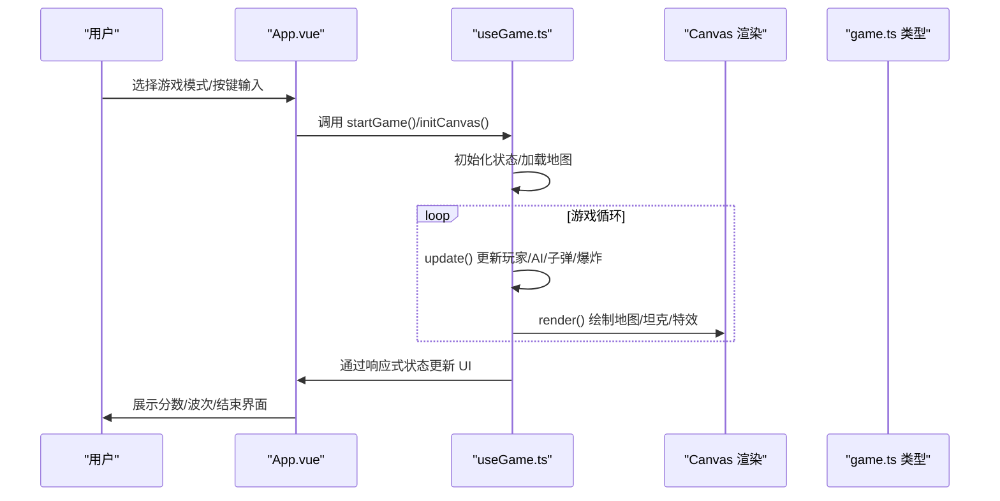
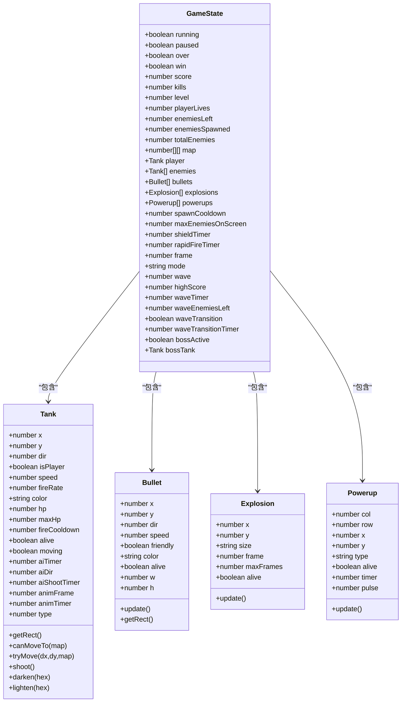
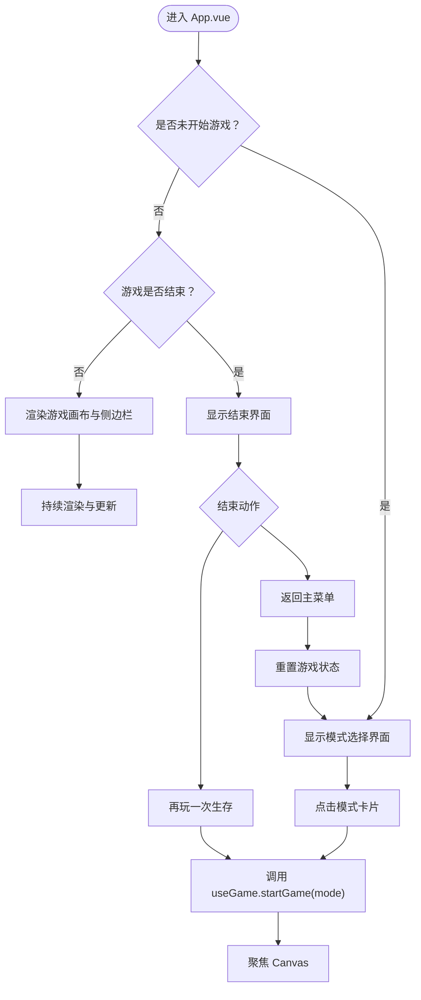
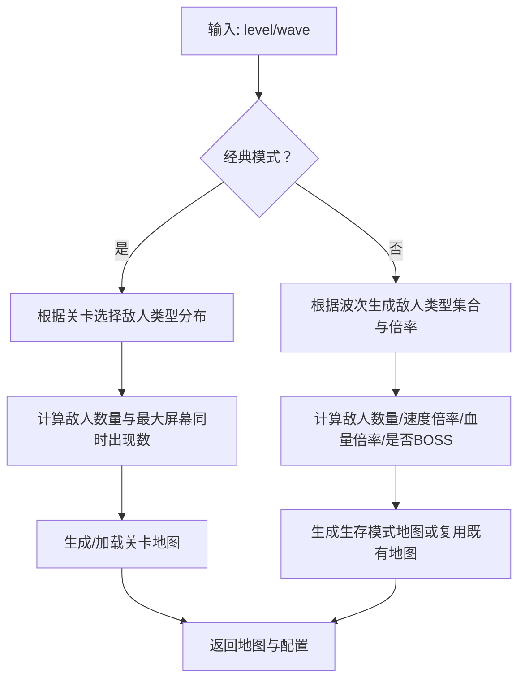
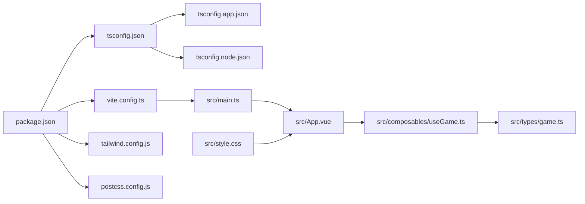

# 开发指南

<cite>
**本文档引用的文件**
- [package.json](file://package.json)
- [vite.config.ts](file://vite.config.ts)
- [tailwind.config.js](file://tailwind.config.js)
- [postcss.config.js](file://postcss.config.js)
- [tsconfig.json](file://tsconfig.json)
- [tsconfig.app.json](file://tsconfig.app.json)
- [tsconfig.node.json](file://tsconfig.node.json)
- [src/main.ts](file://src/main.ts)
- [src/App.vue](file://src/App.vue)
- [src/composables/useGame.ts](file://src/composables/useGame.ts)
- [src/types/game.ts](file://src/types/game.ts)
- [src/style.css](file://src/style.css)
- [README.md](file://README.md)
</cite>

## 目录
1. [简介](#简介)
2. [项目结构](#项目结构)
3. [核心组件](#核心组件)
4. [架构总览](#架构总览)
5. [详细组件分析](#详细组件分析)
6. [依赖关系分析](#依赖关系分析)
7. [性能考虑](#性能考虑)
8. [调试与故障排除](#调试与故障排除)
9. [结论](#结论)
10. [附录](#附录)

## 简介
本开发指南面向 Reimagined Journey（坦克大战）项目的开发者，提供从代码规范、构建配置、样式体系到游戏开发技巧、调试与性能优化的完整实践说明。项目采用 Vue 3 + TypeScript + Vite 技术栈，结合自定义 Canvas 游戏引擎实现经典街机玩法，并通过 Tailwind CSS 提供响应式与主题化样式支持。

## 项目结构
项目采用“功能模块 + 类型定义 + 组合式函数”的组织方式：
- 入口与应用层：main.ts、App.vue
- 游戏核心：composables/useGame.ts（游戏状态、逻辑与渲染）
- 类型与常量：types/game.ts（地图、敌人、波次、碰撞等）
- 样式与主题：style.css（Tailwind 基础 + 自定义样式）
- 构建与配置：Vite、Tailwind、PostCSS、TypeScript 多配置文件

图表来源
- [src/main.ts:1-6](file://src/main.ts#L1-L6)
- [src/App.vue:1-305](file://src/App.vue#L1-L305)
- [src/composables/useGame.ts:264-1282](file://src/composables/useGame.ts#L264-L1282)
- [src/types/game.ts:1-300](file://src/types/game.ts#L1-L300)
- [src/style.css:1-439](file://src/style.css#L1-L439)
- [vite.config.ts:1-8](file://vite.config.ts#L1-L8)
- [tailwind.config.js:1-12](file://tailwind.config.js#L1-L12)
- [postcss.config.js:1-7](file://postcss.config.js#L1-L7)
- [tsconfig.json:1-8](file://tsconfig.json#L1-L8)

章节来源
- [src/main.ts:1-6](file://src/main.ts#L1-L6)
- [src/App.vue:1-305](file://src/App.vue#L1-L305)
- [vite.config.ts:1-8](file://vite.config.ts#L1-L8)
- [tailwind.config.js:1-12](file://tailwind.config.js#L1-L12)
- [postcss.config.js:1-7](file://postcss.config.js#L1-L7)
- [tsconfig.json:1-8](file://tsconfig.json#L1-L8)

## 核心组件
- 应用入口与挂载：main.ts 创建 Vue 应用并挂载根组件。
- 根组件与视图：App.vue 负责游戏模式选择、UI 展示、事件绑定与状态驱动。
- 游戏组合式函数：useGame.ts 提供游戏状态、输入处理、AI、碰撞、渲染与生命周期管理。
- 类型与常量：game.ts 定义地图、敌人、波次、碰撞检测等核心数据结构与算法。
- 样式体系：style.css 引入 Tailwind 并补充自定义 UI 主题与动画。

章节来源
- [src/main.ts:1-6](file://src/main.ts#L1-L6)
- [src/App.vue:1-305](file://src/App.vue#L1-L305)
- [src/composables/useGame.ts:264-1282](file://src/composables/useGame.ts#L264-L1282)
- [src/types/game.ts:1-300](file://src/types/game.ts#L1-L300)
- [src/style.css:1-439](file://src/style.css#L1-L439)

## 架构总览
应用采用“组合式函数 + 单页应用 + Canvas 渲染”的架构：
- 视图层：Vue 3 SFC + Composition API，响应式状态驱动 UI。
- 逻辑层：useGame.ts 管理游戏循环、状态、输入与渲染。
- 数据层：game.ts 定义地图、敌人、波次、碰撞等数据模型。
- 构建层：Vite + Vue 插件 + TypeScript 编译 + Tailwind + PostCSS。

图表来源
- [src/App.vue:19-50](file://src/App.vue#L19-L50)
- [src/composables/useGame.ts:1155-1176](file://src/composables/useGame.ts#L1155-L1176)
- [src/composables/useGame.ts:731-792](file://src/composables/useGame.ts#L731-L792)
- [src/composables/useGame.ts:1071-1153](file://src/composables/useGame.ts#L1071-L1153)
- [src/types/game.ts:1-300](file://src/types/game.ts#L1-L300)

## 详细组件分析

### 组合式函数 useGame.ts
- 职责：封装游戏状态、输入处理、AI 行为、碰撞检测、波次与关卡推进、Canvas 渲染。
- 关键能力：
  - 状态管理：运行/暂停/结束、分数、击杀、关卡/波次、玩家生命、敌人队列、子弹与爆炸、道具。
  - 输入处理：键盘事件映射到移动与射击，暂停键。
  - AI 与行为：敌人寻路、射击、炮台固定射击、BOSS 散弹。
  - 碰撞与效果：子弹与地形、玩家与敌人、爆炸与道具拾取。
  - 渲染：绘制地图、坦克、子弹、爆炸、道具、波次提示与暂停覆盖层。
  - 模式切换：经典模式（15 关）与生存模式（无限波次）。
- 性能要点：使用 requestAnimationFrame 驱动循环；及时清理失效对象；波次过渡阶段暂停逻辑更新。

图表来源
- [src/composables/useGame.ts:16-138](file://src/composables/useGame.ts#L16-L138)
- [src/composables/useGame.ts:140-172](file://src/composables/useGame.ts#L140-L172)
- [src/composables/useGame.ts:174-195](file://src/composables/useGame.ts#L174-L195)
- [src/composables/useGame.ts:197-223](file://src/composables/useGame.ts#L197-L223)
- [src/composables/useGame.ts:229-301](file://src/composables/useGame.ts#L229-L301)

章节来源
- [src/composables/useGame.ts:264-1282](file://src/composables/useGame.ts#L264-L1282)

### 根组件 App.vue
- 职责：模式选择界面、游戏结束界面、侧边栏统计、Canvas 容器与焦点管理。
- 关键交互：点击模式卡片启动游戏；监听游戏 over 状态展示结果；返回菜单与再玩一次。
- 状态驱动：通过 useGame 返回的状态与方法控制 UI。

图表来源
- [src/App.vue:19-83](file://src/App.vue#L19-L83)
- [src/App.vue:86-305](file://src/App.vue#L86-L305)
- [src/composables/useGame.ts:1162-1176](file://src/composables/useGame.ts#L1162-L1176)

章节来源
- [src/App.vue:1-305](file://src/App.vue#L1-L305)

### 类型与常量 game.ts
- 职责：定义地图尺寸、方向常量、地形类型、敌人属性、波次配置、地图生成算法、碰撞检测工具。
- 设计要点：通过函数化配置（如敌人速度、血量、颜色、波次参数）实现可扩展的游戏平衡性。

图表来源
- [src/types/game.ts:87-157](file://src/types/game.ts#L87-L157)
- [src/types/game.ts:159-238](file://src/types/game.ts#L159-L238)
- [src/types/game.ts:240-296](file://src/types/game.ts#L240-L296)

章节来源
- [src/types/game.ts:1-300](file://src/types/game.ts#L1-L300)

### 样式与主题 style.css
- 职责：引入 Tailwind 基础、组件与实用类；定义游戏 UI 主题（背景、面板、控件、按钮、波次提示、BOSS 标识、新纪录闪烁等）。
- 设计要点：使用 Tailwind 实现布局与基础样式，自定义动画与视觉反馈强化游戏体验。

章节来源
- [src/style.css:1-439](file://src/style.css#L1-L439)

## 依赖关系分析
- 包管理与脚本：package.json 定义 dev/build/preview 脚本与依赖。
- 构建配置：vite.config.ts 启用 Vue 插件；tailwind.config.js 指定内容扫描路径；postcss.config.js 配置 Tailwind 与 Autoprefixer。
- 类型编译：tsconfig.json 引用 app 与 node 两套配置；app 配置启用严格模式与未使用项检查；node 配置针对构建器模式与 ESNext 模块解析。

图表来源
- [package.json:1-26](file://package.json#L1-L26)
- [vite.config.ts:1-8](file://vite.config.ts#L1-L8)
- [tsconfig.json:1-8](file://tsconfig.json#L1-L8)
- [tsconfig.app.json:1-17](file://tsconfig.app.json#L1-L17)
- [tsconfig.node.json:1-27](file://tsconfig.node.json#L1-L27)
- [tailwind.config.js:1-12](file://tailwind.config.js#L1-L12)
- [postcss.config.js:1-7](file://postcss.config.js#L1-L7)
- [src/main.ts:1-6](file://src/main.ts#L1-L6)
- [src/App.vue:1-305](file://src/App.vue#L1-L305)
- [src/composables/useGame.ts:264-1282](file://src/composables/useGame.ts#L264-L1282)
- [src/types/game.ts:1-300](file://src/types/game.ts#L1-L300)
- [src/style.css:1-439](file://src/style.css#L1-L439)

章节来源
- [package.json:1-26](file://package.json#L1-L26)
- [tsconfig.json:1-8](file://tsconfig.json#L1-L8)
- [tsconfig.app.json:1-17](file://tsconfig.app.json#L1-L17)
- [tsconfig.node.json:1-27](file://tsconfig.node.json#L1-L27)
- [tailwind.config.js:1-12](file://tailwind.config.js#L1-L12)
- [postcss.config.js:1-7](file://postcss.config.js#L1-L7)

## 性能考虑
- 游戏循环与渲染
  - 使用 requestAnimationFrame 驱动循环，避免阻塞主线程。
  - 在波次过渡阶段暂停逻辑更新，仅进行过渡渲染，降低 CPU 占用。
- 对象生命周期
  - 及时过滤失效对象（子弹、爆炸、道具），避免累积导致性能下降。
  - 控制最大屏幕同时出现敌人数量，随关卡/波次动态调整。
- 渲染优化
  - 优先使用 Canvas 批量绘制，减少 DOM 操作。
  - 利用阴影与渐变时注意 alpha 与半径控制，避免过度绘制。
- 内存管理
  - 避免闭包持有长生命周期引用；在组件卸载时取消动画帧与移除事件监听。
  - 本地存储高分时注意键名一致性与序列化格式。
- TypeScript 严格性
  - 启用严格模式与未使用项检查，减少潜在内存泄漏与逻辑错误。
  - 使用只读与不可变数据结构（如深拷贝地图）提升稳定性。

章节来源
- [src/composables/useGame.ts:731-792](file://src/composables/useGame.ts#L731-L792)
- [src/composables/useGame.ts:1259-1265](file://src/composables/useGame.ts#L1259-L1265)
- [tsconfig.app.json:8-14](file://tsconfig.app.json#L8-L14)

## 调试与故障排除
- 常见问题与定位
  - 游戏无响应：确认 Canvas 已初始化并获取上下文；检查游戏循环是否启动；验证键盘事件是否正确绑定与解绑。
  - 键位无效：检查按键映射与事件捕获顺序；确认非默认行为（如方向键滚动页面）已被阻止。
  - 渲染异常：检查地图绘制顺序与透明度叠加；确认波次过渡覆盖层绘制时机。
  - 性能抖动：观察敌人数量与屏幕刷新频率；减少不必要的阴影与渐变；优化碰撞检测范围。
- 调试建议
  - 使用浏览器开发者工具的性能面板监测帧耗时与内存增长。
  - 在关键函数（update、render、碰撞检测）添加日志或断点，观察状态变化。
  - 分离测试：将碰撞检测与地图生成抽离为独立单元测试，确保边界条件正确。
- 版本与环境
  - 确认 Node 与依赖版本满足构建要求；必要时清理缓存后重新安装依赖。

章节来源
- [src/composables/useGame.ts:1244-1265](file://src/composables/useGame.ts#L1244-L1265)
- [src/composables/useGame.ts:1071-1153](file://src/composables/useGame.ts#L1071-L1153)
- [src/types/game.ts:298-300](file://src/types/game.ts#L298-L300)

## 结论
本项目以清晰的职责分离与严格的类型约束实现了高性能的 Canvas 游戏体验。通过组合式函数封装复杂逻辑，配合 Tailwind 与自定义样式构建一致的 UI 主题；借助 Vite 与 TypeScript 提供高效的开发与构建体验。遵循本文档的规范与最佳实践，可进一步提升开发效率、可维护性与性能表现。

## 附录

### TypeScript 编码标准
- 项目配置
  - app 配置启用严格模式与未使用项检查，确保类型安全与代码质量。
  - node 配置采用 bundler 模式与 ESNext 模块解析，适配现代打包链路。
- 命名与结构
  - 使用语义化命名（如 GameState、Tank、Bullet），避免缩写。
  - 将纯函数与副作用分离，便于测试与维护。
- 类型设计
  - 使用只读与字面量联合类型（如 GameMode）提升安全性。
  - 对外暴露接口时明确可选字段与默认值。

章节来源
- [tsconfig.app.json:1-17](file://tsconfig.app.json#L1-L17)
- [tsconfig.node.json:1-27](file://tsconfig.node.json#L1-L27)
- [src/types/game.ts:23-24](file://src/types/game.ts#L23-L24)

### Vue 组件开发规范
- 组合式函数
  - 将状态、逻辑与生命周期集中在单一文件内，便于复用与测试。
  - 明确导出 API（如 startGame、initCanvas），避免外部直接修改内部状态。
- 模板与样式
  - 使用 Tailwind 实现响应式布局与主题化；自定义动画与视觉反馈增强体验。
  - 将交互与状态驱动分离，模板仅负责展示。
- 事件与输入
  - 统一键盘事件处理，避免默认行为干扰；在组件卸载时清理事件监听。

章节来源
- [src/composables/useGame.ts:1272-1282](file://src/composables/useGame.ts#L1272-L1282)
- [src/App.vue:1-305](file://src/App.vue#L1-L305)
- [src/style.css:1-439](file://src/style.css#L1-L439)

### Canvas 游戏开发技巧
- 渲染管线
  - 先绘制背景与网格，再绘制地图元素，最后绘制动态对象（坦克、子弹、爆炸）。
  - 使用局部 save/restore 控制变换与阴影，避免全局污染。
- 动画与帧率
  - 使用 requestAnimationFrame 保证流畅度；在波次过渡阶段暂停逻辑更新。
- 碰撞与边界
  - 使用矩形包围盒快速检测；对地形与玩家/敌人进行精确边界吸附与阻挡判断。
- 性能优化
  - 及时过滤失效对象；限制最大同时出现敌人数量；合理使用阴影与渐变。

章节来源
- [src/composables/useGame.ts:1071-1153](file://src/composables/useGame.ts#L1071-L1153)
- [src/composables/useGame.ts:533-636](file://src/composables/useGame.ts#L533-L636)
- [src/types/game.ts:298-300](file://src/types/game.ts#L298-L300)

### 构建与配置系统
- Vite
  - 启用 Vue 插件，自动处理单文件组件与类型声明。
- Tailwind CSS
  - content 扫描范围覆盖 src 下所有 Vue/TS/JS 文件；按需生成样式，减少体积。
- PostCSS
  - 集成 Tailwind 与 Autoprefixer，自动处理浏览器兼容性。
- TypeScript
  - 多配置文件组织：根配置引用 app 与 node 配置；app 配置启用严格模式；node 配置适配构建器模式。

章节来源
- [vite.config.ts:1-8](file://vite.config.ts#L1-L8)
- [tailwind.config.js:1-12](file://tailwind.config.js#L1-L12)
- [postcss.config.js:1-7](file://postcss.config.js#L1-L7)
- [tsconfig.json:1-8](file://tsconfig.json#L1-L8)
- [tsconfig.app.json:1-17](file://tsconfig.app.json#L1-L17)
- [tsconfig.node.json:1-27](file://tsconfig.node.json#L1-L27)

### 开发工作流程与版本控制
- 分支与提交
  - 使用功能分支开发特性，提交信息清晰描述变更目的与影响范围。
- 代码审查
  - 通过 PR 进行代码审查，重点关注性能、可读性与类型安全。
- 本地预览
  - 使用 dev 脚本热更新开发，build 脚本生成生产包，preview 验证部署产物。
- 团队协作
  - 统一编码风格与命名约定；定期同步依赖版本；对关键逻辑编写注释与测试。

章节来源
- [package.json:6-10](file://package.json#L6-L10)
- [README.md:1-6](file://README.md#L1-L6)