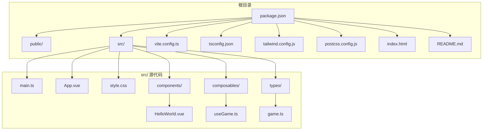
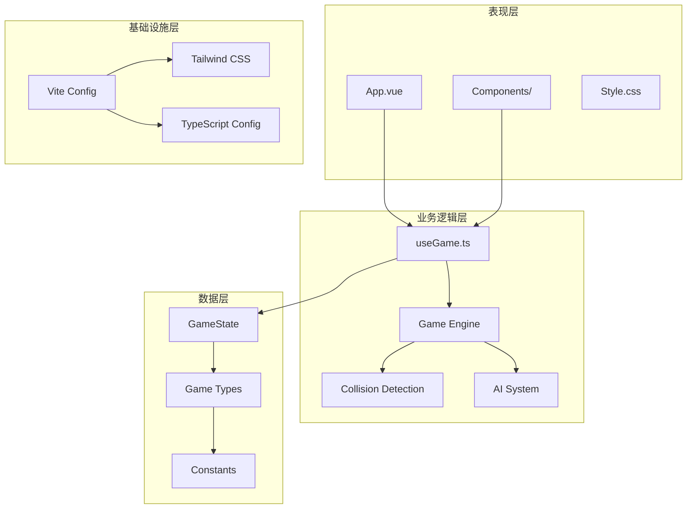
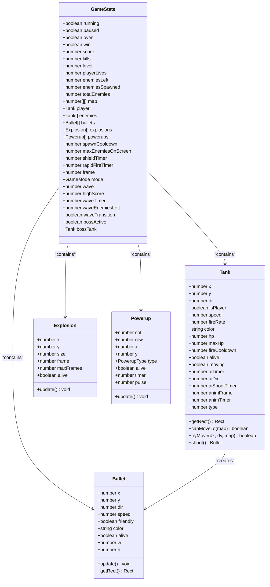
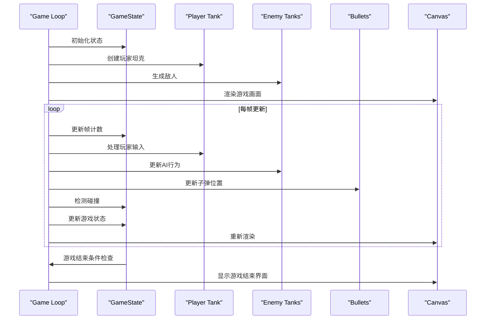
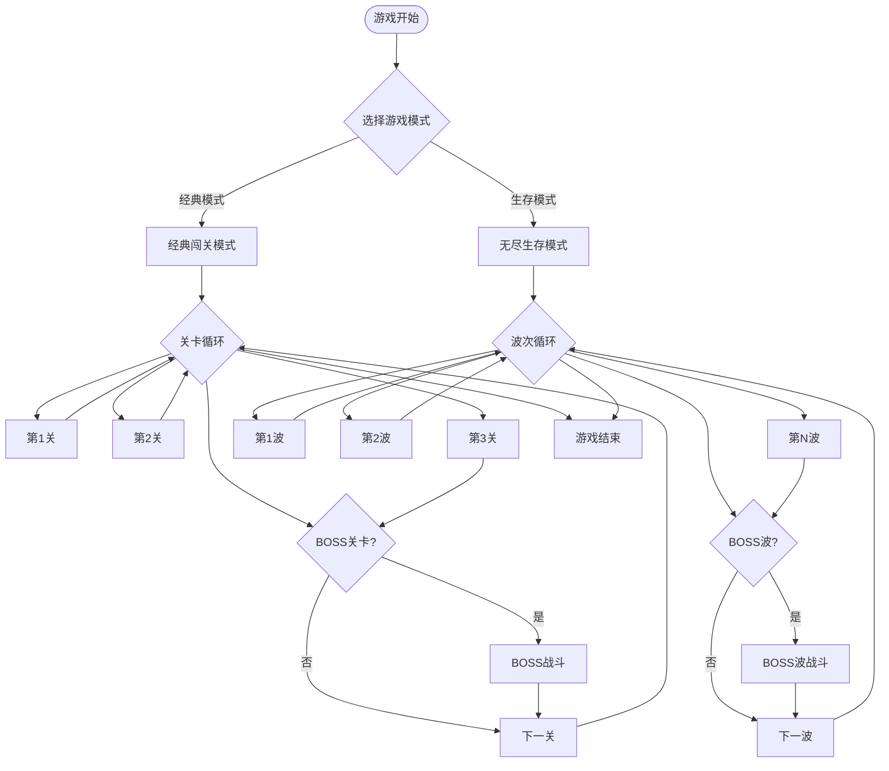
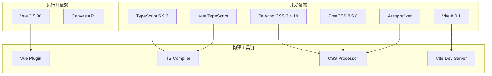

# 快速开始

<cite>
**本文档引用的文件**
- [README.md](file://README.md)
- [package.json](file://package.json)
- [vite.config.ts](file://vite.config.ts)
- [tsconfig.json](file://tsconfig.json)
- [tsconfig.app.json](file://tsconfig.app.json)
- [tsconfig.node.json](file://tsconfig.node.json)
- [tailwind.config.js](file://tailwind.config.js)
- [postcss.config.js](file://postcss.config.js)
- [index.html](file://index.html)
- [src/main.ts](file://src/main.ts)
- [src/App.vue](file://src/App.vue)
- [src/composables/useGame.ts](file://src/composables/useGame.ts)
- [src/types/game.ts](file://src/types/game.ts)
- [src/style.css](file://src/style.css)
- [src/components/HelloWorld.vue](file://src/components/HelloWorld.vue)
</cite>

## 目录
1. [简介](#简介)
2. [项目结构](#项目结构)
3. [核心组件](#核心组件)
4. [架构概览](#架构概览)
5. [详细组件分析](#详细组件分析)
6. [依赖分析](#依赖分析)
7. [性能考虑](#性能考虑)
8. [故障排除指南](#故障排除指南)
9. [结论](#结论)
10. [附录](#附录)

## 简介
Reimagined Journey 是一个基于 Vue 3 + TypeScript + Vite 的 2D 坦克对战游戏项目。该项目使用现代前端技术栈，提供了经典闯关和无尽生存两种游戏模式，支持实时渲染、碰撞检测、波次管理、道具系统等核心功能。

## 项目结构
项目采用模块化组织方式，主要目录结构如下：

**图表来源**
- [package.json:1-26](file://package.json#L1-L26)
- [src/main.ts:1-6](file://src/main.ts#L1-L6)
- [src/App.vue:1-305](file://src/App.vue#L1-L305)

**章节来源**
- [package.json:1-26](file://package.json#L1-L26)
- [README.md:1-6](file://README.md#L1-L6)

## 核心组件
项目的核心由以下关键组件构成：

### 应用入口
应用通过 Vue 3 的组合式 API 和 TypeScript 进行初始化，使用 Vite 作为构建工具和开发服务器。

### 游戏引擎
游戏逻辑集中在 `useGame` 组合函数中，实现了完整的 2D 游戏循环，包括：
- 实体管理系统（玩家、敌人、子弹、爆炸）
- 碰撞检测算法
- AI 行为控制
- 波次管理
- 道具系统

### 类型定义
游戏常量和类型定义位于 `game.ts` 文件中，包括：
- 游戏网格尺寸和单位
- 方向常量
- 地形类型
- 敌人属性配置
- 波次配置

**章节来源**
- [src/main.ts:1-6](file://src/main.ts#L1-L6)
- [src/App.vue:1-305](file://src/App.vue#L1-L305)
- [src/composables/useGame.ts:1-800](file://src/composables/useGame.ts#L1-L800)
- [src/types/game.ts:1-300](file://src/types/game.ts#L1-L300)

## 架构概览
项目采用分层架构设计，各层职责清晰分离：

**图表来源**
- [src/App.vue:1-305](file://src/App.vue#L1-L305)
- [src/composables/useGame.ts:264-301](file://src/composables/useGame.ts#L264-L301)
- [src/types/game.ts:1-300](file://src/types/game.ts#L1-L300)
- [vite.config.ts:1-8](file://vite.config.ts#L1-L8)

## 详细组件分析

### 游戏状态管理
游戏状态通过响应式对象管理，包含所有游戏运行时数据：

**图表来源**
- [src/composables/useGame.ts:229-262](file://src/composables/useGame.ts#L229-L262)
- [src/composables/useGame.ts:16-138](file://src/composables/useGame.ts#L16-L138)
- [src/composables/useGame.ts:140-172](file://src/composables/useGame.ts#L140-L172)
- [src/composables/useGame.ts:174-195](file://src/composables/useGame.ts#L174-L195)
- [src/composables/useGame.ts:197-223](file://src/composables/useGame.ts#L197-L223)

### 游戏循环流程
游戏采用固定时间步长的更新循环：

**图表来源**
- [src/composables/useGame.ts:731-792](file://src/composables/useGame.ts#L731-L792)
- [src/App.vue:46-50](file://src/App.vue#L46-L50)

### 游戏模式系统
项目支持两种游戏模式，每种模式有不同的规则和体验：

**图表来源**
- [src/App.vue:19-44](file://src/App.vue#L19-L44)
- [src/types/game.ts:23-24](file://src/types/game.ts#L23-L24)
- [src/composables/useGame.ts:360-450](file://src/composables/useGame.ts#L360-L450)

**章节来源**
- [src/composables/useGame.ts:264-301](file://src/composables/useGame.ts#L264-L301)
- [src/types/game.ts:23-24](file://src/types/game.ts#L23-L24)
- [src/App.vue:19-83](file://src/App.vue#L19-L83)

## 依赖分析
项目使用现代化的前端技术栈，主要依赖关系如下：

**图表来源**
- [package.json:11-24](file://package.json#L11-L24)
- [vite.config.ts:1-8](file://vite.config.ts#L1-L8)
- [tsconfig.app.json:1-17](file://tsconfig.app.json#L1-L17)

**章节来源**
- [package.json:1-26](file://package.json#L1-L26)
- [tsconfig.json:1-8](file://tsconfig.json#L1-L8)

## 性能考虑
项目在性能方面采用了多项优化策略：

### 渲染优化
- 使用 Canvas 2D API 进行高效图形渲染
- 实现了脏矩形更新机制，仅重绘变化区域
- 采用对象池模式管理游戏实体，减少垃圾回收压力

### 内存管理
- 所有游戏实体都实现了生命周期管理
- 及时清理不再使用的对象和 DOM 元素
- 合理使用 WeakMap 和 WeakSet 避免内存泄漏

### 碰撞检测优化
- 使用空间分割算法优化碰撞检测效率
- 实现了早期退出机制，避免不必要的计算
- 利用 AABB 碰撞检测简化复杂形状判断

## 故障排除指南

### 开发环境问题
**问题：Node.js 版本不兼容**
- 症状：npm install 失败或构建错误
- 解决方案：确保使用 Node.js 16+ 版本，推荐 LTS 版本

**问题：TypeScript 编译错误**
- 症状：编译时报错，特别是关于严格模式的错误
- 解决方案：检查 tsconfig 文件中的严格模式设置，确保符合项目要求

**问题：Vite 开发服务器无法启动**
- 症状：端口被占用或热重载失效
- 解决方案：修改 vite.config.ts 中的端口配置，或重启开发服务器

### 浏览器兼容性问题
**问题：某些浏览器不支持 Canvas API**
- 症状：游戏无法正常显示或功能异常
- 解决方案：确保使用现代浏览器（Chrome 80+, Firefox 74+, Safari 14+）

**问题：CSS 动画在旧版浏览器中失效**
- 症状：动画效果不工作或显示异常
- 解决方案：检查 Tailwind CSS 配置，确保启用了必要的浏览器前缀

### 性能问题诊断
**问题：游戏运行缓慢**
- 症状：帧率低于预期，特别是在复杂场景中
- 排查步骤：
  1. 检查是否有过多的 DOM 操作
  2. 确认 Canvas 渲染优化是否生效
  3. 分析是否存在内存泄漏

**问题：内存使用过高**
- 症状：页面加载后内存持续增长
- 解决方案：检查游戏实体的生命周期管理，确保及时清理不再使用的对象

**章节来源**
- [package.json:14-24](file://package.json#L14-L24)
- [tsconfig.app.json:8-13](file://tsconfig.app.json#L8-L13)
- [tailwind.config.js:1-12](file://tailwind.config.js#L1-L12)

## 结论
Reimagined Journey 项目展示了现代前端游戏开发的最佳实践，通过合理的架构设计和性能优化，为开发者提供了一个功能完整、易于扩展的游戏框架。项目采用的技术栈成熟稳定，文档和注释完善，适合学习和二次开发。

## 附录

### 开发环境要求
- **Node.js**: 16+ 版本（推荐 LTS）
- **包管理器**: npm 8+ 或 yarn 1.22+
- **浏览器**: 支持 Canvas API 的现代浏览器

### 安装步骤
1. 克隆项目仓库
2. 在项目根目录执行 `npm install`
3. 启动开发服务器：`npm run dev`
4. 访问 `http://localhost:5173`

### 构建和部署
- **开发构建**: `npm run dev`
- **生产构建**: `npm run build`
- **本地预览**: `npm run preview`

### 主要配置文件说明
- `vite.config.ts`: Vite 构建工具配置
- `tsconfig.json`: TypeScript 编译配置
- `tailwind.config.js`: CSS 框架配置
- `postcss.config.js`: PostCSS 处理器配置

**章节来源**
- [README.md:1-6](file://README.md#L1-L6)
- [package.json:6-10](file://package.json#L6-L10)
- [vite.config.ts:1-8](file://vite.config.ts#L1-L8)
- [tsconfig.json:1-8](file://tsconfig.json#L1-L8)