# Canvas 渲染系统

<cite>
**本文档引用的文件**
- [README.md](file://README.md)
- [index.html](file://index.html)
- [src/main.ts](file://src/main.ts)
- [src/App.vue](file://src/App.vue)
- [src/composables/useGame.ts](file://src/composables/useGame.ts)
- [src/types/game.ts](file://src/types/game.ts)
- [src/style.css](file://src/style.css)
- [package.json](file://package.json)
- [vite.config.ts](file://vite.config.ts)
</cite>

## 目录
1. [简介](#简介)
2. [项目结构](#项目结构)
3. [核心组件](#核心组件)
4. [架构概览](#架构概览)
5. [详细组件分析](#详细组件分析)
6. [新增功能特性](#新增功能特性)
7. [依赖关系分析](#依赖关系分析)
8. [性能考虑](#性能考虑)
9. [故障排除指南](#故障排除指南)
10. [结论](#结论)
11. [附录](#附录)

## 简介
Reimagined Journey 是一个基于 Vue 3 + TypeScript + Vite 构建的坦克大战游戏，采用 Canvas 2D API 实现高性能的 2D 游戏渲染。该系统实现了完整的渲染循环、帧率控制、图层管理、动画效果和性能优化策略，为玩家提供流畅的游戏体验。系统现已支持经典模式和生存模式，包含BOSS血条显示、波次过渡动画、高分成就动画等视觉效果。

## 项目结构
该项目采用现代化的前端技术栈，核心文件组织如下：

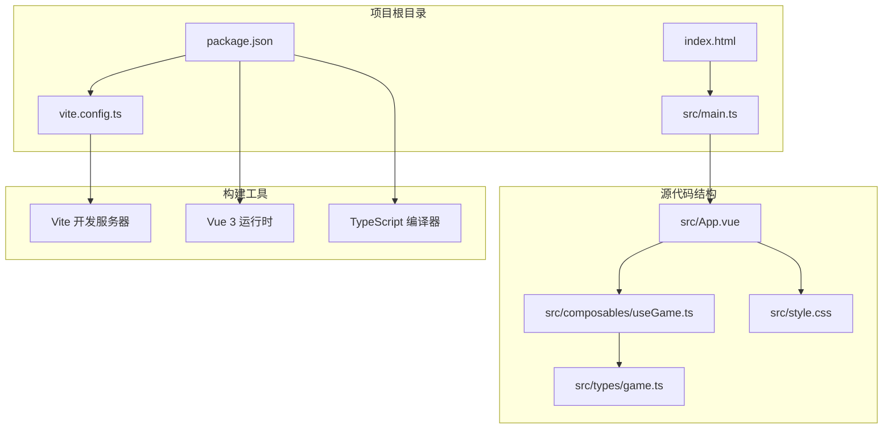

**图表来源**
- [index.html:1-14](file://index.html#L1-L14)
- [src/main.ts:1-6](file://src/main.ts#L1-L6)
- [package.json:1-26](file://package.json#L1-L26)

**章节来源**
- [README.md:1-6](file://README.md#L1-L6)
- [index.html:1-14](file://index.html#L1-L14)
- [src/main.ts:1-6](file://src/main.ts#L1-L6)

## 核心组件
Canvas 渲染系统的核心由以下组件构成：

### 游戏状态管理
- **GameState 接口**：定义完整的游戏状态，包括运行状态、暂停状态、游戏结束状态、分数、击杀数、关卡信息等
- **GameMode 类型**：支持经典模式和生存模式两种游戏模式
- **PowerupType 类型**：定义四种道具类型（护盾、快速射击、生命、炸弹）
- **WaveConfig 接口**：生存模式波次配置，包含敌人数量、类型、倍率等参数

### 渲染引擎
- **Canvas 上下文管理**：通过 ref 和 reactive 管理 Canvas 元素和渲染上下文
- **渲染循环**：基于 requestAnimationFrame 的高效渲染循环
- **帧率控制**：通过动画帧调度实现稳定的 60FPS 渲染

### 游戏对象系统
- **Tank 类**：玩家和敌人的统一表示，包含位置、方向、速度、血量等属性
- **Bullet 类**：子弹对象，支持友军和敌军区分
- **Explosion 类**：爆炸效果，支持不同尺寸的爆炸动画
- **Powerup 类**：道具系统，包含护盾、快速射击、生命、炸弹四种效果

**章节来源**
- [src/composables/useGame.ts:229-301](file://src/composables/useGame.ts#L229-L301)
- [src/types/game.ts:19-33](file://src/types/game.ts#L19-L33)

## 架构概览
整个渲染系统采用组件化架构，通过 Vue 3 的组合式 API 实现状态管理和渲染控制：

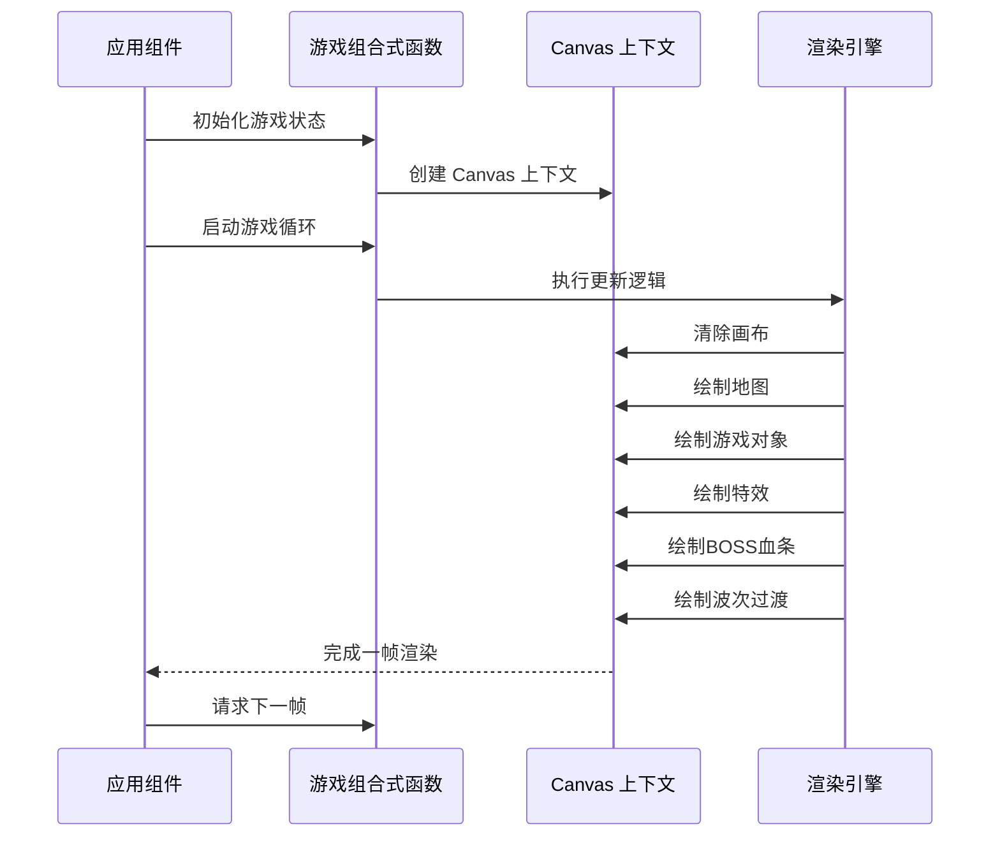

**图表来源**
- [src/App.vue:19-26](file://src/App.vue#L19-L26)
- [src/composables/useGame.ts:1155-1160](file://src/composables/useGame.ts#L1155-L1160)
- [src/composables/useGame.ts:1071-1153](file://src/composables/useGame.ts#L1071-L1153)

## 详细组件分析

### 渲染循环与帧率控制
渲染系统采用基于 requestAnimationFrame 的高效循环机制：

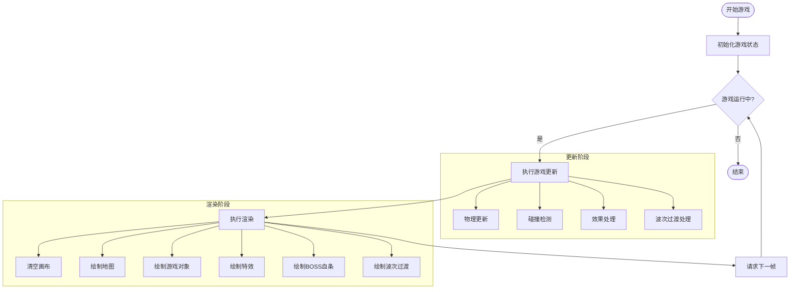

**图表来源**
- [src/composables/useGame.ts:1155-1160](file://src/composables/useGame.ts#L1155-L1160)
- [src/composables/useGame.ts:731-792](file://src/composables/useGame.ts#L731-L792)
- [src/composables/useGame.ts:1071-1153](file://src/composables/useGame.ts#L1071-L1153)

### 图层管理系统
渲染系统实现了清晰的图层分离，确保绘制顺序的正确性：

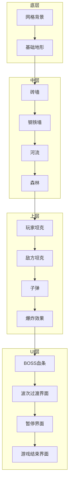

**图表来源**
- [src/composables/useGame.ts:1071-1153](file://src/composables/useGame.ts#L1071-L1153)
- [src/composables/useGame.ts:828-920](file://src/composables/useGame.ts#L828-L920)

### 坐标系统与变换矩阵
游戏采用基于网格的坐标系统，每个格子大小为 48x48 像素：

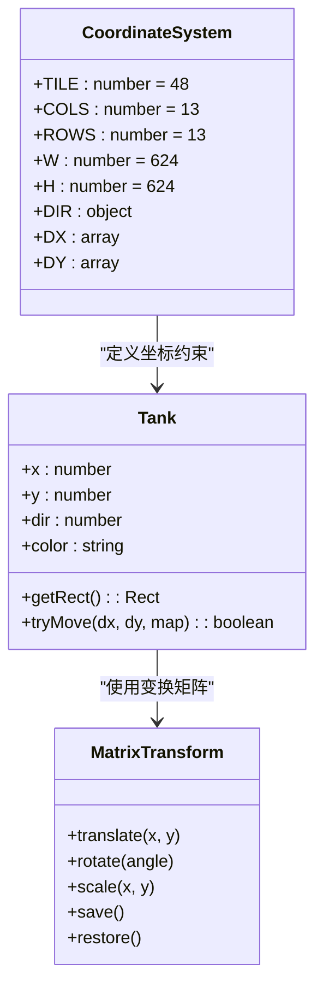

**图表来源**
- [src/types/game.ts:1-11](file://src/types/game.ts#L1-L11)
- [src/composables/useGame.ts:16-55](file://src/composables/useGame.ts#L16-L55)
- [src/composables/useGame.ts:921-980](file://src/composables/useGame.ts#L921-L980)

### 动画效果实现
系统实现了多种动画效果，包括坦克履带动画、爆炸效果、护盾闪烁、BOSS血条动画等：

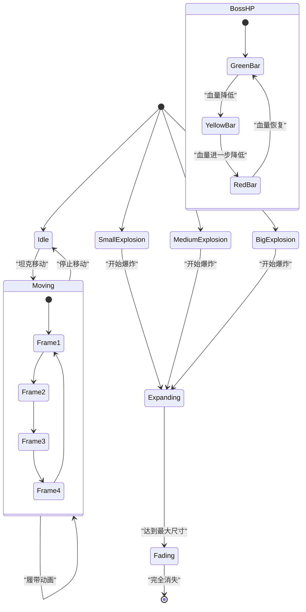

**图表来源**
- [src/composables/useGame.ts:939-946](file://src/composables/useGame.ts#L939-L946)
- [src/composables/useGame.ts:174-195](file://src/composables/useGame.ts#L174-L195)

### 绘制命令组织方式
渲染系统采用模块化的绘制函数设计：

| 绘制类别 | 函数名称 | 功能描述 |
|---------|----------|----------|
| 地形绘制 | drawMap | 绘制整个游戏地图 |
| 地形元素 | drawBrick, drawSteel, drawWater, drawForest, drawBase | 绘制不同类型地形 |
| 游戏对象 | drawTank, drawBullet | 绘制坦克和子弹 |
| 特效系统 | drawExplosion, drawPowerup | 绘制爆炸和道具 |
| UI系统 | drawBossHP, drawWaveTransition | 绘制BOSS血条和波次过渡 |
| 覆盖层 | drawForestOverlay | 绘制森林覆盖效果 |

**章节来源**
- [src/composables/useGame.ts:794-826](file://src/composables/useGame.ts#L794-L826)
- [src/composables/useGame.ts:828-920](file://src/composables/useGame.ts#L828-L920)
- [src/composables/useGame.ts:921-1069](file://src/composables/useGame.ts#L921-L1069)

## 新增功能特性

### BOSS血条显示系统
系统新增了完整的BOSS血条显示功能，为玩家提供清晰的BOSS状态指示：

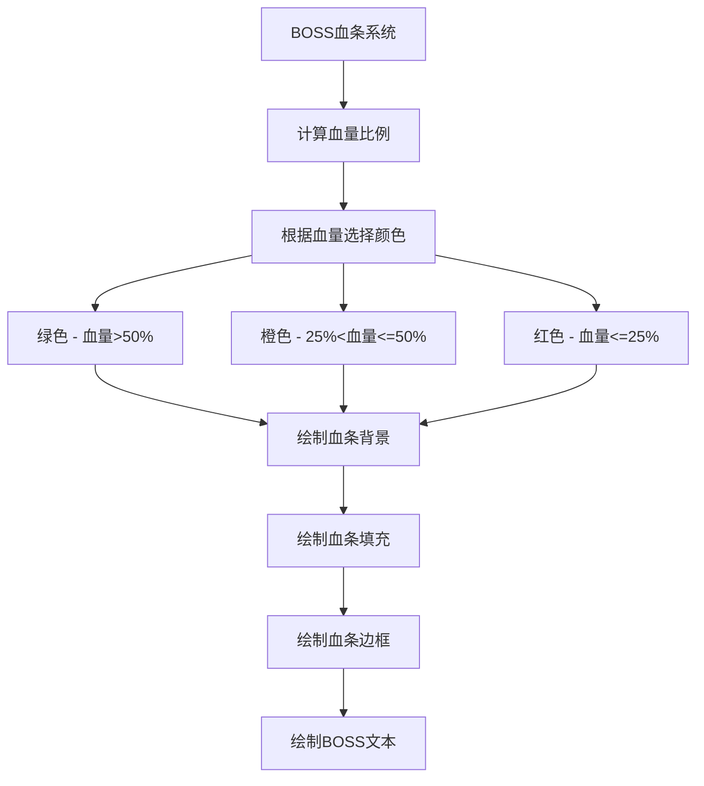

**图表来源**
- [src/composables/useGame.ts:1111-1128](file://src/composables/useGame.ts#L1111-L1128)

### 波次过渡动画系统
生存模式新增了波次过渡动画，提供流畅的波次切换体验：

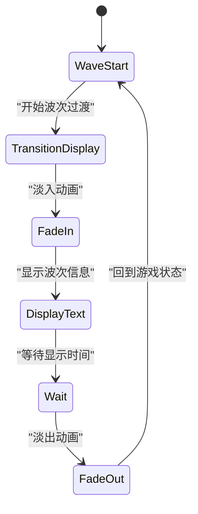

**图表来源**
- [src/composables/useGame.ts:1130-1142](file://src/composables/useGame.ts#L1130-L1142)
- [src/App.vue:176-182](file://src/App.vue#L176-L182)

### 高分成就动画系统
系统新增了高分成就动画，为玩家打破纪录时提供视觉反馈：

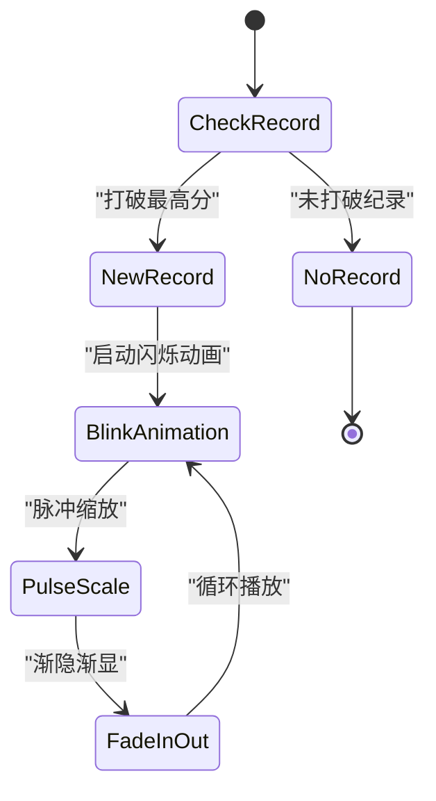

**图表来源**
- [src/style.css:403-422](file://src/style.css#L403-L422)
- [src/App.vue:77-81](file://src/App.vue#L77-L81)

### 生存模式完整实现
系统实现了完整的生存模式，包含波次管理、BOSS关卡、最高分记录等功能：

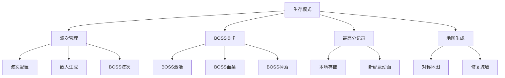

**图表来源**
- [src/composables/useGame.ts:1178-1213](file://src/composables/useGame.ts#L1178-L1213)
- [src/types/game.ts:141-157](file://src/types/game.ts#L141-L157)

**章节来源**
- [src/composables/useGame.ts:1111-1142](file://src/composables/useGame.ts#L1111-L1142)
- [src/App.vue:176-182](file://src/App.vue#L176-L182)
- [src/style.css:403-422](file://src/style.css#L403-L422)

## 依赖关系分析

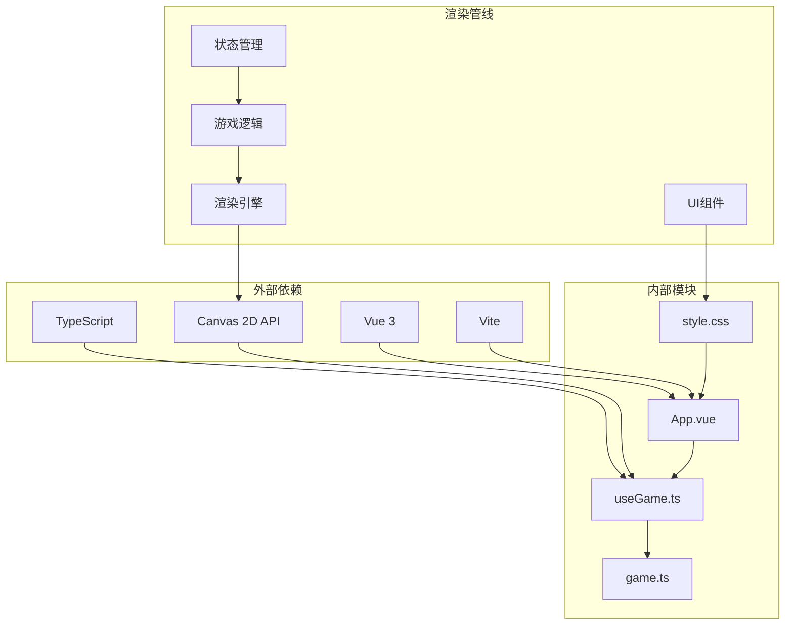

**图表来源**
- [package.json:11-24](file://package.json#L11-L24)
- [src/App.vue:1-6](file://src/App.vue#L1-L6)
- [src/composables/useGame.ts:1-10](file://src/composables/useGame.ts#L1-L10)

**章节来源**
- [package.json:1-26](file://package.json#L1-L26)
- [vite.config.ts:1-8](file://vite.config.ts#L1-L8)

## 性能考虑

### 渲染优化策略
1. **对象池模式**：使用数组过滤替代对象销毁，减少垃圾回收压力
2. **批量绘制**：按图层顺序批量绘制，避免重复状态切换
3. **脏矩形优化**：仅绘制发生变化的区域
4. **渐变缓存**：复用渐变对象，避免重复创建
5. **条件渲染**：仅在需要时绘制BOSS血条和波次过渡

### 内存管理
- **生命周期管理**：在组件卸载时清理动画帧和事件监听器
- **引用管理**：使用 ref 和 reactive 管理 DOM 和状态引用
- **垃圾回收优化**：避免在渲染循环中创建临时对象

### 垃圾回收优化策略
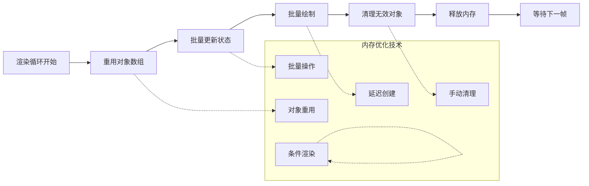

**图表来源**
- [src/composables/useGame.ts:784-786](file://src/composables/useGame.ts#L784-L786)
- [src/composables/useGame.ts:1259-1265](file://src/composables/useGame.ts#L1259-L1265)

## 故障排除指南

### 常见问题及解决方案

#### 渲染异常
- **问题**：游戏画面不显示或显示异常
- **原因**：Canvas 上下文未正确初始化
- **解决**：检查 Canvas 元素引用和 getContext 调用

#### 性能问题
- **问题**：帧率下降或卡顿
- **原因**：过多的对象创建和销毁
- **解决**：使用对象池模式，减少垃圾回收

#### 输入响应问题
- **问题**：键盘输入无响应
- **原因**：事件监听器未正确绑定
- **解决**：检查 onMounted 和 onUnmounted 生命周期

#### BOSS血条显示问题
- **问题**：BOSS血条不显示或显示异常
- **原因**：BOSS状态未正确设置或BOSSTank引用为空
- **解决**：检查 BOSSActive 标志和 bossTank 引用

#### 波次过渡动画问题
- **问题**：波次过渡界面不显示或动画异常
- **原因**：waveTransition 标志未正确设置或定时器错误
- **解决**：检查波次切换逻辑和定时器管理

### 调试技巧
1. **帧率监控**：通过浏览器开发者工具的性能面板监控 FPS
2. **内存分析**：使用内存快照分析内存泄漏
3. **渲染分析**：使用 Chrome DevTools 的 Rendering 面板分析渲染性能
4. **断点调试**：在关键渲染节点设置断点进行调试
5. **状态检查**：使用 Vue DevTools 检查游戏状态变化

**章节来源**
- [src/composables/useGame.ts:1244-1265](file://src/composables/useGame.ts#L1244-L1265)

## 结论
Reimagined Journey 的 Canvas 渲染系统展现了现代 Web 游戏开发的最佳实践。通过合理的架构设计、高效的渲染循环和完善的性能优化策略，系统能够在各种设备上提供流畅的游戏体验。新增的BOSS血条显示、波次过渡动画、高分成就动画等功能进一步提升了游戏的视觉表现力和玩家体验。该系统的模块化设计和清晰的职责分离为后续的功能扩展奠定了坚实的基础。

## 附录

### API 参考
- **Canvas 上下文方法**：fillRect, strokeRect, beginPath, moveTo, lineTo, bezierCurveTo, arc, fillText
- **渐变对象**：createLinearGradient, createRadialGradient, addColorStop
- **状态管理**：save, restore, translate, rotate, scale
- **动画控制**：requestAnimationFrame, cancelAnimationFrame

### 性能指标
- **目标帧率**：60 FPS (约 16.7ms/帧)
- **渲染时间预算**：每帧不超过 16ms
- **内存使用**：单帧对象创建不超过 100 个
- **CPU 占用**：主线程 CPU 占用率不超过 50%

### 兼容性说明
- **浏览器支持**：Chrome 60+, Firefox 55+, Safari 11+
- **Canvas 特性**：使用标准 Canvas 2D API，无需第三方库依赖
- **响应式设计**：支持不同屏幕尺寸的自适应布局

### 新增功能特性
- **BOSS血条显示**：实时显示BOSS血量状态，支持颜色渐变
- **波次过渡动画**：生存模式波次切换时的视觉过渡效果
- **高分成就动画**：新纪录时的闪烁动画效果
- **生存模式完整实现**：包含波次管理、BOSS关卡、最高分记录
- **对称地图生成**：生存模式专用的地图生成算法
- **波次配置系统**：动态调整敌人数量、速度、血量等参数