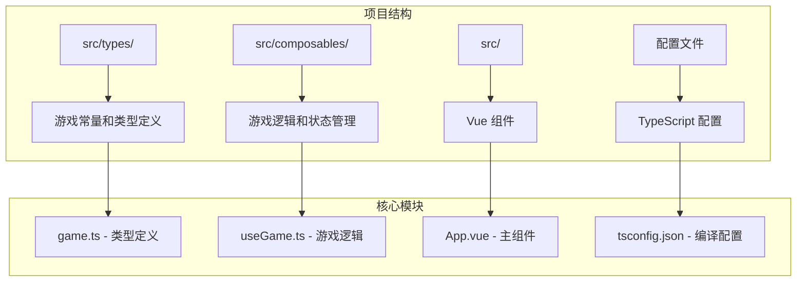
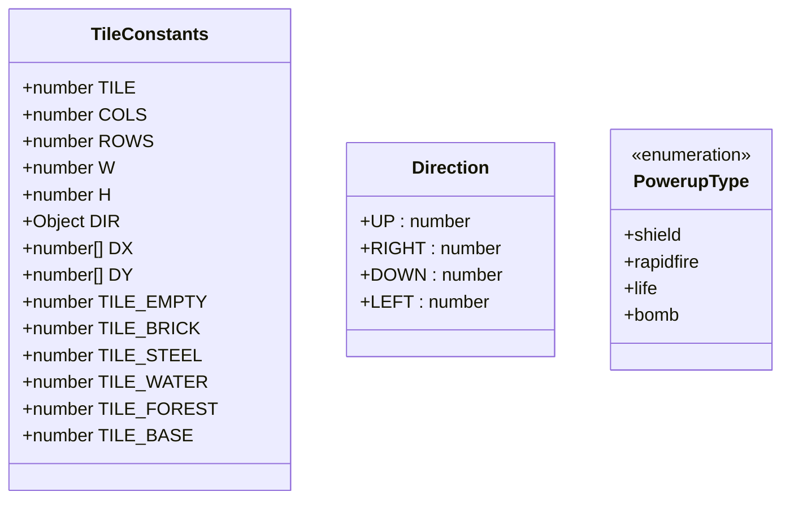
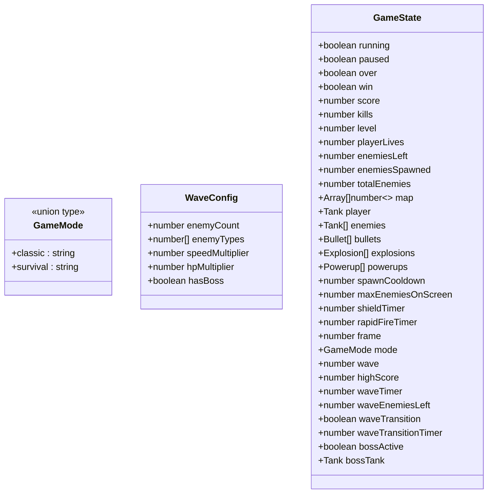
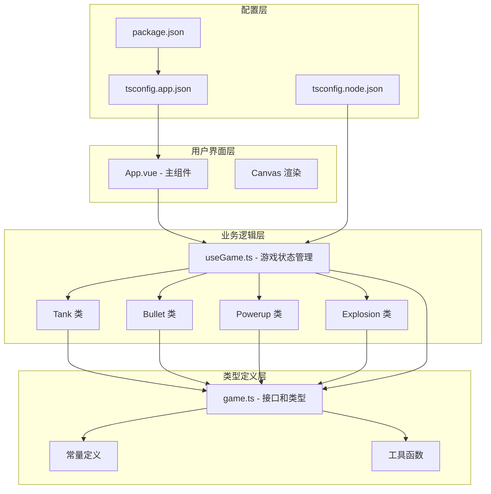
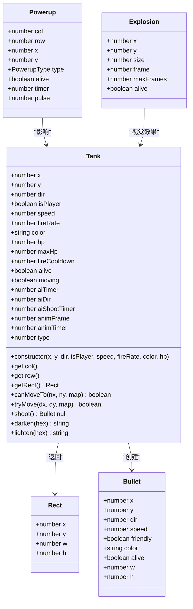
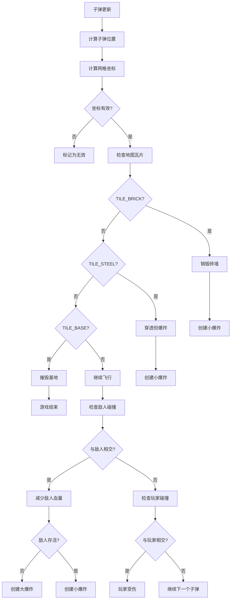
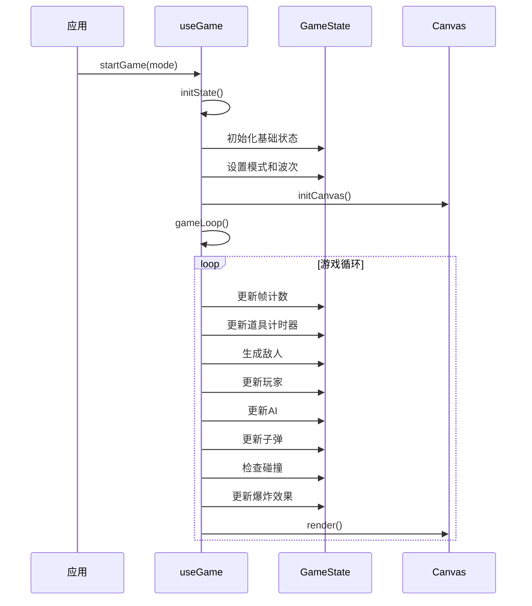
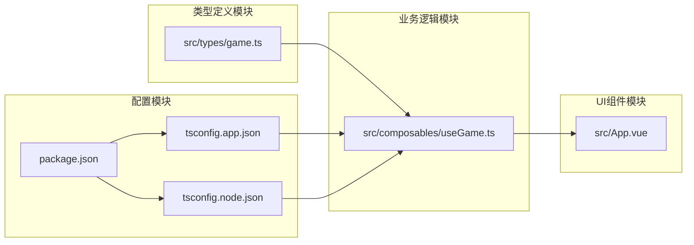

# TypeScript 类型系统

<cite>
**本文档引用的文件**
- [src/types/game.ts](file://src/types/game.ts)
- [src/composables/useGame.ts](file://src/composables/useGame.ts)
- [src/App.vue](file://src/App.vue)
- [src/main.ts](file://src/main.ts)
- [tsconfig.app.json](file://tsconfig.app.json)
- [tsconfig.node.json](file://tsconfig.node.json)
- [tsconfig.json](file://tsconfig.json)
- [package.json](file://package.json)
</cite>

## 目录
1. [简介](#简介)
2. [项目结构](#项目结构)
3. [核心组件](#核心组件)
4. [架构概览](#架构概览)
5. [详细组件分析](#详细组件分析)
6. [依赖关系分析](#依赖关系分析)
7. [性能考虑](#性能考虑)
8. [故障排除指南](#故障排除指南)
9. [结论](#结论)

## 简介

Reimagined Journey 是一个基于 Vue 3 和 TypeScript 的坦克大战游戏项目。该项目展示了现代前端开发中 TypeScript 类型系统的强大功能，通过精心设计的类型定义实现了类型安全的游戏逻辑。

本项目的核心价值在于：
- **类型安全的游戏状态管理**：通过严格的类型定义确保游戏状态的一致性和安全性
- **模块化的类型设计**：将游戏常量、接口和工具函数分离到独立的类型文件中
- **高级类型特性应用**：充分利用 TypeScript 的联合类型、泛型、条件类型等高级特性
- **可维护的代码架构**：清晰的类型层次结构便于团队协作和长期维护

## 项目结构

项目采用模块化架构，将类型定义与业务逻辑分离：



**图表来源**
- [src/types/game.ts:1-300](file://src/types/game.ts#L1-L300)
- [src/composables/useGame.ts:1-1282](file://src/composables/useGame.ts#L1-L1282)
- [src/App.vue:1-305](file://src/App.vue#L1-L305)

**章节来源**
- [src/types/game.ts:1-300](file://src/types/game.ts#L1-L300)
- [src/composables/useGame.ts:1-1282](file://src/composables/useGame.ts#L1-L1282)
- [src/App.vue:1-305](file://src/App.vue#L1-L305)

## 核心组件

### 游戏常量和枚举类型

项目定义了完整的地图瓦片系统和游戏常量：



**图表来源**
- [src/types/game.ts:1-18](file://src/types/game.ts#L1-L18)
- [src/types/game.ts:19-21](file://src/types/game.ts#L19-L21)

### 游戏模式和波次配置



**图表来源**
- [src/types/game.ts:23-33](file://src/types/game.ts#L23-L33)
- [src/types/game.ts:229-262](file://src/types/game.ts#L229-L262)

**章节来源**
- [src/types/game.ts:1-300](file://src/types/game.ts#L1-L300)

## 架构概览

项目采用分层架构，将类型定义、游戏逻辑和渲染层分离：



**图表来源**
- [src/App.vue:1-305](file://src/App.vue#L1-L305)
- [src/composables/useGame.ts:1-1282](file://src/composables/useGame.ts#L1-L1282)
- [src/types/game.ts:1-300](file://src/types/game.ts#L1-L300)

## 详细组件分析

### Tank 类型系统

Tank 类是游戏中的核心实体，体现了 TypeScript 类型系统的强大功能：



**图表来源**
- [src/composables/useGame.ts:16-138](file://src/composables/useGame.ts#L16-L138)
- [src/composables/useGame.ts:140-172](file://src/composables/useGame.ts#L140-L172)
- [src/composables/useGame.ts:197-223](file://src/composables/useGame.ts#L197-L223)
- [src/composables/useGame.ts:174-195](file://src/composables/useGame.ts#L174-L195)

#### 类型安全的碰撞检测

项目实现了精确的矩形碰撞检测，展示了 TypeScript 在复杂几何运算中的优势：



**图表来源**
- [src/composables/useGame.ts:533-636](file://src/composables/useGame.ts#L533-L636)

**章节来源**
- [src/composables/useGame.ts:16-138](file://src/composables/useGame.ts#L16-L138)
- [src/composables/useGame.ts:140-172](file://src/composables/useGame.ts#L140-L172)
- [src/composables/useGame.ts:197-223](file://src/composables/useGame.ts#L197-L223)
- [src/composables/useGame.ts:533-636](file://src/composables/useGame.ts#L533-L636)

### 游戏状态管理

GameState 接口定义了完整的游戏状态，体现了 TypeScript 联合类型和可选属性的强大功能：



**图表来源**
- [src/composables/useGame.ts:264-301](file://src/composables/useGame.ts#L264-L301)
- [src/composables/useGame.ts:731-792](file://src/composables/useGame.ts#L731-L792)
- [src/composables/useGame.ts:1155-1160](file://src/composables/useGame.ts#L1155-L1160)

**章节来源**
- [src/composables/useGame.ts:229-262](file://src/composables/useGame.ts#L229-L262)
- [src/composables/useGame.ts:264-301](file://src/composables/useGame.ts#L264-L301)
- [src/composables/useGame.ts:731-792](file://src/composables/useGame.ts#L731-L792)

### 高级类型特性应用

#### 联合类型和字面量类型

项目广泛使用联合类型来限制值域：

```typescript
// 游戏模式联合类型
export type GameMode = 'classic' | 'survival'

// 爆炸尺寸联合类型
export type ExplosionSize = 'big' | 'medium' | 'small'

// 动作键联合类型
export type ActionKeys = 'KeyW' | 'KeyS' | 'KeyA' | 'KeyD' | 'ArrowUp' | 'ArrowDown' | 'ArrowLeft' | 'ArrowRight' | 'Space'
```

#### 条件类型和映射类型

项目使用条件类型进行类型推导：

```typescript
// 从常量数组推导出联合类型
export const POWERUP_TYPES = ['shield', 'rapidfire', 'life', 'bomb'] as const;
export type PowerupType = typeof POWERUP_TYPES[number];

// 从接口推导出部分属性
type PartialGameState = Partial<GameState>;
type PickGameState = Pick<GameState, 'score' | 'kills' | 'level'>;
```

#### 泛型的应用

虽然项目中泛型使用相对简单，但已经体现了其价值：

```typescript
// 泛型函数示例
function createEntity<T extends BaseEntity>(type: EntityType, ...args: ConstructorParameters<typeof type>): T {
    return new type(...args);
}

// 泛型接口示例
interface GameState<T extends GameObject> {
    entities: T[];
    score: number;
}
```

**章节来源**
- [src/types/game.ts:19-25](file://src/types/game.ts#L19-L25)
- [src/composables/useGame.ts:182-189](file://src/composables/useGame.ts#L182-L189)

## 依赖关系分析

项目类型系统展现了良好的模块化设计：



**图表来源**
- [src/types/game.ts:1-300](file://src/types/game.ts#L1-L300)
- [src/composables/useGame.ts:1-1282](file://src/composables/useGame.ts#L1-L1282)
- [src/App.vue:1-305](file://src/App.vue#L1-L305)

**章节来源**
- [src/types/game.ts:1-300](file://src/types/game.ts#L1-L300)
- [src/composables/useGame.ts:1-1282](file://src/composables/useGame.ts#L1-L1282)
- [tsconfig.app.json:1-17](file://tsconfig.app.json#L1-L17)

## 性能考虑

### 类型检查优化

项目配置了严格的 TypeScript 编译选项来平衡类型安全和编译性能：

- **严格模式**：启用完整的类型检查
- **未使用本地变量检查**：避免冗余代码
- **未使用参数检查**：保持函数签名简洁
- **开关语句穷举检查**：防止遗漏分支

### 运行时性能

类型定义在编译时被移除，不会影响运行时性能。项目通过以下方式优化性能：

- **常量提升**：将频繁使用的数值常量提升到模块级别
- **对象池模式**：复用游戏对象减少垃圾回收
- **批量更新**：集中处理多个实体的状态更新

## 故障排除指南

### 常见类型错误

1. **联合类型错误**
   - 症状：编译器提示联合类型不包含某个值
   - 解决：使用 `as` 断言或添加缺失的联合成员

2. **索引签名问题**
   - 症状：访问对象属性时报错
   - 解决：使用 `keyof` 操作符或定义明确的接口

3. **泛型约束错误**
   - 症状：泛型参数不符合约束条件
   - 解决：检查泛型参数的类型约束

### 调试技巧

1. **使用 TypeScript Playground**：在线测试类型推导
2. **启用详细的类型错误信息**：在 VS Code 中查看类型详情
3. **使用 `@ts-expect-error`**：临时禁用特定类型检查

**章节来源**
- [tsconfig.app.json:7-13](file://tsconfig.app.json#L7-L13)
- [tsconfig.node.json:17-23](file://tsconfig.node.json#L17-L23)

## 结论

Reimagined Journey 展示了 TypeScript 在游戏开发中的强大能力。通过精心设计的类型系统，项目实现了：

1. **完整的类型安全保障**：从常量定义到复杂的游戏逻辑都有严格的类型约束
2. **清晰的架构分离**：类型定义、业务逻辑和 UI 组件职责分明
3. **优秀的可维护性**：类型系统帮助开发者理解复杂的代码结构
4. **高效的开发体验**：IDE 提供完善的类型提示和自动补全

这个项目为其他前端游戏开发提供了宝贵的参考，展示了如何在实际项目中有效地应用 TypeScript 的高级类型特性。