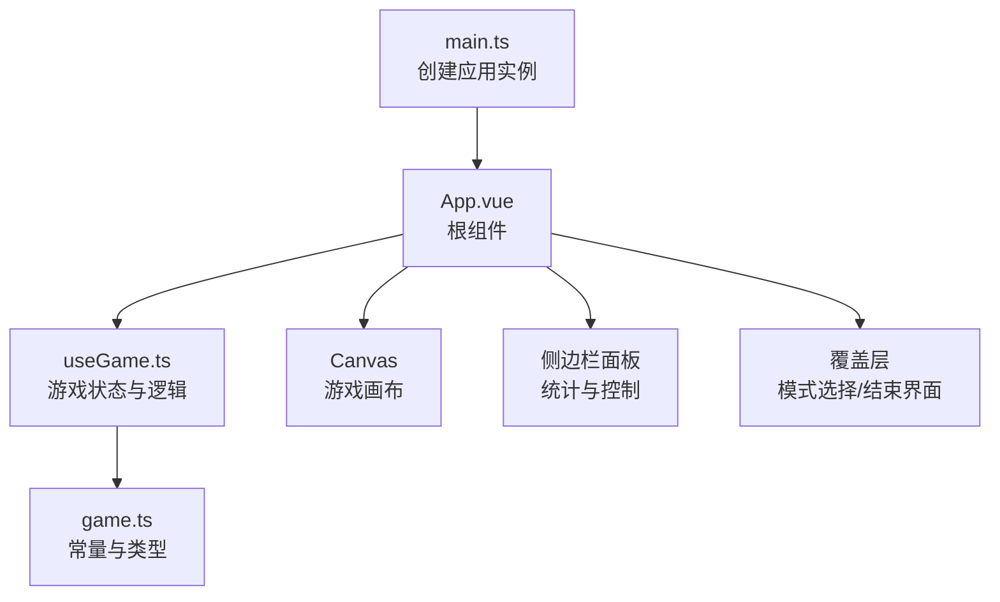
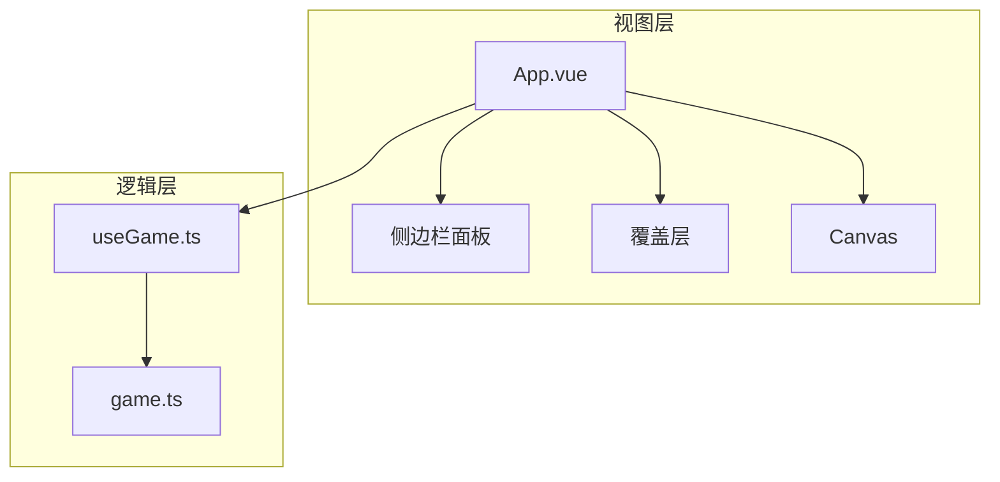
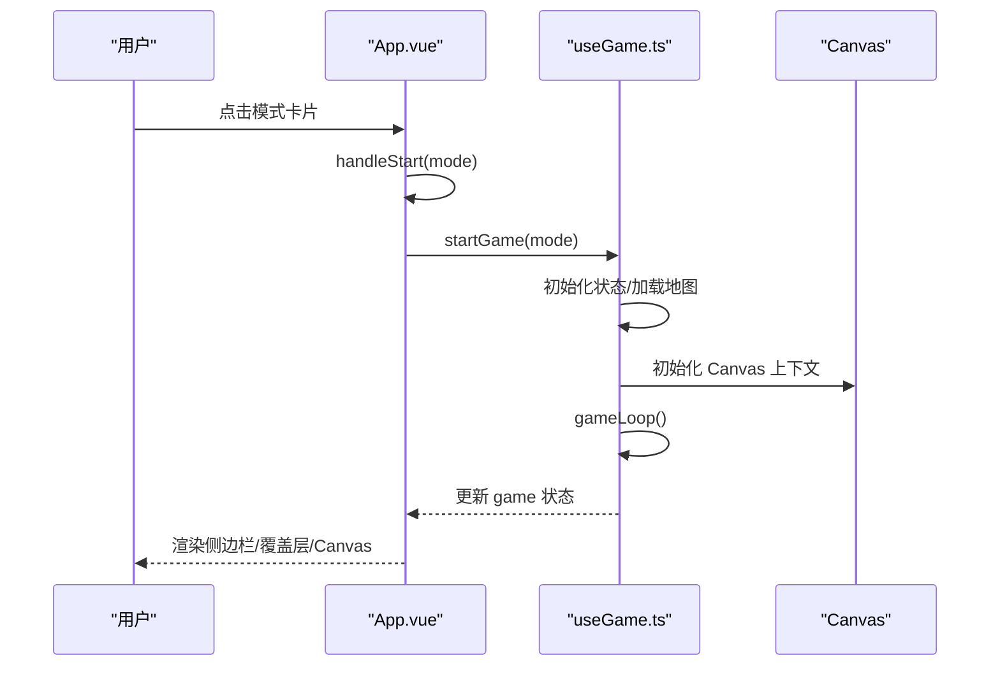
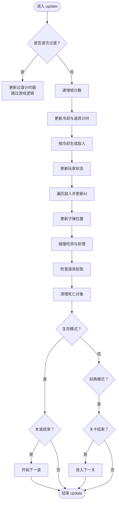
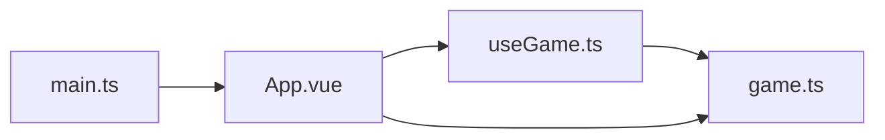

# Vue 组件架构

<cite>
**本文档引用的文件**
- [App.vue](file://src/App.vue)
- [main.ts](file://src/main.ts)
- [HelloWorld.vue](file://src/components/HelloWorld.vue)
- [useGame.ts](file://src/composables/useGame.ts)
- [game.ts](file://src/types/game.ts)
- [README.md](file://README.md)
- [package.json](file://package.json)
</cite>

## 目录
1. [简介](#简介)
2. [项目结构](#项目结构)
3. [核心组件](#核心组件)
4. [架构总览](#架构总览)
5. [详细组件分析](#详细组件分析)
6. [依赖关系分析](#依赖关系分析)
7. [性能考量](#性能考量)
8. [故障排查指南](#故障排查指南)
9. [结论](#结论)
10. [附录](#附录)

## 简介
本项目是一个基于 Vue 3 Composition API 的坦克对战游戏，采用单页应用架构，根组件负责游戏全局状态与 UI 布局，通过可组合函数集中管理游戏逻辑与 Canvas 渲染。本文档系统性解析组件设计模式、根组件职责、组件通信、props 与事件处理、生命周期管理、响应式数据绑定在游戏场景中的应用，并总结组件复用、插槽与组合的最佳实践。

## 项目结构
项目采用典型的 Vue 3 单文件组件（SFC）与组合式 API 结构：
- 入口：main.ts 创建应用实例并挂载根组件 App.vue
- 根组件：App.vue 负责游戏 UI 布局、模式选择、结束界面、侧边栏统计面板与 Canvas 容器
- 可组合函数：useGame.ts 提供游戏状态、AI、碰撞检测、渲染与生命周期钩子
- 类型定义：game.ts 定义常量、类型与地图生成算法
- 示例组件：HelloWorld.vue 展示基础 Composition API 使用方式

图表来源
- [main.ts:1-6](file://src/main.ts#L1-L6)
- [App.vue:1-305](file://src/App.vue#L1-L305)
- [useGame.ts:264-1282](file://src/composables/useGame.ts#L264-L1282)
- [game.ts:1-300](file://src/types/game.ts#L1-L300)

章节来源
- [main.ts:1-6](file://src/main.ts#L1-L6)
- [README.md:1-6](file://README.md#L1-L6)
- [package.json:1-26](file://package.json#L1-L26)

## 核心组件
- 根组件 App.vue
  - 职责：管理游戏模式选择、开始/结束覆盖层、波次过渡提示、侧边栏统计面板、Canvas 容器与焦点管理；通过 watch 监听 game.over 自动弹出结束界面；通过 onMounted 初始化 Canvas。
  - 数据：响应式状态包括 game（来自 useGame）、showOverlay、overlay 标题/消息/分数/击杀/关卡/波次、isNewRecord、levelBanner、powerupNotice 等。
  - 方法：handleStart、returnToMenu、restartSurvival；调用 useGame 的 startGame、initCanvas。
  - 模板：条件渲染模式选择与结束界面，v-if 控制覆盖层与波次过渡，v-for 渲染生命图标与剩余敌人图标，v-show 控制暂停与波次提示。
- 可组合函数 useGame.ts
  - 职责：封装游戏状态（reactive）、更新循环（update）、渲染（render）、键盘输入处理、AI 行为、碰撞检测、波次与关卡推进、暂停与结束控制、Canvas 初始化与动画循环。
  - 状态：game（含运行/暂停/结束/胜利、分数、击杀、关卡/波次、玩家生命、敌人数量、地图、子弹、爆炸、道具、冷却计时、模式与 BOSS 标识等）。
  - 生命周期：onMounted/onUnmounted 注册/移除键盘监听与取消动画帧。
  - 返回值：暴露 game、canvasRef、ctx、startGame、endGame、togglePause、initCanvas、spawnExplosion 等。
- 类型定义 game.ts
  - 职责：定义地图尺寸、方向、地形类型、敌人属性、波次配置、地图生成算法、BOSS 关卡判定与生存模式地图生成。
- 示例组件 HelloWorld.vue
  - 职责：演示 Composition API 基础用法（ref、模板引用、事件处理），作为学习参考。

章节来源
- [App.vue:1-305](file://src/App.vue#L1-L305)
- [useGame.ts:264-1282](file://src/composables/useGame.ts#L264-L1282)
- [game.ts:1-300](file://src/types/game.ts#L1-L300)
- [HelloWorld.vue:1-94](file://src/components/HelloWorld.vue#L1-L94)

## 架构总览
整体架构围绕“根组件 + 可组合函数”的模式展开：
- 根组件负责视图层与用户交互（模式选择、覆盖层、侧边栏、Canvas）
- useGame 负责业务逻辑与渲染，内部维护游戏状态与动画循环
- game.ts 提供类型与地图/波次规则
- main.ts 仅负责应用挂载

图表来源
- [App.vue:86-305](file://src/App.vue#L86-L305)
- [useGame.ts:264-1282](file://src/composables/useGame.ts#L264-L1282)
- [game.ts:1-300](file://src/types/game.ts#L1-L300)

## 详细组件分析

### 根组件 App.vue 设计与职责
- 视图组织
  - 模式选择界面：点击卡片触发 handleStart，支持 classic 与 survival 两种模式
  - 结束界面：根据 game.mode 与 game.over 动态渲染标题/消息/统计/按钮
  - 波次过渡：当 game.waveTransition 为真时显示“第 X 波”提示
  - 侧边栏：显示分数、关卡/波次、最高分、击杀、玩家生命、剩余敌人/本波剩余、操作说明
  - Canvas：容器内放置 canvas 并绑定 ref，onMounted 初始化
- 响应式与生命周期
  - onMounted：initCanvas(canvasRef.value)，确保 Canvas 上下文可用
  - watch(game.over)：自动弹出结束覆盖层，按模式填充统计信息，生存模式检查新纪录
  - 事件处理：handleStart、returnToMenu、restartSurvival
- 数据绑定与状态
  - showOverlay、overlayTitle/Message/Score/Kills/Level/Wave、isNewRecord、levelBanner、powerupNotice
  - 与 useGame 返回的 game 同步，实现 UI 与游戏状态的双向联动

图表来源
- [App.vue:19-50](file://src/App.vue#L19-L50)
- [useGame.ts:1155-1176](file://src/composables/useGame.ts#L1155-L1176)

章节来源
- [App.vue:1-305](file://src/App.vue#L1-L305)

### 可组合函数 useGame.ts：游戏状态与渲染
- 状态模型
  - GameState：包含运行/暂停/结束/胜利、分数、击杀、关卡/波次、玩家生命、敌人数量、地图、子弹、爆炸、道具、冷却计时、模式与 BOSS 标识等
  - keys：键盘输入状态映射
- 更新循环
  - update：处理波次过渡、冷却、生成敌人、玩家与 AI 更新、子弹与爆炸清理、碰撞检测、道具拾取、波次/关卡推进
  - gameLoop：requestAnimationFrame 驱动的主循环
- 渲染管线
  - render：清屏、绘制网格、地图、道具、敌人、玩家、森林遮罩、子弹、爆炸、BOSS 血条、波次过渡与暂停提示
  - draw*：独立绘制函数（地图块、坦克、子弹、爆炸、道具、森林遮罩）
- 事件与生命周期
  - 键盘事件：onKeyDown/onKeyUp 注册/移除，P 键切换暂停
  - onMounted/onUnmounted：注册/移除事件与取消动画帧
- 导出接口
  - startGame、endGame、togglePause、initCanvas、spawnExplosion 等

图表来源
- [useGame.ts:731-792](file://src/composables/useGame.ts#L731-L792)
- [useGame.ts:1189-1228](file://src/composables/useGame.ts#L1189-L1228)

章节来源
- [useGame.ts:264-1282](file://src/composables/useGame.ts#L264-L1282)

### 类型定义 game.ts：常量与规则
- 地图与渲染
  - TILE、COLS、ROWS、W、H、DIR、DX/DY、地形类型常量
  - 地图生成算法：generateLevel、getLevelMap、getSurvivalMap
- 敌人与波次
  - enemySpeed/fireRate/hp/color、getEnemyType、isBossLevel、bossHp
  - getWaveConfig：生存模式波次配置（敌人数量、类型、倍率、是否 BOSS）
- 工具函数
  - rectsOverlap：矩形相交判断
- 用途
  - 为 useGame 提供规则与地图数据，保证游戏行为一致性

章节来源
- [game.ts:1-300](file://src/types/game.ts#L1-L300)

### 示例组件 HelloWorld.vue：Composition API 基础
- 展示了 ref、模板引用与事件绑定的基础用法，适合理解 Vue 3 SFC 与脚本设置语法
- 与主游戏无直接耦合，仅作学习参考

章节来源
- [HelloWorld.vue:1-94](file://src/components/HelloWorld.vue#L1-L94)

## 依赖关系分析
- 应用入口依赖
  - main.ts 依赖 App.vue 与样式
- 根组件依赖
  - App.vue 依赖 useGame.ts（状态与方法）、game.ts（类型与规则）
- 可组合函数依赖
  - useGame.ts 依赖 game.ts（常量与规则）、Vue 响应式 API（ref、reactive、onMounted、onUnmounted）
- 类型依赖
  - game.ts 为 useGame.ts 与 App.vue 提供类型与规则支撑

图表来源
- [main.ts:1-6](file://src/main.ts#L1-L6)
- [App.vue:1-10](file://src/App.vue#L1-L10)
- [useGame.ts:1-10](file://src/composables/useGame.ts#L1-L10)
- [game.ts:1-300](file://src/types/game.ts#L1-L300)

章节来源
- [package.json:1-26](file://package.json#L1-L26)

## 性能考量
- 动画循环
  - 使用 requestAnimationFrame 驱动 gameLoop，避免阻塞主线程
  - 在波次过渡期间跳过游戏逻辑，降低 CPU 占用
- 清理与过滤
  - update 结尾对死亡对象进行过滤，减少渲染与碰撞检测开销
- 渲染优化
  - render 中仅绘制可见元素，避免重复绘制
  - draw* 函数按需绘制，减少不必要的计算
- 输入处理
  - 键盘事件使用捕获阶段，避免默认行为干扰（如方向键滚动页面）

## 故障排查指南
- Canvas 未初始化
  - 症状：游戏无法渲染或报错
  - 排查：确认 onMounted 中 initCanvas 已执行，canvasRef 不为空
  - 参考路径：[App.vue:46-50](file://src/App.vue#L46-L50)、[useGame.ts:1267-1270](file://src/composables/useGame.ts#L1267-L1270)
- 键盘无响应
  - 症状：WASD/Space/P 无效
  - 排查：确认 onMounted 已注册事件，onUnmounted 是否正确移除；P 键暂停逻辑
  - 参考路径：[useGame.ts:1244-1257](file://src/composables/useGame.ts#L1244-L1257)、[useGame.ts:1259-1265](file://src/composables/useGame.ts#L1259-L1265)
- 结束界面不出现
  - 症状：游戏结束但覆盖层不显示
  - 排查：确认 watch(game.over) 分支逻辑，classic 与 survival 的覆盖层内容
  - 参考路径：[App.vue:52-83](file://src/App.vue#L52-L83)
- 波次过渡不显示
  - 症状：生存模式波次切换无提示
  - 排查：确认 game.waveTransition 与 game.waveTransitionTimer 的更新逻辑
  - 参考路径：[useGame.ts:1189-1213](file://src/composables/useGame.ts#L1189-L1213)、[useGame.ts:1130-1142](file://src/composables/useGame.ts#L1130-L1142)
- 新纪录未记录
  - 症状：生存模式最高分未更新
  - 排查：确认 endGame 与 localStorage 写入逻辑
  - 参考路径：[useGame.ts:610-616](file://src/composables/useGame.ts#L610-L616)

章节来源
- [App.vue:46-83](file://src/App.vue#L46-L83)
- [useGame.ts:1130-1265](file://src/composables/useGame.ts#L1130-L1265)

## 结论
本项目通过“根组件 + 可组合函数”的架构实现了清晰的职责分离：根组件专注 UI 与交互，useGame 负责复杂的游戏逻辑与渲染，game.ts 提供规则与类型保障。该模式具备良好的可扩展性与可维护性，适合在大型游戏中推广。建议后续引入插槽与组件组合以进一步提升复用性，并完善错误边界与日志监控以增强稳定性。

## 附录
- 项目启动与构建
  - 开发：npm run dev
  - 构建：npm run build
  - 预览：npm run preview
- 技术栈
  - Vue 3 + TypeScript + Vite + TailwindCSS

章节来源
- [package.json:6-10](file://package.json#L6-L10)
- [README.md:1-6](file://README.md#L1-L6)