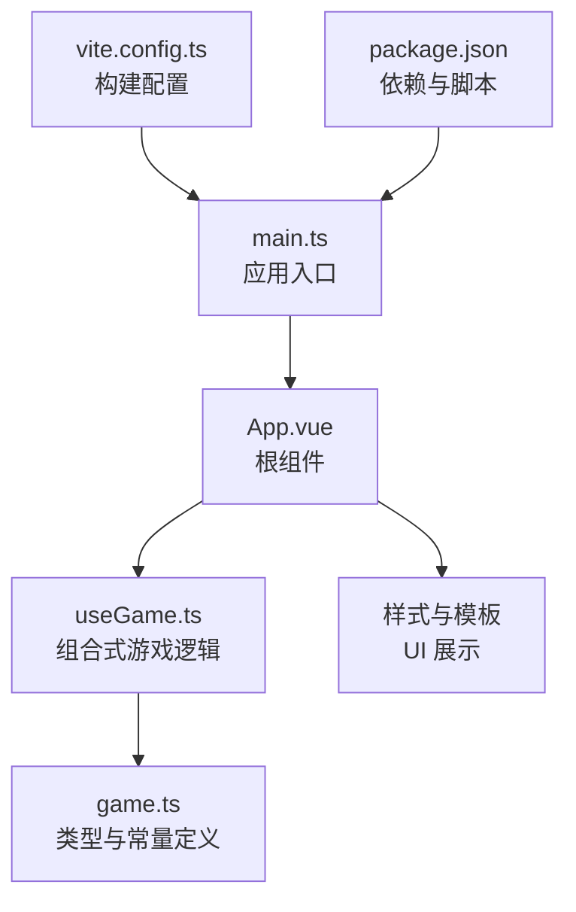
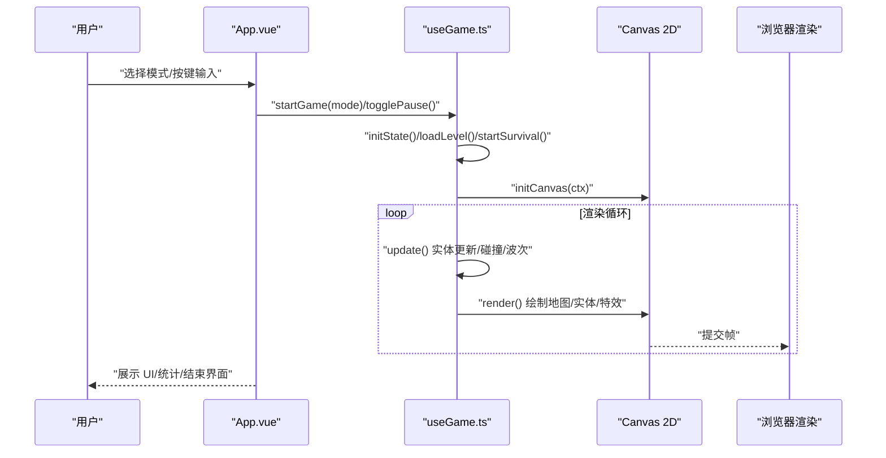
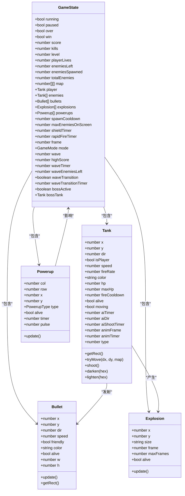
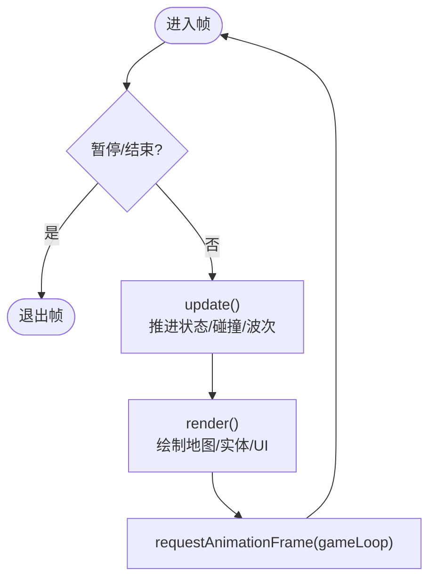
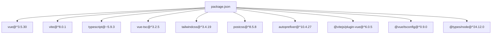

# 核心架构

<cite>
**本文引用的文件**
- [main.ts](file://src/main.ts)
- [App.vue](file://src/App.vue)
- [useGame.ts](file://src/composables/useGame.ts)
- [game.ts](file://src/types/game.ts)
- [HelloWorld.vue](file://src/components/HelloWorld.vue)
- [package.json](file://package.json)
- [vite.config.ts](file://vite.config.ts)
- [README.md](file://README.md)
</cite>

## 目录
1. [引言](#引言)
2. [项目结构](#项目结构)
3. [核心组件](#核心组件)
4. [架构总览](#架构总览)
5. [详细组件分析](#详细组件分析)
6. [依赖分析](#依赖分析)
7. [性能考虑](#性能考虑)
8. [故障排查指南](#故障排查指南)
9. [结论](#结论)
10. [附录](#附录)

## 引言
本文件面向 Reimagined Journey 项目，系统性阐述基于 Vue 3 Composition API 的核心架构设计与实现要点。重点包括：
- 组件化架构如何支撑游戏逻辑的模块化组织
- useGame 组合函数的设计理念与职责边界
- Canvas 2D 渲染系统的架构、渲染循环与帧率管理
- TypeScript 类型系统在游戏开发中的应用与收益
- 架构决策的技术考量与权衡

## 项目结构
Reimagined Journey 采用“单页应用 + 组合式逻辑 + 类型驱动”的组织方式：
- 应用入口负责挂载根组件
- 根组件负责 UI 展示、输入事件绑定与组合式逻辑的接入
- 组合式逻辑集中于 useGame，封装游戏状态、更新与渲染
- 类型定义集中在 types/game，提供常量、枚举、接口与工具函数
- 构建与运行由 Vite + Vue 插件提供支持

图表来源
- [main.ts:1-6](file://src/main.ts#L1-L6)
- [App.vue:1-305](file://src/App.vue#L1-L305)
- [useGame.ts:1267-1282](file://src/composables/useGame.ts#L1267-L1282)
- [game.ts:1-300](file://src/types/game.ts#L1-L300)
- [vite.config.ts:1-8](file://vite.config.ts#L1-L8)
- [package.json:1-26](file://package.json#L1-L26)

章节来源
- [main.ts:1-6](file://src/main.ts#L1-L6)
- [App.vue:1-305](file://src/App.vue#L1-L305)
- [vite.config.ts:1-8](file://vite.config.ts#L1-L8)
- [package.json:1-26](file://package.json#L1-L26)

## 核心组件
- 应用入口与挂载
  - 使用 Vue 3 的 createApp 创建应用实例，并将根组件挂载到 DOM
- 根组件 App.vue
  - 通过组合式 API 接入 useGame，暴露游戏状态与控制方法
  - 负责 UI 展示、模式选择、结束界面、侧边栏统计与输入事件绑定
- 组合式逻辑 useGame
  - 定义游戏状态、实体类、碰撞检测、AI 行为、波次与关卡管理
  - 提供渲染管线（绘制地图、坦克、子弹、爆炸、补给）与渲染循环
- 类型系统 game.ts
  - 定义地图尺寸、方向、地形类型、敌人属性、波次配置、地图生成算法
  - 提供矩形相交判断等通用工具函数

章节来源
- [main.ts:1-6](file://src/main.ts#L1-L6)
- [App.vue:1-305](file://src/App.vue#L1-L305)
- [useGame.ts:264-1282](file://src/composables/useGame.ts#L264-L1282)
- [game.ts:1-300](file://src/types/game.ts#L1-L300)

## 架构总览
整体采用“组合式逻辑 + Canvas 2D 渲染”的双层架构：
- 上层：Vue 组件负责 UI 与交互，调用 useGame 提供的方法与状态
- 下层：useGame 管理游戏世界（实体、规则、渲染上下文），通过 requestAnimationFrame 驱动渲染循环

图表来源
- [App.vue:6-26](file://src/App.vue#L6-L26)
- [useGame.ts:1155-1176](file://src/composables/useGame.ts#L1155-L1176)
- [useGame.ts:1071-1153](file://src/composables/useGame.ts#L1071-L1153)
- [useGame.ts:1267-1270](file://src/composables/useGame.ts#L1267-L1270)

## 详细组件分析

### useGame 组合式逻辑
- 设计理念
  - 将游戏状态与行为封装为可复用的组合式逻辑，便于测试与维护
  - 通过 reactive 包裹 GameState，结合 ref 管理 Canvas 引用与键盘状态
  - 将渲染与逻辑解耦：update 负责逻辑推进，render 负责绘制
- 关键职责
  - 游戏状态管理：running/paused/over/win、分数、关卡/波次、玩家生命、敌人数量等
  - 实体系统：Tank、Bullet、Explosion、Powerup 的构造、更新与销毁
  - 游戏规则：碰撞检测、补给触发、AI 行为、波次与关卡切换
  - 渲染系统：绘制地图、地形、坦克、子弹、爆炸、补给、UI 血条与过渡提示
  - 输入处理：键盘事件监听与处理，支持暂停键
  - 生命周期：onMounted/onUnmounted 注册/注销事件，清理动画帧
- 渲染循环
  - 使用 requestAnimationFrame 驱动 gameLoop，按帧执行 update 与 render
  - 在暂停或结束状态下停止循环，避免资源浪费
- 模式与波次
  - 支持 classic 与 survival 两种模式
  - survival 模式包含波次配置、BOSS 波判定、波次过渡动画与地图修复

图表来源
- [useGame.ts:16-138](file://src/composables/useGame.ts#L16-L138)
- [useGame.ts:140-172](file://src/composables/useGame.ts#L140-L172)
- [useGame.ts:174-195](file://src/composables/useGame.ts#L174-L195)
- [useGame.ts:197-223](file://src/composables/useGame.ts#L197-L223)
- [useGame.ts:229-262](file://src/composables/useGame.ts#L229-L262)

章节来源
- [useGame.ts:264-1282](file://src/composables/useGame.ts#L264-L1282)

### 游戏状态与渲染流程
- 渲染循环
  - gameLoop 在每次帧回调中调用 update 与 render
  - update 负责状态推进、碰撞检测、波次/关卡管理
  - render 负责清屏、绘制网格、地图、实体、特效与 UI
- 更新流程
  - 处理波次过渡（survival）
  - 计算冷却与生成敌人
  - 更新玩家与敌人 AI
  - 更新子弹、爆炸、补给
  - 执行碰撞检测与补给拾取
  - 过滤已死亡对象
  - 判断关卡/波次完成与游戏结束

图表来源
- [useGame.ts:1155-1160](file://src/composables/useGame.ts#L1155-L1160)
- [useGame.ts:731-792](file://src/composables/useGame.ts#L731-L792)
- [useGame.ts:1071-1153](file://src/composables/useGame.ts#L1071-L1153)

章节来源
- [useGame.ts:1155-1160](file://src/composables/useGame.ts#L1155-L1160)
- [useGame.ts:731-792](file://src/composables/useGame.ts#L731-L792)
- [useGame.ts:1071-1153](file://src/composables/useGame.ts#L1071-L1153)

### Canvas 2D 渲染系统
- 渲染上下文与画布
  - 通过 initCanvas 获取 CanvasRenderingContext2D
  - 清屏后绘制网格背景，再按层绘制地图、实体、特效与 UI
- 地图与地形
  - drawMap 遍历地图二维数组，根据类型绘制不同地形
  - 地形绘制包含渐变、描边与细节，体现视觉层次
- 实体绘制
  - drawTank：绘制坦克主体、履带、炮管、炮塔与 HP 指示；玩家坦克在受保护时绘制护盾光圈
  - drawBullet：绘制发光圆点
  - drawExplosion：绘制径向渐变与脉冲火花
  - drawPowerup：绘制脉动图标与阴影
- UI 与过渡
  - BOSS 血条、波次过渡文字、暂停遮罩等
- 性能策略
  - 仅绘制存活实体，避免无效绘制
  - 合理使用全局透明度与阴影，平衡视觉与性能
  - 通过帧计数与定时器控制动画节奏

```mermaid
graph LR
Init["initCanvas(ctx)"] --> Clear["clearRect + 填充底色"]
Clear --> Grid["绘制网格"]
Grid --> Map["drawMap() 地图"]
Map --> Powerups["遍历并 drawPowerup()"]
Powerups --> Enemies["遍历并 drawTank() 敌方"]
Enemies --> Player["drawTank() 玩家"]
Player --> Forest["drawForestOverlay() 森林覆盖"]
Forest --> Bullets["遍历并 drawBullet()"]
Bullets --> Explosions["遍历并 drawExplosion()"]
Explosions --> UI["BOSS血条/波次/暂停遮罩"]
```

图表来源
- [useGame.ts:1267-1270](file://src/composables/useGame.ts#L1267-L1270)
- [useGame.ts:1071-1153](file://src/composables/useGame.ts#L1071-L1153)
- [useGame.ts:828-920](file://src/composables/useGame.ts#L828-L920)
- [useGame.ts:921-980](file://src/composables/useGame.ts#L921-L980)
- [useGame.ts:982-991](file://src/composables/useGame.ts#L982-L991)
- [useGame.ts:993-1023](file://src/composables/useGame.ts#L993-L1023)
- [useGame.ts:1025-1059](file://src/composables/useGame.ts#L1025-L1059)

章节来源
- [useGame.ts:1071-1153](file://src/composables/useGame.ts#L1071-L1153)
- [useGame.ts:828-920](file://src/composables/useGame.ts#L828-L920)
- [useGame.ts:921-980](file://src/composables/useGame.ts#L921-L980)
- [useGame.ts:982-991](file://src/composables/useGame.ts#L982-L991)
- [useGame.ts:993-1023](file://src/composables/useGame.ts#L993-L1023)
- [useGame.ts:1025-1059](file://src/composables/useGame.ts#L1025-L1059)

### TypeScript 类型系统在游戏开发中的应用
- 常量与枚举
  - 方向、地形类型、补给类型、游戏模式等均以常量与字面量联合类型定义，避免魔法值
- 接口与配置
  - GameState 明确游戏状态字段，确保状态一致性与可追踪性
  - WaveConfig 定义生存模式波次参数，便于扩展与测试
- 工具函数
  - rectsOverlap 提供通用的矩形相交判断，降低重复代码与错误风险
- 地图与生成
  - getLevelMap/getSurvivalMap 与 generateLevel 提供统一的地图获取入口，保证一致性
- 优势
  - 编译期类型检查，减少运行时错误
  - IDE 智能感知与重构支持，提升开发效率
  - 文档化数据结构，便于团队协作与知识沉淀

章节来源
- [game.ts:1-300](file://src/types/game.ts#L1-L300)
- [useGame.ts:229-262](file://src/composables/useGame.ts#L229-L262)

### 组件化架构与模块化组织
- 组件职责分离
  - App.vue：UI 与输入事件，调用 useGame 控制游戏生命周期
  - useGame.ts：游戏逻辑与渲染，封装复杂状态与行为
  - game.ts：纯类型与常量，提供跨模块共享的规范
- 组合式 API 的优势
  - 将状态、逻辑与副作用（键盘事件、动画帧）集中管理，便于测试与复用
  - 通过 ref/reactive 暴露响应式数据，与模板自动联动
- 可扩展性
  - 新增实体类型只需扩展类与绘制函数，无需改动核心循环
  - 新增模式只需扩展模式分支与状态字段，保持主循环稳定

章节来源
- [App.vue:1-305](file://src/App.vue#L1-L305)
- [useGame.ts:264-1282](file://src/composables/useGame.ts#L264-L1282)
- [game.ts:1-300](file://src/types/game.ts#L1-L300)

## 依赖分析
- 运行时依赖
  - Vue 3：提供响应式系统与组件模型
- 开发依赖
  - Vite：快速构建与热更新
  - TypeScript：类型系统与编译
  - TailwindCSS：样式工具
  - PostCSS：CSS 后处理
- 项目脚本
  - dev：本地开发
  - build：类型检查与打包
  - preview：预览构建产物

图表来源
- [package.json:1-26](file://package.json#L1-L26)

章节来源
- [package.json:1-26](file://package.json#L1-L26)
- [vite.config.ts:1-8](file://vite.config.ts#L1-L8)

## 性能考虑
- 渲染层面
  - 仅绘制存活实体，及时过滤死亡对象，减少绘制开销
  - 合理使用阴影与透明度，避免过度绘制
  - 通过帧计数与定时器控制动画节奏，避免高频刷新
- 逻辑层面
  - 将碰撞检测与波次判断放在 update 中统一处理，避免重复扫描
  - 通过最大同时出现敌人数量限制，控制实体数量
- 输入与生命周期
  - 在 onUnmounted 中取消动画帧与移除事件，防止内存泄漏
- 可扩展建议
  - 引入对象池减少频繁分配
  - 对热点路径进行微优化（如相交检测、地图索引）

[本节为通用性能指导，不直接分析具体文件]

## 故障排查指南
- 游戏未开始或无法输入
  - 检查 App.vue 是否正确调用 useGame 并绑定键盘事件
  - 确认 startGame 已被调用且 canvas 已 focus
- 渲染异常或画面闪烁
  - 确认 initCanvas 成功获取 CanvasRenderingContext2D
  - 检查 render 是否在 gameLoop 中被调用
- 键盘事件无效
  - 确认 onMounted/onUnmounted 中事件注册/注销逻辑正常
  - 检查暂停状态与覆盖层遮挡
- 波次/关卡不推进
  - 检查 enemiesLeft/enemiesSpawned 与 totalEnemies 的计算逻辑
  - 确认波次过渡动画结束后恢复游戏逻辑

章节来源
- [App.vue:46-50](file://src/App.vue#L46-L50)
- [useGame.ts:1244-1265](file://src/composables/useGame.ts#L1244-L1265)
- [useGame.ts:1155-1160](file://src/composables/useGame.ts#L1155-L1160)
- [useGame.ts:1267-1270](file://src/composables/useGame.ts#L1267-L1270)

## 结论
Reimagined Journey 以 Vue 3 Composition API 为核心，将游戏逻辑与渲染系统清晰分离，借助 TypeScript 类型系统保障了代码质量与可维护性。useGame 作为组合式逻辑中心，承担了状态管理、实体行为、碰撞检测与渲染调度的职责；Canvas 2D 渲染系统提供了高效、可扩展的绘制能力。该架构在保证功能完整性的同时，兼顾了性能与可扩展性，适合进一步演进为更复杂的策略类游戏。

[本节为总结性内容，不直接分析具体文件]

## 附录
- 项目脚手架与推荐实践
  - 采用 Vite + Vue + TypeScript 的现代前端栈
  - 使用 TailwindCSS 快速搭建 UI
  - 通过 README 与官方文档了解最佳实践

章节来源
- [README.md:1-6](file://README.md#L1-L6)