# 游戏状态管理

<cite>
**本文档引用的文件**
- [useGame.ts](file://src/composables/useGame.ts)
- [game.ts](file://src/types/game.ts)
- [App.vue](file://src/App.vue)
- [main.ts](file://src/main.ts)
- [HelloWorld.vue](file://src/components/HelloWorld.vue)
- [README.md](file://README.md)
</cite>

## 目录
1. [简介](#简介)
2. [项目结构](#项目结构)
3. [核心组件](#核心组件)
4. [架构概览](#架构概览)
5. [详细组件分析](#详细组件分析)
6. [依赖关系分析](#依赖关系分析)
7. [性能考虑](#性能考虑)
8. [故障排除指南](#故障排除指南)
9. [结论](#结论)

## 简介

Reimagined Journey 是一个基于 Vue 3 和 TypeScript 的坦克大战游戏，采用现代化的组合式 API 架构实现响应式游戏状态管理。该系统通过 useGame 组合函数提供完整的游戏生命周期管理，包括状态初始化、更新循环、渲染管理和多游戏模式支持。

游戏状态管理系统的核心特点：
- 基于 Vue 3 响应式系统的组合式 API 设计
- 支持经典模式和生存模式两种游戏体验
- 完整的实体管理（坦克、子弹、爆炸效果、道具）
- 实时碰撞检测和物理模拟
- 状态持久化和重置机制
- 高性能的渲染管道

## 项目结构

项目的文件组织遵循 Vue 3 单文件组件的标准结构：

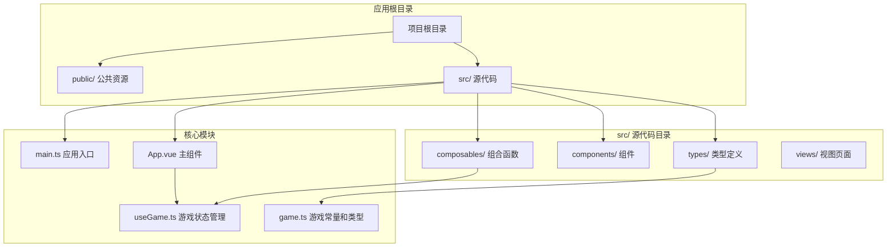

**图表来源**
- [main.ts:1-6](file://src/main.ts#L1-L6)
- [App.vue:1-305](file://src/App.vue#L1-L305)
- [useGame.ts:1-1282](file://src/composables/useGame.ts#L1-L1282)
- [game.ts:1-300](file://src/types/game.ts#L1-L300)

**章节来源**
- [main.ts:1-6](file://src/main.ts#L1-L6)
- [README.md:1-6](file://README.md#L1-L6)

## 核心组件

### useGame 组合函数架构

useGame 组合函数是整个游戏状态管理系统的核心，提供了完整的状态管理和游戏逻辑控制：

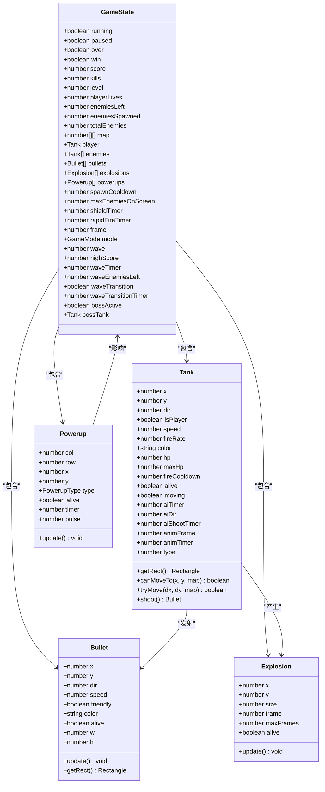

**图表来源**
- [useGame.ts:16-138](file://src/composables/useGame.ts#L16-L138)
- [useGame.ts:229-262](file://src/composables/useGame.ts#L229-L262)

### 游戏状态数据结构

游戏状态采用响应式对象设计，确保与 Vue 3 的响应式系统无缝集成：

| 状态字段 | 类型 | 描述 | 默认值 |
|---------|------|------|--------|
| running | boolean | 游戏是否正在运行 | false |
| paused | boolean | 游戏是否暂停 | false |
| over | boolean | 游戏是否结束 | false |
| win | boolean | 游戏是否获胜 | false |
| score | number | 当前得分 | 0 |
| kills | number | 总击杀数 | 0 |
| level | number | 当前关卡 | 1 |
| playerLives | number | 玩家生命值 | 3 |
| enemiesLeft | number | 剩余敌人数量 | 0 |
| enemiesSpawned | number | 已生成敌人数量 | 0 |
| totalEnemies | number | 总敌人数量 | 0 |
| map | number[][] | 地图矩阵 | [] |
| player | Tank \| null | 玩家坦克 | null |
| enemies | Tank[] | 敌人列表 | [] |
| bullets | Bullet[] | 子弹列表 | [] |
| explosions | Explosion[] | 爆炸效果列表 | [] |
| powerups | Powerup[] | 道具列表 | [] |
| spawnCooldown | number | 敌人生成冷却 | 0 |
| maxEnemiesOnScreen | number | 屏幕最大敌人数量 | 4 |
| shieldTimer | number | 护盾持续时间 | 0 |
| rapidFireTimer | number | 连发持续时间 | 0 |
| frame | number | 游戏帧数 | 0 |

**章节来源**
- [useGame.ts:229-301](file://src/composables/useGame.ts#L229-L301)

## 架构概览

### 系统架构图

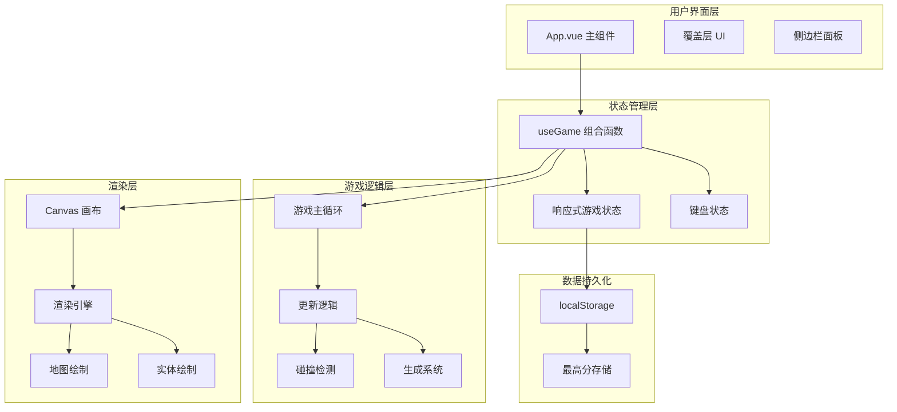

**图表来源**
- [App.vue:1-305](file://src/App.vue#L1-L305)
- [useGame.ts:1272-1282](file://src/composables/useGame.ts#L1272-L1282)

### 状态管理流程

```mermaid
sequenceDiagram
participant UI as 用户界面
participant App as App.vue
participant Game as useGame
participant State as 游戏状态
participant Loop as 游戏循环
UI->>App : 用户点击开始游戏
App->>Game : startGame(mode)
Game->>Game : initState()
Game->>State : 初始化默认状态
Game->>Loop : 启动游戏循环
Loop->>Game : update()
Game->>State : 更新游戏状态
Game->>Loop : render()
Loop->>Game : requestAnimationFrame
Game->>Loop : 下一帧
Note over UI,Loop : 游戏运行中...
Loop->>Game : update()
Game->>State : 处理输入
Game->>State : 更新实体位置
Game->>State : 检测碰撞
Game->>State : 处理效果
Game->>Loop : render()
```

**图表来源**
- [useGame.ts:1155-1176](file://src/composables/useGame.ts#L1155-L1176)
- [useGame.ts:731-792](file://src/composables/useGame.ts#L731-L792)

## 详细组件分析

### 游戏状态管理器

useGame 组合函数实现了完整的状态管理功能：

#### 状态初始化机制

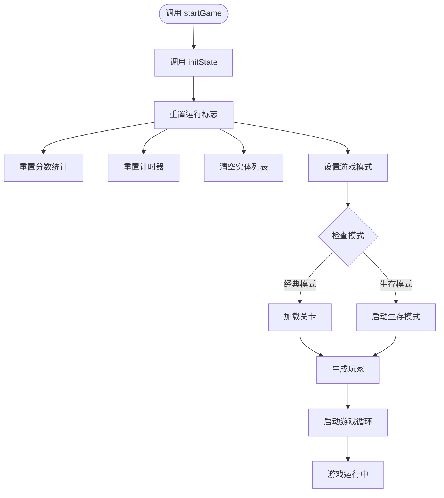

**图表来源**
- [useGame.ts:1162-1176](file://src/composables/useGame.ts#L1162-L1176)
- [useGame.ts:319-354](file://src/composables/useGame.ts#L319-L354)

#### 实体管理系统

游戏包含多种实体类型，每种都有特定的行为和生命周期：

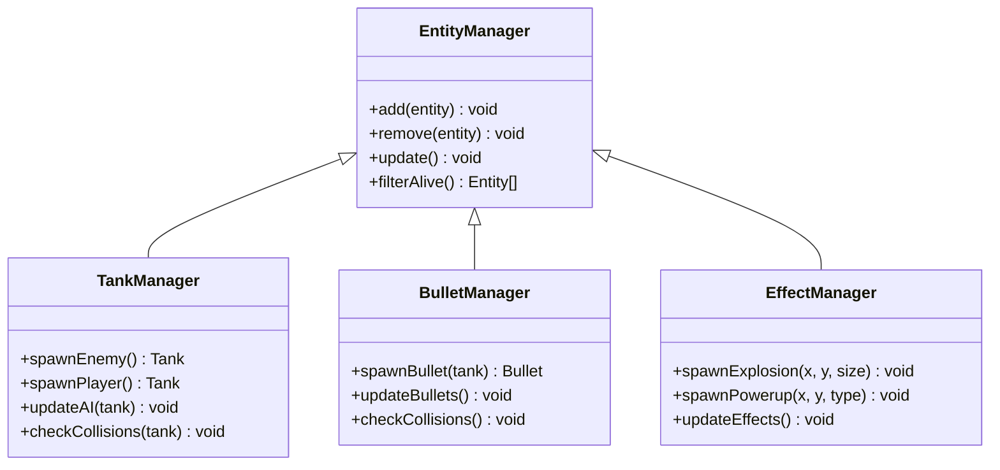

**图表来源**
- [useGame.ts:360-426](file://src/composables/useGame.ts#L360-L426)
- [useGame.ts:112-172](file://src/composables/useGame.ts#L112-L172)

**章节来源**
- [useGame.ts:360-426](file://src/composables/useGame.ts#L360-L426)
- [useGame.ts:112-172](file://src/composables/useGame.ts#L112-L172)

### 状态转换逻辑

#### 经典模式状态转换

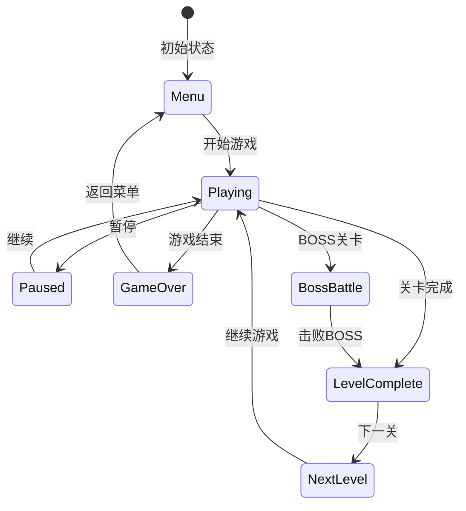

#### 生存模式状态转换

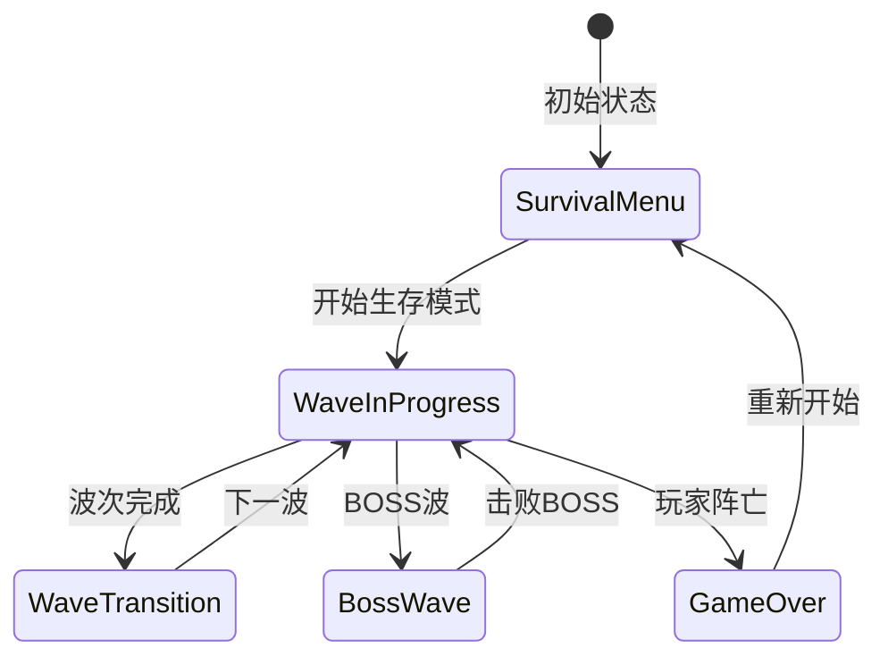

**图表来源**
- [useGame.ts:1189-1213](file://src/composables/useGame.ts#L1189-L1213)
- [useGame.ts:1215-1228](file://src/composables/useGame.ts#L1215-L1228)

**章节来源**
- [useGame.ts:1189-1213](file://src/composables/useGame.ts#L1189-L1213)
- [useGame.ts:1215-1228](file://src/composables/useGame.ts#L1215-L1228)

### 状态同步机制

#### Vue 响应式集成

游戏状态通过 Vue 3 的响应式系统实现自动更新：

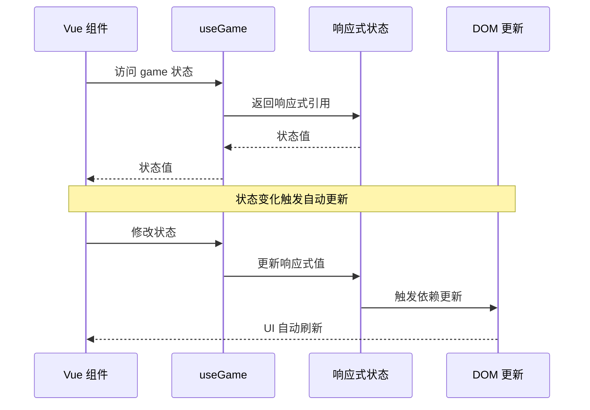

**图表来源**
- [App.vue:52-83](file://src/App.vue#L52-L83)
- [useGame.ts:268-301](file://src/composables/useGame.ts#L268-L301)

#### 键盘输入处理

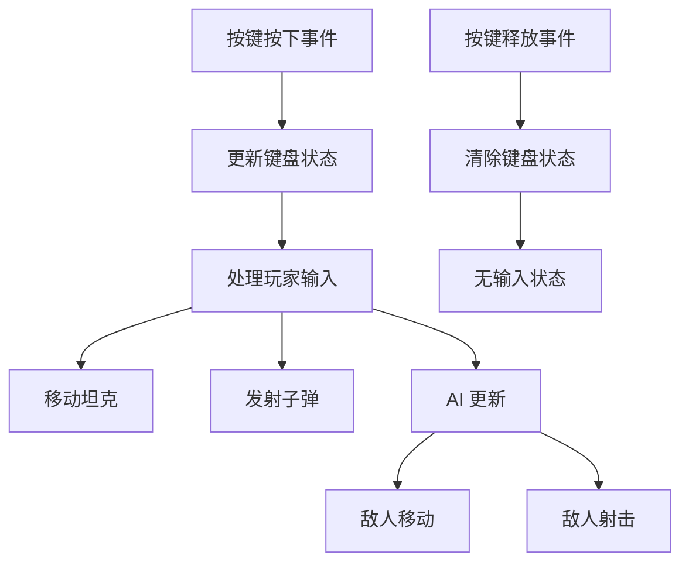

**图表来源**
- [useGame.ts:307-316](file://src/composables/useGame.ts#L307-L316)
- [useGame.ts:694-729](file://src/composables/useGame.ts#L694-L729)

**章节来源**
- [App.vue:52-83](file://src/App.vue#L52-L83)
- [useGame.ts:307-316](file://src/composables/useGame.ts#L307-L316)
- [useGame.ts:694-729](file://src/composables/useGame.ts#L694-L729)

### 状态持久化策略

#### 数据持久化实现

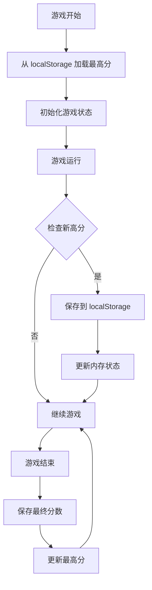

**图表来源**
- [useGame.ts:346](file://src/composables/useGame.ts#L346)
- [useGame.ts:611-616](file://src/composables/useGame.ts#L611-L616)

#### 状态重置机制

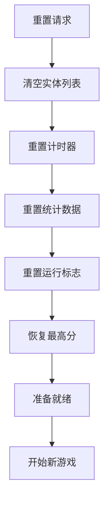

**图表来源**
- [useGame.ts:1162-1176](file://src/composables/useGame.ts#L1162-L1176)
- [useGame.ts:319-354](file://src/composables/useGame.ts#L319-L354)

**章节来源**
- [useGame.ts:346](file://src/composables/useGame.ts#L346)
- [useGame.ts:611-616](file://src/composables/useGame.ts#L611-L616)
- [useGame.ts:1162-1176](file://src/composables/useGame.ts#L1162-L1176)

### 多游戏模式状态隔离

#### 模式特定状态管理

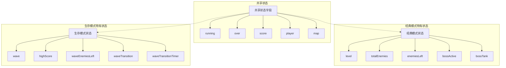

**图表来源**
- [useGame.ts:252-301](file://src/composables/useGame.ts#L252-L301)
- [game.ts:23-24](file://src/types/game.ts#L23-L24)

#### 模式切换逻辑

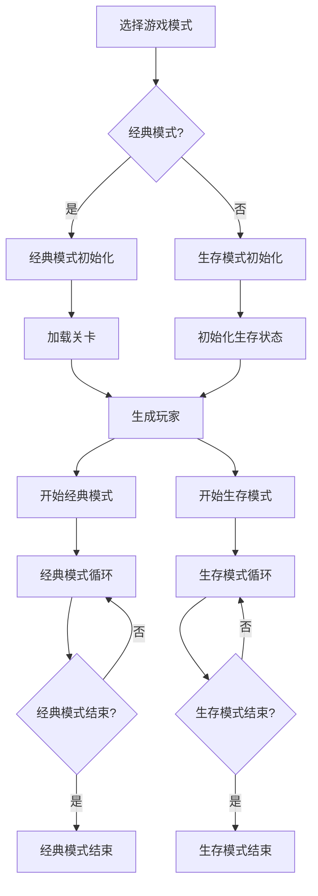

**图表来源**
- [useGame.ts:1162-1187](file://src/composables/useGame.ts#L1162-L1187)
- [useGame.ts:1189-1213](file://src/composables/useGame.ts#L1189-L1213)

**章节来源**
- [useGame.ts:252-301](file://src/composables/useGame.ts#L252-L301)
- [useGame.ts:1162-1187](file://src/composables/useGame.ts#L1162-L1187)

## 依赖关系分析

### 外部依赖

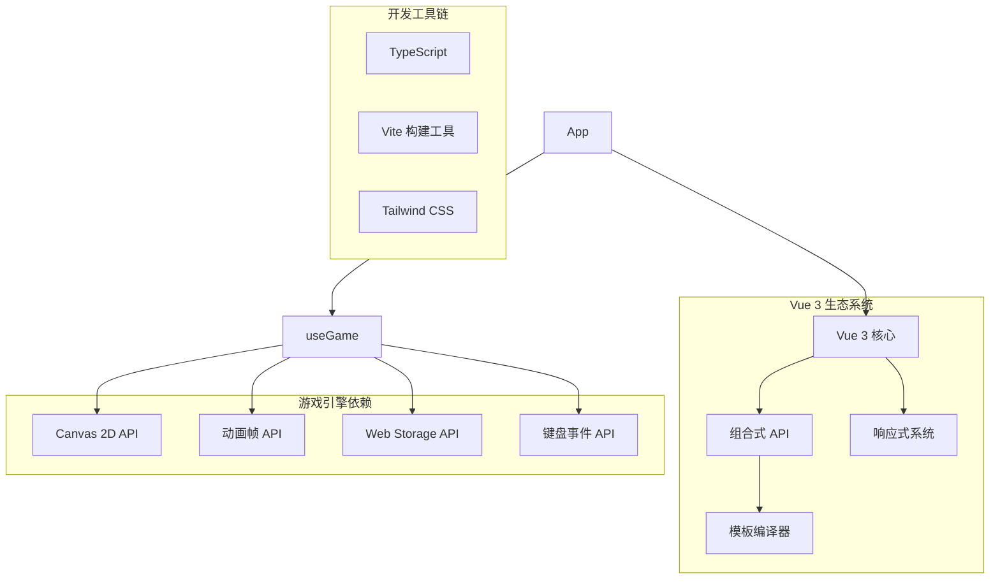

**图表来源**
- [main.ts:1-6](file://src/main.ts#L1-L6)
- [useGame.ts:1-10](file://src/composables/useGame.ts#L1-L10)

### 内部模块依赖

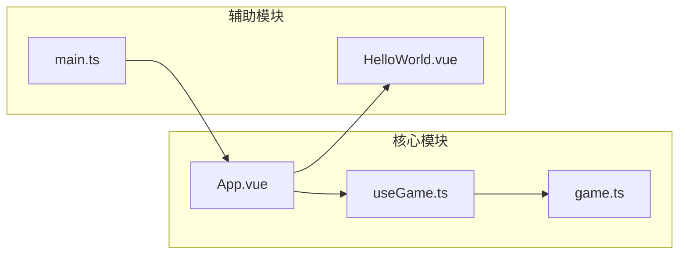

**图表来源**
- [App.vue:1-8](file://src/App.vue#L1-L8)
- [useGame.ts:1-10](file://src/composables/useGame.ts#L1-L10)
- [main.ts:1-6](file://src/main.ts#L1-L6)

**章节来源**
- [main.ts:1-6](file://src/main.ts#L1-L6)
- [App.vue:1-8](file://src/App.vue#L1-L8)

## 性能考虑

### 渲染优化策略

#### 实体更新优化

游戏采用了高效的实体更新策略，避免不必要的计算：

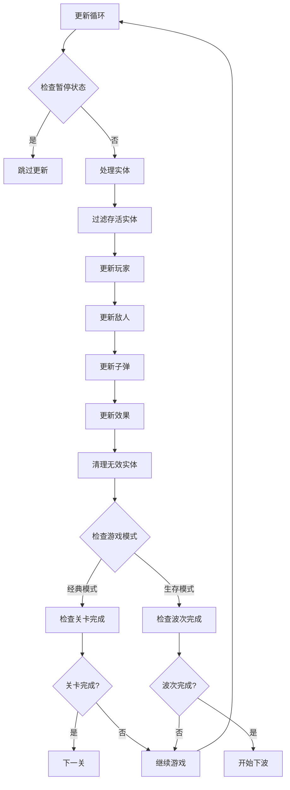

**图表来源**
- [useGame.ts:731-792](file://src/composables/useGame.ts#L731-L792)
- [useGame.ts:784-791](file://src/composables/useGame.ts#L784-L791)

#### 内存管理优化

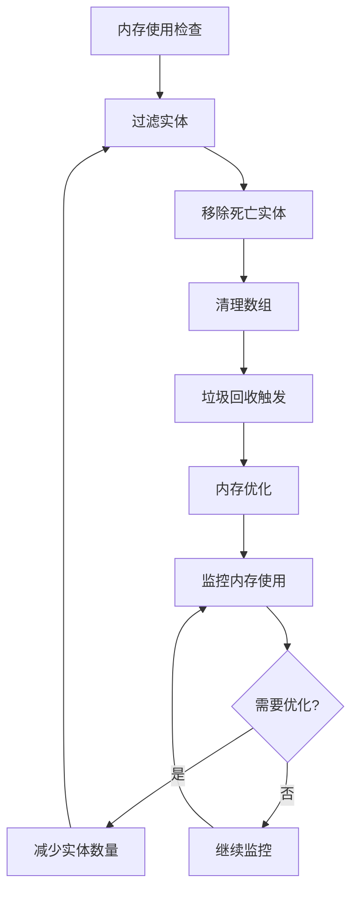

**图表来源**
- [useGame.ts:784-791](file://src/composables/useGame.ts#L784-L791)

### 响应式性能优化

#### 状态更新优化

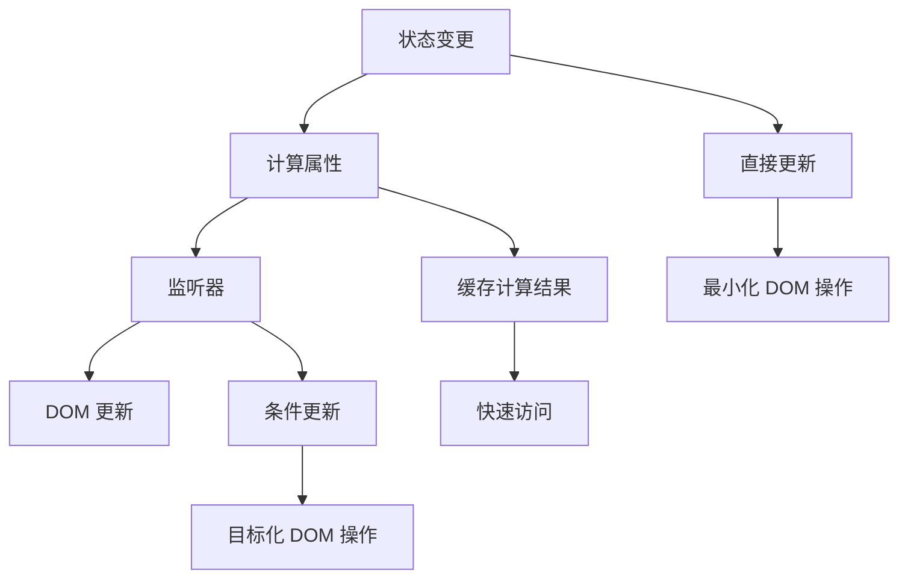

**图表来源**
- [App.vue:52-83](file://src/App.vue#L52-L83)
- [useGame.ts:268-301](file://src/composables/useGame.ts#L268-L301)

**章节来源**
- [useGame.ts:731-792](file://src/composables/useGame.ts#L731-L792)
- [App.vue:52-83](file://src/App.vue#L52-L83)

## 故障排除指南

### 常见问题诊断

#### 状态不同步问题

当出现状态不同步问题时，可以按照以下步骤排查：

1. **检查响应式绑定**
   - 确认所有状态都通过响应式系统管理
   - 验证状态更新是否触发了正确的依赖更新

2. **调试状态流**
   - 在关键状态变更点添加日志输出
   - 使用浏览器开发者工具监控状态变化

3. **验证组件更新**
   - 检查组件是否正确订阅了状态变更
   - 确认模板中的状态绑定语法正确

#### 性能问题诊断

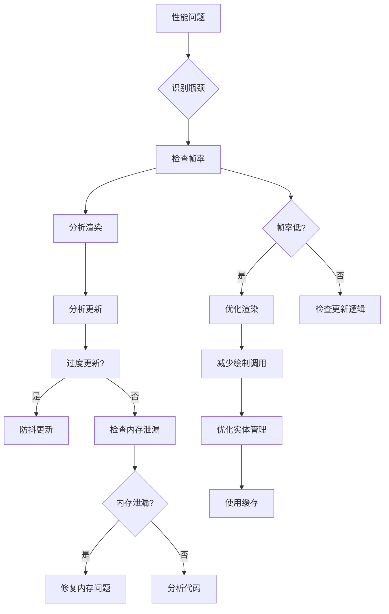

**图表来源**
- [useGame.ts:1155-1176](file://src/composables/useGame.ts#L1155-L1176)
- [useGame.ts:731-792](file://src/composables/useGame.ts#L731-L792)

#### 游戏循环问题

当游戏循环出现问题时：

1. **检查动画帧循环**
   - 确认 requestAnimationFrame 正确使用
   - 验证循环停止条件正确

2. **调试状态更新**
   - 检查 update 方法的执行顺序
   - 验证状态更新的幂等性

3. **监控内存使用**
   - 定期清理无效实体
   - 监控数组长度增长

**章节来源**
- [useGame.ts:1155-1176](file://src/composables/useGame.ts#L1155-L1176)
- [useGame.ts:731-792](file://src/composables/useGame.ts#L731-L792)

### 最佳实践建议

#### 状态管理最佳实践

1. **单一职责原则**
   - 每个状态字段应该有明确的用途
   - 避免状态冗余和重复

2. **响应式设计**
   - 使用 reactive 包装复杂对象
   - 避免直接修改嵌套属性

3. **状态隔离**
   - 不同模式的状态应该相互独立
   - 避免模式间的状态污染

#### 性能优化最佳实践

1. **渲染优化**
   - 批量更新 DOM 操作
   - 使用虚拟滚动处理大量实体

2. **内存管理**
   - 及时清理不再使用的实体
   - 避免创建临时对象

3. **计算优化**
   - 缓存昂贵的计算结果
   - 使用防抖和节流处理高频事件

## 结论

Reimagined Journey 的游戏状态管理系统展现了现代前端游戏开发的最佳实践。通过精心设计的组合式 API 架构，系统实现了：

**技术优势**：
- 基于 Vue 3 响应式系统的高效状态管理
- 完整的多游戏模式支持和状态隔离
- 优化的渲染管道和性能监控
- 灵活的状态持久化和重置机制

**架构特色**：
- 清晰的职责分离和模块化设计
- 完善的错误处理和故障恢复机制
- 可扩展的状态结构和实体系统
- 高效的内存管理和性能优化

**未来改进方向**：
- 添加更详细的状态快照和回放功能
- 实现更精细的性能分析和监控
- 增强多平台兼容性和移动端优化
- 扩展更多游戏模式和内容

这个系统为类似的游戏项目提供了优秀的参考模板，展示了如何在现代前端技术栈中构建高性能、可维护的游戏状态管理系统。