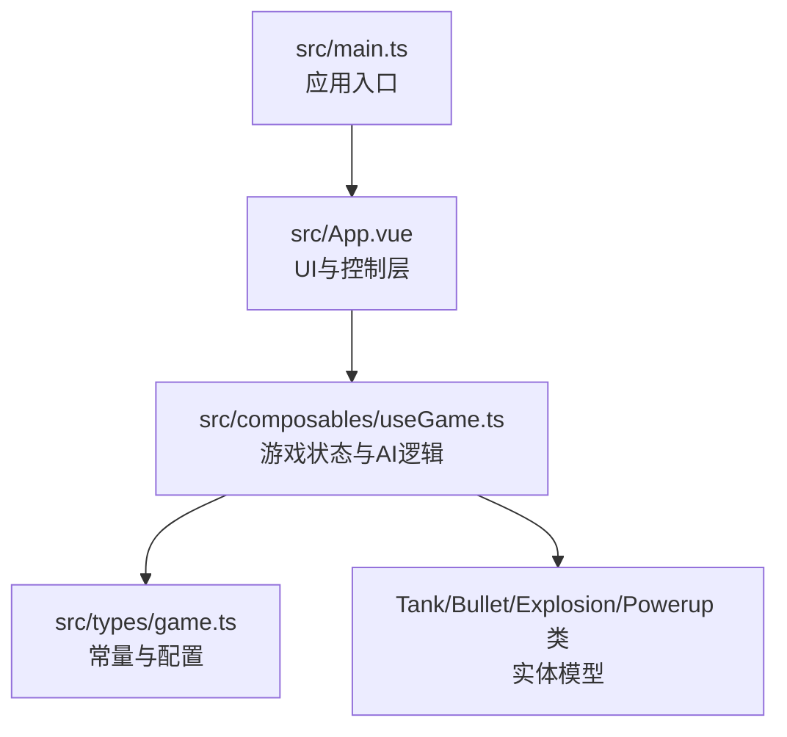
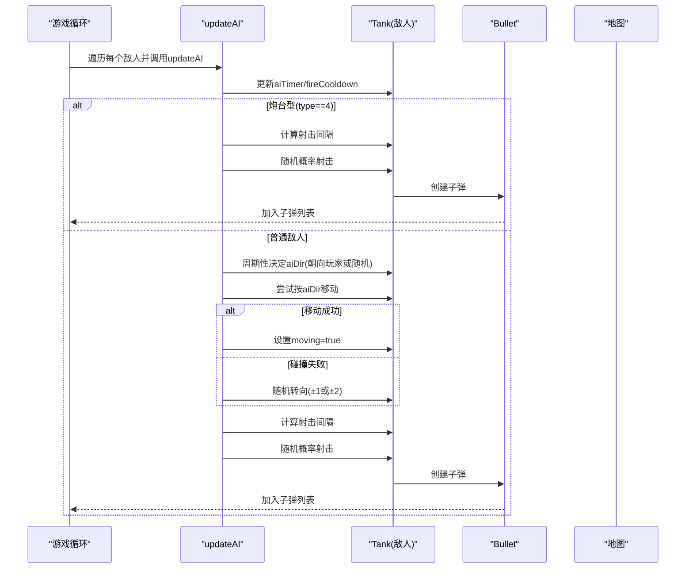
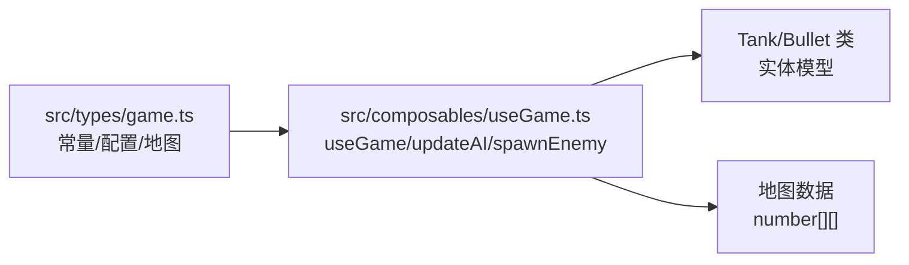
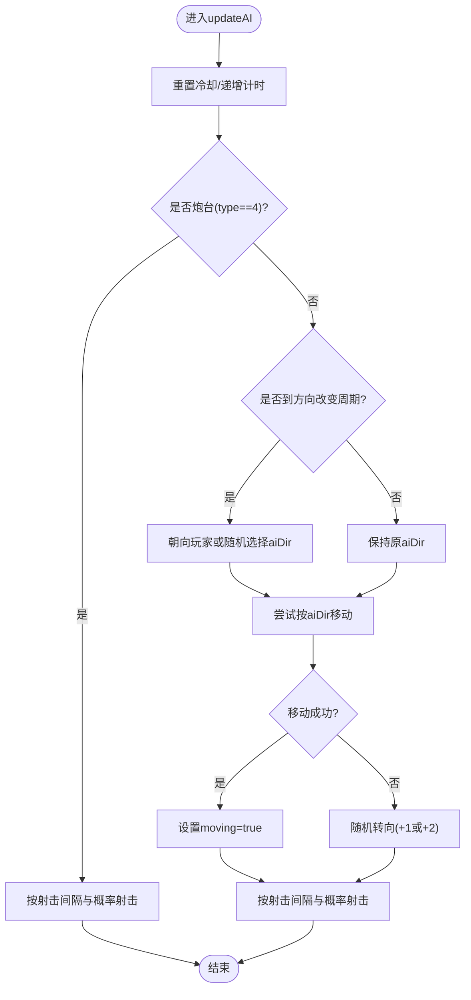

# AI行为系统

<cite>
**本文档引用的文件**
- [README.md](file://README.md)
- [src/main.ts](file://src/main.ts)
- [src/App.vue](file://src/App.vue)
- [src/composables/useGame.ts](file://src/composables/useGame.ts)
- [src/types/game.ts](file://src/types/game.ts)
</cite>

## 目录
1. [简介](#简介)
2. [项目结构](#项目结构)
3. [核心组件](#核心组件)
4. [架构概览](#架构概览)
5. [详细组件分析](#详细组件分析)
6. [依赖分析](#依赖分析)
7. [性能考量](#性能考量)
8. [故障排查指南](#故障排查指南)
9. [结论](#结论)
10. [附录](#附录)

## 简介
本文件面向“AI行为系统”的设计与实现，聚焦于updateAI函数的决策逻辑，包括敌人方向选择、移动策略与射击时机判断；对比不同类型的敌人（炮台型与普通敌人）的行为差异；详解BOSS的特殊AI（散射射击与血量管理）；解释AI随机性参数的设置与平衡性考虑；并给出行为树的实现思路与可扩展性方案，以及具体的AI配置参数与调优建议。

## 项目结构
该项目为基于Vue 3 + TypeScript + Vite的2D坦克游戏，AI行为集中在useGame组合式函数中，通过updateAI驱动所有敌方单位的每帧行为。类型定义位于game.ts，负责常量、地图、敌人属性与波次配置等。

图表来源
- [src/main.ts:1-6](file://src/main.ts#L1-L6)
- [src/App.vue:1-305](file://src/App.vue#L1-L305)
- [src/composables/useGame.ts:1-1282](file://src/composables/useGame.ts#L1-L1282)
- [src/types/game.ts:1-300](file://src/types/game.ts#L1-L300)

章节来源
- [src/main.ts:1-6](file://src/main.ts#L1-L6)
- [src/App.vue:1-305](file://src/App.vue#L1-L305)
- [src/composables/useGame.ts:1-1282](file://src/composables/useGame.ts#L1-L1282)
- [src/types/game.ts:1-300](file://src/types/game.ts#L1-L300)

## 核心组件
- Tank类：表示玩家或敌方坦克，包含位置、朝向、速度、开火冷却、血量、AI计时器等状态字段，并提供canMoveTo/tryMove/shoot等方法。
- Bullet类：表示子弹，包含方向、速度、友好阵营标记、矩形碰撞框等。
- GameState与useGame：集中管理游戏状态、波次、敌人生成、AI更新、碰撞检测、UI交互等。
- 类型系统：定义地图瓦片、方向常量、敌人类型枚举、波次配置、敌人属性表、关卡与地图生成等。

章节来源
- [src/composables/useGame.ts:16-138](file://src/composables/useGame.ts#L16-L138)
- [src/composables/useGame.ts:140-172](file://src/composables/useGame.ts#L140-L172)
- [src/composables/useGame.ts:229-301](file://src/composables/useGame.ts#L229-L301)
- [src/types/game.ts:1-300](file://src/types/game.ts#L1-L300)

## 架构概览
AI行为由updateAI统一调度，按类型分发不同策略：
- 炮台型敌人（type=4）：固定朝向，仅射击，不移动。
- 普通敌人（type=0~3）：周期性改变方向，朝向玩家或随机移动，尝试前进，碰撞失败则随机转向。
- BOSS（type=5）：继承普通敌人移动策略，但射击改为散射三方向。

图表来源
- [src/composables/useGame.ts:452-511](file://src/composables/useGame.ts#L452-L511)
- [src/composables/useGame.ts:513-531](file://src/composables/useGame.ts#L513-L531)

章节来源
- [src/composables/useGame.ts:452-531](file://src/composables/useGame.ts#L452-L531)

## 详细组件分析

### updateAI函数：决策逻辑与行为树映射
updateAI是AI的核心调度器，每帧执行以下流程：
- 冷却与计时：重置fireCooldown，递增aiTimer与aiShootTimer。
- 类型分支：
  - 炮台型（type=4）：固定朝向，按射击间隔与概率发射子弹，不移动。
  - 其他类型：周期性决定aiDir（优先朝向玩家，否则随机），尝试按当前方向移动，碰撞失败则随机转向，随后按射击间隔与概率射击。
- BOSS（type=5）：普通移动策略不变，射击改为散射三方向。

行为树映射思路（概念性）：
- Root
  - 条件：敌人是否存活
    - 否：返回
    - 是：继续
  - 子节点1：炮台型判定
    - 是：射击分支（射击间隔/概率）
    - 否：进入移动分支
  - 子节点2：移动分支
    - 决策：是否需要改变方向（周期性）
      - 是：朝向玩家或随机
      - 否：沿原方向
    - 执行：尝试移动，失败则随机转向
  - 子节点3：射击分支（非炮台）
    - 决策：射击间隔/概率
    - 执行：单发或散射（BOSS）

章节来源
- [src/composables/useGame.ts:452-511](file://src/composables/useGame.ts#L452-L511)

### 敌人类型与行为差异
- 类型0/1/2/3：普通步兵型，移动与射击策略一致，区别在于速度、开火间隔与血量。
- 类型4：炮台型，不移动，仅射击，适合固定防御位置。
- 类型5：BOSS，继承普通移动策略，射击改为散射三方向，血量更高，击杀奖励更大。

章节来源
- [src/types/game.ts:92-106](file://src/types/game.ts#L92-L106)
- [src/types/game.ts:108-128](file://src/types/game.ts#L108-L128)
- [src/composables/useGame.ts:360-426](file://src/composables/useGame.ts#L360-L426)

### BOSS特殊AI：散射射击与血量管理
- 散射射击：以当前朝向为基准，左右各偏转一个方向，同时发射三发子弹，提升命中覆盖与压力。
- 血量管理：根据关卡或波次设定不同血量，击杀后清空BOSS状态并增加额外分数。

章节来源
- [src/composables/useGame.ts:513-531](file://src/composables/useGame.ts#L513-L531)
- [src/composables/useGame.ts:571-579](file://src/composables/useGame.ts#L571-L579)
- [src/types/game.ts:135-139](file://src/types/game.ts#L135-L139)

### AI随机性参数与平衡性
updateAI中的随机性主要体现在：
- 方向改变周期：changeDirInterval = 80 + 随机(0~60)，避免机械重复。
- 朝向选择：50%概率朝向玩家，50%概率随机，兼顾追击与探索。
- 移动失败后的转向：随机选择+1或+2（模4），增加路径多样性。
- 射击间隔：shootInterval = 40 + 随机(0~80)，配合射击概率，控制火力密度。
- 射击概率：普通敌人60%，炮台70%，BOSS散射触发概率60%。
- 炮台射击间隔：30 + 随机(0~40)，保证持续输出。

平衡性考虑：
- 低级敌人：高射速、低血量，强调数量压制。
- 高级敌人：低射速、高血量，强调威胁与策略性。
- 炮台：固定位置、高威胁、低机动，适合防守。
- BOSS：高血量、散射攻击、大奖励，作为阶段性目标。

章节来源
- [src/composables/useGame.ts:473-495](file://src/composables/useGame.ts#L473-L495)
- [src/composables/useGame.ts:497-510](file://src/composables/useGame.ts#L497-L510)
- [src/composables/useGame.ts:460-471](file://src/composables/useGame.ts#L460-L471)
- [src/types/game.ts:92-106](file://src/types/game.ts#L92-L106)

### 行为树实现思路与可扩展性
- 实现思路（概念性）：
  - 节点类型：条件节点（存活/距离/冷却）、动作节点（转向/移动/射击）、复合节点（序列/选择/并行）。
  - 优先级：炮台型优先；BOSS散射优先；追击优先；探索移动；射击。
- 可扩展性：
  - 新增敌人类型：新增类型枚举与属性表，扩展spawnEnemy中的类型选择与BOSS判定。
  - 新增行为：添加新动作节点（如“撤退”、“装填”、“预警”），通过条件节点控制切换。
  - 参数化：将周期、概率、阈值等放入配置对象，便于热更新与调试。
  - 状态机：将aiDir/aiShootTimer抽象为状态机，支持更复杂的过渡条件。

[本节为概念性设计，不直接分析具体文件，故无章节来源]

### AI配置参数与调优建议
- 方向改变周期（changeDirInterval）：基础值80，随机范围60。建议随波次/难度线性增加，避免过于僵化。
- 朝向玩家概率：默认50%。建议根据敌人类型调整，炮台型降低，BOSS提高。
- 移动失败转向幅度：±1或±2。建议随等级增加，提升路径复杂度。
- 射击间隔（shootInterval）：普通敌人基础40，随机80；炮台30+随机40；BOSS散射同普通射击间隔。建议随波次/等级降低随机范围，提升稳定性。
- 射击概率：普通60%，炮台70%，BOSS散射60%。建议根据血量与威胁度动态调整。
- BOSS血量：根据关卡设定，建议随波次/等级递增，保证挑战性与成就感。
- 敌人属性表：速度、射速、血量、颜色。建议建立表格化配置，便于批量调优与A/B测试。

章节来源
- [src/composables/useGame.ts:473-510](file://src/composables/useGame.ts#L473-L510)
- [src/types/game.ts:92-106](file://src/types/game.ts#L92-L106)
- [src/types/game.ts:135-139](file://src/types/game.ts#L135-L139)

## 依赖分析
- useGame依赖game.ts提供的常量、方向表、敌人属性表、波次配置与地图生成。
- updateAI依赖Tank类的方法（canMoveTo/tryMove/shoot）与全局game状态（map、bullets等）。
- 敌人生成逻辑依赖波次配置与关卡类型，决定敌人类型、速度、射速与血量。

图表来源
- [src/types/game.ts:1-300](file://src/types/game.ts#L1-L300)
- [src/composables/useGame.ts:1-1282](file://src/composables/useGame.ts#L1-L1282)

章节来源
- [src/types/game.ts:1-300](file://src/types/game.ts#L1-L300)
- [src/composables/useGame.ts:1-1282](file://src/composables/useGame.ts#L1-L1282)

## 性能考量
- updateAI每帧遍历所有敌人，时间复杂度O(N)。建议：
  - 控制最大同时出现敌人数量（maxEnemiesOnScreen），避免过多AI实例。
  - 使用对象池复用Bullet/Explosion，减少GC压力。
  - 将随机计算与方向表查询放在常量区，避免重复计算。
- 碰撞检测与地图访问为O(M)（M为子弹数），建议：
  - 采用空间分割（如四叉树）优化大规模场景下的碰撞检测。
  - 对地图访问进行边界检查与缓存，减少重复索引计算。

[本节为通用性能建议，不直接分析具体文件，故无章节来源]

## 故障排查指南
- 敌人不动或频繁转向：
  - 检查changeDirInterval与aiTimer是否正确递增。
  - 确认canMoveTo/tryMove的边界与地图值。
- 子弹不发射或发射异常：
  - 检查fireCooldown与shootInterval的递减与重置逻辑。
  - 确认射击概率与类型分支（炮台/BOSS）。
- BOSS未散射：
  - 检查type=5的分支与shootBossBullets的方向集合。
- 碰撞误判：
  - 检查getRect与rectsOverlap的边界与尺寸。
  - 确认子弹与地图块的碰撞顺序与销毁逻辑。

章节来源
- [src/composables/useGame.ts:452-531](file://src/composables/useGame.ts#L452-L531)
- [src/composables/useGame.ts:533-636](file://src/composables/useGame.ts#L533-L636)

## 结论
本AI系统以简洁的状态机与随机性参数为核心，实现了炮台型、普通敌人与BOSS的差异化行为。通过参数化配置与行为树映射，可在不破坏现有逻辑的前提下扩展新类型与新策略。建议结合波次与难度曲线动态调整随机范围与属性，以获得更佳的游戏体验与平衡性。

[本节为总结性内容，不直接分析具体文件，故无章节来源]

## 附录
- 关键流程图：updateAI决策流程

图表来源
- [src/composables/useGame.ts:452-511](file://src/composables/useGame.ts#L452-L511)