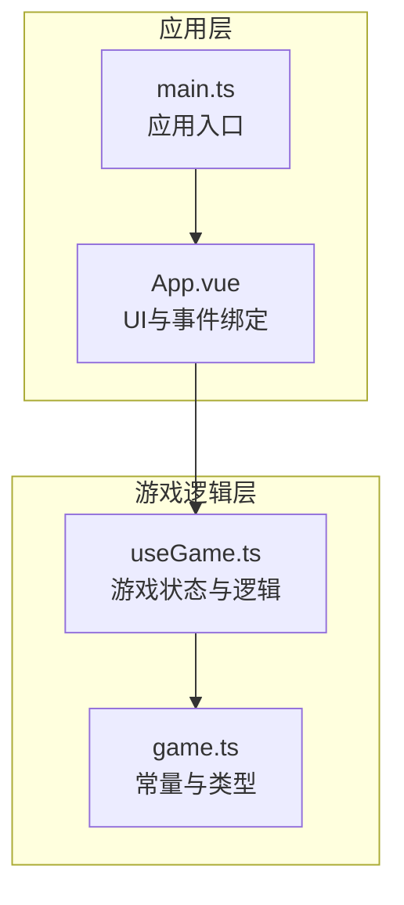
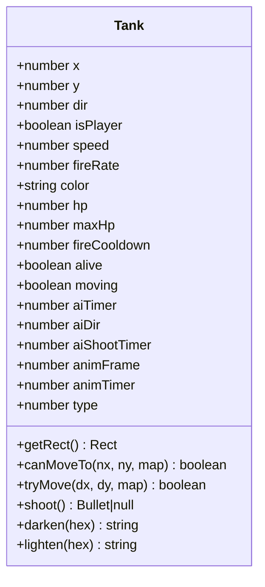
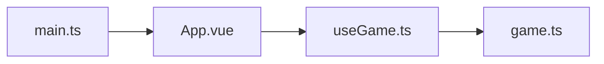

# 坦克系统

<cite>
**本文档引用的文件**
- [useGame.ts](file://src/composables/useGame.ts)
- [game.ts](file://src/types/game.ts)
- [App.vue](file://src/App.vue)
- [main.ts](file://src/main.ts)
</cite>

## 目录
1. [简介](#简介)
2. [项目结构](#项目结构)
3. [核心组件](#核心组件)
4. [架构总览](#架构总览)
5. [详细组件分析](#详细组件分析)
6. [依赖关系分析](#依赖关系分析)
7. [性能考量](#性能考量)
8. [故障排查指南](#故障排查指南)
9. [结论](#结论)
10. [附录](#附录)

## 简介
本文件面向坦克系统的使用者与维护者，系统化阐述 Tank 类的设计与实现，覆盖玩家坦克与敌人坦克的统一建模、核心属性与行为方法、AI 决策逻辑、动画系统、碰撞检测、以及不同坦克类型的差异（含炮台与 BOSS）。同时提供构造函数参数说明、使用示例路径与性能优化建议，帮助读者快速理解并高效扩展该系统。

## 项目结构
本项目采用 Vue 3 + TypeScript 的前端架构，坦克系统集中于组合式函数 useGame.ts 中，通过响应式状态驱动游戏循环与渲染。类型常量与辅助函数位于 game.ts，UI 展示与事件绑定位于 App.vue，应用入口在 main.ts。



图表来源
- [useGame.ts:1-1282](file://src/composables/useGame.ts#L1-L1282)
- [game.ts:1-300](file://src/types/game.ts#L1-L300)
- [App.vue:1-305](file://src/App.vue#L1-L305)
- [main.ts:1-6](file://src/main.ts#L1-L6)

章节来源
- [useGame.ts:1-1282](file://src/composables/useGame.ts#L1-L1282)
- [game.ts:1-300](file://src/types/game.ts#L1-L300)
- [App.vue:1-305](file://src/App.vue#L1-L305)
- [main.ts:1-6](file://src/main.ts#L1-L6)

## 核心组件
- Tank 类：统一抽象玩家与敌人坦克，封装位置、方向、速度、生命值、射击冷却、动画帧等状态，提供移动、射击、碰撞检测与颜色工具方法。
- Bullet 类：子弹实体，负责位置更新与边界判定。
- Explosion、Powerup 等：爆炸与道具系统，作为坦克系统生态的一部分参与碰撞与表现。
- useGame 组合式函数：管理游戏状态、生成敌人与玩家、AI 更新、碰撞检测、渲染调度与 UI 交互。

章节来源
- [useGame.ts:16-138](file://src/composables/useGame.ts#L16-L138)
- [useGame.ts:140-172](file://src/composables/useGame.ts#L140-L172)
- [useGame.ts:174-195](file://src/composables/useGame.ts#L174-L195)
- [useGame.ts:264-301](file://src/composables/useGame.ts#L264-L301)

## 架构总览
坦克系统围绕 useGame.ts 的响应式状态 game 运行，通过 requestAnimationFrame 驱动 update 循环，逐帧更新玩家、敌人、子弹与特效，并在 render 中绘制。AI 与碰撞检测在 update 阶段执行，渲染阶段调用 drawTank 等绘制函数。

```mermaid
sequenceDiagram
participant Loop as "游戏循环"
participant Player as "玩家坦克"
participant Enemies as "敌人坦克集合"
participant Bullets as "子弹集合"
participant Render as "渲染器"
Loop->>Loop : "更新帧计数"
Loop->>Player : "处理输入与移动"
Loop->>Enemies : "AI更新与射击"
Loop->>Bullets : "更新位置"
Loop->>Loop : "碰撞检测与效果"
Loop->>Render : "绘制地图/坦克/子弹/特效"
```

图表来源
- [useGame.ts:731-792](file://src/composables/useGame.ts#L731-L792)
- [useGame.ts:921-980](file://src/composables/useGame.ts#L921-L980)

章节来源
- [useGame.ts:731-792](file://src/composables/useGame.ts#L731-L792)
- [useGame.ts:921-980](file://src/composables/useGame.ts#L921-L980)

## 详细组件分析

### Tank 类设计与属性
- 设计目标：统一玩家与敌人坦克的建模，简化控制流与渲染逻辑。
- 核心属性
  - 位置坐标：x、y（像素）
  - 方向：dir（0~3，对应上右下左）
  - 标识：isPlayer（布尔）
  - 性能参数：speed（移动速度）、fireRate（射击冷却帧）
  - 生命系统：hp、maxHp
  - 行为状态：fireCooldown（剩余冷却）、alive、moving
  - AI状态：aiTimer、aiDir、aiShootTimer
  - 动画状态：animFrame、animTimer
  - 类型：type（0~5，区分普通敌人、炮台、BOSS）

- 方法
  - getRect：返回碰撞矩形（带内边距）
  - canMoveTo：基于四角检测与地图瓦片类型判断可通行
  - tryMove：在吸附到网格线的基础上尝试移动，避免卡格子
  - shoot：根据 isPlayer 设置不同速度与颜色，重置射击冷却
  - darken/lighten：颜色工具，用于渲染细节与阴影



图表来源
- [useGame.ts:16-138](file://src/composables/useGame.ts#L16-L138)

章节来源
- [useGame.ts:16-138](file://src/composables/useGame.ts#L16-L138)

### 移动系统：canMoveTo 与 tryMove
- canMoveTo：以坦克包围盒四角采样，检查列/行索引与地图边界，过滤不可穿越瓦片（砖墙、钢铁、水、基地）。
- tryMove：
  - 计算新位置后，若水平移动则尝试将 Y 坐标吸附到最近的网格线；垂直移动同理。
  - 若吸附后的结果仍可通过 canMoveTo，则更新位置并返回 true，否则返回 false。
- 吸附阈值 snap 与角落内边距 pad 用于提升移动体验，避免“卡格子”现象。


图表来源
- [useGame.ts:83-110](file://src/composables/useGame.ts#L83-L110)
- [useGame.ts:65-81](file://src/composables/useGame.ts#L65-L81)

章节来源
- [useGame.ts:65-110](file://src/composables/useGame.ts#L65-L110)

### 射击机制：shoot 与冷却
- 冷却控制：每次射击前检查 fireCooldown，非零则拒绝射击。
- 发射位置：基于坦克中心与方向向量计算弹头起点，保证弹头从炮口射出。
- 子弹速度：玩家子弹速度高于敌人子弹，体现平衡性。
- 子弹颜色：玩家为绿色，敌人为橙红色，便于识别。

章节来源
- [useGame.ts:112-121](file://src/composables/useGame.ts#L112-L121)

### 碰撞检测：getRect 与 rectsOverlap
- getRect：返回带内边距的矩形，避免与墙体边缘贴合导致误判。
- rectsOverlap：通用矩形相交判断，用于子弹与坦克、墙体、基地的碰撞处理。

章节来源
- [useGame.ts:60-63](file://src/composables/useGame.ts#L60-L63)
- [game.ts:298-300](file://src/types/game.ts#L298-L300)

### 动画系统：animFrame 与 animTimer
- animTimer：递增计数，用于控制动画帧切换节奏。
- animFrame：轨道细节动画帧索引，仅在 moving 为真时按固定节拍递增。
- 渲染阶段：根据 animFrame 在左右履带绘制动态条纹，增强运动感。

章节来源
- [useGame.ts:939-946](file://src/composables/useGame.ts#L939-L946)
- [useGame.ts:921-980](file://src/composables/useGame.ts#L921-L980)

### AI 系统：updateAI 决策逻辑
- 冷却与计时：统一递减 fireCooldown 与 aiTimer，并清空 moving 标志。
- 特殊类型处理：
  - 炮台（type=4）：不移动，按随机间隔射击，射击概率更高。
  - BOSS（type=5）：射击模式为三向散射（正前方±15度），提升挑战性。
- 主要策略：
  - 定期改变方向：按随机周期调整 aiDir。
  - 相对定位：若存在存活玩家且有一定概率，优先朝玩家方向移动（按 x/y 差值绝对值大小决定水平或垂直方向）。
  - 随机性：方向变化与射击概率引入随机性，避免可预测行为。
  - 尝试移动：根据当前方向与速度尝试移动，失败则随机转向。


图表来源
- [useGame.ts:452-511](file://src/composables/useGame.ts#L452-L511)
- [useGame.ts:513-531](file://src/composables/useGame.ts#L513-L531)

章节来源
- [useGame.ts:452-531](file://src/composables/useGame.ts#L452-L531)

### 坦克类型与特殊坦克
- 类型枚举（type）：0~5
  - 0：轻型步兵坦克（低血量、中等速度）
  - 1：重型步兵坦克（中等血量、较慢速度）
  - 2：反坦克坦克（中等血量、较快速度）
  - 3：工兵坦克（高血量、最慢速度）
  - 4：炮台（固定位置、高射速、不移动）
  - 5：BOSS（极高血量、三向散射射击）
- 生成逻辑：
  - 经典模式：按关卡等级动态选择类型，BOSS关卡可生成 BOSS。
  - 生存模式：按波次配置选择类型集合，每5波出现一次 BOSS。
- BOSS 血条：在 UI 中绘制，随血量变化颜色渐变。

章节来源
- [game.ts:92-106](file://src/types/game.ts#L92-L106)
- [useGame.ts:360-426](file://src/composables/useGame.ts#L360-L426)
- [useGame.ts:1111-1128](file://src/composables/useGame.ts#L1111-L1128)

### 构造函数参数说明
- 参数列表：x、y、dir、isPlayer、speed、fireRate、color、hp
- 用途：
  - 位置与方向：确定初始坐标与朝向
  - isPlayer：区分玩家与敌人，影响射击速度、颜色与 UI 显示
  - 性能参数：speed、fireRate 控制移动与射击节奏
  - 颜色：渲染主体与细节颜色
  - 生命值：hp、maxHp 决定可承受伤害与 UI 血条

章节来源
- [useGame.ts:36-55](file://src/composables/useGame.ts#L36-L55)

### 使用示例（路径）
- 创建玩家坦克：[spawnPlayer:428-431](file://src/composables/useGame.ts#L428-L431)
- 生成敌人坦克：[spawnEnemy:360-426](file://src/composables/useGame.ts#L360-L426)
- 更新玩家：[updatePlayer:694-729](file://src/composables/useGame.ts#L694-L729)
- 更新敌人 AI：[updateAI:452-511](file://src/composables/useGame.ts#L452-L511)
- 绘制坦克：[drawTank:921-980](file://src/composables/useGame.ts#L921-L980)

章节来源
- [useGame.ts:428-431](file://src/composables/useGame.ts#L428-L431)
- [useGame.ts:360-426](file://src/composables/useGame.ts#L360-L426)
- [useGame.ts:694-729](file://src/composables/useGame.ts#L694-L729)
- [useGame.ts:452-511](file://src/composables/useGame.ts#L452-L511)
- [useGame.ts:921-980](file://src/composables/useGame.ts#L921-L980)

## 依赖关系分析
- useGame.ts 依赖 game.ts 提供的地图瓦片常量、方向向量、敌人属性表与波次配置。
- App.vue 通过 useGame 暴露的接口启动游戏、渲染 UI、处理键盘事件。
- main.ts 引导应用挂载。



图表来源
- [useGame.ts:1-10](file://src/composables/useGame.ts#L1-L10)
- [App.vue:1-6](file://src/App.vue#L1-L6)
- [main.ts:1-6](file://src/main.ts#L1-L6)

章节来源
- [useGame.ts:1-10](file://src/composables/useGame.ts#L1-L10)
- [App.vue:1-6](file://src/App.vue#L1-L6)
- [main.ts:1-6](file://src/main.ts#L1-L6)

## 性能考量
- 碰撞检测
  - canMoveTo 仅检查四个角，复杂度 O(1)，适合高频调用。
  - rectsOverlap 为简单矩形相交，开销极小。
- 移动吸附
  - 仅在水平/垂直移动时进行一次吸附尝试，避免多余计算。
- AI 决策
  - 通过 aiTimer 与 aiShootTimer 控制更新频率，降低每帧 CPU 占用。
  - 随机性与概率控制可调，平衡挑战性与性能。
- 渲染
  - 动画帧切换按固定节拍，避免频繁重绘。
  - 爆炸与道具使用透明度与渐变，视觉效果与性能折中。
- 建议
  - 将地图访问改为更高效的缓存结构（如四叉树）以支持更大地图。
  - 对大量敌人进行空间分区（如网格/四叉树）以减少不必要的 AI 与碰撞遍历。
  - 对子弹与爆炸对象池化，减少频繁分配与 GC 抖动。
  - 将方向向量 DX/DY 改为预分配数组，避免重复创建。

[本节为通用性能建议，不直接分析具体文件，故无章节来源]

## 故障排查指南
- 坦克卡在格子
  - 检查 tryMove 的吸附逻辑与 canMoveTo 的边界条件。
  - 章节来源：[useGame.ts:83-110](file://src/composables/useGame.ts#L83-L110)
- 子弹无法命中
  - 确认 getRect 内边距与 rectsOverlap 的边界关系。
  - 章节来源：[useGame.ts:60-63](file://src/composables/useGame.ts#L60-L63)、[game.ts:298-300](file://src/types/game.ts#L298-L300)
- 敌人不移动
  - 检查 updateAI 的 aiTimer 与 aiDir 更新逻辑，确认炮台与 BOSS 分支。
  - 章节来源：[useGame.ts:452-511](file://src/composables/useGame.ts#L452-L511)
- BOSS 不散射
  - 确认 BOSS 类型分支与 shootBossBullets 的方向计算。
  - 章节来源：[useGame.ts:513-531](file://src/composables/useGame.ts#L513-L531)
- BOSS 血条不显示
  - 检查 bossActive 与 bossTank 的状态，确认 UI 绘制条件。
  - 章节来源：[useGame.ts:1111-1128](file://src/composables/useGame.ts#L1111-L1128)

## 结论
本坦克系统以 Tank 类为核心，统一了玩家与敌人坦克的行为模型，结合清晰的移动、射击、碰撞与 AI 逻辑，辅以动画与 UI 血条，形成完整的游戏实体。通过合理的随机性与类型差异化（炮台、BOSS），既保证了可玩性也维持了性能。建议在后续迭代中引入空间分区与对象池化，进一步提升大规模场景下的运行效率。

## 附录
- 键盘输入绑定与暂停
  - 章节来源：[useGame.ts:1244-1265](file://src/composables/useGame.ts#L1244-L1265)
- 游戏模式切换与波次管理
  - 章节来源：[useGame.ts:1162-1213](file://src/composables/useGame.ts#L1162-L1213)
- UI 与事件
  - 章节来源：[App.vue:19-83](file://src/App.vue#L19-L83)