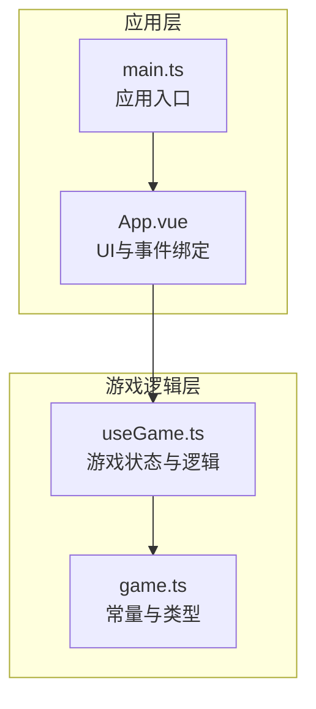
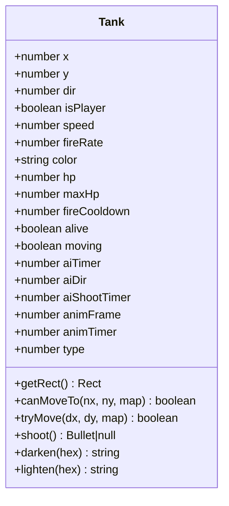
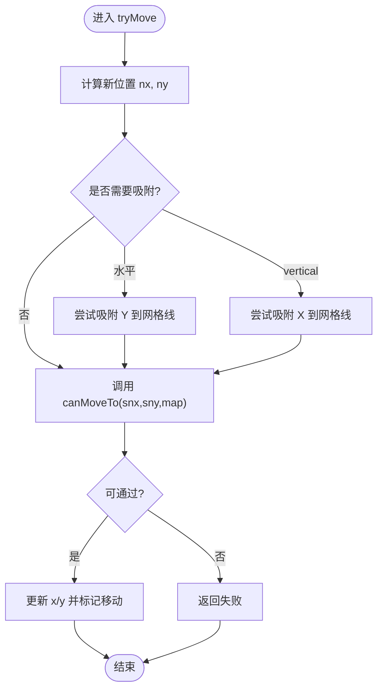
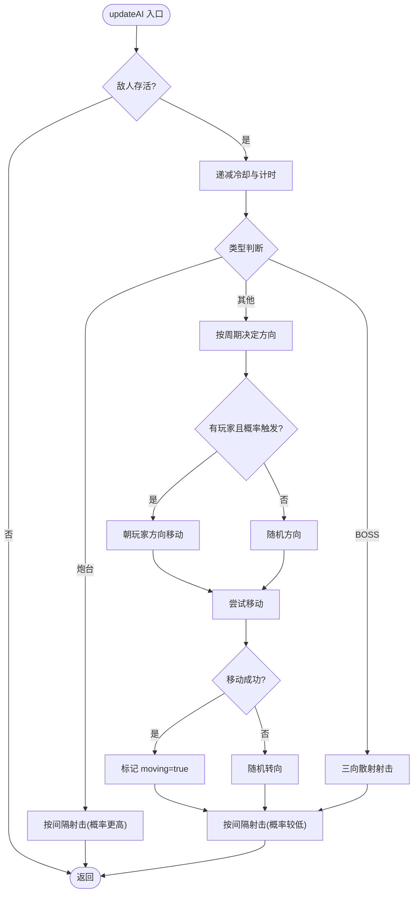
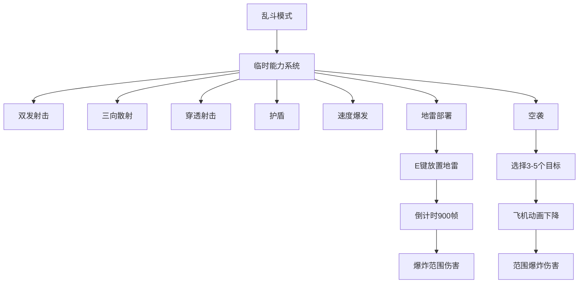
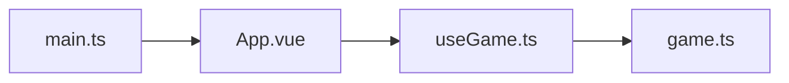

# 坦克系统

<cite>
**本文档引用的文件**
- [useGame.ts](file://src/composables/useGame.ts)
- [game.ts](file://src/types/game.ts)
- [App.vue](file://src/App.vue)
- [main.ts](file://src/main.ts)
</cite>

## 更新摘要
**变更内容**
- 新增技能乱斗模式下的特殊坦克行为系统
- 添加地雷部署机制和碰撞检测
- 实现空袭触发系统和爆炸效果
- 增加多种临时能力的激活和持续时间管理
- 扩展玩家坦克的临时能力系统

## 目录
1. [简介](#简介)
2. [项目结构](#项目结构)
3. [核心组件](#核心组件)
4. [架构总览](#架构总览)
5. [详细组件分析](#详细组件分析)
6. [依赖关系分析](#依赖关系分析)
7. [性能考量](#性能考量)
8. [故障排查指南](#故障排查指南)
9. [结论](#结论)
10. [附录](#附录)

## 简介
本文件面向坦克系统的使用者与维护者，系统化阐述 Tank 类的设计与实现，覆盖玩家坦克与敌人坦克的统一建模、核心属性与行为方法、AI 决策逻辑、动画系统、碰撞检测、以及不同坦克类型的差异（含炮台与 BOSS）。特别关注最新新增的 BOSS 坦克系统和特殊炮塔型敌人的 AI 行为，包括散射射击模式和固定位置攻击机制。**最新版本**还引入了技能乱斗模式，为玩家坦克增加了多种临时能力，包括双发射击、三向散射、穿透射击、护盾、速度爆发、地雷部署和空袭等功能。同时提供构造函数参数说明、使用示例路径与性能优化建议，帮助读者快速理解并高效扩展该系统。

## 项目结构
本项目采用 Vue 3 + TypeScript 的前端架构，坦克系统集中于组合式函数 useGame.ts 中，通过响应式状态驱动游戏循环与渲染。类型常量与辅助函数位于 game.ts，UI 展示与事件绑定位于 App.vue，应用入口在 main.ts。



**图表来源**
- [useGame.ts:1-1902](file://src/composables/useGame.ts#L1-L1902)
- [game.ts:1-312](file://src/types/game.ts#L1-L312)
- [App.vue:1-426](file://src/App.vue#L1-L426)
- [main.ts:1-6](file://src/main.ts#L1-L6)

**章节来源**
- [useGame.ts:1-1902](file://src/composables/useGame.ts#L1-L1902)
- [game.ts:1-312](file://src/types/game.ts#L1-L312)
- [App.vue:1-426](file://src/App.vue#L1-L426)
- [main.ts:1-6](file://src/main.ts#L1-L6)

## 核心组件
- **Tank 类**：统一抽象玩家与敌人坦克，封装位置、方向、速度、生命值、射击冷却、动画帧等状态，提供移动、射击、碰撞检测与颜色工具方法。
- **Bullet 类**：子弹实体，负责位置更新与边界判定。
- **Explosion、Powerup 等**：爆炸与道具系统，作为坦克系统生态的一部分参与碰撞与表现。
- **Mine 类**：地雷实体，支持定时触发和范围爆炸效果。
- **useGame 组合式函数**：管理游戏状态、生成敌人与玩家、AI 更新、碰撞检测、渲染调度与 UI 交互。

**章节来源**
- [useGame.ts:16-138](file://src/composables/useGame.ts#L16-L138)
- [useGame.ts:140-172](file://src/composables/useGame.ts#L140-L172)
- [useGame.ts:174-195](file://src/composables/useGame.ts#L174-L195)
- [useGame.ts:232-256](file://src/composables/useGame.ts#L232-L256)
- [useGame.ts:264-301](file://src/composables/useGame.ts#L264-L301)

## 架构总览
坦克系统围绕 useGame.ts 的响应式状态 game 运行，通过 requestAnimationFrame 驱动 update 循环，逐帧更新玩家、敌人、子弹与特效，并在 render 中绘制。AI 与碰撞检测在 update 阶段执行，渲染阶段调用 drawTank 等绘制函数。**新增的乱斗模式**通过独立的状态管理实现了复杂的临时能力系统。

```mermaid
sequenceDiagram
participant Loop as "游戏循环"
participant Player as "玩家坦克"
participant Enemies as "敌人坦克集合"
participant Bullets as "子弹集合"
participant Mines as "地雷集合"
participant Render as "渲染器"
Loop->>Loop : "更新帧计数"
Loop->>Player : "处理输入与移动"
Loop->>Enemies : "AI更新与射击"
Loop->>Bullets : "更新位置"
Loop->>Mines : "地雷更新与检测"
Loop->>Loop : "碰撞检测与效果"
Loop->>Render : "绘制地图/坦克/子弹/地雷/特效"
```

**图表来源**
- [useGame.ts:1099-1221](file://src/composables/useGame.ts#L1099-L1221)
- [useGame.ts:1130-1172](file://src/composables/useGame.ts#L1130-L1172)

**章节来源**
- [useGame.ts:1099-1221](file://src/composables/useGame.ts#L1099-L1221)
- [useGame.ts:1130-1172](file://src/composables/useGame.ts#L1130-L1172)

## 详细组件分析

### Tank 类设计与属性
- **设计目标**：统一玩家与敌人坦克的建模，简化控制流与渲染逻辑。
- **核心属性**
  - 位置坐标：x、y（像素）
  - 方向：dir（0~3，对应上右下左）
  - 标识：isPlayer（布尔）
  - 性能参数：speed（移动速度）、fireRate（射击冷却帧）
  - 生命系统：hp、maxHp
  - 行为状态：fireCooldown（剩余冷却）、alive、moving
  - AI状态：aiTimer、aiDir、aiShootTimer
  - 动画状态：animFrame、animTimer
  - 类型：type（0~5，区分普通敌人、炮台、BOSS）

- **方法**
  - getRect：返回碰撞矩形（带内边距）
  - canMoveTo：基于四角检测与地图瓦片类型判断可通行
  - tryMove：在吸附到网格线的基础上尝试移动，避免卡格子
  - shoot：根据 isPlayer 设置不同速度与颜色，重置射击冷却
  - darken/lighten：颜色工具，用于渲染细节与阴影



**图表来源**
- [useGame.ts:16-138](file://src/composables/useGame.ts#L16-L138)

**章节来源**
- [useGame.ts:16-138](file://src/composables/useGame.ts#L16-L138)

### 移动系统：canMoveTo 与 tryMove
- **canMoveTo**：以坦克包围盒四角采样，检查列/行索引与地图边界，过滤不可穿越瓦片（砖墙、钢铁、水、基地）。
- **tryMove**：
  - 计算新位置后，若水平移动则尝试将 Y 坐标吸附到最近的网格线；垂直移动同理。
  - 若吸附后的结果仍可通过 canMoveTo，则更新位置并返回 true，否则返回 false。
- **吸附阈值 snap 与角落内边距 pad**：用于提升移动体验，避免"卡格子"现象。



**图表来源**
- [useGame.ts:83-110](file://src/composables/useGame.ts#L83-L110)
- [useGame.ts:65-81](file://src/composables/useGame.ts#L65-L81)

**章节来源**
- [useGame.ts:65-110](file://src/composables/useGame.ts#L65-L110)

### 射击机制：shoot 与 shootBrawl
- **普通射击**：每次射击前检查 fireCooldown，非零则拒绝射击。发射位置基于坦克中心与方向向量计算，保证弹头从炮口射出。
- **乱斗模式射击**：根据当前激活的临时能力选择不同的射击模式：
  - **双发射击**：正前方 + 垂直偏移8px的第二颗子弹
  - **三向散射**：正前方 + 左偏15度 + 右偏15度的三颗子弹
  - **穿透射击**：子弹可穿透多个敌人
  - **普通射击**：单发子弹，可带穿透效果
- **子弹速度与颜色**：玩家子弹速度高于敌人子弹，体现平衡性。不同射击模式使用不同颜色便于识别。

**章节来源**
- [useGame.ts:112-121](file://src/composables/useGame.ts#L112-L121)
- [useGame.ts:703-748](file://src/composables/useGame.ts#L703-L748)

### 碰撞检测：getRect 与 rectsOverlap
- **getRect**：返回带内边距的矩形，避免与墙体边缘贴合导致误判。
- **rectsOverlap**：通用矩形相交判断，用于子弹与坦克、墙体、基地的碰撞处理。

**章节来源**
- [useGame.ts:60-63](file://src/composables/useGame.ts#L60-L63)
- [game.ts:310-312](file://src/types/game.ts#L310-L312)

### 动画系统：animFrame 与 animTimer
- **animTimer**：递增计数，用于控制动画帧切换节奏。
- **animFrame**：轨道细节动画帧索引，仅在 moving 为真时按固定节拍递增。
- **渲染阶段**：根据 animFrame 在左右履带绘制动态条纹，增强运动感。

**章节来源**
- [useGame.ts:939-946](file://src/composables/useGame.ts#L939-L946)
- [useGame.ts:921-980](file://src/composables/useGame.ts#L921-L980)

### AI 系统：updateAI 决策逻辑
- **冷却与计时**：统一递减 fireCooldown 与 aiTimer，并清空 moving 标志。
- **特殊类型处理**：
  - **炮台（type=4）**：不移动，按随机间隔射击，射击概率更高。
  - **BOSS（type=5）**：射击模式为三向散射（正前方±15度），提升挑战性。
- **主要策略**：
  - 定期改变方向：按随机周期调整 aiDir。
  - 相对定位：若存在存活玩家且有一定概率，优先朝玩家方向移动（按 x/y 差值绝对值大小决定水平或垂直方向）。
  - 随机性：方向变化与射击概率引入随机性，避免可预测行为。
  - 尝试移动：根据当前方向与速度尝试移动，失败则随机转向。



**图表来源**
- [useGame.ts:622-681](file://src/composables/useGame.ts#L622-L681)
- [useGame.ts:683-701](file://src/composables/useGame.ts#L683-L701)

**章节来源**
- [useGame.ts:622-701](file://src/composables/useGame.ts#L622-L701)

### BOSS 系统与特殊炮塔
- **BOSS 坦克系统**：
  - **类型标识**：type=5，极高血量（8-12，随关卡变化）
  - **散射射击**：使用 shootBossBullets 实现三向散射（正前方±15度）
  - **BOSS 关卡**：第5、10、15关为 BOSS 关卡
  - **UI 血条**：在屏幕顶部显示 BOSS 血条，颜色随血量变化
  - **击杀奖励**：额外1000分，大爆炸效果

- **特殊炮塔型敌人**：
  - **类型标识**：type=4，固定位置，不移动
  - **射击机制**：按随机间隔射击，射击概率更高（0.7）
  - **生成条件**：经典模式10-12关，生存模式根据波次配置
  - **AI 行为**：专注于射击而非移动

- **生成逻辑**：
  - **经典模式**：根据关卡等级动态选择类型，BOSS关卡可生成 BOSS
  - **生存模式**：每5波出现一次 BOSS，炮塔类型随波次增加
  - **BOSS 引用管理**：生成时保存到 game.bossTank，用于 UI 和碰撞检测

**章节来源**
- [useGame.ts:498-596](file://src/composables/useGame.ts#L498-L596)
- [useGame.ts:622-681](file://src/composables/useGame.ts#L622-L681)
- [useGame.ts:683-701](file://src/composables/useGame.ts#L683-L701)
- [useGame.ts:1111-1128](file://src/composables/useGame.ts#L1111-L1128)
- [game.ts:92-106](file://src/types/game.ts#L92-L106)
- [game.ts:131-139](file://src/types/game.ts#L131-L139)

### 技能乱斗模式系统
**新增** 技能乱斗模式为玩家坦克提供了丰富的临时能力系统，包括地雷部署、空袭触发、速度加成等多种新机制。

#### 临时能力系统
- **双发射击（doubleShotTimer）**：持续400帧，提供双发子弹射击能力
- **三向散射（tripleShotTimer）**：持续400帧，提供三向散射射击能力
- **穿透射击（pierceTimer）**：持续400帧，提供穿透多敌人的能力
- **护盾（shieldTimer）**：持续500帧，免疫一次敌方子弹伤害
- **速度爆发（speedBoostTimer）**：持续400帧，将玩家速度提升1.8倍

#### 地雷系统
- **地雷部署**：玩家拾取地雷道具后可携带3个地雷
- **放置机制**：按E键在当前位置放置地雷，避免在同一格重复放置
- **定时引爆**：地雷倒计时900帧后自动爆炸
- **范围伤害**：爆炸半径1.5*TILE，对范围内敌人造成伤害
- **BOSS特殊处理**：对BOSS造成3点伤害，可直接击杀

#### 空袭系统
- **触发条件**：拾取空袭道具后可发动空袭
- **目标选择**：随机选择3-5个存活敌人为目标
- **动画效果**：飞机动画从屏幕上方下降，到达目标位置后爆炸
- **范围打击**：对目标坐标附近敌人造成范围伤害

#### 乱斗模式特性
- **地图尺寸**：17x17网格，比经典模式更大
- **敌人生成**：顶部三个出生点，每波敌人数量随波次增加
- **难度递增**：敌人速度和血量随波次线性增长
- **BOSS机制**：每5波出现一次BOSS，血量为mini-BOSS标准
- **道具掉落率**：乱斗模式道具掉落率为60%，比经典模式高



**图表来源**
- [useGame.ts:967-1014](file://src/composables/useGame.ts#L967-L1014)
- [useGame.ts:1077-1088](file://src/composables/useGame.ts#L1077-L1088)
- [useGame.ts:1131-1172](file://src/composables/useGame.ts#L1131-L1172)

**章节来源**
- [useGame.ts:967-1014](file://src/composables/useGame.ts#L967-L1014)
- [useGame.ts:1077-1088](file://src/composables/useGame.ts#L1077-L1088)
- [useGame.ts:1131-1172](file://src/composables/useGame.ts#L1131-L1172)
- [game.ts:22-26](file://src/types/game.ts#L22-L26)

### 构造函数参数说明
- **参数列表**：x、y、dir、isPlayer、speed、fireRate、color、hp
- **用途**：
  - 位置与方向：确定初始坐标与朝向
  - isPlayer：区分玩家与敌人，影响射击速度、颜色与 UI 显示
  - 性能参数：speed、fireRate 控制移动与射击节奏
  - 颜色：渲染主体与细节颜色
  - 生命值：hp、maxHp 决定可承受伤害与 UI 血条

**章节来源**
- [useGame.ts:36-55](file://src/composables/useGame.ts#L36-L55)

### 使用示例（路径）
- **创建玩家坦克**：[spawnPlayer:598-601](file://src/composables/useGame.ts#L598-L601)
- **生成敌人坦克**：[spawnEnemy:498-596](file://src/composables/useGame.ts#L498-L596)
- **更新玩家**：[updatePlayer:1045-1097](file://src/composables/useGame.ts#L1045-L1097)
- **更新敌人 AI**：[updateAI:622-681](file://src/composables/useGame.ts#L622-L681)
- **绘制坦克**：[drawTank:921-980](file://src/composables/useGame.ts#L921-L980)

**章节来源**
- [useGame.ts:598-601](file://src/composables/useGame.ts#L598-L601)
- [useGame.ts:498-596](file://src/composables/useGame.ts#L498-L596)
- [useGame.ts:1045-1097](file://src/composables/useGame.ts#L1045-L1097)
- [useGame.ts:622-681](file://src/composables/useGame.ts#L622-L681)
- [useGame.ts:921-980](file://src/composables/useGame.ts#L921-L980)

## 依赖关系分析
- **useGame.ts** 依赖 game.ts 提供的地图瓦片常量、方向向量、敌人属性表与波次配置。
- **App.vue** 通过 useGame 暴露的接口启动游戏、渲染 UI、处理键盘事件。
- **main.ts** 引导应用挂载。



**图表来源**
- [useGame.ts:1-10](file://src/composables/useGame.ts#L1-L10)
- [App.vue:1-6](file://src/App.vue#L1-L6)
- [main.ts:1-6](file://src/main.ts#L1-L6)

**章节来源**
- [useGame.ts:1-10](file://src/composables/useGame.ts#L1-L10)
- [App.vue:1-6](file://src/App.vue#L1-L6)
- [main.ts:1-6](file://src/main.ts#L1-L6)

## 性能考量
- **碰撞检测**
  - canMoveTo 仅检查四个角，复杂度 O(1)，适合高频调用。
  - rectsOverlap 为简单矩形相交，开销极小。
- **移动吸附**
  - 仅在水平/垂直移动时进行一次吸附尝试，避免多余计算。
- **AI 决策**
  - 通过 aiTimer 与 aiShootTimer 控制更新频率，降低每帧 CPU 占用。
  - 随机性与概率控制可调，平衡挑战性与性能。
  - **BOSS 散射射击**：三向散射计算量较小，性能影响有限。
- **乱斗模式性能**
  - **临时能力计时器**：每个能力独立计时，CPU 开销极小
  - **地雷系统**：仅对存活地雷进行更新，避免无效计算
  - **空袭动画**：仅在激活状态下更新，完成后立即释放资源
  - **道具生成**：乱斗模式道具生成算法优化，避免重复生成
- **渲染**
  - 动画帧切换按固定节拍，避免频繁重绘。
  - 爆炸与道具使用透明度与渐变，视觉效果与性能折中。
  - **BOSS 血条**：仅在 BOSS 出现时绘制，性能开销很小。
  - **乱斗模式UI**：仅在乱斗模式下显示临时能力进度条。
- **建议**
  - 将地图访问改为更高效的缓存结构（如四叉树）以支持更大地图。
  - 对大量敌人进行空间分区（如网格/四叉树）以减少不必要的 AI 与碰撞遍历。
  - 对子弹与爆炸对象池化，减少频繁分配与 GC 抖动。
  - 将方向向量 DX/DY 改为预分配数组，避免重复创建。
  - **乱斗模式优化**：考虑将地雷和空袭效果对象池化，减少内存分配。

## 故障排查指南
- **坦克卡在格子**
  - 检查 tryMove 的吸附逻辑与 canMoveTo 的边界条件。
  - **章节来源**：[useGame.ts:83-110](file://src/composables/useGame.ts#L83-L110)
- **子弹无法命中**
  - 确认 getRect 内边距与 rectsOverlap 的边界关系。
  - **章节来源**：[useGame.ts:60-63](file://src/composables/useGame.ts#L60-L63)、[game.ts:310-312](file://src/types/game.ts#L310-L312)
- **敌人不移动**
  - 检查 updateAI 的 aiTimer 与 aiDir 更新逻辑，确认炮台与 BOSS 分支。
  - **章节来源**：[useGame.ts:622-681](file://src/composables/useGame.ts#L622-L681)
- **BOSS 不散射**
  - 确认 BOSS 类型分支与 shootBossBullets 的方向计算。
  - **章节来源**：[useGame.ts:683-701](file://src/composables/useGame.ts#L683-L701)
- **BOSS 血条不显示**
  - 检查 bossActive 与 bossTank 的状态，确认 UI 绘制条件。
  - **章节来源**：[useGame.ts:1111-1128](file://src/composables/useGame.ts#L1111-L1128)
- **炮塔不射击**
  - 检查炮塔类型判断与 aiShootTimer 逻辑，确认射击概率。
  - **章节来源**：[useGame.ts:630-641](file://src/composables/useGame.ts#L630-L641)
- **乱斗模式能力不生效**
  - 检查临时能力计时器状态与 applyBrawlPowerup 函数逻辑。
  - **章节来源**：[useGame.ts:967-1014](file://src/composables/useGame.ts#L967-L1014)
- **地雷无法放置**
  - 确认 E 键输入处理与地雷数量检查，避免同一格重复放置。
  - **章节来源**：[useGame.ts:1077-1088](file://src/composables/useGame.ts#L1077-L1088)
- **空袭动画不显示**
  - 检查 airstrikeActive 状态与目标选择逻辑。
  - **章节来源**：[useGame.ts:991-1000](file://src/composables/useGame.ts#L991-L1000)

## 结论
本坦克系统以 Tank 类为核心，统一了玩家与敌人坦克的行为模型，结合清晰的移动、射击、碰撞与 AI 逻辑，辅以动画与 UI 血条，形成完整的游戏实体。**最新版本**通过新增的 BOSS 坦克系统、特殊炮塔型敌人和**技能乱斗模式**，显著增强了游戏挑战性和多样性。乱斗模式引入的临时能力系统（双发射击、三向散射、穿透射击、护盾、速度爆发）为玩家提供了丰富的战术选择，地雷部署和空袭系统增加了游戏的策略深度。通过合理的随机性与类型差异化（炮台、BOSS），既保证了可玩性也维持了性能。建议在后续迭代中引入空间分区与对象池化，进一步提升大规模场景下的运行效率。

## 附录
- **键盘输入绑定与暂停**
  - **章节来源**：[useGame.ts:1244-1265](file://src/composables/useGame.ts#L1244-L1265)
- **游戏模式切换与波次管理**
  - **章节来源**：[useGame.ts:1162-1213](file://src/composables/useGame.ts#L1162-L1213)
- **UI 与事件**
  - **章节来源**：[App.vue:19-83](file://src/App.vue#L19-L83)
- **BOSS 血条与波次过渡**
  - **章节来源**：[useGame.ts:1111-1142](file://src/composables/useGame.ts#L1111-L1142)
- **乱斗模式UI显示**
  - **章节来源**：[App.vue:370-426](file://src/App.vue#L370-L426)
- **地雷碰撞检测**
  - **章节来源**：[useGame.ts:916-948](file://src/composables/useGame.ts#L916-L948)