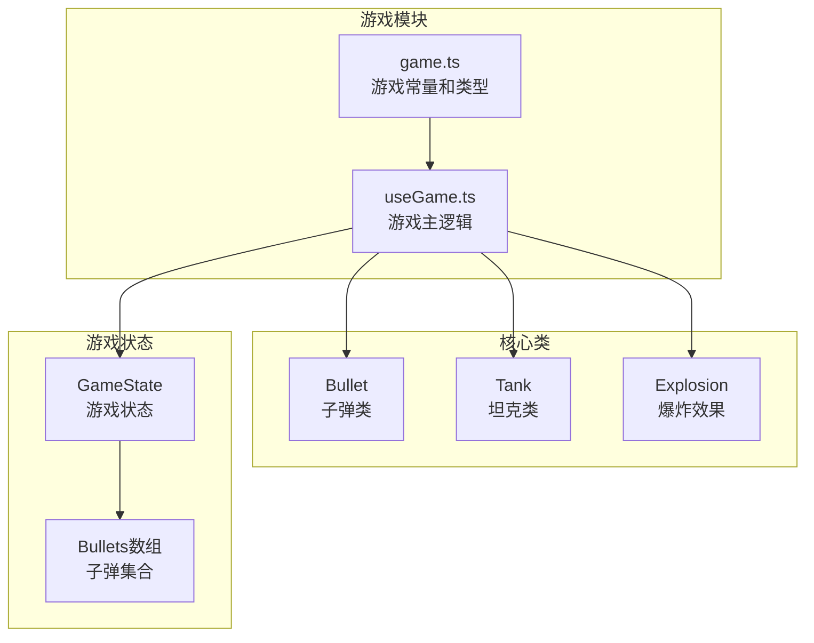
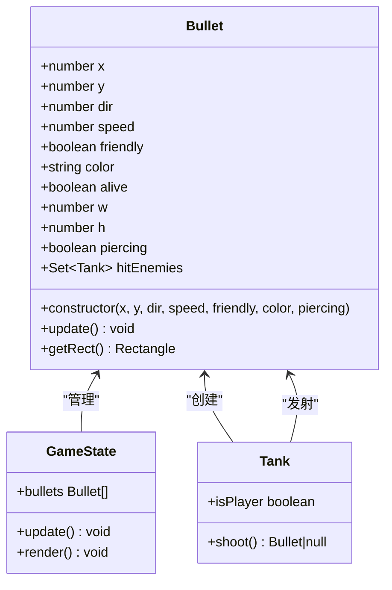
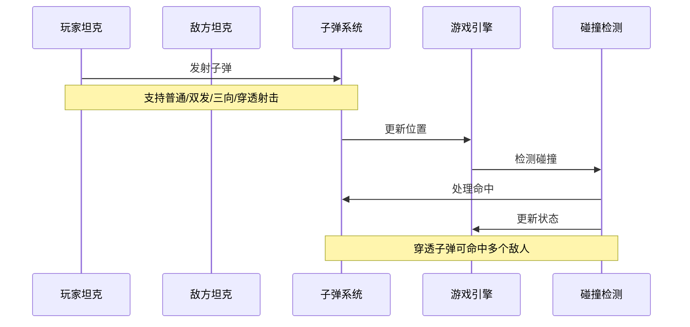
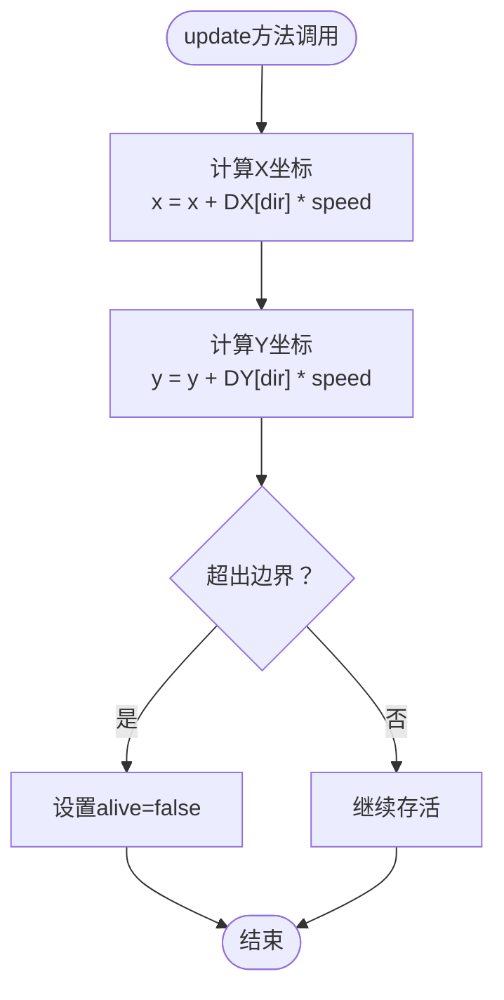
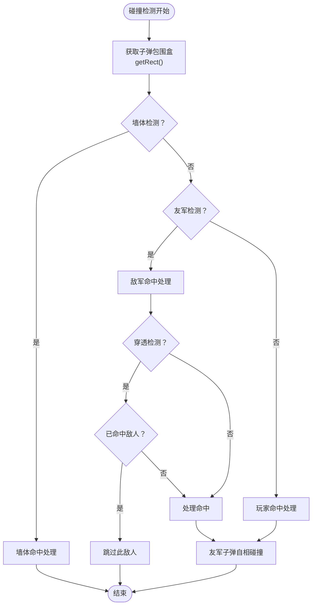
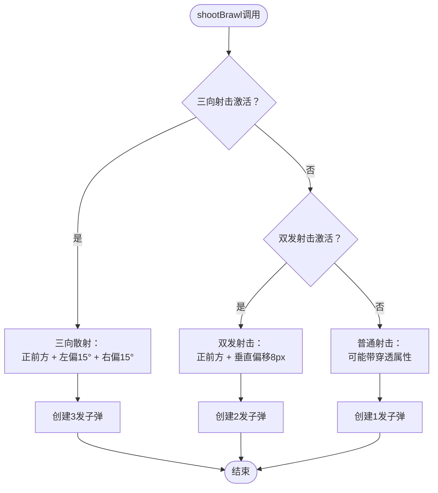
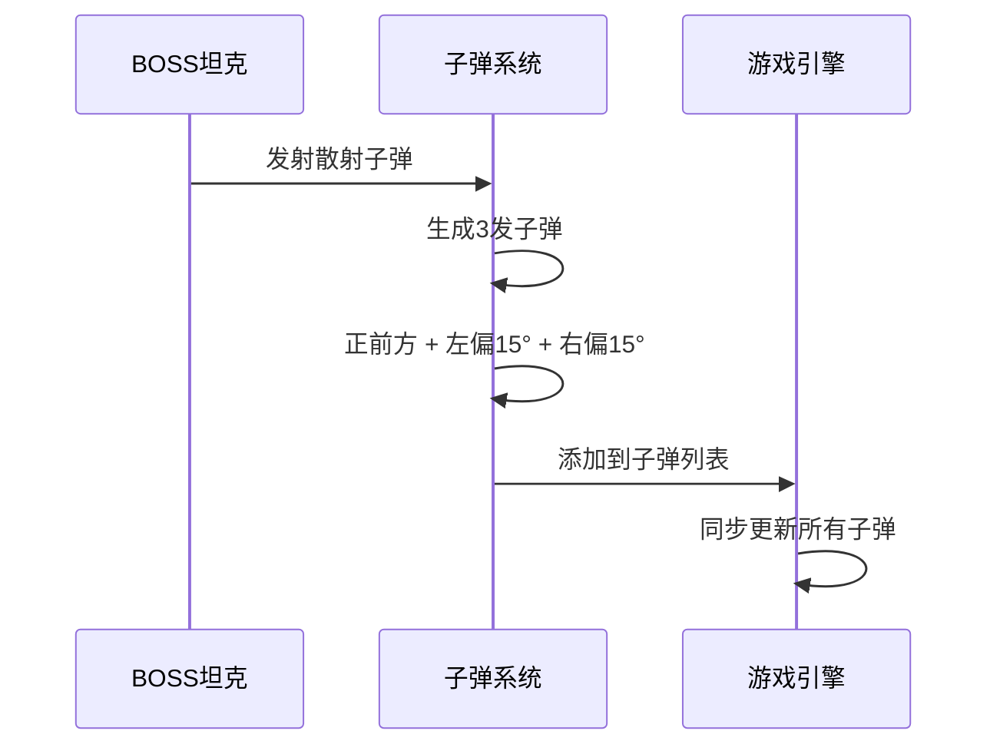
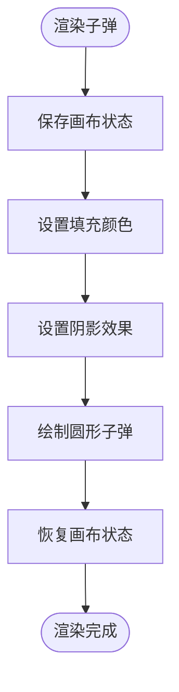
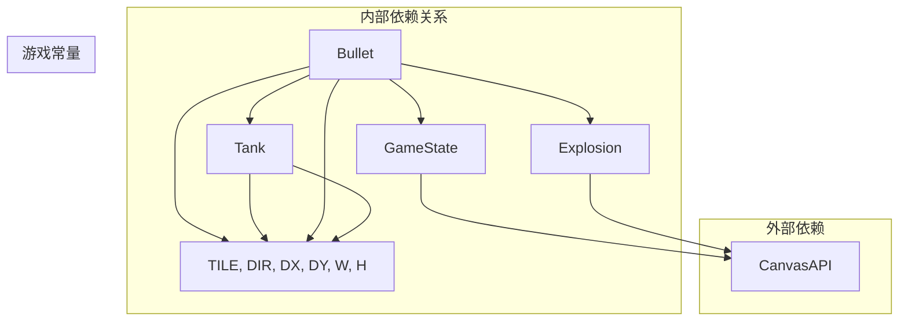

# 子弹系统

<cite>
**本文档引用的文件**
- [useGame.ts](file://src/composables/useGame.ts)
- [game.ts](file://src/types/game.ts)
</cite>

## 更新摘要
**变更内容**
- 新增穿透能力系统，允许子弹穿透多个敌人
- 实现三向散射射击机制，支持同时发射多发子弹
- 添加双发射击模式，提供垂直偏移的双重射击
- 扩展乱斗模式技能系统，包含穿透、散射、双发等新功能
- 更新碰撞检测逻辑以支持穿透子弹的特殊行为

## 目录
1. [简介](#简介)
2. [项目结构](#项目结构)
3. [核心组件](#核心组件)
4. [架构概览](#架构概览)
5. [详细组件分析](#详细组件分析)
6. [依赖关系分析](#依赖关系分析)
7. [性能考虑](#性能考虑)
8. [故障排除指南](#故障排除指南)
9. [结论](#结论)

## 简介

子弹系统是坦克大战游戏的核心机制之一，负责处理所有飞行弹丸的创建、更新、渲染和销毁。本文档深入分析了Bullet类的设计与实现，包括其基本属性、物理运动系统、碰撞检测机制以及与其他游戏对象的交互关系。特别关注了最新的穿透能力、三向散射射击机制和双发射击模式等重大增强功能。

## 项目结构

子弹系统位于游戏的核心逻辑模块中，与游戏状态管理紧密集成：

**图表来源**
- [useGame.ts:140-172](file://src/composables/useGame.ts#L140-L172)
- [useGame.ts:229-262](file://src/composables/useGame.ts#L229-L262)

**章节来源**
- [useGame.ts:1-10](file://src/composables/useGame.ts#L1-L10)
- [game.ts:1-300](file://src/types/game.ts#L1-L300)

## 核心组件

### Bullet类设计

Bullet类是子弹系统的核心，采用简洁而高效的面向对象设计，现已支持穿透能力：

**图表来源**
- [useGame.ts:140-172](file://src/composables/useGame.ts#L140-L172)
- [useGame.ts:112-121](file://src/composables/useGame.ts#L112-L121)
- [useGame.ts:229-244](file://src/composables/useGame.ts#L229-L244)

### 基本属性详解

Bullet类包含以下关键属性：

| 属性名 | 类型 | 描述 | 默认值 |
|--------|------|------|--------|
| x | number | 子弹X坐标 | 构造函数参数 |
| y | number | 子弹Y坐标 | 构造函数参数 |
| dir | number | 方向 (0-3) | 构造函数参数 |
| speed | number | 移动速度 | 构造函数参数 |
| friendly | boolean | 友好标记 | 构造函数参数 |
| color | string | 颜色标识 | 构造函数参数 |
| alive | boolean | 存活状态 | true |
| w | number | 宽度 | 6 |
| h | number | 高度 | 6 |
| piercing | boolean | 穿透标记 | false |
| hitEnemies | Set<Tank> | 已命中敌人集合 | new Set() |

**章节来源**
- [useGame.ts:140-172](file://src/composables/useGame.ts#L140-L172)

## 架构概览

子弹系统在整个游戏架构中扮演着关键角色，与多个组件协同工作，现已支持多种射击模式：

**图表来源**
- [useGame.ts:112-121](file://src/composables/useGame.ts#L112-L121)
- [useGame.ts:766-771](file://src/composables/useGame.ts#L766-L771)
- [useGame.ts:533-636](file://src/composables/useGame.ts#L533-L636)

## 详细组件分析

### 物理运动系统

#### 位置更新算法

子弹的物理运动采用简单的向量更新算法：

**图表来源**
- [useGame.ts:163-169](file://src/composables/useGame.ts#L163-L169)
- [game.ts:8-10](file://src/types/game.ts#L8-L10)

#### 边界检测机制

子弹系统实现了完整的边界检测，确保子弹在屏幕外自动销毁：

- **左边界**：x < 0
- **上边界**：y < 0  
- **右边界**：x > 游戏宽度(W)
- **下边界**：y > 游戏高度(H)

**章节来源**
- [useGame.ts:163-169](file://src/composables/useGame.ts#L163-L169)
- [game.ts:5-6](file://src/types/game.ts#L5-L6)

### 生命周期管理

#### 创建时机

子弹的创建通过Tank类的shoot方法实现，支持多种创建场景：

1. **玩家发射**：速度为7，颜色为绿色(#00ff88)
2. **敌人发射**：速度为5，颜色为红色(#ff6644)
3. **乱斗模式特殊射击**：支持双发、三向、穿透等特殊模式

#### 销毁条件

子弹的销毁遵循以下规则：

1. **边界销毁**：超出游戏边界
2. **碰撞销毁**：与其他对象发生碰撞
3. **穿透销毁**：非穿透子弹命中敌人后销毁
4. **自相销毁**：友军与敌军子弹相撞
5. **墙体销毁**：击中可破坏或不可破坏墙体

**章节来源**
- [useGame.ts:112-121](file://src/composables/useGame.ts#L112-L121)
- [useGame.ts:533-636](file://src/composables/useGame.ts#L533-L636)

### 碰撞检测系统

#### 包围盒检测

子弹使用矩形包围盒进行碰撞检测，提供快速而准确的碰撞判断：

**图表来源**
- [useGame.ts:171](file://src/composables/useGame.ts#L171)
- [useGame.ts:533-636](file://src/composables/useGame.ts#L533-L636)

#### 碰撞处理逻辑

系统实现了多层次的碰撞处理，现已支持穿透能力：

1. **墙体碰撞**：
   - 砖墙：墙体消失，子弹销毁
   - 钢墙：子弹销毁
   - 基地：基地消失，游戏结束

2. **敌军碰撞**：
   - 穿透子弹：记录已命中敌人，继续飞行
   - 普通子弹：命中后销毁
   - 敌军生命值减一，若生命值<=0则销毁

3. **玩家碰撞**：玩家生命值减一，子弹销毁

4. **自相碰撞**：双方子弹同时销毁

**章节来源**
- [useGame.ts:533-636](file://src/composables/useGame.ts#L533-L636)
- [game.ts:298-300](file://src/types/game.ts#L298-L300)

### 射击模式系统

#### 乱斗模式特殊射击

乱斗模式提供了三种特殊射击模式，按优先级执行：

**图表来源**
- [useGame.ts:703-748](file://src/composables/useGame.ts#L703-L748)

#### 穿透能力实现

穿透子弹具有特殊的行为模式：

1. **穿透标记**：构造函数接受piercing参数，默认false
2. **命中记录**：使用Set<Tank>记录已命中的敌人
3. **重复命中检测**：在碰撞检测中跳过已命中的敌人
4. **持续飞行**：命中敌人后继续飞行直到销毁

**章节来源**
- [useGame.ts:156-168](file://src/composables/useGame.ts#L156-L168)
- [useGame.ts:703-748](file://src/composables/useGame.ts#L703-L748)

### 类型区分系统

#### 玩家子弹 vs 敌人子弹

| 特征 | 玩家子弹 | 敌人子弹 |
|------|----------|----------|
| 速度 | 7 | 5 |
| 颜色 | #00ff88 (绿色) | #ff6644 (红色) |
| 友好标记 | true | false |
| 发射来源 | 玩家坦克 | 敌方坦克/炮台 |
| 碰撞目标 | 敌方坦克 | 玩家坦克 |

#### BOSS特殊机制

BOSS坦克具有独特的散射射击能力：

**图表来源**
- [useGame.ts:513-531](file://src/composables/useGame.ts#L513-L531)

**章节来源**
- [useGame.ts:117-120](file://src/composables/useGame.ts#L117-L120)
- [useGame.ts:513-531](file://src/composables/useGame.ts#L513-L531)

### 渲染系统

#### 视觉效果

子弹采用圆形渲染，具有发光效果：

**图表来源**
- [useGame.ts:982-991](file://src/composables/useGame.ts#L982-L991)

## 依赖关系分析

### 内部依赖

**图表来源**
- [useGame.ts:1-10](file://src/composables/useGame.ts#L1-L10)
- [useGame.ts:229-262](file://src/composables/useGame.ts#L229-L262)

### 性能优化策略

#### 对象池模式

虽然当前实现直接创建和销毁子弹对象，但系统设计支持未来扩展：

1. **批量更新**：所有子弹统一在游戏循环中更新
2. **延迟销毁**：使用alive标志位标记销毁，统一清理
3. **内存管理**：利用JavaScript垃圾回收机制

#### 碰撞检测优化

1. **快速剔除**：先进行包围盒快速检测
2. **层级处理**：按优先级处理不同类型的碰撞
3. **短路求值**：一旦命中立即停止进一步检测
4. **穿透优化**：使用Set进行快速命中检测

**章节来源**
- [useGame.ts:766-787](file://src/composables/useGame.ts#L766-L787)
- [useGame.ts:533-636](file://src/composables/useGame.ts#L533-L636)

## 性能考虑

### 时间复杂度分析

- **单帧更新**：O(n)，其中n为活跃子弹数量
- **碰撞检测**：O(n²)，在最坏情况下需要检查所有子弹对
- **穿透检测**：O(n × m)，其中m为命中敌人数量
- **内存使用**：O(n + k)，每个活跃子弹占用固定内存空间，k为命中敌人集合大小

### 内存管理策略

1. **及时销毁**：超出边界或发生碰撞后立即设置alive=false
2. **周期清理**：每帧结束后统一过滤掉已销毁的子弹
3. **对象复用**：考虑未来实现对象池以减少GC压力
4. **集合管理**：合理使用Set进行命中记录，避免重复引用

### 优化建议

1. **空间分割**：实现网格分区减少碰撞检测范围
2. **层次化碰撞**：先粗略检测再精确检测
3. **批处理渲染**：合并相似的渲染操作
4. **命中缓存**：缓存已检测的碰撞结果

## 故障排除指南

### 常见问题诊断

#### 子弹不显示
- 检查alive标志位是否正确设置
- 验证颜色和透明度设置
- 确认渲染顺序正确

#### 碰撞检测失效
- 验证包围盒尺寸和位置
- 检查rectsOverlap函数实现
- 确认碰撞检测顺序

#### 穿透功能异常
- 验证piercing标志位设置
- 检查hitEnemies集合的添加和检测
- 确认穿透子弹的颜色标识正确

#### 性能问题
- 监控子弹数量增长
- 检查碰撞检测复杂度
- 评估渲染开销

**章节来源**
- [useGame.ts:982-991](file://src/composables/useGame.ts#L982-L991)
- [useGame.ts:533-636](file://src/composables/useGame.ts#L533-L636)

## 结论

子弹系统展现了优秀的游戏架构设计，具有以下特点：

1. **简洁高效**：核心逻辑简单明了，易于理解和维护
2. **扩展性强**：良好的类设计支持未来功能扩展
3. **性能稳定**：合理的数据结构和算法保证了流畅的游戏体验
4. **视觉效果**：精心设计的渲染系统提供了良好的视觉反馈
5. **功能丰富**：支持多种射击模式，包括穿透、散射、双发等高级特性

该系统为整个坦克大战游戏提供了坚实的基础，通过合理的抽象和封装，使得子弹的创建、更新、渲染和销毁都变得清晰有序。最新的穿透能力和多模式射击系统大大增强了游戏的策略性和趣味性。未来可以在此基础上添加更多高级特性，如子弹特效、特殊弹药类型等。