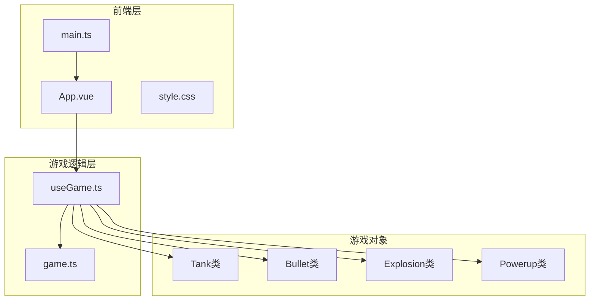
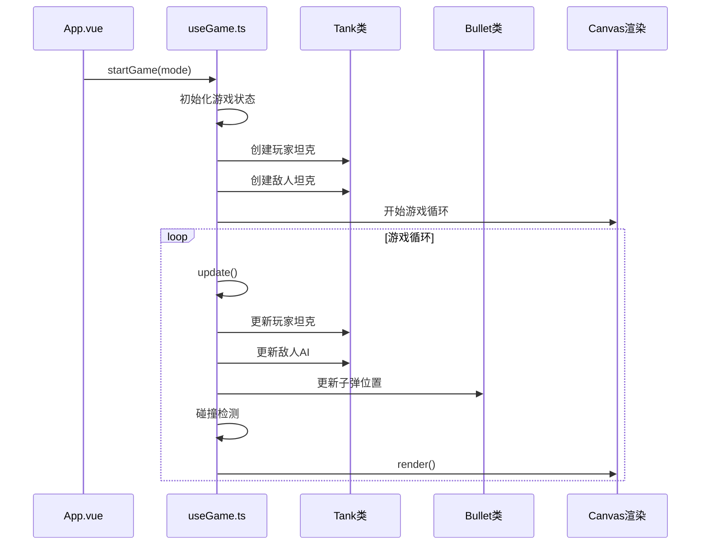
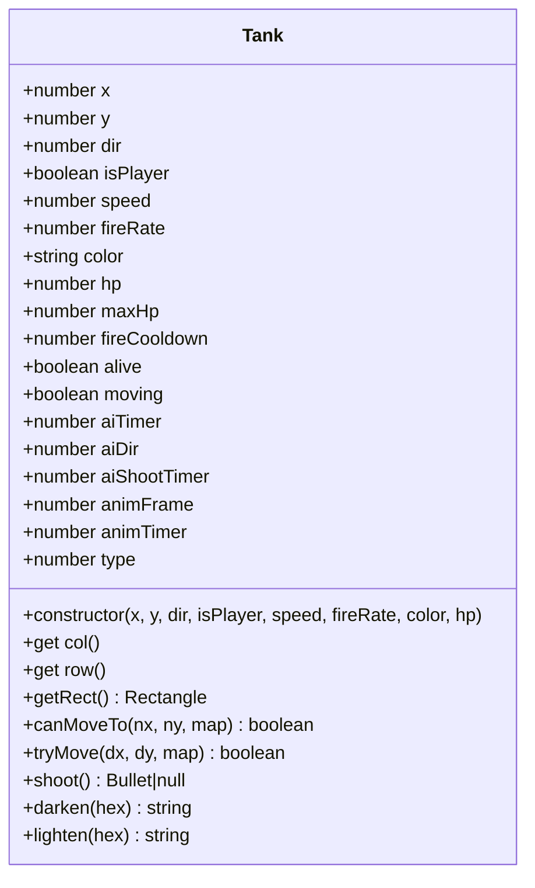
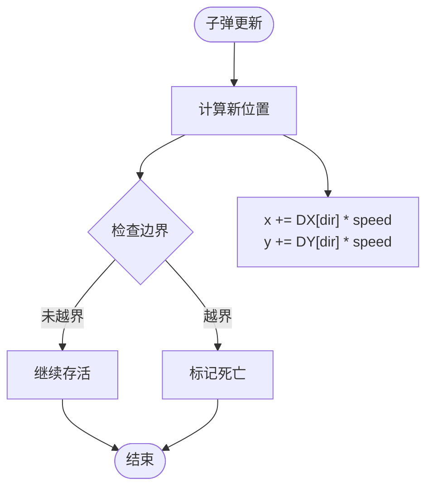
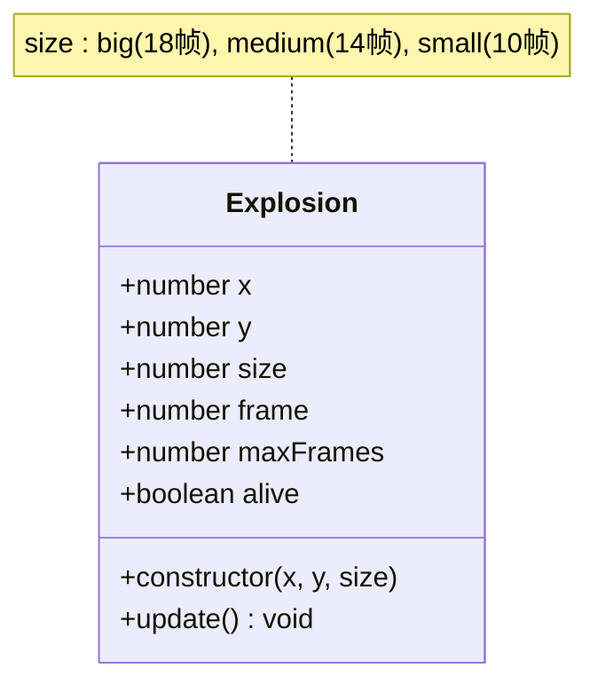
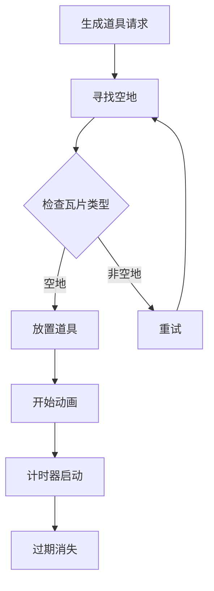
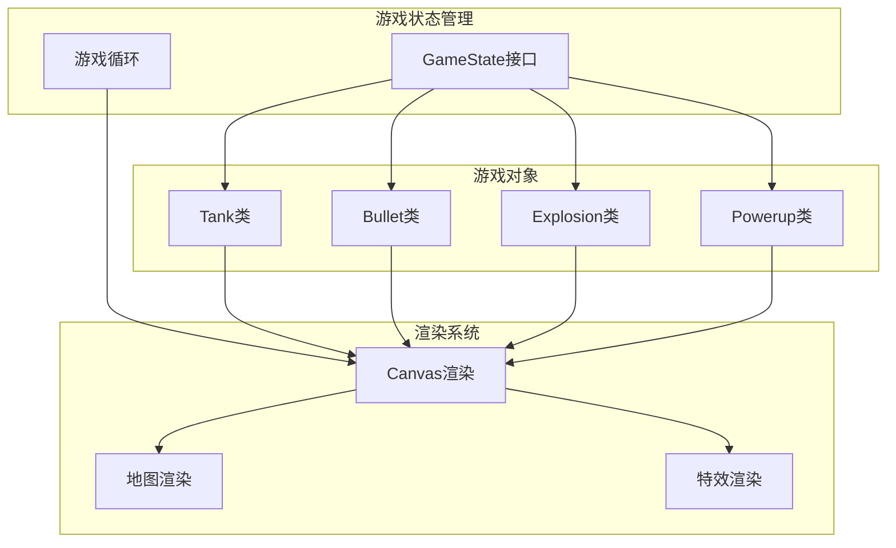

# 游戏对象系统

<cite>
**本文档引用的文件**
- [README.md](file://README.md)
- [src/types/game.ts](file://src/types/game.ts)
- [src/composables/useGame.ts](file://src/composables/useGame.ts)
- [src/App.vue](file://src/App.vue)
- [src/main.ts](file://src/main.ts)
- [src/style.css](file://src/style.css)
</cite>

## 目录
1. [简介](#简介)
2. [项目结构](#项目结构)
3. [核心组件](#核心组件)
4. [架构概览](#架构概览)
5. [详细组件分析](#详细组件分析)
6. [依赖分析](#依赖分析)
7. [性能考虑](#性能考虑)
8. [故障排除指南](#故障排除指南)
9. [结论](#结论)
10. [附录](#附录)

## 简介
本项目是一个基于Vue 3 + TypeScript + Vite开发的经典坦克大战游戏。游戏实现了完整的坦克战斗系统，包括玩家坦克、敌人坦克、子弹、爆炸效果和道具系统。本文档将深入分析游戏对象系统的设计与实现，涵盖Tank类、Bullet类、Explosion类和Powerup类的详细设计。

## 项目结构
项目采用模块化架构，主要分为以下几个核心部分：



**图表来源**
- [src/App.vue:1-305](file://src/App.vue#L1-L305)
- [src/main.ts:1-6](file://src/main.ts#L1-L6)
- [src/composables/useGame.ts:1-1282](file://src/composables/useGame.ts#L1-L1282)
- [src/types/game.ts:1-300](file://src/types/game.ts#L1-L300)

**章节来源**
- [README.md:1-6](file://README.md#L1-L6)
- [src/App.vue:1-305](file://src/App.vue#L1-L305)
- [src/main.ts:1-6](file://src/main.ts#L1-L6)

## 核心组件
游戏对象系统由四个核心类组成，每个类都有明确的职责和生命周期管理：

### 游戏常量和类型定义
项目定义了完整的地图系统、敌人类型、道具系统和游戏模式常量：

- **地图瓦片系统**：TILE、COLS、ROWS、W、H等基础常量
- **方向系统**：DIR、DX、DY数组定义了四个方向的坐标变化
- **地形类型**：TILE_EMPTY、TILE_BRICK、TILE_STEEL、TILE_WATER、TILE_FOREST、TILE_BASE
- **敌人类型**：0-5共6种敌人类型，包含不同属性和行为
- **道具系统**：shield、rapidfire、life、bomb四种道具效果
- **游戏模式**：classic（经典模式）和 survival（生存模式）

**章节来源**
- [src/types/game.ts:1-300](file://src/types/game.ts#L1-L300)

## 架构概览
游戏采用单文件组件架构，通过useGame组合式函数管理整个游戏状态和逻辑：



**图表来源**
- [src/App.vue:19-26](file://src/App.vue#L19-L26)
- [src/composables/useGame.ts:1155-1176](file://src/composables/useGame.ts#L1155-L1176)
- [src/composables/useGame.ts:731-792](file://src/composables/useGame.ts#L731-L792)

## 详细组件分析

### Tank类设计与实现

#### 类结构和属性
Tank类是游戏的核心实体，支持玩家坦克和敌人坦克两种模式：



**图表来源**
- [src/composables/useGame.ts:16-138](file://src/composables/useGame.ts#L16-L138)

#### 构造函数参数详解
- **x, y**: 坦克初始坐标（像素单位）
- **dir**: 初始朝向（0-3对应上右下左）
- **isPlayer**: 是否为玩家控制的坦克
- **speed**: 移动速度（像素/帧）
- **fireRate**: 射击冷却时间（帧）
- **color**: 坦克颜色（十六进制字符串）
- **hp**: 坦克生命值

#### 核心方法实现

**移动系统**：
- `canMoveTo()`: 检查目标位置是否可通行
- `tryMove()`: 执行移动并进行网格吸附
- 支持精确的碰撞检测和边界判断

**射击系统**：
- `shoot()`: 创建子弹实例，自动计算发射位置和方向
- 不同类型的坦克有不同的射击速度和颜色

**动画系统**：
- `animFrame`和`animTimer`实现履带动画
- `moving`状态驱动动画播放
- `darken()`和`lighten()`方法动态调整颜色

#### 玩家坦克vs敌人坦克差异
- **玩家坦克**：速度2.5，射击冷却30帧，绿色调
- **敌人坦克**：根据类型和关卡动态调整属性
- **AI系统**：敌人具有独立的决策逻辑和射击策略

**章节来源**
- [src/composables/useGame.ts:16-138](file://src/composables/useGame.ts#L16-L138)
- [src/composables/useGame.ts:428-431](file://src/composables/useGame.ts#L428-L431)
- [src/composables/useGame.ts:410-426](file://src/composables/useGame.ts#L410-L426)

### Bullet类物理运动和碰撞检测

#### 物理运动系统
Bullet类实现了简单的物理运动模型：



**图表来源**
- [src/composables/useGame.ts:163-169](file://src/composables/useGame.ts#L163-L169)

#### 碰撞检测系统
子弹碰撞检测采用多层次处理：

1. **地形碰撞**：检测与砖墙、钢铁、水域、基地的碰撞
2. **实体碰撞**：检测与敌人和玩家的碰撞
3. **相互碰撞**：友军子弹与敌军子弹的相互抵消

**章节来源**
- [src/composables/useGame.ts:140-172](file://src/composables/useGame.ts#L140-L172)
- [src/composables/useGame.ts:533-636](file://src/composables/useGame.ts#L533-L636)

### Explosion类爆炸效果系统

#### 动画系统设计
Explosion类实现了基于帧的爆炸动画：



**图表来源**
- [src/composables/useGame.ts:174-195](file://src/composables/useGame.ts#L174-L195)

#### 渲染系统
爆炸效果通过Canvas渐变实现：

- **径向渐变**：从内向外的光晕效果
- **透明度衰减**：随时间逐渐消失
- **火花效果**：小尺寸爆炸带有放射状火花

**章节来源**
- [src/composables/useGame.ts:174-195](file://src/composables/useGame.ts#L174-L195)
- [src/composables/useGame.ts:993-1023](file://src/composables/useGame.ts#L993-L1023)

### Powerup类道具系统

#### 道具生成机制
Powerup类实现了随机道具生成系统：



**图表来源**
- [src/composables/useGame.ts:638-650](file://src/composables/useGame.ts#L638-L650)

#### 道具效果系统
四种道具类型及其效果：

| 道具类型 | 效果 | 持续时间 | 触发条件 |
|---------|------|----------|----------|
| shield | 免疫伤害 | 300帧 | 拾取后激活 |
| rapidfire | 加速射击 | 300帧 | 激活后立即生效 |
| life | 增加生命 | 即时 | 立即生效 |
| bomb | 清屏效果 | 即时 | 使用后清除所有敌人 |

**章节来源**
- [src/composables/useGame.ts:197-223](file://src/composables/useGame.ts#L197-L223)
- [src/composables/useGame.ts:665-692](file://src/composables/useGame.ts#L665-L692)

## 依赖分析

### 组件间依赖关系


**图表来源**
- [src/composables/useGame.ts:229-262](file://src/composables/useGame.ts#L229-L262)
- [src/composables/useGame.ts:794-1153](file://src/composables/useGame.ts#L794-L1153)

### 数据流向分析
游戏采用单向数据流设计：

1. **输入层**：键盘事件 → 键盘状态映射
2. **处理层**：游戏逻辑 → 对象状态更新
3. **输出层**：Canvas渲染 → 视觉反馈

**章节来源**
- [src/composables/useGame.ts:307-316](file://src/composables/useGame.ts#L307-L316)
- [src/composables/useGame.ts:731-792](file://src/composables/useGame.ts#L731-L792)

## 性能考虑
游戏系统在性能方面采用了多项优化措施：

### 渲染优化
- **批量绘制**：使用Canvas批量绘制减少上下文切换
- **条件渲染**：仅渲染存活的对象
- **渐变优化**：爆炸效果使用预计算的渐变对象

### 内存管理
- **对象池**：使用数组过滤替代频繁的删除操作
- **引用管理**：及时清理不再使用的对象引用
- **状态复用**：复用游戏状态对象避免重复创建

### 计算优化
- **向量化运算**：使用DX/DY数组避免复杂的三角函数计算
- **早期退出**：在碰撞检测中实现早期返回
- **缓存机制**：缓存计算结果避免重复计算

## 故障排除指南

### 常见问题诊断
1. **坦克无法移动**
   - 检查`canMoveTo()`方法的边界条件
   - 验证地图数据的正确性
   - 确认网格吸附逻辑

2. **子弹穿透问题**
   - 检查碰撞检测的顺序
   - 验证矩形重叠检测算法
   - 确认子弹生命周期管理

3. **爆炸效果异常**
   - 检查帧计数器的递增逻辑
   - 验证渐变颜色的计算
   - 确认透明度的衰减曲线

### 调试建议
- 使用浏览器开发者工具监控对象数量
- 实现简单的日志系统跟踪关键事件
- 在渲染函数中添加调试可视化

**章节来源**
- [src/composables/useGame.ts:65-81](file://src/composables/useGame.ts#L65-L81)
- [src/composables/useGame.ts:533-636](file://src/composables/useGame.ts#L533-L636)

## 结论
本游戏对象系统展现了良好的面向对象设计原则，通过清晰的类层次结构和职责分离实现了复杂的游戏逻辑。系统的主要优势包括：

1. **模块化设计**：每个游戏对象都有独立的职责和生命周期
2. **可扩展性**：易于添加新的敌人类型、道具效果和游戏模式
3. **性能优化**：采用多种优化技术确保流畅的游戏体验
4. **代码质量**：TypeScript类型系统提供了良好的开发体验

系统在坦克移动、子弹物理、爆炸动画和道具系统等方面都实现了高质量的实现，为后续的功能扩展奠定了坚实的基础。

## 附录

### API参考

#### Tank类方法
- `constructor(x, y, dir, isPlayer, speed, fireRate, color, hp)`
- `getRect()`: 获取碰撞矩形
- `tryMove(dx, dy, map)`: 执行移动
- `shoot()`: 发射子弹
- `darken(hex)`: 颜色变暗
- `lighten(hex)`: 颜色变亮

#### Bullet类方法
- `constructor(x, y, dir, speed, friendly, color)`
- `update()`: 更新位置
- `getRect()`: 获取碰撞矩形

#### Explosion类方法
- `constructor(x, y, size)`
- `update()`: 更新动画帧

#### Powerup类方法
- `constructor(col, row, type)`
- `update()`: 更新动画和计时

### 使用示例
```typescript
// 创建玩家坦克
const player = new Tank(
  4 * TILE, 12 * TILE, 
  DIR.UP, true, 
  2.5, 30, '#44cc88', 1
);

// 创建爆炸效果
const explosion = new Explosion(
  enemy.x + TILE/2, enemy.y + TILE/2, 'big'
);

// 创建道具
const powerup = new Powerup(5, 5, 'rapidfire');
```