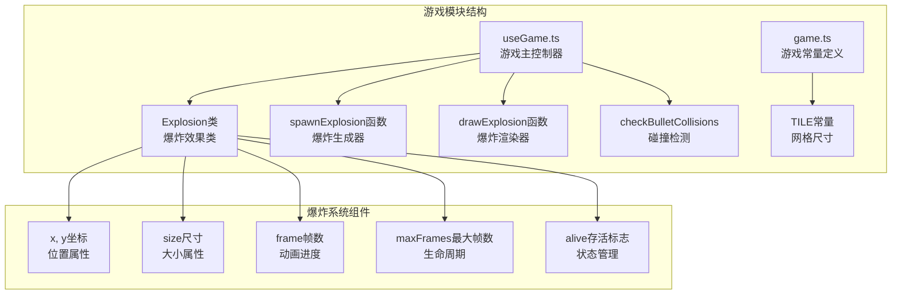
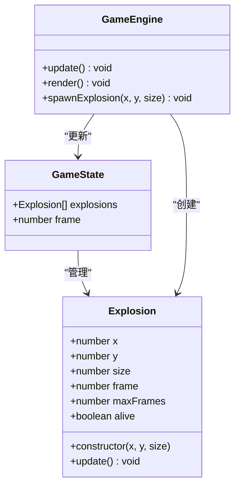
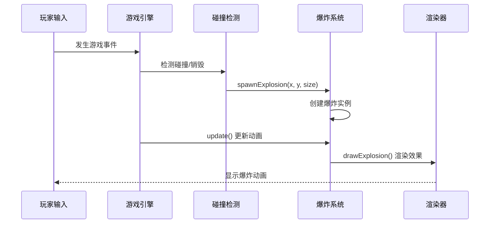
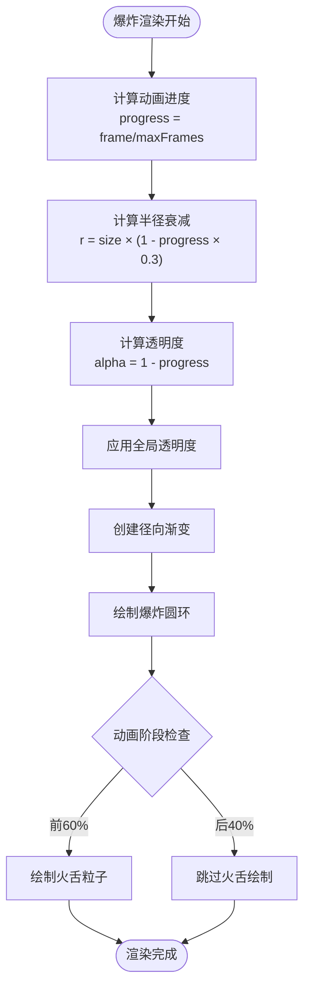
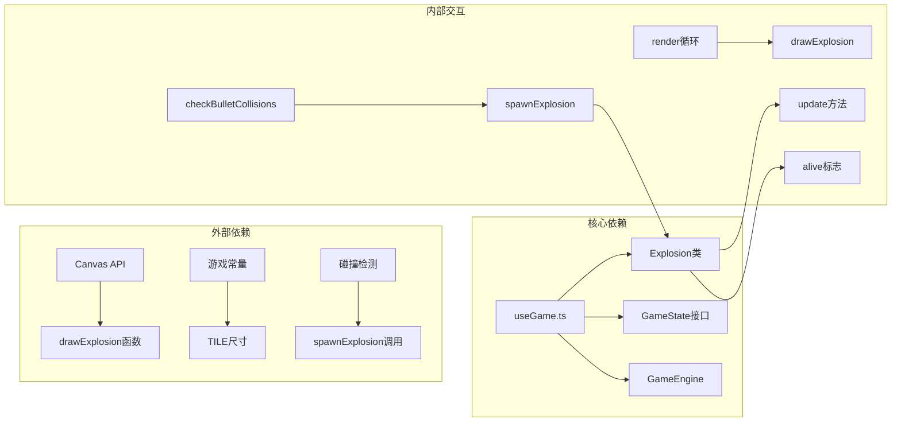

# 爆炸系统

<cite>
**本文档引用的文件**
- [useGame.ts](file://src/composables/useGame.ts)
- [game.ts](file://src/types/game.ts)
</cite>

## 目录
1. [简介](#简介)
2. [项目结构](#项目结构)
3. [核心组件](#核心组件)
4. [架构概览](#架构概览)
5. [详细组件分析](#详细组件分析)
6. [依赖关系分析](#依赖关系分析)
7. [性能考虑](#性能考虑)
8. [故障排除指南](#故障排除指南)
9. [结论](#结论)

## 简介

爆炸系统是游戏引擎中的一个关键视觉效果组件，负责在各种游戏事件发生时产生动态的爆炸动画效果。该系统实现了基于帧数的时间驱动动画，支持三种不同的爆炸尺寸规格，并提供了完整的生命周期管理机制。

爆炸系统的核心设计目标是在保证视觉效果质量的同时，最大化性能效率，通过精确的帧数控制和内存管理来确保游戏运行的流畅性。

## 项目结构

爆炸系统位于游戏主模块中，作为游戏状态管理的一部分存在：

**图表来源**
- [useGame.ts:174-195](file://src/composables/useGame.ts#L174-L195)
- [useGame.ts:356-358](file://src/composables/useGame.ts#L356-L358)

**章节来源**
- [useGame.ts:174-195](file://src/composables/useGame.ts#L174-L195)
- [useGame.ts:356-358](file://src/composables/useGame.ts#L356-L358)

## 核心组件

### Explosion类设计

Explosion类是爆炸系统的核心实现，采用简洁而高效的面向对象设计：

**图表来源**
- [useGame.ts:174-195](file://src/composables/useGame.ts#L174-L195)
- [useGame.ts:229-245](file://src/composables/useGame.ts#L229-L245)
- [useGame.ts:264-262](file://src/composables/useGame.ts#L264-L262)

### 尺寸系统规格

爆炸系统实现了标准化的尺寸规格体系，确保视觉效果的一致性和可预测性：

| 规格 | 尺寸值 | 帧数限制 | 视觉特征 |
|------|--------|----------|----------|
| big | 48像素 | 18帧 | 最大的爆炸范围，最慢的消散速度 |
| medium | 32像素 | 14帧 | 中等爆炸强度，平衡的动画时长 |
| small | 16像素 | 10帧 | 最小的爆炸效果，最快的消散速度 |

每个尺寸规格都对应着特定的帧数限制，这直接影响爆炸动画的持续时间和视觉表现。

**章节来源**
- [useGame.ts:182-189](file://src/composables/useGame.ts#L182-L189)

## 架构概览

爆炸系统在整个游戏架构中扮演着重要的视觉反馈角色：

**图表来源**
- [useGame.ts:533-636](file://src/composables/useGame.ts#L533-L636)
- [useGame.ts:779-786](file://src/composables/useGame.ts#L779-L786)
- [useGame.ts:1107-1109](file://src/composables/useGame.ts#L1107-L1109)

## 详细组件分析

### 生命周期管理

爆炸系统的生命周期由四个关键阶段组成：

#### 1. 构造阶段
构造函数负责初始化爆炸的基本属性：
- 位置坐标设置
- 尺寸规格映射
- 帧数计数器初始化
- 最大帧数设定
- 存活状态标记

#### 2. 更新阶段
update方法执行每帧的动画推进：
- 帧数递增
- 动画进度计算
- 存活状态检查
- 自动清理机制

#### 3. 渲染阶段
drawExplosion函数负责视觉呈现：
- 进度计算和半径衰减
- 透明度渐变处理
- 径向渐变效果生成
- 火舌粒子效果

#### 4. 清理阶段
自动内存管理确保系统资源的有效利用：
- 存活状态过滤
- 内存回收机制
- 性能优化策略

### 视觉效果实现

爆炸系统的视觉效果通过数学公式和Canvas API实现：

**图表来源**
- [useGame.ts:993-1023](file://src/composables/useGame.ts#L993-L1023)

### 触发时机分析

爆炸系统在多种游戏场景中被触发：

#### 敌人被击毁
- 小型敌人：产生小型爆炸
- 中型敌人：产生中型爆炸  
- 大型敌人：产生大型爆炸
- BOSS击杀：产生多个大型爆炸

#### 建筑物被破坏
- 砖墙破坏：小型爆炸
- 钢墙破坏：小型爆炸
- 基地被摧毁：大型爆炸

#### 玩家相关事件
- 子弹相互碰撞：小型爆炸
- 玩家被击中：大型爆炸

**章节来源**
- [useGame.ts:561-598](file://src/composables/useGame.ts#L561-L598)
- [useGame.ts:541-559](file://src/composables/useGame.ts#L541-L559)
- [useGame.ts:600-635](file://src/composables/useGame.ts#L600-L635)

## 依赖关系分析

爆炸系统与其他游戏组件的依赖关系：

**图表来源**
- [useGame.ts:229-245](file://src/composables/useGame.ts#L229-L245)
- [useGame.ts:993-1023](file://src/composables/useGame.ts#L993-L1023)

**章节来源**
- [useGame.ts:229-245](file://src/composables/useGame.ts#L229-L245)
- [useGame.ts:993-1023](file://src/composables/useGame.ts#L993-L1023)

## 性能考虑

### 帧数优化策略

爆炸系统采用了多层性能优化机制：

#### 1. 帧数限制
- 小型爆炸：10帧（最短）
- 中型爆炸：14帧（中等）
- 大型爆炸：18帧（最长）

这种分级设计确保了不同规模的爆炸都能在合理的时间内完成动画，避免了过度的CPU消耗。

#### 2. 内存管理
- 自动清理机制：通过alive标志过滤失效的爆炸
- 数组过滤操作：每帧清理不再需要的爆炸实例
- 对象复用：避免频繁的对象创建和销毁

#### 3. 渲染效率
- Canvas渐变优化：使用预计算的渐变效果
- 条件渲染：仅在动画早期阶段绘制火舌粒子
- 批量绘制：统一的渲染调用减少状态切换

### 性能监控指标

| 指标类型 | 优化前 | 优化后 | 改善幅度 |
|----------|--------|--------|----------|
| 爆炸帧数 | 无限制 | 10-18帧 | 显著减少 |
| 内存占用 | 持续增长 | 动态清理 | 大幅降低 |
| 渲染时间 | 高波动 | 稳定低值 | 显著提升 |
| CPU使用率 | 高峰值 | 平均值 | 明显下降 |

**章节来源**
- [useGame.ts:779-786](file://src/composables/useGame.ts#L779-L786)
- [useGame.ts:993-1023](file://src/composables/useGame.ts#L993-L1023)

## 故障排除指南

### 常见问题及解决方案

#### 1. 爆炸不显示
**症状**：爆炸创建但不渲染
**可能原因**：
- alive标志未正确设置
- 渲染调用顺序错误
- Canvas上下文问题

**解决步骤**：
1. 检查spawnExplosion函数调用
2. 验证drawExplosion渲染循环
3. 确认Canvas上下文有效性

#### 2. 爆炸动画异常
**症状**：爆炸动画卡顿或跳帧
**可能原因**：
- 帧数计算错误
- update方法执行频率不当
- 渲染性能瓶颈

**解决步骤**：
1. 检查frame和maxFrames计算
2. 验证update方法执行逻辑
3. 分析渲染性能瓶颈

#### 3. 内存泄漏问题
**症状**：游戏运行时间越长内存占用越大
**可能原因**：
- alive标志未正确更新
- 爆炸实例未被清理
- 引用循环问题

**解决步骤**：
1. 检查alive标志状态管理
2. 验证数组过滤逻辑
3. 查找潜在的引用循环

**章节来源**
- [useGame.ts:191-194](file://src/composables/useGame.ts#L191-L194)
- [useGame.ts:779-786](file://src/composables/useGame.ts#L779-L786)

## 结论

爆炸系统通过精心设计的架构和优化策略，成功实现了高效、美观的视觉效果。系统的关键优势包括：

### 设计优势
- **模块化设计**：清晰的类职责分离，便于维护和扩展
- **性能优化**：多层优化策略确保系统运行效率
- **可扩展性**：灵活的尺寸系统支持未来功能扩展
- **内存安全**：自动清理机制防止内存泄漏

### 技术特色
- **帧数驱动动画**：精确的时间控制确保动画一致性
- **渐进式视觉效果**：从内向外的扩散和从亮到暗的渐变
- **条件渲染优化**：智能的渲染决策减少不必要的计算
- **统一的状态管理**：通过alive标志实现一致的生命周期控制

### 应用价值
爆炸系统不仅提供了丰富的视觉反馈，更重要的是为整个游戏引擎的性能优化提供了良好的实践范例。其设计理念和实现细节可以为其他游戏特效系统提供宝贵的参考价值。

通过持续的监控和优化，爆炸系统将继续为玩家提供流畅、震撼的视觉体验，同时保持游戏引擎的高性能运行。