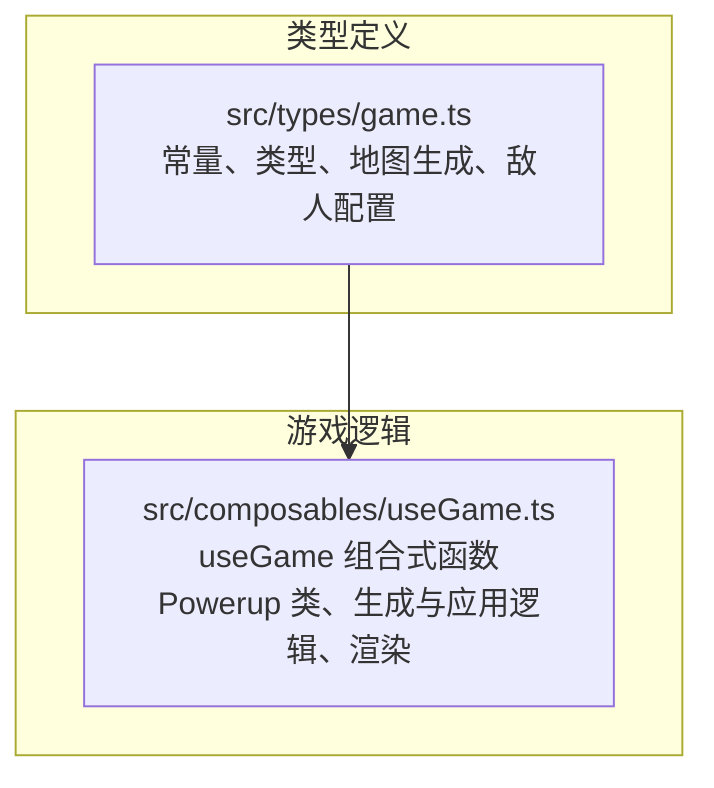
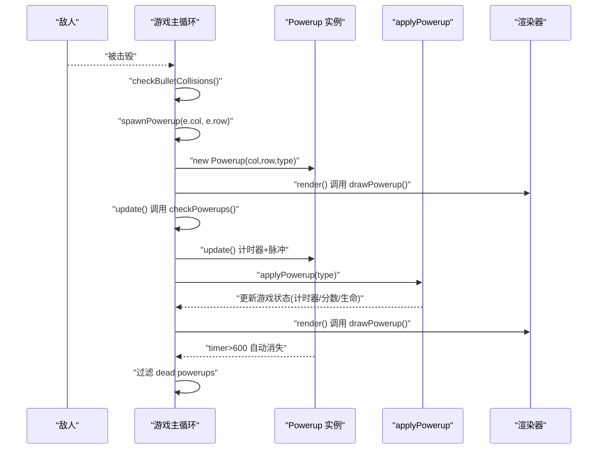
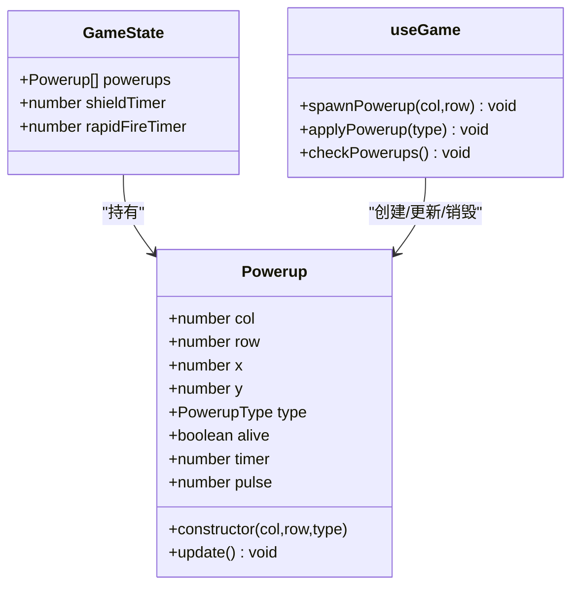
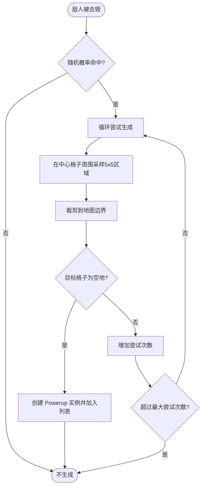
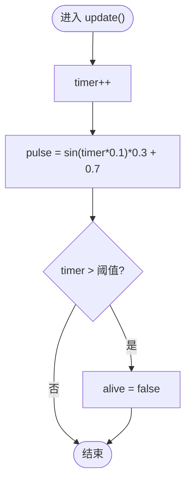
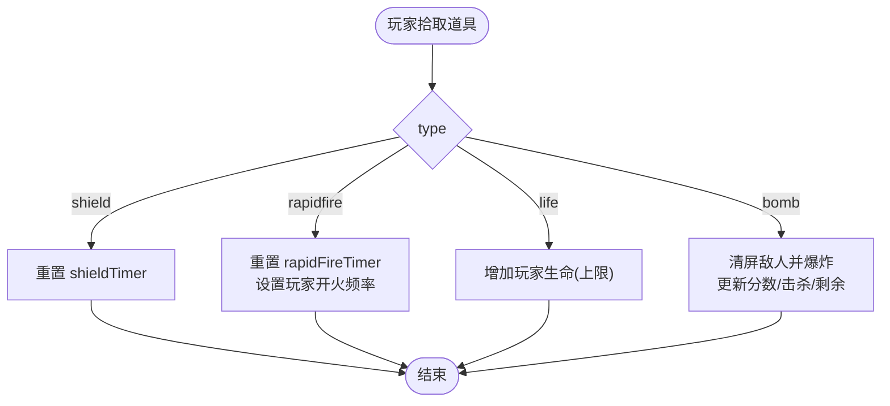
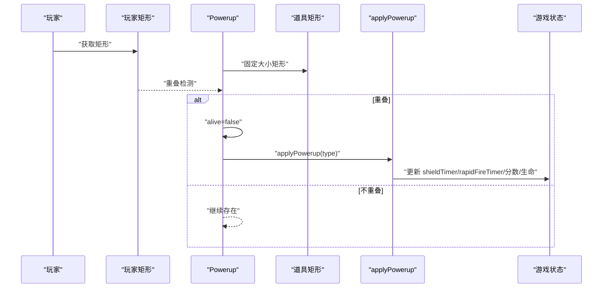
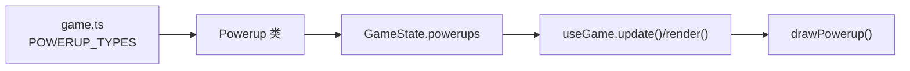

# 道具系统

<cite>
**本文档引用的文件**
- [src/types/game.ts](file://src/types/game.ts)
- [src/composables/useGame.ts](file://src/composables/useGame.ts)
</cite>

## 目录
1. [简介](#简介)
2. [项目结构](#项目结构)
3. [核心组件](#核心组件)
4. [架构总览](#架构总览)
5. [详细组件分析](#详细组件分析)
6. [依赖关系分析](#依赖关系分析)
7. [性能考量](#性能考量)
8. [故障排查指南](#故障排查指南)
9. [结论](#结论)
10. [附录](#附录)

## 简介
本文件聚焦于游戏中的“道具系统”，围绕 Powerup 类的设计与实现进行深入解析，涵盖：
- 道具的位置管理（列/行、像素坐标）
- 类型系统与效果映射
- 生命周期管理（存活、计时器、脉冲动画）
- 道具生成机制（随机位置、地图可放置性检查、概率分布）
- 动画与消失机制
- 四种类型的效果实现与应用流程
- 平衡性与玩家体验优化建议

## 项目结构
本项目采用 Vue 3 + TypeScript + Vite 的前端架构，游戏主逻辑集中在组合式函数 useGame.ts 中，类型定义位于 game.ts。道具系统作为游戏状态的一部分，与玩家、敌人、子弹、爆炸等对象共同构成游戏世界。

图表来源
- [src/types/game.ts:1-300](file://src/types/game.ts#L1-L300)
- [src/composables/useGame.ts:1-1282](file://src/composables/useGame.ts#L1-L1282)

章节来源
- [src/types/game.ts:1-300](file://src/types/game.ts#L1-L300)
- [src/composables/useGame.ts:1-1282](file://src/composables/useGame.ts#L1-L1282)

## 核心组件
- Powerup 类：负责单个道具的状态与行为（位置、类型、存活、计时器、脉冲动画）。
- 生成与应用：spawnPowerup 负责在地图上随机生成道具；applyPowerup 将类型映射为具体的游戏状态变更。
- 渲染：drawPowerup 负责绘制道具的视觉效果（图标、描边、阴影、脉冲透明度）。

章节来源
- [src/composables/useGame.ts:197-223](file://src/composables/useGame.ts#L197-L223)
- [src/composables/useGame.ts:638-650](file://src/composables/useGame.ts#L638-L650)
- [src/composables/useGame.ts:665-692](file://src/composables/useGame.ts#L665-L692)
- [src/composables/useGame.ts:1025-1059](file://src/composables/useGame.ts#L1025-L1059)

## 架构总览
道具系统在游戏循环中与其他对象协同工作：生成阶段由敌人被击毁触发；碰撞检测阶段由玩家拾取触发；更新阶段驱动动画与生命周期；渲染阶段负责视觉呈现。

图表来源
- [src/composables/useGame.ts](file://src/composables/useGame.ts#L584)
- [src/composables/useGame.ts:638-650](file://src/composables/useGame.ts#L638-L650)
- [src/composables/useGame.ts:652-663](file://src/composables/useGame.ts#L652-L663)
- [src/composables/useGame.ts:665-692](file://src/composables/useGame.ts#L665-L692)
- [src/composables/useGame.ts:774-777](file://src/composables/useGame.ts#L774-L777)
- [src/composables/useGame.ts:1025-1059](file://src/composables/useGame.ts#L1025-L1059)

## 详细组件分析

### Powerup 类设计与实现
- 位置管理
  - 列/行：col、row，用于与地图格子对齐
  - 像素坐标：x、y，用于渲染与碰撞检测
  - 构造时将列/行转换为像素坐标
- 类型系统
  - 使用受控枚举 POWERUP_TYPES 定义类型集合
  - 类型为只读联合类型，保证类型安全
- 生命周期管理
  - alive：控制是否参与渲染与碰撞
  - timer：递增计时器，用于脉冲动画与自动消失
  - pulse：基于 timer 的正弦波动，产生脉冲透明度
- 动画与消失
  - update 方法内递增 timer，并根据正弦函数计算脉冲值
  - 当 timer 超过阈值时，设置 alive=false，从而被清理

图表来源
- [src/composables/useGame.ts:197-223](file://src/composables/useGame.ts#L197-L223)
- [src/composables/useGame.ts:229-262](file://src/composables/useGame.ts#L229-L262)
- [src/composables/useGame.ts:638-650](file://src/composables/useGame.ts#L638-L650)
- [src/composables/useGame.ts:665-692](file://src/composables/useGame.ts#L665-L692)
- [src/composables/useGame.ts:652-663](file://src/composables/useGame.ts#L652-L663)

章节来源
- [src/composables/useGame.ts:197-223](file://src/composables/useGame.ts#L197-L223)
- [src/types/game.ts:19-21](file://src/types/game.ts#L19-L21)

### 道具生成机制
- 触发时机：敌人被击毁时，有一定概率调用 spawnPowerup
- 随机位置策略：
  - 在敌人所在格子为中心的 5×5 区域内随机采样
  - 通过最大最小裁剪确保落在地图边界内
- 可放置性检查：
  - 检查目标格子是否为空地（TILE_EMPTY）
  - 若不可放置则重试，最多尝试若干次
- 类型分布：
  - 从受控枚举 POWERUP_TYPES 中等概率随机选择
- 生成结果：
  - 成功后创建 Powerup 实例并加入游戏状态

图表来源
- [src/composables/useGame.ts](file://src/composables/useGame.ts#L584)
- [src/composables/useGame.ts:638-650](file://src/composables/useGame.ts#L638-L650)
- [src/types/game.ts](file://src/types/game.ts#L12)

章节来源
- [src/composables/useGame.ts](file://src/composables/useGame.ts#L584)
- [src/composables/useGame.ts:638-650](file://src/composables/useGame.ts#L638-L650)

### 动画效果与生命周期
- 脉冲动画（pulse）：
  - 基于 timer 的正弦函数，周期性变化透明度
  - 用于视觉反馈，增强道具的存在感
- 定时器（timer）：
  - 每帧自增，用于驱动脉冲与判断生命周期
- 消失机制：
  - 当 timer 超过设定阈值时，alive=false
  - 游戏主循环末尾会过滤掉 dead 的道具

图表来源
- [src/composables/useGame.ts:774-777](file://src/composables/useGame.ts#L774-L777)
- [src/composables/useGame.ts:218-222](file://src/composables/useGame.ts#L218-L222)

章节来源
- [src/composables/useGame.ts:218-222](file://src/composables/useGame.ts#L218-L222)
- [src/composables/useGame.ts:774-777](file://src/composables/useGame.ts#L774-L777)

### 道具类型系统与效果实现
- 类型定义：shield 护盾、rapidfire 速射、life 生命、bomb 炸弹
- 效果映射（applyPowerup）：
  - 护盾：重置护盾计时器，提供短暂无敌或减伤效果
  - 速射：重置速射计时器，临时提升玩家开火频率
  - 生命：增加玩家生命上限（有上限限制）
  - 炸弹：清屏所有敌人，附加分数与击杀统计

图表来源
- [src/composables/useGame.ts:655-663](file://src/composables/useGame.ts#L655-L663)
- [src/composables/useGame.ts:665-692](file://src/composables/useGame.ts#L665-L692)
- [src/types/game.ts:19-21](file://src/types/game.ts#L19-L21)

章节来源
- [src/composables/useGame.ts:665-692](file://src/composables/useGame.ts#L665-L692)
- [src/types/game.ts:19-21](file://src/types/game.ts#L19-L21)

### 道具效果的应用流程
- 碰撞检测：玩家矩形与道具矩形重叠时，标记道具死亡并应用效果
- 状态修改：根据类型更新游戏状态（计时器、分数、生命）
- 视觉反馈：护盾在渲染阶段使用脉冲描边与透明度变化；速射、生命、炸弹在应用后通常伴随 UI 或音效提示（本仓库未直接展示音效，但可通过计时器与分数变化感知）

图表来源
- [src/composables/useGame.ts:652-663](file://src/composables/useGame.ts#L652-L663)
- [src/composables/useGame.ts:665-692](file://src/composables/useGame.ts#L665-L692)

章节来源
- [src/composables/useGame.ts:652-663](file://src/composables/useGame.ts#L652-L663)
- [src/composables/useGame.ts:665-692](file://src/composables/useGame.ts#L665-L692)

## 依赖关系分析
- 类型依赖：POWERUP_TYPES 来源于类型定义文件，确保生成与应用两端一致
- 游戏状态依赖：Powerup 实例存储在 GameState 的 powerups 数组中，受游戏主循环统一更新与渲染
- 渲染依赖：drawPowerup 依赖道具的脉冲值与类型，输出对应的图标与描边

图表来源
- [src/types/game.ts:19-21](file://src/types/game.ts#L19-L21)
- [src/composables/useGame.ts:197-223](file://src/composables/useGame.ts#L197-L223)
- [src/composables/useGame.ts:229-262](file://src/composables/useGame.ts#L229-L262)
- [src/composables/useGame.ts:1025-1059](file://src/composables/useGame.ts#L1025-L1059)

章节来源
- [src/types/game.ts:19-21](file://src/types/game.ts#L19-L21)
- [src/composables/useGame.ts:197-223](file://src/composables/useGame.ts#L197-L223)
- [src/composables/useGame.ts:1025-1059](file://src/composables/useGame.ts#L1025-L1059)

## 性能考量
- 道具数量控制：通过生成概率与地图空地限制，避免过多道具堆积
- 更新与渲染：每帧仅对 alive=true 的道具执行 update 与 draw，过滤 dead 道具降低开销
- 动画成本：脉冲动画使用简单三角函数，开销极低
- 内存管理：道具生命周期结束后立即从数组移除，避免长期累积

## 故障排查指南
- 道具不出现
  - 检查敌人被击毁时的生成概率是否触发
  - 检查目标格子是否为空地
  - 检查尝试次数是否达到上限
- 道具无法拾取
  - 检查玩家矩形与道具矩形是否发生重叠
  - 确认道具 alive 状态未被提前清除
- 动画异常
  - 检查 timer 是否正常递增
  - 检查脉冲计算是否溢出或越界
- 效果未生效
  - 检查 applyPowerup 的类型分支是否正确
  - 检查对应计时器/分数/生命是否被更新

章节来源
- [src/composables/useGame.ts](file://src/composables/useGame.ts#L584)
- [src/composables/useGame.ts:638-650](file://src/composables/useGame.ts#L638-L650)
- [src/composables/useGame.ts:652-663](file://src/composables/useGame.ts#L652-L663)
- [src/composables/useGame.ts:665-692](file://src/composables/useGame.ts#L665-L692)
- [src/composables/useGame.ts:774-777](file://src/composables/useGame.ts#L774-L777)

## 结论
道具系统通过简洁的 Powerup 类与受控类型集合，实现了稳定、可扩展的效果机制。生成与应用逻辑清晰，动画与生命周期管理合理，配合游戏主循环高效运行。建议在后续迭代中引入更丰富的视觉反馈与平衡性参数化配置，以进一步提升玩家体验。

## 附录
- 关键实现路径参考
  - 道具类定义：[Powerup 类:197-223](file://src/composables/useGame.ts#L197-L223)
  - 生成逻辑：[spawnPowerup:638-650](file://src/composables/useGame.ts#L638-L650)
  - 碰撞与应用：[checkPowerups 与 applyPowerup:652-692](file://src/composables/useGame.ts#L652-L692)
  - 渲染逻辑：[drawPowerup:1025-1059](file://src/composables/useGame.ts#L1025-L1059)
  - 类型定义：[POWERUP_TYPES:19-21](file://src/types/game.ts#L19-L21)