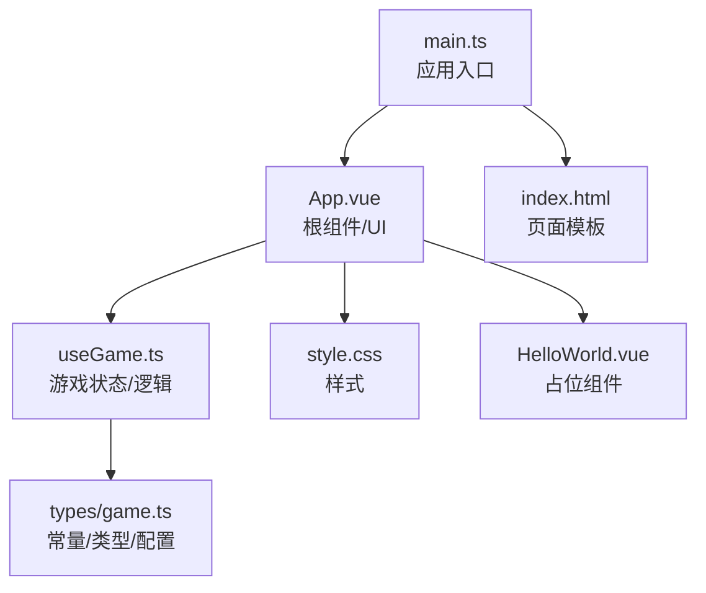
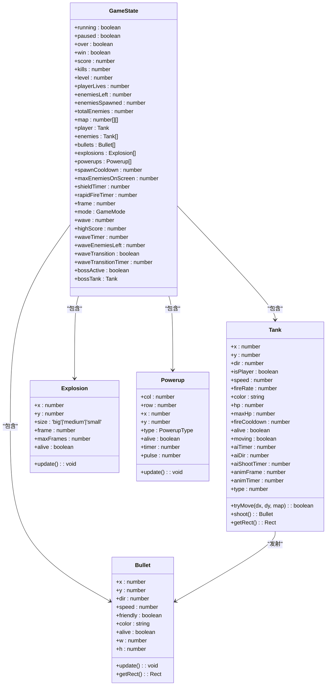
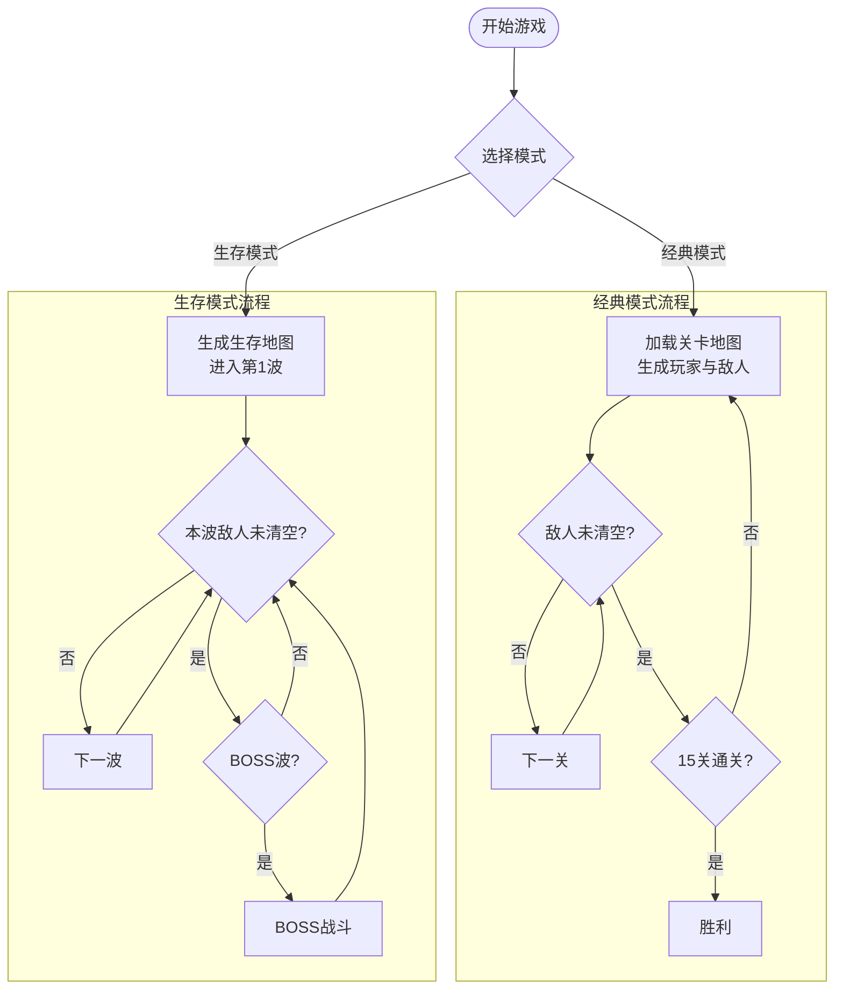
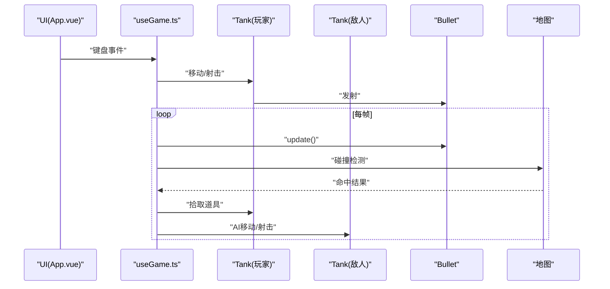
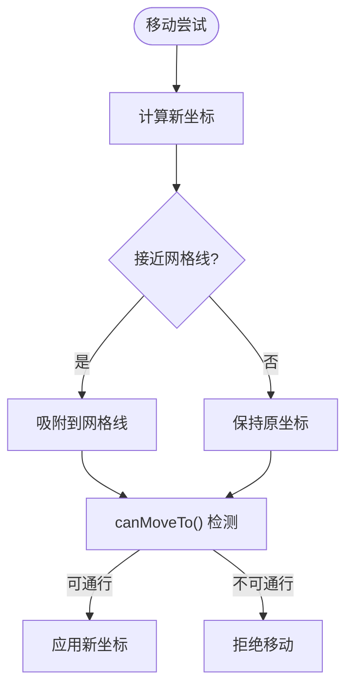
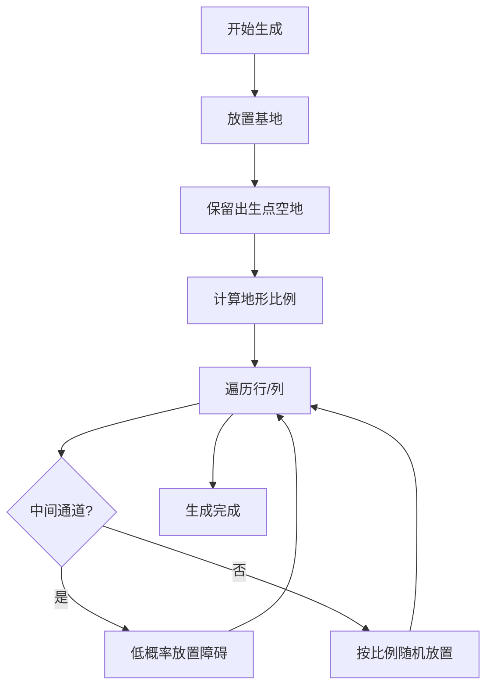
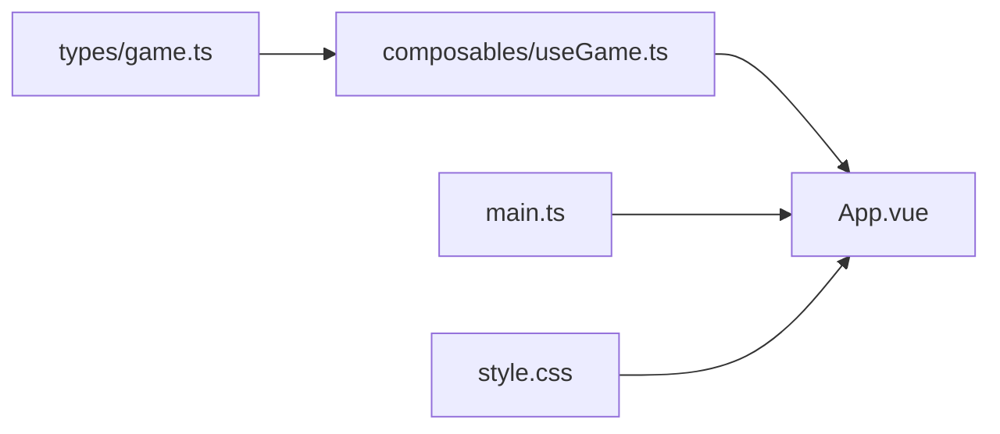

# 游戏机制

<cite>
**本文档引用的文件**
- [README.md](file://README.md)
- [package.json](file://package.json)
- [src/main.ts](file://src/main.ts)
- [src/App.vue](file://src/App.vue)
- [src/composables/useGame.ts](file://src/composables/useGame.ts)
- [src/types/game.ts](file://src/types/game.ts)
- [src/style.css](file://src/style.css)
- [src/components/HelloWorld.vue](file://src/components/HelloWorld.vue)
</cite>

## 目录
1. [简介](#简介)
2. [项目结构](#项目结构)
3. [核心组件](#核心组件)
4. [架构总览](#架构总览)
5. [详细组件分析](#详细组件分析)
6. [依赖关系分析](#依赖关系分析)
7. [性能考量](#性能考量)
8. [故障排查指南](#故障排查指南)
9. [结论](#结论)
10. [附录](#附录)

## 简介
本项目为 Reimagined Journey 的游戏机制文档，聚焦于双模式游戏系统（经典模式与生存模式）、游戏对象系统（玩家坦克、敌人AI、子弹物理、爆炸效果、道具系统）、物理与碰撞系统（网格碰撞、移动吸附、边界处理）、地图生成与波次系统，以及平衡性调整策略。文档以循序渐进的方式呈现，既适合开发者深入理解实现细节，也便于非技术读者把握整体设计。

## 项目结构
项目采用 Vue 3 + TypeScript + Vite 的前端工程化结构，核心逻辑集中在组合式函数 useGame.ts 中，类型定义位于 types/game.ts，应用入口在 main.ts，UI 展示由 App.vue 负责。

图表来源
- [src/main.ts:1-6](file://src/main.ts#L1-L6)
- [src/App.vue:1-305](file://src/App.vue#L1-L305)
- [src/composables/useGame.ts:1-1282](file://src/composables/useGame.ts#L1-L1282)
- [src/types/game.ts:1-300](file://src/types/game.ts#L1-L300)
- [src/style.css:1-439](file://src/style.css#L1-L439)
- [src/components/HelloWorld.vue:1-94](file://src/components/HelloWorld.vue#L1-L94)

章节来源
- [src/main.ts:1-6](file://src/main.ts#L1-L6)
- [src/App.vue:1-305](file://src/App.vue#L1-L305)
- [src/composables/useGame.ts:1-1282](file://src/composables/useGame.ts#L1-L1282)
- [src/types/game.ts:1-300](file://src/types/game.ts#L1-L300)
- [src/style.css:1-439](file://src/style.css#L1-L439)
- [src/components/HelloWorld.vue:1-94](file://src/components/HelloWorld.vue#L1-L94)

## 核心组件
- 游戏状态与控制：useGame.ts 提供游戏运行时状态、输入处理、更新循环、渲染、模式切换、波次管理、胜负判定等。
- 类型与配置：types/game.ts 定义地图瓦片类型、敌人属性、波次配置、地图生成算法、BOSS规则、碰撞工具等。
- 视图与交互：App.vue 负责模式选择、开始/结束界面、暂停、波次过渡提示、UI统计面板；style.css 提供视觉样式。
- 应用入口：main.ts 创建 Vue 应用并挂载根组件。

章节来源
- [src/composables/useGame.ts:264-301](file://src/composables/useGame.ts#L264-L301)
- [src/types/game.ts:1-300](file://src/types/game.ts#L1-L300)
- [src/App.vue:1-305](file://src/App.vue#L1-L305)
- [src/style.css:1-439](file://src/style.css#L1-L439)

## 架构总览
游戏采用“组合式函数 + 类 + 状态对象”的组织方式：
- 组合式函数 useGame.ts 暴露响应式状态 game 与一系列方法（startGame、update、render、spawnEnemy 等），负责游戏主循环与业务逻辑。
- 类 Tank、Bullet、Explosion、Powerup 描述游戏对象的行为与状态。
- 类型模块 types/game.ts 提供地图、敌人、波次、生成器等纯函数与常量。
- UI 层通过 App.vue 订阅 game 状态并驱动绘制与交互。

图表来源
- [src/composables/useGame.ts:16-138](file://src/composables/useGame.ts#L16-L138)
- [src/composables/useGame.ts:140-172](file://src/composables/useGame.ts#L140-L172)
- [src/composables/useGame.ts:174-195](file://src/composables/useGame.ts#L174-L195)
- [src/composables/useGame.ts:197-223](file://src/composables/useGame.ts#L197-L223)
- [src/composables/useGame.ts:229-262](file://src/composables/useGame.ts#L229-L262)

## 详细组件分析

### 双模式游戏系统（经典模式 vs 生存模式）
- 经典模式
  - 关卡推进：按关卡顺序逐关挑战，15 关通关条件为击败所有 BOSS。
  - BOSS 关卡：第 5、10、15 关为 BOSS 关卡，BOSS 血量随关卡递增。
  - 敌人生成：每关固定总敌人数，按出生点轮流出怪，屏幕同时存在数量受上限限制。
- 生存模式
  - 波次推进：无尽波次挑战，每波敌人数量、速度、血量随波次递增，每 5 波出现一次 BOSS 波。
  - 地图重置：每 5 波重置一次生存地图，修复被破坏的砖墙。
  - 最高分：使用本地存储记录最高分，结束界面可显示新纪录。

图表来源
- [src/App.vue:19-44](file://src/App.vue#L19-L44)
- [src/composables/useGame.ts:1162-1213](file://src/composables/useGame.ts#L1162-L1213)
- [src/composables/useGame.ts:1215-1228](file://src/composables/useGame.ts#L1215-L1228)
- [src/types/game.ts:142-157](file://src/types/game.ts#L142-L157)
- [src/types/game.ts:131-139](file://src/types/game.ts#L131-L139)

章节来源
- [src/App.vue:19-44](file://src/App.vue#L19-L44)
- [src/composables/useGame.ts:1162-1213](file://src/composables/useGame.ts#L1162-L1213)
- [src/composables/useGame.ts:1215-1228](file://src/composables/useGame.ts#L1215-L1228)
- [src/types/game.ts:131-157](file://src/types/game.ts#L131-L157)

### 游戏对象系统
- 玩家坦克（Tank）
  - 属性：位置、朝向、速度、开火冷却、血量、动画帧等。
  - 行为：移动（含网格吸附）、射击、矩形碰撞检测、颜色变暗/变亮辅助绘制。
- 子弹（Bullet）
  - 属性：位置、方向、速度、友好方标识、颜色、尺寸。
  - 行为：按方向移动，越界销毁。
- 爆炸（Explosion）
  - 属性：位置、尺寸（大/中/小）、帧计数、最大帧数。
  - 行为：随时间衰减与扩散，帧满销毁。
- 道具（Powerup）
  - 属性：行列位置、类型（护盾/速射/生命/炸弹）、脉动动画。
  - 行为：定时脉动，超时销毁；拾取后应用效果。

图表来源
- [src/App.vue:1244-1257](file://src/App.vue#L1244-L1257)
- [src/composables/useGame.ts:694-729](file://src/composables/useGame.ts#L694-L729)
- [src/composables/useGame.ts:112-121](file://src/composables/useGame.ts#L112-L121)
- [src/composables/useGame.ts:533-636](file://src/composables/useGame.ts#L533-L636)

章节来源
- [src/composables/useGame.ts:16-138](file://src/composables/useGame.ts#L16-L138)
- [src/composables/useGame.ts:140-172](file://src/composables/useGame.ts#L140-L172)
- [src/composables/useGame.ts:174-195](file://src/composables/useGame.ts#L174-L195)
- [src/composables/useGame.ts:197-223](file://src/composables/useGame.ts#L197-L223)

### 物理与碰撞系统
- 网格与边界
  - 地图尺寸：13×13 瓦片，每瓦片 48×48 像素。
  - 边界处理：子弹越界即销毁；坦克移动时若越界则回退。
- 碰撞检测
  - 矩形重叠检测：基于轴对齐包围盒（AABB）。
  - 坦克与地图：四角采样判断是否可通行（排除砖墙、钢铁、水域、基地）。
  - 子弹与地图/敌人/玩家：命中后销毁子弹并触发爆炸与后续逻辑。
- 移动吸附
  - 当接近网格线时，尝试将坐标吸附到最近的网格线，提升移动的“棋盘化”体验。

图表来源
- [src/composables/useGame.ts:83-110](file://src/composables/useGame.ts#L83-L110)
- [src/composables/useGame.ts:298-300](file://src/composables/useGame.ts#L298-L300)

章节来源
- [src/composables/useGame.ts:83-110](file://src/composables/useGame.ts#L83-L110)
- [src/composables/useGame.ts:298-300](file://src/composables/useGame.ts#L298-L300)

### 地图生成与波次系统
- 关卡地图
  - 预设关卡：提供三张固定地图，基地位于底部中央，周围有砖墙保护。
  - 动态生成：超过预设关卡数后，按比例随机生成地形（钢铁、水域、森林、砖墙），保留玩家出生点与敌人出生点附近的空地，并在中间行留出通道。
- 生存地图
  - 对称布局：四角与中心区域布置掩体，边缘水域，基地位于底部中央。
- 波次配置
  - 敌人数量：随波次递增，上限 20。
  - 速度倍率：随波次线性增长。
  - 血量倍率：每 3 波提升一次。
  - BOSS 波：每 5 波一次，最后一波为 BOSS。

图表来源
- [src/types/game.ts:160-230](file://src/types/game.ts#L160-L230)
- [src/types/game.ts:241-296](file://src/types/game.ts#L241-L296)
- [src/types/game.ts:142-157](file://src/types/game.ts#L142-L157)

章节来源
- [src/types/game.ts:160-230](file://src/types/game.ts#L160-L230)
- [src/types/game.ts:241-296](file://src/types/game.ts#L241-L296)
- [src/types/game.ts:142-157](file://src/types/game.ts#L142-L157)

### 道具系统与平衡性
- 道具类型：护盾（临时无敌）、速射（缩短开火间隔）、生命（增加生命上限）、炸弹（清屏）。
- 掉落机制：击杀敌人后以概率掉落，随机分布在目标周围。
- 平衡性建议
  - 速射持续时间与开火间隔需权衡，避免过度压制。
  - 护盾持续时间应与敌人火力匹配，防止“永生”。
  - 炸弹效果应作为紧急手段，不宜频繁出现。
  - 生存模式下，波次难度曲线需平滑，避免“过山车”。

章节来源
- [src/composables/useGame.ts:638-692](file://src/composables/useGame.ts#L638-L692)
- [src/types/game.ts:19-21](file://src/types/game.ts#L19-L21)

### 渲染与UI
- 渲染管线
  - 先绘制网格背景，再按地图瓦片类型绘制地形（砖墙、钢铁、水域、森林、基地）。
  - 绘制道具、敌人、玩家、子弹、爆炸特效。
  - BOSS 血条与波次过渡提示叠加在场景之上。
- UI 面板
  - 战况面板：得分、关卡/波次、击杀数。
  - 生命图标：最多 5 条。
  - 控制说明：WASD 移动、空格射击、P 暂停。
  - 结束界面：经典模式显示通关或失败，生存模式显示最终得分、击杀与波次，并提示最高分与新纪录。

章节来源
- [src/composables/useGame.ts:827-1153](file://src/composables/useGame.ts#L827-L1153)
- [src/App.vue:208-302](file://src/App.vue#L208-L302)
- [src/style.css:1-439](file://src/style.css#L1-L439)

## 依赖关系分析
- useGame.ts 依赖 types/game.ts 提供的地图、敌人、波次、生成器与碰撞工具。
- App.vue 依赖 useGame.ts 提供的状态与方法，负责事件绑定与 UI 渲染。
- main.ts 仅负责应用挂载，不直接参与游戏逻辑。

图表来源
- [src/types/game.ts:1-300](file://src/types/game.ts#L1-L300)
- [src/composables/useGame.ts:1-1282](file://src/composables/useGame.ts#L1-L1282)
- [src/App.vue:1-305](file://src/App.vue#L1-L305)
- [src/main.ts:1-6](file://src/main.ts#L1-L6)

章节来源
- [src/types/game.ts:1-300](file://src/types/game.ts#L1-L300)
- [src/composables/useGame.ts:1-1282](file://src/composables/useGame.ts#L1-L1282)
- [src/App.vue:1-305](file://src/App.vue#L1-L305)
- [src/main.ts:1-6](file://src/main.ts#L1-L6)

## 性能考量
- 更新与渲染分离：每帧先 update 后 render，避免重复计算。
- 对象池化：子弹、爆炸、道具均以“alive”标志过滤，减少遍历成本。
- 碰撞检测范围：子弹仅在地图范围内进行瓦片级碰撞，降低复杂度。
- 绘制优化：仅绘制可见对象，避免不必要的阴影与渐变计算。
- 建议
  - 在大规模敌人场景下，可考虑空间分割（如四叉树）优化碰撞检测。
  - 使用 requestAnimationFrame 管理主循环，避免阻塞主线程。

[本节为通用性能讨论，无需特定文件来源]

## 故障排查指南
- 输入无响应
  - 检查键盘事件监听是否注册，确认 game.running 与 game.paused 状态。
  - 章节来源
    - [src/App.vue:1244-1257](file://src/App.vue#L1244-L1257)
- 子弹穿墙或无法命中
  - 确认 canMoveTo 与矩形重叠检测逻辑，检查瓦片类型与边界。
  - 章节来源
    - [src/composables/useGame.ts:65-81](file://src/composables/useGame.ts#L65-L81)
    - [src/composables/useGame.ts:298-300](file://src/composables/useGame.ts#L298-L300)
- 敌人不出生
  - 检查 spawnCooldown 与 maxEnemiesOnScreen，确认波次/关卡参数。
  - 章节来源
    - [src/composables/useGame.ts:752-756](file://src/composables/useGame.ts#L752-L756)
    - [src/composables/useGame.ts:360-426](file://src/composables/useGame.ts#L360-L426)
- 生存模式地图不刷新
  - 确认每 5 波重置地图逻辑与波次过渡动画。
  - 章节来源
    - [src/composables/useGame.ts:1209-1213](file://src/composables/useGame.ts#L1209-L1213)
- BOSS 血条不显示
  - 确认 bossActive 与 bossTank 引用，检查绘制条件。
  - 章节来源
    - [src/composables/useGame.ts:1111-1128](file://src/composables/useGame.ts#L1111-L1128)

## 结论
Reimagined Journey 通过清晰的双模式设计、简洁的对象模型与稳健的物理/碰撞系统，实现了可玩性强、扩展性好的街机体验。经典模式强调节奏与策略，生存模式强调压力与极限挑战。未来可在性能优化、AI 行为多样性与平衡微调方面进一步迭代。

[本节为总结性内容，无需特定文件来源]

## 附录
- 项目依赖
  - Vue 3、Vite、TailwindCSS、TypeScript。
  - 章节来源
    - [package.json:1-26](file://package.json#L1-L26)