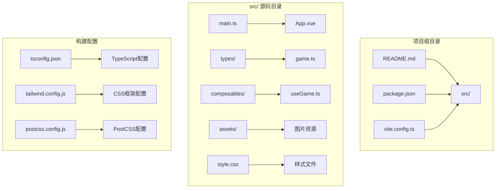
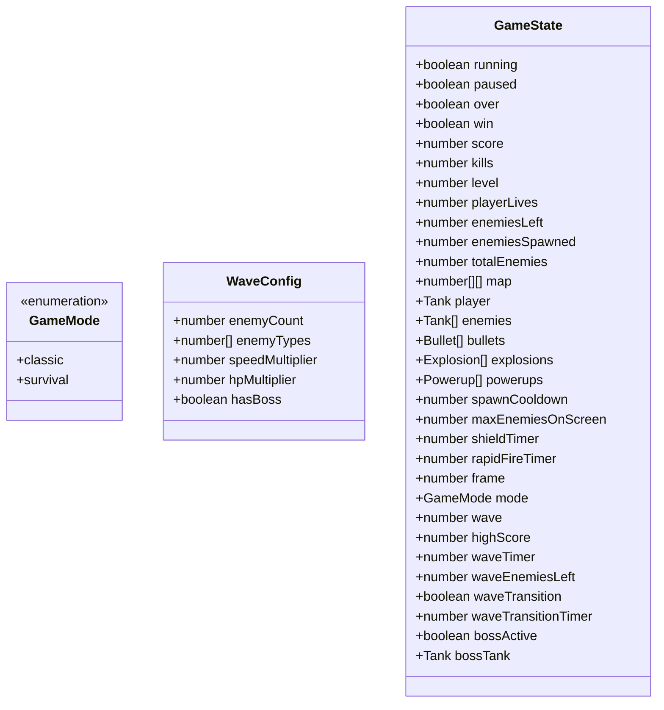
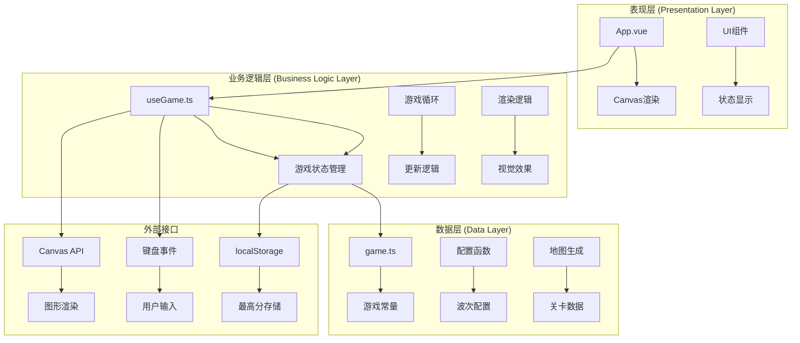
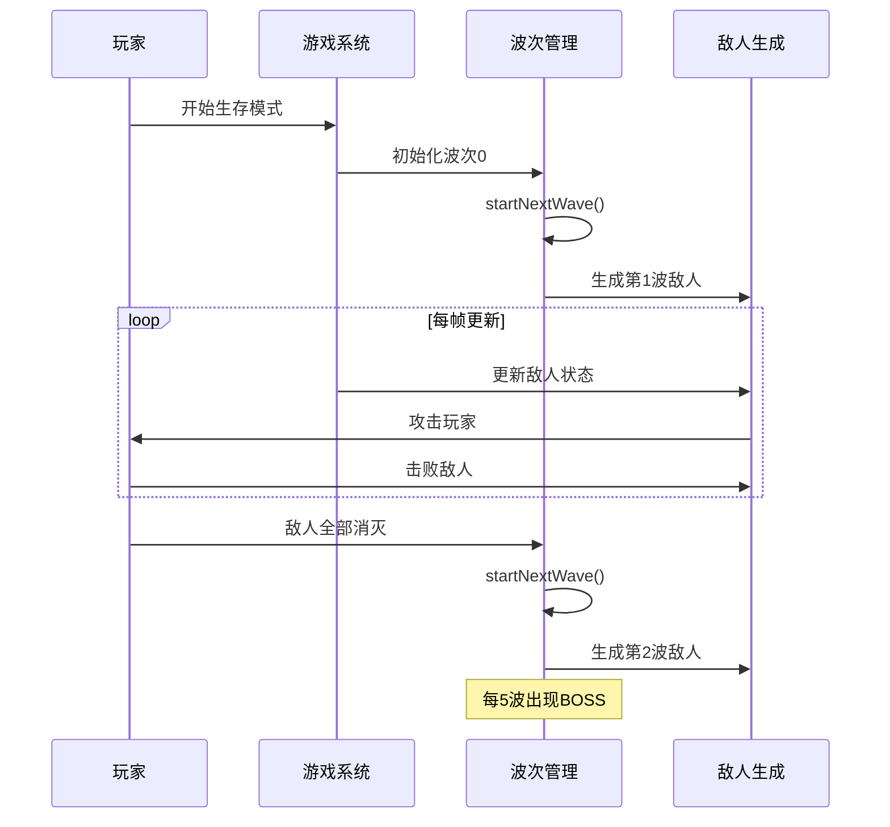
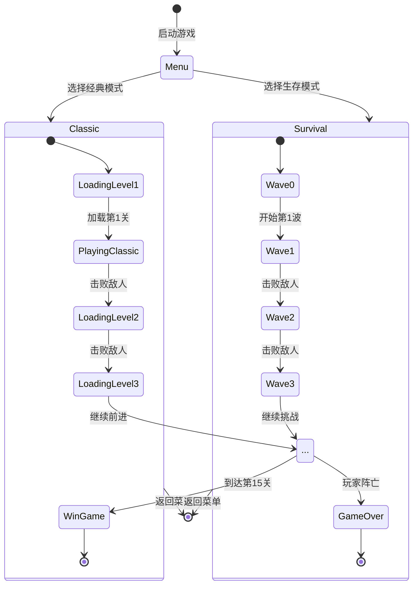
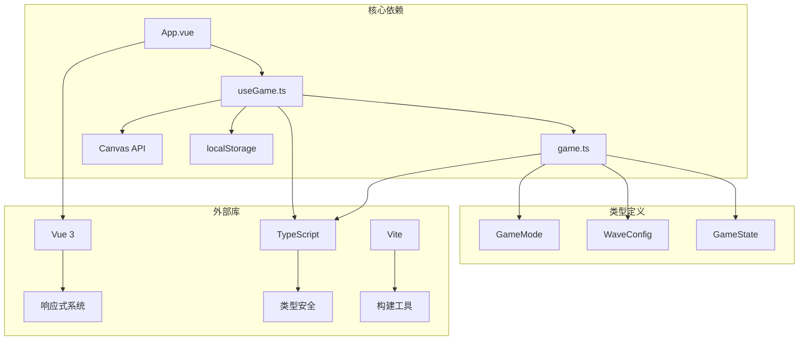

# 游戏模式系统

<cite>
**本文档引用的文件**
- [README.md](file://README.md)
- [src/types/game.ts](file://src/types/game.ts)
- [src/composables/useGame.ts](file://src/composables/useGame.ts)
- [src/App.vue](file://src/App.vue)
- [src/main.ts](file://src/main.ts)
- [src/style.css](file://src/style.css)
</cite>

## 目录
1. [简介](#简介)
2. [项目结构](#项目结构)
3. [核心组件](#核心组件)
4. [架构概览](#架构概览)
5. [详细组件分析](#详细组件分析)
6. [依赖关系分析](#依赖关系分析)
7. [性能考虑](#性能考虑)
8. [故障排除指南](#故障排除指南)
9. [结论](#结论)

## 简介

这是一个基于Vue 3和TypeScript的坦克大战游戏，实现了经典的经典模式和生存模式两大游戏体验。游戏采用Canvas渲染技术，提供了完整的关卡系统、敌人AI、弹幕战斗和视觉特效。

游戏的核心特色包括：
- **经典模式**：15关逐步挑战，每个5关为一个BOSS关卡
- **生存模式**：无限波次挑战，难度随波次递增
- **双模式切换**：无缝切换经典模式和生存模式
- **状态管理系统**：完整的游戏状态跟踪和持久化

## 项目结构

项目采用Vue 3单文件组件架构，主要文件组织如下：



**图表来源**
- [src/main.ts:1-6](file://src/main.ts#L1-L6)
- [src/App.vue:1-305](file://src/App.vue#L1-L305)

**章节来源**
- [README.md:1-6](file://README.md#L1-L6)
- [src/main.ts:1-6](file://src/main.ts#L1-L6)

## 核心组件

### 游戏模式类型定义

游戏系统定义了两种核心模式：



**图表来源**
- [src/types/game.ts:23-33](file://src/types/game.ts#L23-L33)
- [src/types/game.ts:229-262](file://src/types/game.ts#L229-L262)

### 游戏常量和配置

游戏使用统一的常量定义来确保一致性：

| 常量名称 | 值 | 描述 |
|---------|----|------|
| TILE | 48 | 方格尺寸（像素） |
| COLS | 13 | 地图列数 |
| ROWS | 13 | 地图行数 |
| W | 624 | 游戏画布宽度 |
| H | 624 | 游戏画布高度 |
| TILE_EMPTY | 0 | 空地 |
| TILE_BRICK | 1 | 砖墙 |
| TILE_STEEL | 2 | 钢墙 |
| TILE_WATER | 3 | 水域 |
| TILE_FOREST | 4 | 森林 |
| TILE_BASE | 5 | 基地 |

**章节来源**
- [src/types/game.ts:1-11](file://src/types/game.ts#L1-L11)
- [src/types/game.ts:12-17](file://src/types/game.ts#L12-L17)

## 架构概览

游戏采用模块化架构，主要分为以下几个层次：



**图表来源**
- [src/App.vue:1-305](file://src/App.vue#L1-L305)
- [src/composables/useGame.ts:264-1282](file://src/composables/useGame.ts#L264-L1282)
- [src/types/game.ts:1-300](file://src/types/game.ts#L1-L300)

## 详细组件分析

### 经典模式系统

经典模式是传统的15关闯关游戏，每个5关为一个BOSS关卡。

#### 关卡设计

经典模式的关卡设计遵循以下规则：


**图表来源**
- [src/composables/useGame.ts:433-450](file://src/composables/useGame.ts#L433-L450)
- [src/composables/useGame.ts:1215-1228](file://src/composables/useGame.ts#L1215-L1228)

#### BOSS战设计

BOSS战具有独特的机制：

| BOSS关卡 | 血量 | 特殊能力 | 击败奖励 |
|---------|------|----------|----------|
| 第5关 | 8 | 散射攻击 | 1000分 |
| 第10关 | 10 | 强力攻击 | 1000分 |
| 第15关 | 12 | 最终形态 | 1000分 |

BOSS战斗时的特殊机制：
- BOSS拥有额外的血条显示
- BOSS发射散射弹幕（3发子弹）
- 击败BOSS后获得额外分数
- BOSS战结束后清除BOSS状态

**章节来源**
- [src/types/game.ts:131-139](file://src/types/game.ts#L131-L139)
- [src/composables/useGame.ts:513-531](file://src/composables/useGame.ts#L513-L531)
- [src/composables/useGame.ts:572-579](file://src/composables/useGame.ts#L572-L579)

#### 经典模式敌人配置

经典模式根据关卡自动调整敌人类型：

| 关卡范围 | 主要敌人类型 | 概率分布 |
|---------|-------------|----------|
| 1-3关 | 类型0,1 | 60%类型0, 40%类型1 |
| 4-6关 | 类型0,1,2 | 30%各类型 |
| 7-9关 | 类型1,2,3 | 30%各类型 |
| 10-12关 | 类型2,3,4 | 30%各类型（含炮台） |
| 13-15关 | 类型3,4 | 50%各类型 |

**章节来源**
- [src/types/game.ts:108-128](file://src/types/game.ts#L108-L128)

### 生存模式系统

生存模式提供无限波次挑战，难度随波次递增。

#### 波次系统设计

生存模式的波次系统具有以下特点：



**图表来源**
- [src/composables/useGame.ts:1178-1213](file://src/composables/useGame.ts#L1178-L1213)
- [src/composables/useGame.ts:788-792](file://src/composables/useGame.ts#L788-L792)

#### 难度递增机制

生存模式的难度递增遵循以下公式：

| 参数 | 计算公式 | 说明 |
|------|----------|------|
| 敌人数量 | min(6 + 波次, 20) | 每波增加，上限20 |
| 移动速度 | 基础速度 × (1 + 波次 × 0.05) | 每波增加5% |
| 生命值 | 基础生命值 × (1 + floor(波次/3) × 0.5) | 每3波增加50% |
| 射速 | max(10, 基础射速 - 波次 × 2) | 每波减少2帧 |

**章节来源**
- [src/types/game.ts:142-157](file://src/types/game.ts#L142-L157)

#### BOSS波次机制

每5波为一个BOSS波次，具有以下特征：

- **触发条件**：波次编号 % 5 === 0
- **BOSS类型**：类型5（最小BOSS）
- **特殊效果**：最后一波敌人替换为BOSS
- **地图重置**：每5波重新生成地图修复损坏的砖墙

**章节来源**
- [src/types/game.ts:146](file://src/types/game.ts#L146)
- [src/composables/useGame.ts:384-391](file://src/composables/useGame.ts#L384-L391)
- [src/composables/useGame.ts:1209-1212](file://src/composables/useGame.ts#L1209-L1212)

### 地图生成策略

游戏实现了两种不同的地图生成策略：

#### 经典模式关卡地图

经典模式使用预定义的地图数据：

```mermaid
flowchart LR
subgraph "关卡地图"
A[第1关] --> B[复杂布局]
C[第2关] --> D[对称设计]
E[第3关] --> F[几何图案]
G[第4-15关] --> H[动态生成]
end
subgraph "生成规则"
I[基地位置] --> J[固定在(6,12)]
K[玩家出生点] --> L[保持空地]
M[敌人出生点] --> N[[0,0],[6,0],[12,0]]
O[中间通道] --> P[预留通路]
end
```

**图表来源**
- [src/types/game.ts:36-85](file://src/types/game.ts#L36-L85)
- [src/types/game.ts:160-238](file://src/types/game.ts#L160-L238)

#### 生存模式专用地图

生存模式使用对称地图设计：

| 地图元素 | 位置 | 概率 | 功能 |
|---------|------|------|------|
| 基地 | (6,12) | 100% | 玩家防御核心 |
| 保护墙 | 基地周围 | 100% | 防御炮台 |
| 四角掩体 | 对称位置 | 50% | 敌人进攻路径 |
| 中央障碍 | 多个位置 | 40% | 地形掩护 |
| 边缘水域 | 四个角落 | 70% | 阻挡路径 |

**章节来源**
- [src/types/game.ts:241-296](file://src/types/game.ts#L241-L296)

### 模式切换与状态管理

游戏实现了无缝的模式切换机制：



**图表来源**
- [src/App.vue:19-26](file://src/App.vue#L19-L26)
- [src/composables/useGame.ts:1162-1176](file://src/composables/useGame.ts#L1162-L1176)

#### 状态持久化

游戏状态通过localStorage进行持久化存储：

- **最高分记录**：`tankHighScore` 键存储生存模式最高分
- **模式切换**：实时切换经典模式和生存模式
- **游戏进度**：经典模式的关卡进度和生存模式的波次进度

**章节来源**
- [src/composables/useGame.ts:346](file://src/composables/useGame.ts#L346)
- [src/composables/useGame.ts:611-616](file://src/composables/useGame.ts#L611-L616)

## 依赖关系分析

游戏的依赖关系清晰明确，遵循单一职责原则：



**图表来源**
- [src/App.vue:1-5](file://src/App.vue#L1-L5)
- [src/composables/useGame.ts:1-10](file://src/composables/useGame.ts#L1-L10)
- [src/types/game.ts:1-10](file://src/types/game.ts#L1-L10)

**章节来源**
- [src/App.vue:1-305](file://src/App.vue#L1-L305)
- [src/composables/useGame.ts:1-1282](file://src/composables/useGame.ts#L1-L1282)
- [src/types/game.ts:1-300](file://src/types/game.ts#L1-L300)

## 性能考虑

游戏在性能优化方面采用了多项措施：

### 渲染优化
- **Canvas渲染**：使用硬件加速的Canvas API进行图形渲染
- **对象池**：复用爆炸、子弹等临时对象，避免频繁内存分配
- **批量绘制**：统一处理相同类型的对象绘制，减少状态切换

### 更新循环优化
- **帧率控制**：使用requestAnimationFrame确保60FPS渲染
- **条件更新**：仅在游戏运行时执行更新逻辑
- **延迟处理**：使用setTimeout处理游戏事件的延迟效果

### 内存管理
- **垃圾回收**：及时清理死亡的子弹、爆炸和道具
- **引用管理**：合理管理BOSS坦克的引用，避免内存泄漏
- **状态重置**：每次模式切换时重置游戏状态

## 故障排除指南

### 常见问题及解决方案

#### 游戏无法启动
**症状**：点击开始按钮无响应
**可能原因**：
- Canvas元素未正确初始化
- 键盘事件监听器冲突
- 模块导入错误

**解决方法**：
1. 检查Canvas元素的ref绑定
2. 确认键盘事件监听器的正确注册
3. 验证模块导入路径

#### 经典模式无法通关
**症状**：第15关无法通过
**可能原因**：
- BOSS血量计算错误
- 敌人生成逻辑异常
- 碰撞检测失效

**解决方法**：
1. 检查BOSS血量配置函数
2. 验证敌人生成计数逻辑
3. 确认碰撞检测算法

#### 生存模式难度异常
**症状**：波次难度不符合预期
**可能原因**：
- 波次配置计算错误
- 难度递增公式异常
- BOSS波次判断逻辑错误

**解决方法**：
1. 验证波次配置函数的返回值
2. 检查难度递增公式的实现
3. 确认BOSS波次的触发条件

**章节来源**
- [src/App.vue:52-83](file://src/App.vue#L52-L83)
- [src/composables/useGame.ts:1230-1235](file://src/composables/useGame.ts#L1230-L1235)

## 结论

游戏模式系统展现了优秀的架构设计和实现质量。经典模式和生存模式各有特色，满足不同玩家的游戏需求。

### 设计亮点

1. **清晰的架构分离**：表现层、业务逻辑层和数据层职责明确
2. **灵活的配置系统**：通过函数和常量实现可配置的游戏参数
3. **完善的用户体验**：流畅的动画效果和直观的UI设计
4. **良好的扩展性**：模块化的代码结构便于功能扩展

### 技术优势

- **TypeScript类型安全**：确保代码质量和开发效率
- **Vue 3响应式系统**：提供优秀的状态管理和UI更新
- **Canvas高性能渲染**：保证流畅的游戏体验
- **localStorage持久化**：支持游戏进度的长期保存

### 改进建议

1. **性能监控**：添加帧率监控和性能分析工具
2. **游戏平衡**：定期调整难度曲线和奖励机制
3. **多语言支持**：添加国际化文本支持
4. **音效系统**：集成背景音乐和音效播放

这个游戏模式系统为开发者提供了坚实的基础，可以在此基础上进一步扩展和完善，创造出更加丰富和有趣的游戏体验。