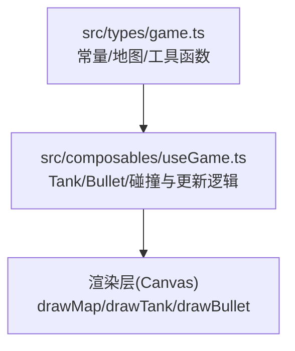
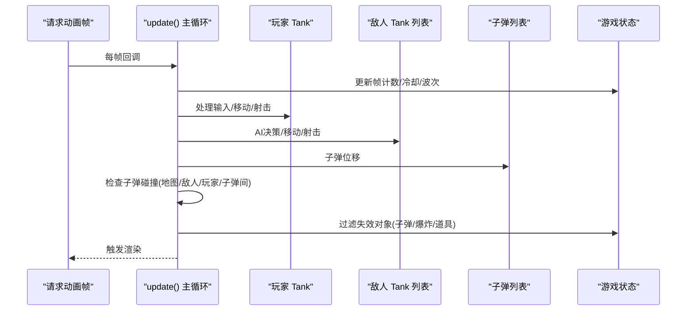
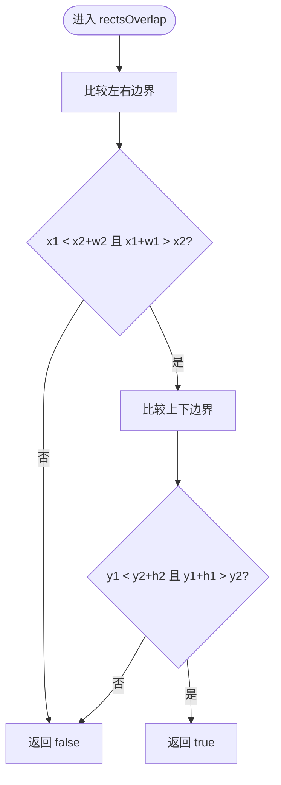
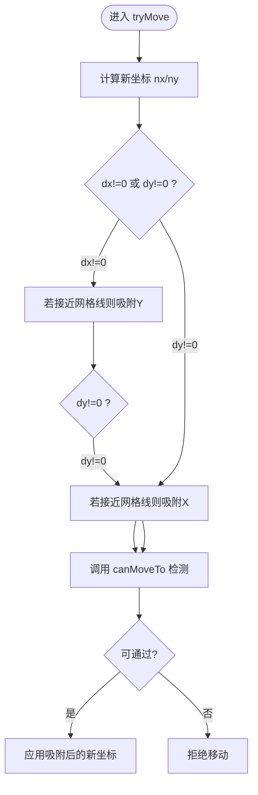
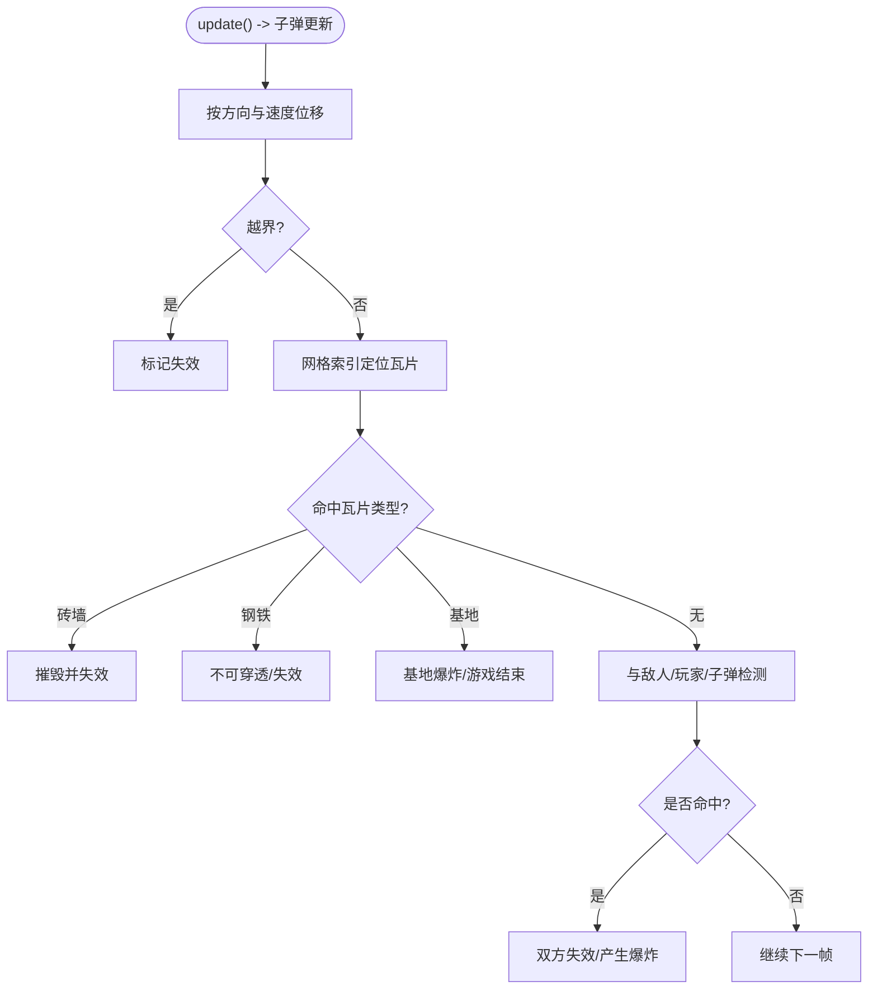
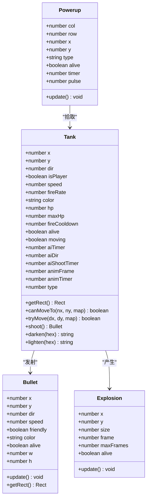
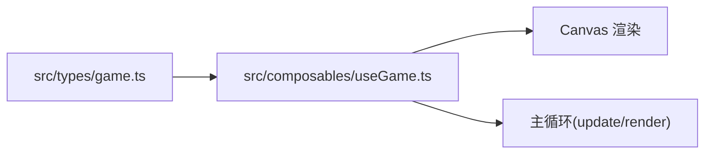

# 物理引擎

<cite>
**本文档引用的文件**
- [README.md](file://README.md)
- [game.ts](file://src/types/game.ts)
- [useGame.ts](file://src/composables/useGame.ts)
</cite>

## 目录
1. [简介](#简介)
2. [项目结构](#项目结构)
3. [核心组件](#核心组件)
4. [架构总览](#架构总览)
5. [详细组件分析](#详细组件分析)
6. [依赖关系分析](#依赖关系分析)
7. [性能考量](#性能考量)
8. [故障排查指南](#故障排查指南)
9. [结论](#结论)
10. [附录](#附录)

## 简介
本文件面向物理引擎与碰撞系统的技术文档，聚焦于网格化碰撞检测、坦克移动吸附机制、子弹边界与穿透处理、以及整体性能优化策略。内容基于仓库中的类型定义与游戏逻辑实现进行归纳总结，并通过可视化图表帮助读者理解系统工作流程。

## 项目结构
本项目采用前端单页应用结构，物理与碰撞相关的核心逻辑集中在组合式函数中，类型常量与地图数据定义在类型模块中：
- 类型与常量：src/types/game.ts
- 游戏主循环与实体：src/composables/useGame.ts

**图表来源**
- [game.ts:1-300](file://src/types/game.ts#L1-L300)
- [useGame.ts:1-1282](file://src/composables/useGame.ts#L1-L1282)

**章节来源**
- [README.md:1-6](file://README.md#L1-L6)
- [game.ts:1-300](file://src/types/game.ts#L1-L300)
- [useGame.ts:1-1282](file://src/composables/useGame.ts#L1-L1282)

## 核心组件
- 网格与地图
  - 瓦片尺寸、行列数、画布尺寸常量
  - 地图瓦片类型枚举（空地、砖墙、钢铁、水域、森林、基地）
  - 关卡地图与生存模式地图生成器
- 实体
  - Tank：玩家与敌人，包含移动、射击、动画与属性
  - Bullet：子弹，包含生命周期与边界消亡
  - Explosion/Powerup：爆炸与道具
- 碰撞与检测
  - 矩形重叠检测函数
  - 坦克移动吸附与边界/障碍物检测
  - 子弹与地图/敌人/玩家/子弹之间的碰撞处理

**章节来源**
- [game.ts:1-300](file://src/types/game.ts#L1-L300)
- [useGame.ts:16-172](file://src/composables/useGame.ts#L16-L172)

## 架构总览
游戏以 requestAnimationFrame 驱动的主循环为核心，按帧执行以下流程：
- 更新阶段：玩家输入驱动坦克移动与射击；AI 控制敌人；子弹位移；检查碰撞与道具拾取；清理无效对象
- 渲染阶段：绘制网格、地图瓦片、坦克、子弹、爆炸与UI

**图表来源**
- [useGame.ts:731-792](file://src/composables/useGame.ts#L731-L792)
- [useGame.ts:1155-1160](file://src/composables/useGame.ts#L1155-L1160)

**章节来源**
- [useGame.ts:731-792](file://src/composables/useGame.ts#L731-L792)
- [useGame.ts:1155-1160](file://src/composables/useGame.ts#L1155-L1160)

## 详细组件分析

### 网格与地图系统
- 网格尺寸与边界
  - 瓦片大小、列数、行数、画布宽高由常量定义
  - 地图二维数组，每个元素为瓦片类型
- 地图生成
  - 关卡地图：内置多关卡模板或按规则生成
  - 生存模式地图：对称布局，中心开阔，四角与中区布置掩体
- 瓦片类型与交互
  - 砖墙可被子弹摧毁
  - 钢铁不可穿透
  - 水域与森林影响视觉与可能的移动策略
  - 基地被摧毁则游戏结束

**章节来源**
- [game.ts:1-300](file://src/types/game.ts#L1-L300)

### 矩形重叠检测（rectsOverlap）
- 功能：判断两个矩形是否相交
- 实现要点
  - 使用“分离轴定理”的一维投影重叠条件
  - 无乘法/除法，仅比较边界值，时间复杂度 O(1)，空间 O(1)
- 性能优势
  - 在碰撞检测中作为基础原子操作，避免了复杂的几何运算
  - 适合在主循环高频调用

**图表来源**
- [game.ts:298-300](file://src/types/game.ts#L298-L300)

**章节来源**
- [game.ts:298-300](file://src/types/game.ts#L298-L300)

### 坦克移动与吸附机制（Tank.canMoveTo / tryMove）
- 移动吸附策略
  - 尝试将接近网格线的坐标吸附到最近的网格线，阈值为固定像素
  - 水平移动时吸附Y，垂直移动时吸附X，避免“贴边抖动”
- 边界与障碍物检测
  - 对四个角点进行网格索引计算
  - 若索引越界或命中不可通行瓦片（砖墙、钢铁、水域、基地），判定不可移动
- 复杂度与优化
  - 单次检测仅检查4个角点，时间复杂度 O(1)，空间 O(1)
  - 吸附阈值与角点内缩参数可微调以平衡“贴边”与“滑行”体验

**图表来源**
- [useGame.ts:83-110](file://src/composables/useGame.ts#L83-L110)
- [useGame.ts:65-81](file://src/composables/useGame.ts#L65-L81)

**章节来源**
- [useGame.ts:83-110](file://src/composables/useGame.ts#L83-L110)
- [useGame.ts:65-81](file://src/composables/useGame.ts#L65-L81)

### 子弹边界处理、穿透检测与消亡条件
- 边界消亡
  - 子弹超出画布边界即标记为“失效”，在下一帧过滤掉
- 穿透检测
  - 子弹与地图瓦片碰撞：命中砖墙/钢铁/基地分别触发不同效果（摧毁/不可穿透/基地爆炸）
  - 子弹与敌人/玩家碰撞：使用矩形重叠检测，命中后双方均失效
  - 子弹与子弹碰撞：友军与敌军之间命中即双方同时失效
- 复杂度与优化
  - 地图碰撞：O(1) 瓦片索引 + 常量时间判定
  - 敌我/敌敌碰撞：双重循环遍历子弹，复杂度 O(B^2)，但实际子弹数量有限，可接受

**图表来源**
- [useGame.ts:163-169](file://src/composables/useGame.ts#L163-L169)
- [useGame.ts:533-636](file://src/composables/useGame.ts#L533-L636)

**章节来源**
- [useGame.ts:163-169](file://src/composables/useGame.ts#L163-L169)
- [useGame.ts:533-636](file://src/composables/useGame.ts#L533-L636)

### 坦克类与子弹类（类图）

**图表来源**
- [useGame.ts:16-195](file://src/composables/useGame.ts#L16-L195)

**章节来源**
- [useGame.ts:16-195](file://src/composables/useGame.ts#L16-L195)

## 依赖关系分析
- useGame.ts 依赖 game.ts 的常量、地图生成与碰撞函数
- 游戏主循环依赖 Canvas 上下文进行绘制
- 碰撞检测依赖矩形重叠函数与网格索引

**图表来源**
- [game.ts:1-300](file://src/types/game.ts#L1-L300)
- [useGame.ts:1-1282](file://src/composables/useGame.ts#L1-L1282)

**章节来源**
- [game.ts:1-300](file://src/types/game.ts#L1-L300)
- [useGame.ts:1-1282](file://src/composables/useGame.ts#L1-L1282)

## 性能考量
- 碰撞检测复杂度
  - 矩形重叠：O(1)
  - 坦克移动检测：O(1)（4角点）
  - 子弹与地图：O(1)（单瓦片）
  - 子弹与实体：O(B^2)，但子弹数量有限，可接受
- 内存与对象复用
  - 子弹、爆炸、道具在失效后统一过滤，避免累积
- 渲染开销
  - 网格绘制与瓦片绘制为 O(R*C)，在 13x13 网格规模下开销可控
- 可优化建议
  - 子弹碰撞可引入空间分割（如四叉树）以降低 O(B^2) 的比较次数
  - 吸附阈值与角点内缩参数可动态调整以平衡性能与体验
  - 将矩形重叠检测内联至热点路径，减少函数调用开销

[本节为通用性能讨论，无需特定文件来源]

## 故障排查指南
- 坦克卡墙/贴边异常
  - 检查吸附阈值与角点内缩参数，确认网格索引越界保护
  - 排查移动方向与吸附逻辑的先后顺序
- 子弹穿透/误伤
  - 确认子弹网格索引与地图碰撞分支顺序
  - 检查友军/敌军标识与碰撞分支逻辑
- 基地未被摧毁
  - 检查基地命中后的地图修改与爆炸触发
- 性能抖动
  - 关注主循环中对象数量增长与过滤时机
  - 评估是否需要引入空间索引或批量更新策略

**章节来源**
- [useGame.ts:533-636](file://src/composables/useGame.ts#L533-L636)
- [useGame.ts:83-110](file://src/composables/useGame.ts#L83-L110)

## 结论
本物理引擎以网格化为基础，结合矩形重叠检测与简单的移动吸附策略，实现了稳定高效的坦克移动与子弹碰撞系统。通过常量化的地图与实体属性，系统具备良好的可维护性与扩展性。未来可在子弹碰撞上引入空间索引以进一步提升性能，并根据实际帧率与对象密度微调参数以获得更佳体验。

[本节为总结性内容，无需特定文件来源]

## 附录

### 物理参数调优建议
- 移动吸附
  - 吸附阈值：建议 4 像素，兼顾贴边与滑行体验
  - 角点内缩：建议 4 像素，避免边缘误判
- 子弹
  - 网格索引：使用中心偏移（如 +3）以提高命中精度
  - 边界消亡：与画布边界一致，避免越界渲染
- 碰撞
  - 矩形重叠：保持 O(1) 检测，避免复杂几何
  - 地图碰撞：优先短路判断（越界/不可通行）

[本节为通用建议，无需特定文件来源]

### 性能基准测试建议
- 测试场景
  - 低负载：少量坦克/子弹，验证帧率与延迟
  - 中负载：中等数量实体，观察帧率波动
  - 高负载：大量子弹/敌人，评估 O(B^2) 的瓶颈
- 指标
  - 平均帧耗时、P95/P99 延迟、对象数量峰值
- 工具
  - 浏览器开发者工具性能面板
  - 自定义帧计时器统计

[本节为通用建议，无需特定文件来源]