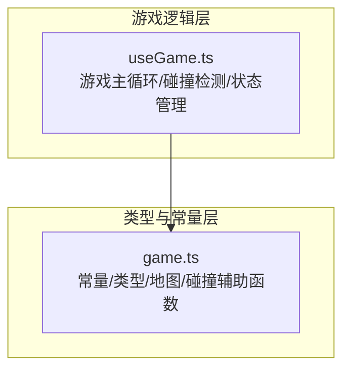
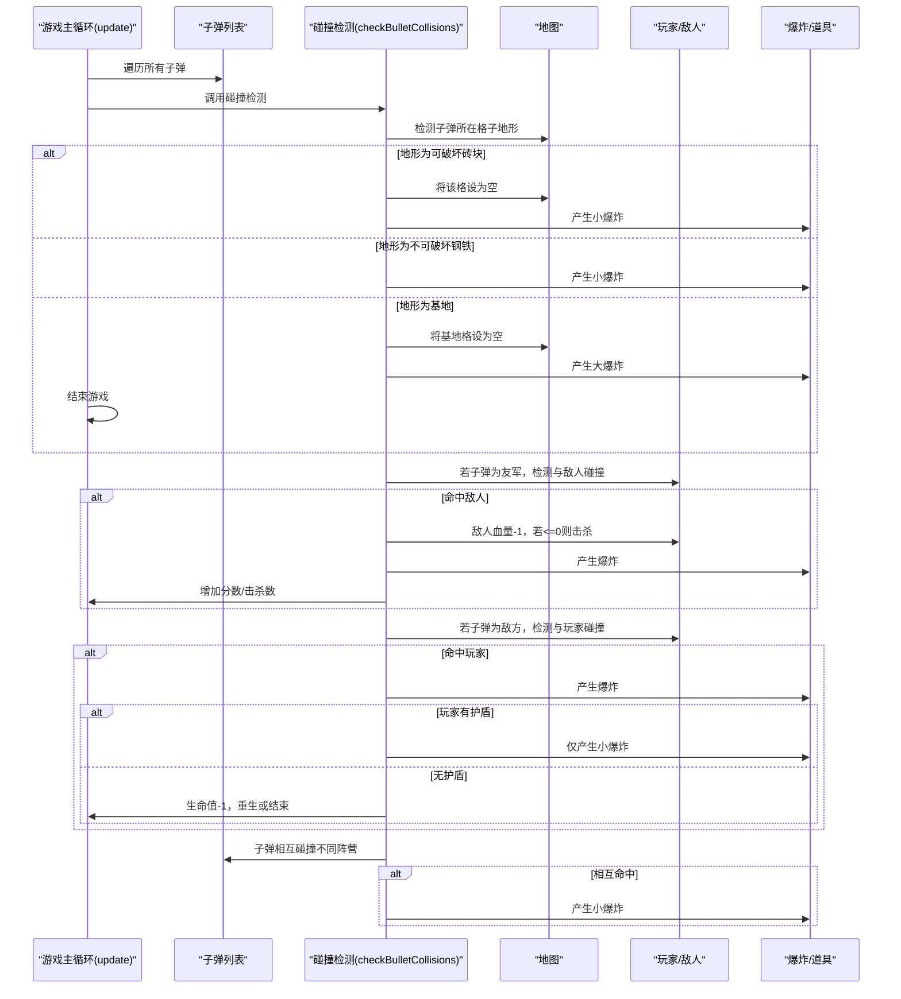
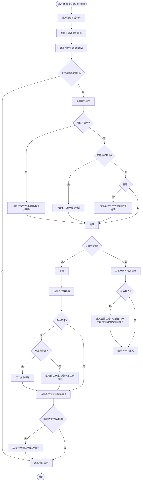
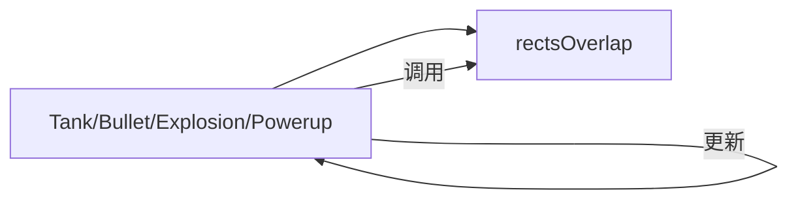

# 碰撞检测系统

<cite>
**本文档引用的文件**
- [src/composables/useGame.ts](file://src/composables/useGame.ts)
- [src/types/game.ts](file://src/types/game.ts)
</cite>

## 目录
1. [简介](#简介)
2. [项目结构](#项目结构)
3. [核心组件](#核心组件)
4. [架构总览](#架构总览)
5. [详细组件分析](#详细组件分析)
6. [依赖关系分析](#依赖关系分析)
7. [性能考量](#性能考量)
8. [故障排查指南](#故障排查指南)
9. [结论](#结论)
10. [附录](#附录)

## 简介
本文件面向碰撞检测系统的实现与优化，重点解析以下内容：
- checkBulletCollisions 函数的完整实现流程，涵盖子弹与地形、子弹与坦克、子弹相互碰撞的检测逻辑
- rectsOverlap 函数的数学原理与性能优化策略
- 不同类型地形对子弹的影响（可破坏砖块、不可破坏钢铁、基地保护）
- 玩家与敌人的碰撞处理与伤害判定机制
- 性能分析与优化建议
- 碰撞参数配置与调试方法

## 项目结构
该项目采用 Vue 3 + TypeScript + Vite 的前端工程，碰撞检测位于游戏主逻辑模块中，通过 useGame 组合式函数集中管理游戏状态与更新循环。碰撞检测涉及的核心文件如下：
- src/composables/useGame.ts：包含 Tank、Bullet、Explosion、Powerup 等类定义，以及游戏主循环、碰撞检测、绘制等逻辑
- src/types/game.ts：包含地图常量、地形类型、碰撞辅助函数 rectsOverlap、关卡地图生成等

**图表来源**
- [src/composables/useGame.ts:1-1282](file://src/composables/useGame.ts#L1-1282)
- [src/types/game.ts:1-300](file://src/types/game.ts#L1-300)

**章节来源**
- [src/composables/useGame.ts:1-1282](file://src/composables/useGame.ts#L1-1282)
- [src/types/game.ts:1-300](file://src/types/game.ts#L1-300)

## 核心组件
- Tank 类：表示玩家或敌人，包含位置、朝向、生命值、射击冷却、移动与射击逻辑
- Bullet 类：表示子弹，包含位置、速度、方向、颜色、尺寸与生命周期
- Explosion 类：表示爆炸效果，包含尺寸、帧数与生命周期
- Powerup 类：表示道具，包含类型、位置与脉动动画
- GameState 接口：集中管理游戏运行状态（关卡、分数、敌人、子弹、爆炸、道具等）

这些组件共同构成碰撞检测的基础数据结构，并在 update 循环中驱动碰撞检测与状态更新。

**章节来源**
- [src/composables/useGame.ts:16-195](file://src/composables/useGame.ts#L16-195)
- [src/composables/useGame.ts:229-301](file://src/composables/useGame.ts#L229-L301)

## 架构总览
碰撞检测在游戏主循环中执行，顺序如下：
- 更新所有子弹位置
- 执行 checkBulletCollisions 进行碰撞判定
- 检查道具拾取
- 清理非存活对象（子弹、爆炸、道具）

**图表来源**
- [src/composables/useGame.ts:731-792](file://src/composables/useGame.ts#L731-L792)
- [src/composables/useGame.ts:533-636](file://src/composables/useGame.ts#L533-L636)

## 详细组件分析

### checkBulletCollisions 函数详解
该函数负责对每一颗存活子弹进行多维度碰撞检测，具体流程如下：
- 计算子弹矩形包围盒与所在网格坐标
- 检测子弹所在格子的地形类型并执行对应处理
- 若子弹为友军，检测与所有敌人之间的碰撞
- 若子弹为敌方，检测与玩家之间的碰撞
- 检测与其他子弹之间的相互碰撞（不同阵营）

**图表来源**
- [src/composables/useGame.ts:533-636](file://src/composables/useGame.ts#L533-L636)

**章节来源**
- [src/composables/useGame.ts:533-636](file://src/composables/useGame.ts#L533-L636)

### rectsOverlap 函数的数学原理与性能优化
- 数学原理：采用轴对齐包围盒(AABB)相交判断，即两个矩形在 x 和 y 方向上同时重叠才视为相交
- 判断条件：a.x < b.x + b.w 且 a.x + a.w > b.x 且 a.y < b.y + b.h 且 a.y + a.h > b.y
- 性能优化策略：
  - 使用位运算与常量比较替代浮点运算，减少分支开销
  - 在调用前先做范围检查（如网格坐标合法性），避免无效计算
  - 合理使用局部变量缓存矩形属性，减少重复访问
  - 在密集场景下，优先使用更粗略的预筛选（如按网格或四叉树）再进行精确 AABB 判定

**章节来源**
- [src/types/game.ts:298-300](file://src/types/game.ts#L298-L300)

### 地形对子弹的影响
- 可破坏砖块（TILE_BRICK）：子弹命中后清除该格，产生小爆炸，子弹死亡
- 不可破坏钢铁（TILE_STEEL）：子弹命中后仅产生小爆炸，子弹死亡
- 基地（TILE_BASE）：子弹命中后清除基地格，产生大爆炸，触发游戏结束逻辑
- 其他地形（TILE_WATER、TILE_FOREST）：在子弹碰撞检测中未作特殊处理，子弹穿过或按默认逻辑处理

**章节来源**
- [src/types/game.ts:12-17](file://src/types/game.ts#L12-L17)
- [src/composables/useGame.ts:541-559](file://src/composables/useGame.ts#L541-L559)

### 玩家与敌人的碰撞处理与伤害判定
- 玩家与敌人：当玩家移动时，若与敌人矩形重叠，则回退一步以阻止穿透
- 子弹与敌人：友军子弹命中敌人，敌人血量-1；若血量<=0则击杀，产生大爆炸，增加分数与击杀数，可能掉落道具
- 子弹与玩家：敌方子弹命中玩家，若玩家有护盾则仅产生小爆炸；否则生命值-1，产生大爆炸，根据剩余生命决定重生或结束
- BOSS 特殊处理：击杀 BOSS 增加额外分数并清空 BOSS 状态，产生双倍爆炸效果

**章节来源**
- [src/composables/useGame.ts:722-729](file://src/composables/useGame.ts#L722-L729)
- [src/composables/useGame.ts:561-598](file://src/composables/useGame.ts#L561-L598)
- [src/composables/useGame.ts:600-625](file://src/composables/useGame.ts#L600-L625)

### 子弹相互碰撞
- 不同阵营的子弹相撞时，双方均标记为死亡并产生小爆炸
- 该逻辑在 checkBulletCollisions 内部对每颗子弹再次遍历所有子弹进行判定

**章节来源**
- [src/composables/useGame.ts:627-635](file://src/composables/useGame.ts#L627-L635)

## 依赖关系分析
- useGame.ts 依赖 game.ts 提供的常量、类型与碰撞辅助函数
- 碰撞检测依赖矩形包围盒判断与地图网格索引
- 游戏状态（玩家、敌人、子弹、爆炸、道具）在 update 循环中被统一管理与清理

**图表来源**
- [src/composables/useGame.ts:1-1282](file://src/composables/useGame.ts#L1-L1282)
- [src/types/game.ts:1-300](file://src/types/game.ts#L1-L300)

**章节来源**
- [src/composables/useGame.ts:1-1282](file://src/composables/useGame.ts#L1-L1282)
- [src/types/game.ts:1-300](file://src/types/game.ts#L1-L300)

## 性能考量
- 时间复杂度
  - 子弹与地形/敌人/玩家/子弹的碰撞检测为 O(B*(M+E+K))，其中 B 为存活子弹数，M 为地图格数，E 为敌人数量，K 为子弹数量
  - AABB 判定为 O(1)，整体受子弹数量主导
- 空间复杂度
  - 使用原地更新与过滤器清理非存活对象，空间开销主要由对象池与状态数组决定
- 优化建议
  - 网格预筛选：按子弹所在网格快速定位潜在碰撞目标，减少遍历
  - 四叉树/空间分割：在大规模敌人与子弹场景中，使用四叉树降低碰撞检测复杂度
  - 批量更新：合并多次状态变更，减少 DOM 或画布操作次数
  - 缓存与复用：缓存矩形包围盒与网格坐标，避免重复计算
  - 分帧处理：将大量碰撞检测拆分到多个帧，避免单帧卡顿

[本节为通用性能讨论，无需特定文件来源]

## 故障排查指南
- 子弹“穿墙”问题
  - 检查子弹矩形包围盒尺寸与网格大小是否匹配，确保命中检测基于网格坐标
  - 确认地形类型判断逻辑正确，避免误判
- 子弹“穿透”敌人
  - 确认友军子弹与敌人碰撞检测在命中后立即设置子弹死亡
  - 检查敌人血量与击杀判定逻辑
- 护盾无效
  - 确认玩家护盾计时器在命中时被正确处理
- 基地未被摧毁
  - 检查基地命中后的地图状态更新与爆炸效果触发
- 性能抖动
  - 使用浏览器性能面板观察帧耗时，必要时引入网格/四叉树优化
  - 减少不必要的对象创建与销毁

[本节为通用故障排查建议，无需特定文件来源]

## 结论
本碰撞检测系统以 AABB 为基础，结合网格索引与阵营区分，实现了对子弹与地形、玩家与敌人、子弹相互碰撞的高效处理。通过合理的状态管理与清理策略，系统在中小规模场景下具备良好的性能与可维护性。针对更大规模的场景，建议引入空间分割与批量处理等优化手段以进一步提升性能。

[本节为总结性内容，无需特定文件来源]

## 附录

### 碰撞参数配置与调试方法
- 碰撞参数
  - 子弹尺寸：宽高均为固定像素值
  - 玩家/敌人矩形：使用固定内边距的矩形包围盒
  - 地形影响：可破坏砖块与不可破坏钢铁的命中行为不同
- 调试方法
  - 可视化包围盒：在开发阶段绘制矩形包围盒以验证碰撞范围
  - 日志输出：在关键碰撞点打印日志，确认命中与伤害流程
  - 性能监控：使用浏览器性能面板观察帧率与热点函数
  - 参数微调：逐步调整子弹速度、网格大小与矩形内边距，平衡精度与性能

[本节为通用指导，无需特定文件来源]