# 道具系统

<cite>
**本文档引用的文件**
- [useGame.ts](file://src/composables/useGame.ts)
- [game.ts](file://src/types/game.ts)
</cite>

## 更新摘要
**变更内容**
- 新增技能乱斗模式八种新能力的详细说明
- 更新道具生成算法以支持乱斗模式特殊机制
- 扩展效果实现机制以包含双发、三向散射、穿透等新功能
- 更新视觉效果系统以支持新道具图标和HUD显示
- 增强平衡性设计分析以涵盖乱斗模式的独特机制

## 目录
1. [简介](#简介)
2. [项目结构](#项目结构)
3. [核心组件](#核心组件)
4. [架构概览](#架构概览)
5. [详细组件分析](#详细组件分析)
6. [技能乱斗模式扩展](#技能乱斗模式扩展)
7. [依赖关系分析](#依赖关系分析)
8. [性能考虑](#性能考虑)
9. [故障排除指南](#故障排除指南)
10. [结论](#结论)

## 简介

道具系统是游戏中的重要机制，负责为玩家提供临时增强效果。本文档深入分析了游戏中的道具生成算法、效果实现机制以及生命周期管理。系统现已扩展为包含两种模式：经典模式的四种传统道具（护盾、速射、生命、炸弹）和技能乱斗模式的八种新能力（双发、三向散射、穿透、护盾、速度爆发、地雷、空袭、核弹），每种道具/能力都提供独特的游戏体验增强。

## 项目结构

道具系统位于游戏的核心逻辑中，与游戏状态管理和渲染系统紧密集成，并支持三种不同的游戏模式：

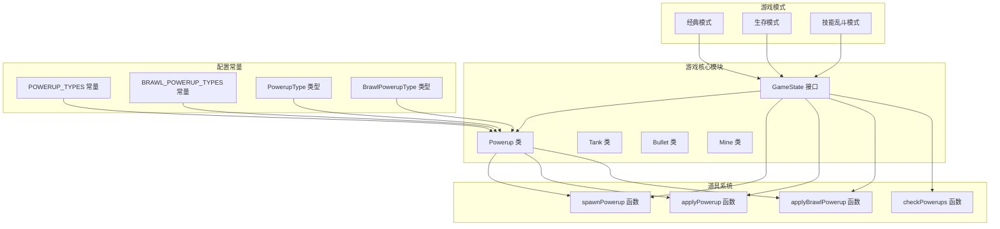

**图表来源**
- [useGame.ts:197-223](file://src/composables/useGame.ts#L197-L223)
- [useGame.ts:638-692](file://src/composables/useGame.ts#L638-L692)
- [game.ts:19-28](file://src/types/game.ts#L19-L28)

**章节来源**
- [useGame.ts:197-223](file://src/composables/useGame.ts#L197-L223)
- [game.ts:19-28](file://src/types/game.ts#L19-L28)

## 核心组件

### Powerup 类

Powerup 类是道具系统的基础数据结构，负责存储道具的位置、类型和生命周期信息：

```mermaid
classDiagram
class Powerup {
+number col
+number row
+number x
+number y
+PowerupType type
+boolean alive
+number timer
+number pulse
+constructor(col, row, type)
+update() void
}
class PowerupType {
<<enumeration>>
"shield"
"rapidfire"
"life"
"bomb"
}
class BrawlPowerupType {
<<enumeration>>
"doubleshot"
"tripleshot"
"pierce"
"shield"
"speedboost"
"mine"
"airstrike"
"bomb"
}
Powerup --> PowerupType : 使用
Powerup --> BrawlPowerupType : 使用
```

**图表来源**
- [useGame.ts:204-230](file://src/composables/useGame.ts#L204-L230)
- [game.ts:19-28](file://src/types/game.ts#L19-L28)

### 道具生成器

spawnPowerup 函数实现了复杂的道具生成算法，现已支持两种模式的不同生成策略：

**章节来源**
- [useGame.ts:868-884](file://src/composables/useGame.ts#L868-L884)
- [useGame.ts:886-902](file://src/composables/useGame.ts#L886-L902)

## 架构概览

道具系统采用事件驱动的设计模式，与游戏主循环无缝集成，并支持三种游戏模式：

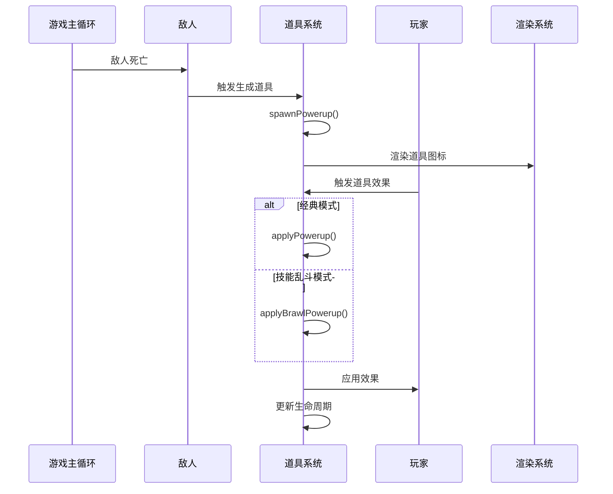

**图表来源**
- [useGame.ts:806-808](file://src/composables/useGame.ts#L806-L808)
- [useGame.ts:950-965](file://src/composables/useGame.ts#L950-L965)
- [useGame.ts:1016-1043](file://src/composables/useGame.ts#L1016-L1043)

## 详细组件分析

### spawnPowerup 函数分析

spawnPowerup 函数实现了复杂的道具生成算法，现已支持两种模式的不同生成策略：

#### 位置选择算法


**图表来源**
- [useGame.ts:868-884](file://src/composables/useGame.ts#L868-L884)

#### 生成概率控制

- **经典/生存模式**: 敌人死亡时有 25% 概率掉落道具
- **技能乱斗模式**: 敌人死亡时有 60% 概率掉落道具（更高的掉落率）
- **位置搜索**: 最多尝试 20 次找到合适位置
- **范围限制**: 在目标位置周围 5×5 格范围内寻找空地

#### 类型随机性

道具类型通过均匀分布随机选择：
- **经典模式**: 护盾 (shield)、速射 (rapidfire)、生命 (life)、炸弹 (bomb)
- **技能乱斗模式**: 双发 (doubleshot)、三向散射 (tripleshot)、穿透 (pierce)、护盾 (shield)、速度爆发 (speedboost)、地雷 (mine)、空袭 (airstrike)、核弹 (bomb)

**章节来源**
- [useGame.ts:868-884](file://src/composables/useGame.ts#L868-L884)
- [useGame.ts:806-808](file://src/composables/useGame.ts#L806-L808)

### applyPowerup 函数分析

applyPowerup 函数实现了经典模式四种道具效果的精确实现：

#### 护盾道具 (shield)

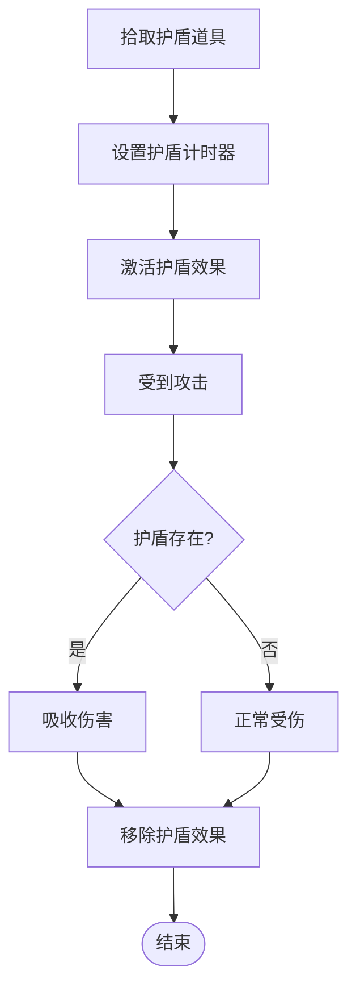

**图表来源**
- [useGame.ts:1016-1020](file://src/composables/useGame.ts#L1016-L1020)

#### 速射道具 (rapidfire)


**图表来源**
- [useGame.ts:1021-1024](file://src/composables/useGame.ts#L1021-L1024)

#### 生命道具 (life)

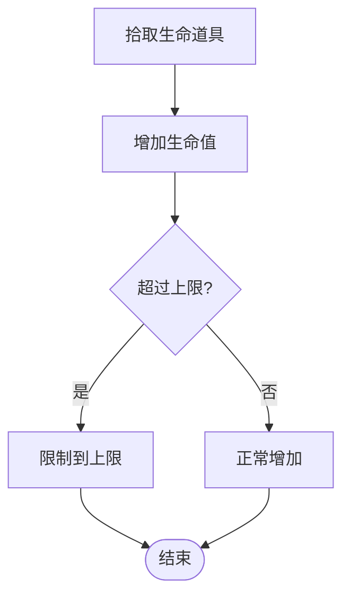

**图表来源**
- [useGame.ts:1025-1027](file://src/composables/useGame.ts#L1025-L1027)

#### 炸弹道具 (bomb)

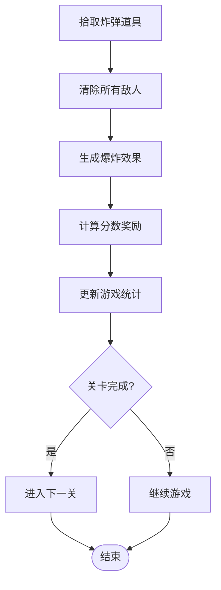

**图表来源**
- [useGame.ts:1028-1041](file://src/composables/useGame.ts#L1028-L1041)

**章节来源**
- [useGame.ts:1016-1043](file://src/composables/useGame.ts#L1016-L1043)

### 生命周期管理

道具的生命周期由 Powerup 类的 update 方法管理：

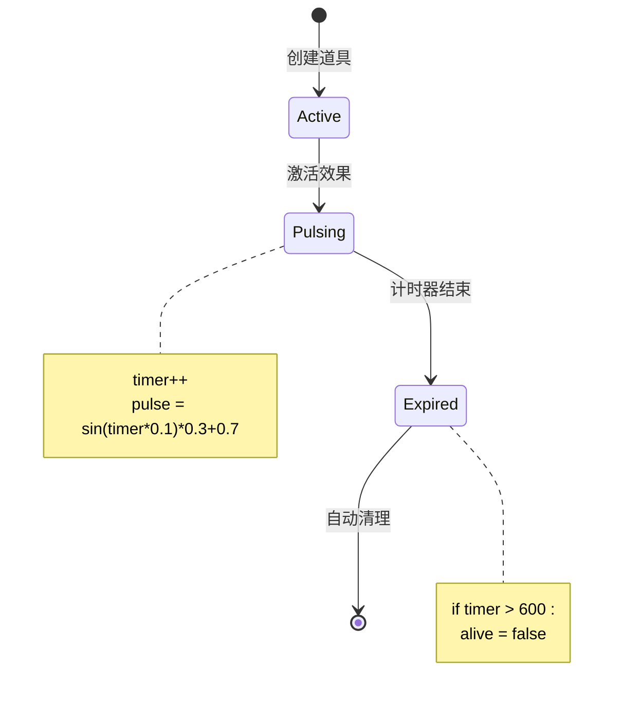

**图表来源**
- [useGame.ts:225-229](file://src/composables/useGame.ts#L225-L229)

**章节来源**
- [useGame.ts:225-229](file://src/composables/useGame.ts#L225-L229)

### 视觉效果系统

道具的视觉效果通过专门的绘制函数实现，现已支持八种不同道具的图标显示：

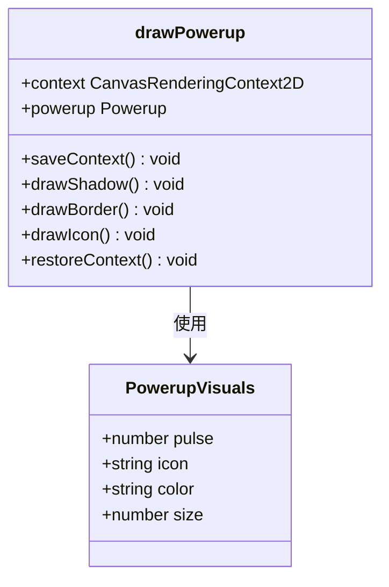

**图表来源**
- [useGame.ts:1456-1497](file://src/composables/useGame.ts#L1456-L1497)

**章节来源**
- [useGame.ts:1456-1497](file://src/composables/useGame.ts#L1456-L1497)

## 技能乱斗模式扩展

### applyBrawlPowerup 函数分析

applyBrawlPowerup 函数实现了技能乱斗模式八种新能力的精确实现：

#### 双发能力 (doubleshot)

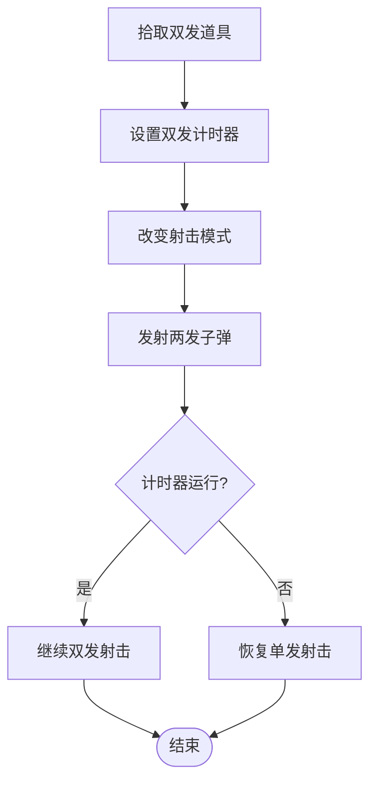

**图表来源**
- [useGame.ts:967-971](file://src/composables/useGame.ts#L967-L971)

#### 三向散射能力 (tripleshot)

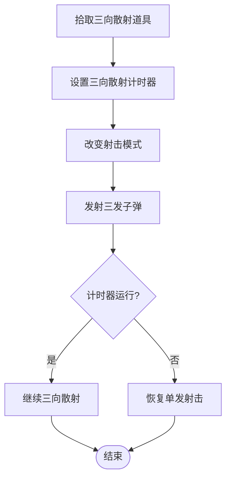

**图表来源**
- [useGame.ts:972-974](file://src/composables/useGame.ts#L972-L974)

#### 穿透能力 (pierce)

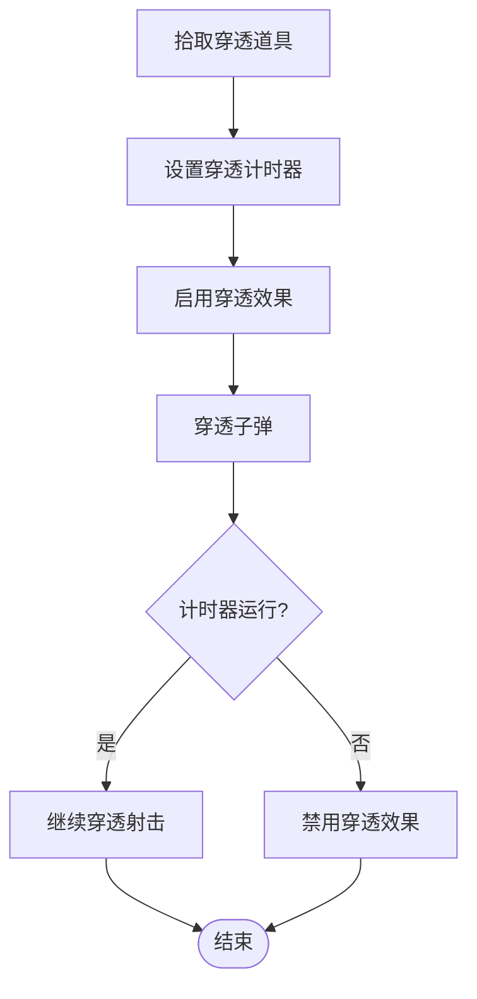

**图表来源**
- [useGame.ts:975-977](file://src/composables/useGame.ts#L975-L977)

#### 速度爆发能力 (speedboost)

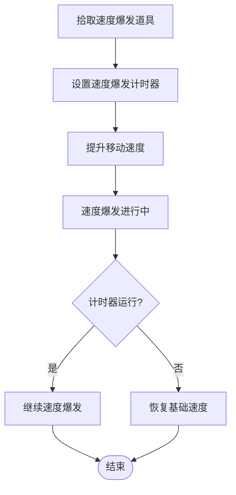

**图表来源**
- [useGame.ts:981-987](file://src/composables/useGame.ts#L981-L987)

#### 地雷能力 (mine)

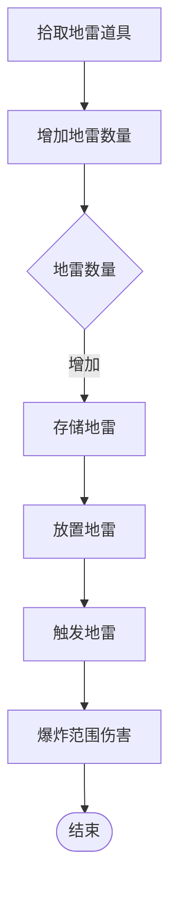

**图表来源**
- [useGame.ts:988-990](file://src/composables/useGame.ts#L988-L990)

#### 空袭能力 (airstrike)

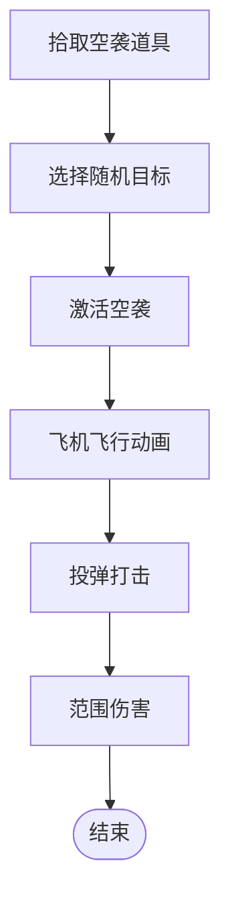

**图表来源**
- [useGame.ts:991-1000](file://src/composables/useGame.ts#L991-L1000)

#### 核弹能力 (bomb)

核弹能力复用经典模式的炸弹效果，但影响范围更广：

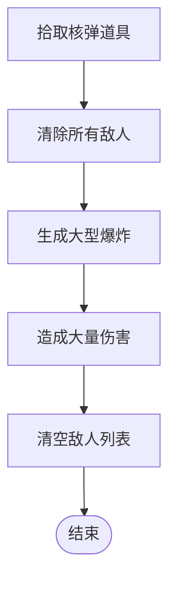

**图表来源**
- [useGame.ts:1001-1013](file://src/composables/useGame.ts#L1001-L1013)

**章节来源**
- [useGame.ts:967-1014](file://src/composables/useGame.ts#L967-L1014)

### 乱斗模式 HUD 系统

技能乱斗模式提供了专门的 HUD 来显示玩家的技能状态：

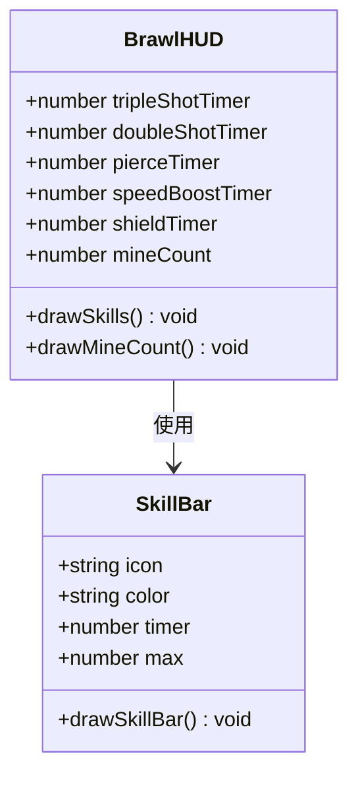

**图表来源**
- [useGame.ts:1524-1571](file://src/composables/useGame.ts#L1524-L1571)

**章节来源**
- [useGame.ts:1524-1571](file://src/composables/useGame.ts#L1524-L1571)

### 乱斗模式地图和生成机制

技能乱斗模式使用特殊的 17×17 地图，支持随机生成的乱斗道具：

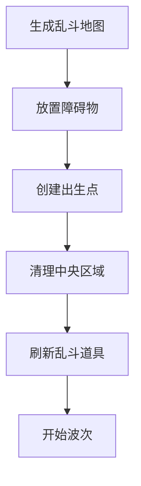

**图表来源**
- [useGame.ts:438-496](file://src/composables/useGame.ts#L438-L496)
- [useGame.ts:1805-1807](file://src/composables/useGame.ts#L1805-L1807)

**章节来源**
- [useGame.ts:438-496](file://src/composables/useGame.ts#L438-L496)
- [useGame.ts:1805-1807](file://src/composables/useGame.ts#L1805-L1807)

## 依赖关系分析

道具系统与其他游戏组件的依赖关系：

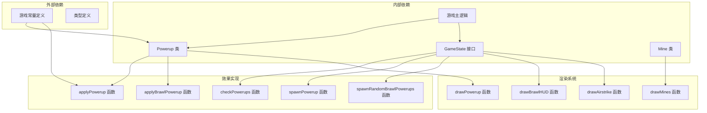

**图表来源**
- [useGame.ts:1-10](file://src/composables/useGame.ts#L1-L10)
- [game.ts:19-28](file://src/types/game.ts#L19-L28)

**章节来源**
- [useGame.ts:1-10](file://src/composables/useGame.ts#L1-L10)
- [game.ts:19-28](file://src/types/game.ts#L19-L28)

## 性能考虑

### 算法复杂度分析

- **spawnPowerup**: 平均 O(1)，最坏 O(n) 随机搜索
- **applyPowerup**: O(1) 常数时间操作
- **applyBrawlPowerup**: O(1) 常数时间操作（技能乱斗模式）
- **checkPowerups**: O(n) 线性扫描所有道具
- **Powerup.update**: O(1) 常数时间更新
- **spawnRandomBrawlPowerups**: O(k) 随机生成 k 个道具

### 内存管理

- 道具对象使用垃圾回收自动管理
- 生命周期结束后自动清理
- 最大存活时间为 600 帧（约 10 秒）
- 乱斗模式地雷对象独立管理

### 渲染优化

- 使用 Canvas 2D API 进行高效渲染
- 道具采用脉冲动画效果
- 乱斗模式 HUD 使用半透明背景
- 最大同时存在 4 个道具，乱斗模式可同时存在多个地雷

## 故障排除指南

### 常见问题及解决方案

#### 道具无法生成

**症状**: 敌人死亡后没有掉落道具
**可能原因**:
- 周围 5×5 格范围内没有空地
- 地图边界限制导致位置计算错误
- 乱斗模式掉落率过高导致生成失败

**解决方案**:
- 检查地图布局，确保有足够的空地
- 调整生成算法的搜索范围
- 验证掉落率配置是否正确

#### 道具效果不生效

**症状**: 拾取道具后无任何变化
**可能原因**:
- applyPowerup 或 applyBrawlPowerup 函数未正确执行
- 游戏状态变量未更新
- 模式切换导致效果函数调用错误

**解决方案**:
- 验证道具类型判断逻辑
- 检查 GameState 中对应状态变量
- 确认当前游戏模式下的效果函数

#### 视觉效果异常

**症状**: 道具图标显示不正确或闪烁
**可能原因**:
- Canvas 上下文状态未正确保存/恢复
- 全局透明度设置冲突
- 乱斗模式 HUD 渲染顺序问题

**解决方案**:
- 确保正确的上下文状态管理
- 检查透明度和阴影设置
- 验证 HUD 渲染的层级顺序

#### 乱斗模式技能失效

**症状**: 技能乱斗模式的特殊能力无法使用
**可能原因**:
- 技能计时器未正确更新
- 子弹射击模式未正确切换
- 地雷放置逻辑错误

**解决方案**:
- 检查技能计时器的更新逻辑
- 验证射击模式切换的条件判断
- 确认地雷放置的网格坐标计算

**章节来源**
- [useGame.ts:868-902](file://src/composables/useGame.ts#L868-L902)
- [useGame.ts:950-1014](file://src/composables/useGame.ts#L950-L1014)
- [useGame.ts:1456-1571](file://src/composables/useGame.ts#L1456-L1571)

## 结论

道具系统通过精心设计的生成算法和效果实现，为游戏提供了丰富的策略元素。系统现已扩展为支持三种游戏模式，具有以下特点：

1. **双模式支持**: 经典模式的四种传统道具和技能乱斗模式的八种新能力
2. **平衡性设计**: 不同模式采用不同的掉落率和效果强度，确保游戏平衡
3. **可扩展性**: 清晰的接口设计便于添加新的道具类型和能力
4. **性能优化**: 高效的数据结构和算法确保流畅的游戏体验
5. **视觉反馈**: 完善的动画效果和 HUD 显示增强了玩家的游戏体验

该系统为游戏的核心玩法提供了重要的支撑，通过合理的概率控制和效果实现，为玩家创造了丰富多样的游戏策略选择。技能乱斗模式的引入大大增加了游戏的策略深度和可玩性，为不同类型的玩家提供了多样化的游戏体验。