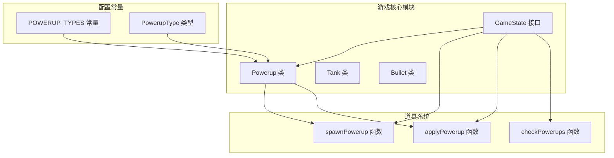
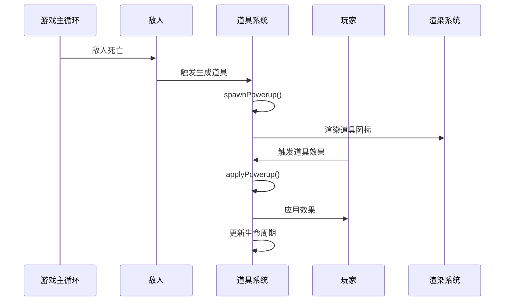
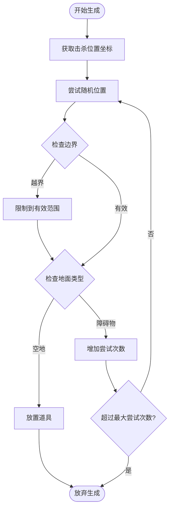
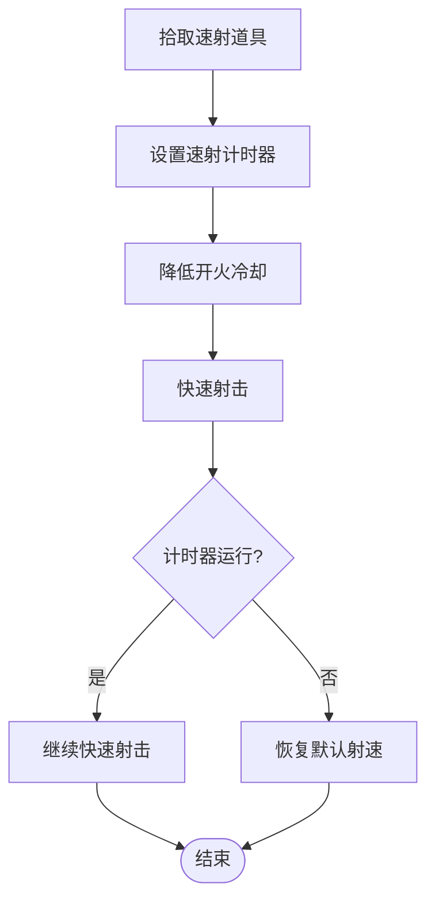
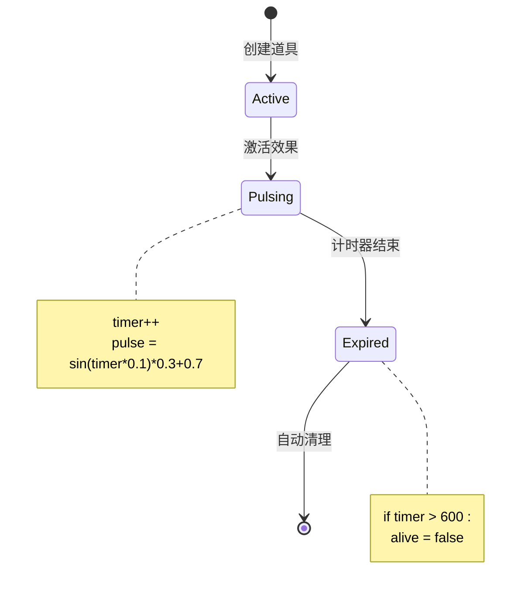
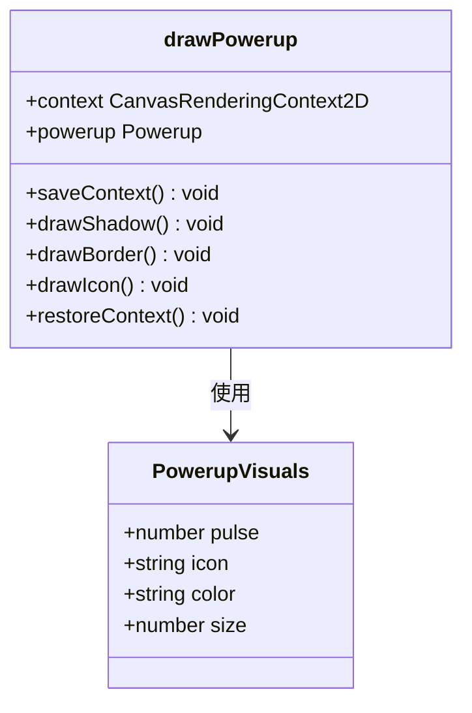
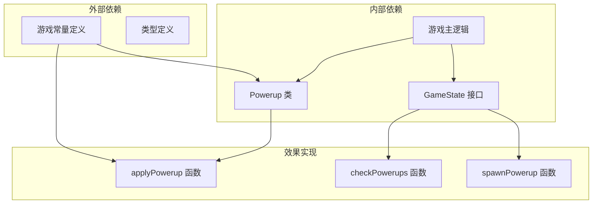

# 道具系统

<cite>
**本文档引用的文件**
- [useGame.ts](file://src/composables/useGame.ts)
- [game.ts](file://src/types/game.ts)
</cite>

## 目录
1. [简介](#简介)
2. [项目结构](#项目结构)
3. [核心组件](#核心组件)
4. [架构概览](#架构概览)
5. [详细组件分析](#详细组件分析)
6. [依赖关系分析](#依赖关系分析)
7. [性能考虑](#性能考虑)
8. [故障排除指南](#故障排除指南)
9. [结论](#结论)

## 简介

道具系统是游戏中的重要机制，负责为玩家提供临时增强效果。本文档深入分析了游戏中的道具生成算法、效果实现机制以及生命周期管理。系统包含四种类型的道具：护盾、速射、生命和炸弹，每种道具都提供独特的游戏体验增强。

## 项目结构

道具系统位于游戏的核心逻辑中，与游戏状态管理和渲染系统紧密集成：



**图表来源**
- [useGame.ts:197-223](file://src/composables/useGame.ts#L197-L223)
- [useGame.ts:638-692](file://src/composables/useGame.ts#L638-L692)
- [game.ts:19-21](file://src/types/game.ts#L19-L21)

**章节来源**
- [useGame.ts:197-223](file://src/composables/useGame.ts#L197-L223)
- [game.ts:19-21](file://src/types/game.ts#L19-L21)

## 核心组件

### Powerup 类

Powerup 类是道具系统的基础数据结构，负责存储道具的位置、类型和生命周期信息：

```mermaid
classDiagram
class Powerup {
+number col
+number row
+number x
+number y
+PowerupType type
+boolean alive
+number timer
+number pulse
+constructor(col, row, type)
+update() void
}
class PowerupType {
<<enumeration>>
"shield"
"rapidfire"
"life"
"bomb"
}
Powerup --> PowerupType : 使用
```

**图表来源**
- [useGame.ts:197-223](file://src/composables/useGame.ts#L197-L223)
- [game.ts:19-21](file://src/types/game.ts#L19-L21)

### 道具生成器

spawnPowerup 函数实现了复杂的道具生成算法，确保道具能够正确放置在游戏环境中。

**章节来源**
- [useGame.ts:197-223](file://src/composables/useGame.ts#L197-L223)
- [useGame.ts:638-650](file://src/composables/useGame.ts#L638-L650)

## 架构概览

道具系统采用事件驱动的设计模式，与游戏主循环无缝集成：



**图表来源**
- [useGame.ts:584](file://src/composables/useGame.ts#L584)
- [useGame.ts:638-692](file://src/composables/useGame.ts#L638-L692)
- [useGame.ts:1025-1059](file://src/composables/useGame.ts#L1025-L1059)

## 详细组件分析

### spawnPowerup 函数分析

spawnPowerup 函数实现了复杂的道具生成算法，包含以下关键特性：

#### 位置选择算法



**图表来源**
- [useGame.ts:638-650](file://src/composables/useGame.ts#L638-L650)

#### 生成概率控制

- **基础生成率**: 敌人死亡时有 25% 概率掉落道具
- **位置搜索**: 最多尝试 20 次找到合适位置
- **范围限制**: 在目标位置周围 5×5 格范围内寻找空地

#### 类型随机性

道具类型通过均匀分布随机选择：
- 护盾 (shield)
- 速射 (rapidfire)  
- 生命 (life)
- 炸弹 (bomb)

**章节来源**
- [useGame.ts:638-650](file://src/composables/useGame.ts#L638-L650)
- [useGame.ts:584](file://src/composables/useGame.ts#L584)

### applyPowerup 函数分析

applyPowerup 函数实现了四种道具效果的精确实现：

#### 护盾道具 (shield)


**图表来源**
- [useGame.ts:665-669](file://src/composables/useGame.ts#L665-L669)

#### 速射道具 (rapidfire)



**图表来源**
- [useGame.ts:670-673](file://src/composables/useGame.ts#L670-L673)

#### 生命道具 (life)


**图表来源**
- [useGame.ts:674-676](file://src/composables/useGame.ts#L674-L676)

#### 炸弹道具 (bomb)


**图表来源**
- [useGame.ts:677-690](file://src/composables/useGame.ts#L677-L690)

**章节来源**
- [useGame.ts:665-692](file://src/composables/useGame.ts#L665-L692)

### 生命周期管理

道具的生命周期由 Powerup 类的 update 方法管理：



**图表来源**
- [useGame.ts:218-222](file://src/composables/useGame.ts#L218-L222)

**章节来源**
- [useGame.ts:218-222](file://src/composables/useGame.ts#L218-L222)

### 视觉效果系统

道具的视觉效果通过专门的绘制函数实现：



**图表来源**
- [useGame.ts:1025-1059](file://src/composables/useGame.ts#L1025-L1059)

**章节来源**
- [useGame.ts:1025-1059](file://src/composables/useGame.ts#L1025-L1059)

## 依赖关系分析

道具系统与其他游戏组件的依赖关系：



**图表来源**
- [useGame.ts:1-10](file://src/composables/useGame.ts#L1-L10)
- [game.ts:19-21](file://src/types/game.ts#L19-L21)

**章节来源**
- [useGame.ts:1-10](file://src/composables/useGame.ts#L1-L10)
- [game.ts:19-21](file://src/types/game.ts#L19-L21)

## 性能考虑

### 算法复杂度分析

- **spawnPowerup**: 平均 O(1)，最坏 O(n) 随机搜索
- **applyPowerup**: O(1) 常数时间操作
- **checkPowerups**: O(n) 线性扫描所有道具
- **Powerup.update**: O(1) 常数时间更新

### 内存管理

- 道具对象使用垃圾回收自动管理
- 生命周期结束后自动清理
- 最大存活时间为 600 帧（约 10 秒）

### 渲染优化

- 使用 Canvas 2D API 进行高效渲染
- 道具采用脉冲动画效果
- 最大同时存在 4 个道具

## 故障排除指南

### 常见问题及解决方案

#### 道具无法生成

**症状**: 敌人死亡后没有掉落道具
**可能原因**:
- 周围 5×5 格范围内没有空地
- 地图边界限制导致位置计算错误

**解决方案**:
- 检查地图布局，确保有足够的空地
- 调整生成算法的搜索范围

#### 道具效果不生效

**症状**: 拾取道具后无任何变化
**可能原因**:
- applyPowerup 函数未正确执行
- 游戏状态变量未更新

**解决方案**:
- 验证道具类型判断逻辑
- 检查 GameState 中对应状态变量

#### 视觉效果异常

**症状**: 道具图标显示不正确或闪烁
**可能原因**:
- Canvas 上下文状态未正确保存/恢复
- 全局透明度设置冲突

**解决方案**:
- 确保正确的上下文状态管理
- 检查透明度和阴影设置

**章节来源**
- [useGame.ts:638-692](file://src/composables/useGame.ts#L638-L692)
- [useGame.ts:1025-1059](file://src/composables/useGame.ts#L1025-L1059)

## 结论

道具系统通过精心设计的生成算法和效果实现，为游戏提供了丰富的策略元素。系统具有以下特点：

1. **平衡性设计**: 均匀的概率分布确保四种道具的出现频率相等
2. **可扩展性**: 清晰的接口设计便于添加新的道具类型
3. **性能优化**: 高效的数据结构和算法确保流畅的游戏体验
4. **视觉反馈**: 完善的动画效果增强了玩家的游戏体验

该系统为游戏的核心玩法提供了重要的支撑，通过合理的概率控制和效果实现，为玩家创造了丰富多样的游戏策略选择。