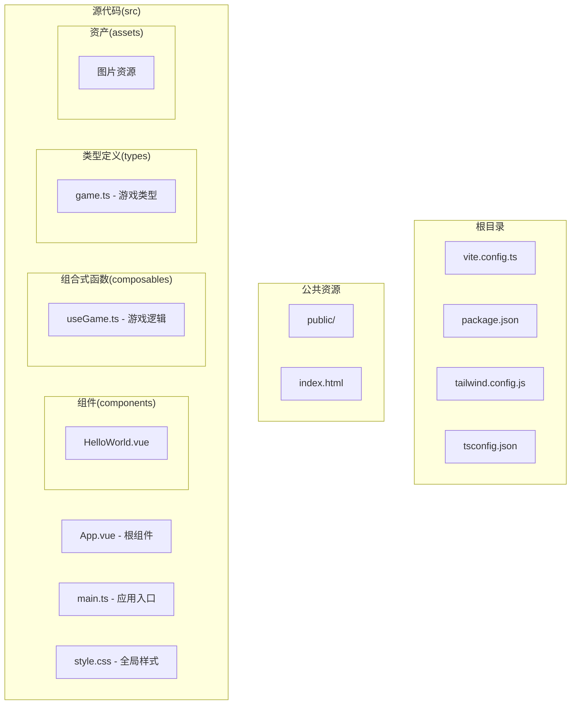
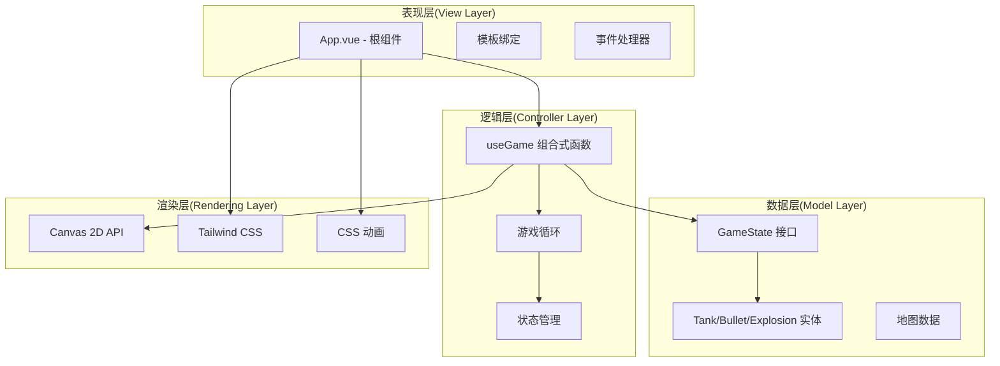
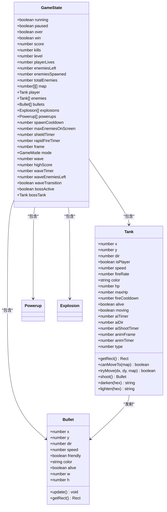
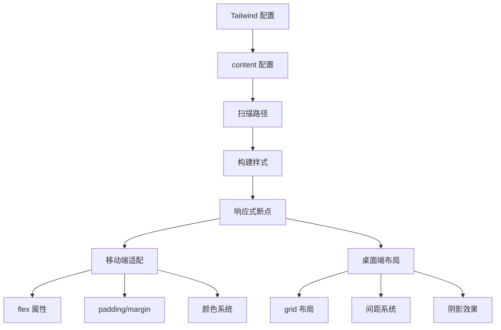
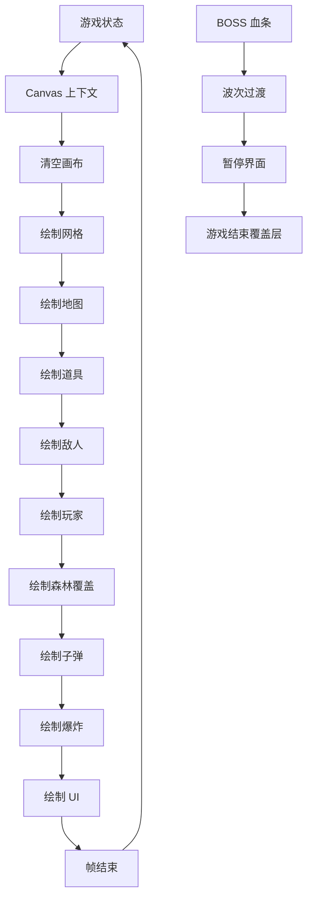
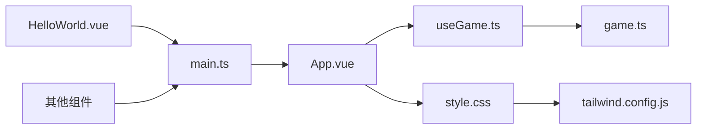

# 组件系统

<cite>
**本文档引用的文件**
- [App.vue](file://src/App.vue)
- [main.ts](file://src/main.ts)
- [useGame.ts](file://src/composables/useGame.ts)
- [game.ts](file://src/types/game.ts)
- [style.css](file://src/style.css)
- [tailwind.config.js](file://tailwind.config.js)
- [HelloWorld.vue](file://src/components/HelloWorld.vue)
- [package.json](file://package.json)
</cite>

## 目录
1. [简介](#简介)
2. [项目结构](#项目结构)
3. [核心组件](#核心组件)
4. [架构概览](#架构概览)
5. [详细组件分析](#详细组件分析)
6. [依赖关系分析](#依赖关系分析)
7. [性能考虑](#性能考虑)
8. [故障排除指南](#故障排除指南)
9. [结论](#结论)

## 简介

Reimagined Journey 是一个基于 Vue 3 的坦克大战游戏，采用现代前端技术栈构建。该项目展示了如何在 Vue 应用中实现复杂的 2D 游戏逻辑，包括响应式状态管理、Canvas 渲染、游戏循环和组件通信机制。

该系统的核心特色包括：
- 使用 Vue 3 Composition API 实现游戏状态管理
- 结合 Canvas 2D API 进行高性能图形渲染
- 实现经典模式和生存模式两种游戏玩法
- 通过 Tailwind CSS 实现响应式设计
- 提供完整的组件通信和状态管理模式

## 项目结构

项目采用模块化组织方式，主要目录结构如下：



**图表来源**
- [main.ts:1-6](file://src/main.ts#L1-L6)
- [App.vue:1-305](file://src/App.vue#L1-L305)

**章节来源**
- [main.ts:1-6](file://src/main.ts#L1-L6)
- [package.json:1-26](file://package.json#L1-L26)

## 核心组件

### App.vue - 根组件

App.vue 是整个应用的根组件，负责协调游戏界面和逻辑层。它实现了以下关键功能：

#### 状态管理
- **游戏状态**: 通过 `useGame` 组合式函数管理游戏状态
- **UI 状态**: 控制覆盖层、波次过渡、等级横幅等界面元素
- **响应式数据**: 使用 `ref` 和 `reactive` 管理可观察状态

#### 生命周期管理
- **挂载处理**: 在 `onMounted` 钩子中初始化 Canvas
- **状态监听**: 使用 `watch` 监听游戏结束状态自动显示覆盖层
- **键盘事件**: 处理游戏控制和暂停功能

#### 组件通信
- **父子通信**: 通过 props 和事件向子组件传递数据
- **状态共享**: 将游戏状态暴露给模板进行绑定
- **事件处理**: 处理用户交互如开始游戏、重启等

**章节来源**
- [App.vue:1-305](file://src/App.vue#L1-L305)
- [useGame.ts:264-301](file://src/composables/useGame.ts#L264-L301)

### useGame.ts - 游戏逻辑组合式函数

这是应用的核心逻辑模块，实现了完整的坦克大战游戏引擎：

#### 游戏实体类
- **Tank 类**: 玩家坦克和敌方坦克的统一表示
- **Bullet 类**: 子弹实体，包含碰撞检测
- **Explosion 类**: 爆炸效果动画
- **Powerup 类**: 道具系统

#### 游戏状态管理
- **GameState 接口**: 定义完整的游戏状态结构
- **响应式状态**: 使用 `reactive` 创建可观察的游戏对象
- **状态初始化**: `initState` 函数管理游戏重置逻辑

#### 游戏循环
- **update 函数**: 主更新循环，处理游戏逻辑
- **render 函数**: Canvas 渲染循环
- **gameLoop**: 动画帧调度

#### 游戏模式支持
- **经典模式**: 15 关卡挑战，击败 BOSS 通关
- **生存模式**: 无限波次挑战，追求最高分数
- **波次管理**: 自动波次生成和 BOSS 挑战

**章节来源**
- [useGame.ts:16-138](file://src/composables/useGame.ts#L16-L138)
- [useGame.ts:229-262](file://src/composables/useGame.ts#L229-L262)
- [useGame.ts:731-792](file://src/composables/useGame.ts#L731-L792)

### game.ts - 类型定义

提供完整的 TypeScript 类型定义，确保类型安全：

#### 游戏常量
- **地图尺寸**: 13x13 格子，每个格子 48x48 像素
- **方向常量**: 上、右、下、左四个方向
- **地形类型**: 砖墙、钢铁、水、森林、基地等

#### 游戏模式
- **GameMode 类型**: 'classic' | 'survival'
- **PowerupType 类型**: 防护、快速射击、生命、炸弹四种道具

#### 地图生成
- **预设关卡**: 3 个固定关卡地图
- **随机生成**: 16-30 关的程序化地图生成
- **生存模式地图**: 对称开放的地图设计

**章节来源**
- [game.ts:1-300](file://src/types/game.ts#L1-L300)

## 架构概览

系统采用分层架构设计，清晰分离关注点：



**图表来源**
- [App.vue:1-305](file://src/App.vue#L1-L305)
- [useGame.ts:264-1282](file://src/composables/useGame.ts#L264-L1282)

### 组件通信机制

系统实现了多种组件通信模式：

#### 父子组件通信
- **props 传递**: App.vue 向子组件传递游戏状态
- **事件回调**: 子组件通过事件向父组件报告状态变化
- **模板引用**: 直接访问子组件的 DOM 元素

#### 状态共享
- **组合式函数**: `useGame` 提供全局可访问的游戏状态
- **响应式绑定**: Vue 的响应式系统自动更新视图
- **状态持久化**: 使用 localStorage 保存生存模式最高分

#### 事件处理模式
- **键盘事件**: 全局键盘监听器处理游戏控制
- **鼠标事件**: 覆盖层按钮点击处理
- **生命周期事件**: 组件挂载和卸载时的资源管理

**章节来源**
- [App.vue:19-44](file://src/App.vue#L19-L44)
- [useGame.ts:1244-1265](file://src/composables/useGame.ts#L1244-L1265)

## 详细组件分析

### 游戏状态管理系统

#### GameState 结构设计



**图表来源**
- [useGame.ts:229-262](file://src/composables/useGame.ts#L229-L262)
- [useGame.ts:16-138](file://src/composables/useGame.ts#L16-L138)
- [useGame.ts:140-172](file://src/composables/useGame.ts#L140-L172)

#### 游戏循环流程

```mermaid
sequenceDiagram
participant App as App.vue
participant Game as useGame
participant Canvas as Canvas
participant Loop as 游戏循环
App->>Game : startGame(mode)
Game->>Loop : gameLoop()
Loop->>Game : update()
Game->>Game : updatePlayer()
Game->>Game : updateAI(enemies)
Game->>Game : checkCollisions()
Game->>Game : spawnPowerups()
Game->>Canvas : render()
Canvas->>Canvas : drawMap()
Canvas->>Canvas : drawEntities()
Loop->>Loop : requestAnimationFrame()
Note over App,Canvas : 每帧执行一次更新和渲染
```

**图表来源**
- [useGame.ts:1155-1160](file://src/composables/useGame.ts#L1155-L1160)
- [useGame.ts:731-792](file://src/composables/useGame.ts#L731-L792)
- [useGame.ts:1071-1153](file://src/composables/useGame.ts#L1071-L1153)

### 响应式设计实现

#### Tailwind CSS 集成

项目使用 Tailwind CSS 实现现代化的响应式设计：



**图表来源**
- [tailwind.config.js:1-12](file://tailwind.config.js#L1-L12)
- [style.css:1-439](file://src/style.css#L1-L439)

#### 自适应布局策略

系统采用以下自适应策略：

1. **容器布局**: 使用 `flex` 布局实现主容器的自适应
2. **侧边栏固定宽度**: 侧边栏固定 160px 宽度，确保内容区域自适应
3. **响应式断点**: 利用 Tailwind 的响应式前缀实现不同屏幕尺寸的适配
4. **弹性图片**: 图片使用 `max-width: 100%` 确保在小屏幕上正确缩放

**章节来源**
- [style.css:21-41](file://src/style.css#L21-L41)
- [tailwind.config.js:3-6](file://tailwind.config.js#L3-L6)

### Canvas 渲染系统

#### 渲染管线设计



**图表来源**
- [useGame.ts:1071-1153](file://src/composables/useGame.ts#L1071-L1153)
- [useGame.ts:828-920](file://src/composables/useGame.ts#L828-L920)

#### 地形渲染系统

系统实现了多种地形类型的渲染：

| 地形类型 | 颜色方案 | 特殊效果 | 用途 |
|---------|---------|---------|------|
| 空地 | #0d2840 | 基础网格 | 可通行区域 |
| 砖墙 | 棕色渐变 | 砖块纹理 | 可破坏障碍 |
| 钢墙 | 灰蓝色渐变 | 金属质感 | 不可破坏障碍 |
| 水域 | 蓝色渐变 | 波浪动画 | 阻挡视线 |
| 森林 | 绿色渐变 | 树叶遮挡 | 隐藏效果 |
| 基地 | 金色边框 | 星形图标 | 游戏目标 |

**章节来源**
- [useGame.ts:828-920](file://src/composables/useGame.ts#L828-L920)
- [useGame.ts:1061-1069](file://src/composables/useGame.ts#L1061-L1069)

## 依赖关系分析

### 技术栈依赖

```mermaid
graph TB
subgraph "运行时依赖"
A[vue ^3.5.30]
end
subgraph "开发依赖"
B[@vitejs/plugin-vue ^6.0.5]
C[tailwindcss ^3.4.19]
D[typescript ~5.9.3]
E[vite ^8.0.1]
F[autoprefixer ^10.4.27]
G[postcss ^8.5.8]
end
subgraph "构建工具"
H[vue-tsc]
I[tsconfig]
end
A --> B
C --> D
E --> F
G --> H
I --> J[开发环境]
```

**图表来源**
- [package.json:11-24](file://package.json#L11-L24)

### 模块依赖关系

系统模块之间的依赖关系如下：



**图表来源**
- [main.ts:1-6](file://src/main.ts#L1-L6)
- [App.vue:1-10](file://src/App.vue#L1-L10)
- [useGame.ts:1-10](file://src/composables/useGame.ts#L1-L10)

**章节来源**
- [package.json:1-26](file://package.json#L1-L26)

## 性能考虑

### 游戏性能优化

#### 渲染优化
- **Canvas 缓存**: 使用 Canvas 2D API 进行硬件加速渲染
- **帧率控制**: 使用 `requestAnimationFrame` 实现 60FPS 渲染
- **对象池**: 复用游戏对象避免频繁内存分配
- **批量更新**: 合并多个状态变更减少重绘次数

#### 内存管理
- **垃圾回收**: 及时清理死亡实体和过期效果
- **引用管理**: 使用弱引用避免循环引用
- **资源释放**: 组件卸载时释放 Canvas 上下文

#### 算法优化
- **碰撞检测**: 使用四叉树优化大量实体的碰撞检测
- **空间分区**: 将游戏世界划分为网格提高查询效率
- **延迟加载**: 按需加载游戏资源

### 响应式性能

#### Vue 3 优化
- **组合式 API**: 减少模板复杂度，提高渲染性能
- **细粒度响应**: 精确控制响应式依赖，避免不必要的更新
- **虚拟 DOM**: 仅更新变化的部分

#### CSS 优化
- **原子化样式**: Tailwind 原子类减少 CSS 文件大小
- **按需加载**: 只构建使用的样式类
- **CSS 压缩**: 生产环境自动压缩 CSS

## 故障排除指南

### 常见问题及解决方案

#### 游戏无法启动
1. **检查 Canvas 支持**: 确保浏览器支持 Canvas 2D API
2. **验证依赖安装**: 运行 `npm install` 确保所有依赖正确安装
3. **检查 TypeScript 配置**: 确认 tsconfig 文件配置正确

#### 性能问题
1. **降低实体数量**: 减少同时存在的敌人和子弹数量
2. **优化渲染**: 检查是否有不必要的重绘操作
3. **内存泄漏**: 确保组件卸载时正确清理事件监听器

#### 样式问题
1. **Tailwind 配置**: 检查 tailwind.config.js 中的 content 路径
2. **CSS 优先级**: 避免内联样式覆盖 Tailwind 类
3. **响应式断点**: 确认断点设置符合预期

**章节来源**
- [useGame.ts:1259-1265](file://src/composables/useGame.ts#L1259-L1265)
- [tailwind.config.js:1-12](file://tailwind.config.js#L1-L12)

### 调试技巧

#### 开发者工具
- **Vue DevTools**: 分析组件树和状态变化
- **浏览器性能面板**: 监控帧率和内存使用
- **网络面板**: 检查资源加载情况

#### 日志调试
- **状态日志**: 记录关键状态变化
- **性能日志**: 监控渲染时间和更新频率
- **错误捕获**: 捕获并记录异常信息

## 结论

Reimagined Journey 展示了一个成熟的 Vue 3 游戏应用架构，成功结合了现代前端技术的最佳实践：

### 技术亮点
- **架构清晰**: 分层设计使代码易于维护和扩展
- **性能优秀**: Canvas 渲染和响应式优化确保流畅体验
- **类型安全**: 完整的 TypeScript 类型定义保证代码质量
- **响应式设计**: Tailwind CSS 实现现代化的自适应布局

### 扩展建议
1. **模块化重构**: 将大型组件拆分为更小的功能模块
2. **测试覆盖**: 添加单元测试和集成测试确保代码质量
3. **性能监控**: 实现运行时性能监控和分析
4. **多平台支持**: 考虑 WebAssembly 或原生应用移植

这个项目为 Vue 3 游戏开发提供了优秀的参考范例，展示了如何在现代前端环境中实现复杂的交互式应用。