# 部署指南

<cite>
**本文档引用的文件**
- [vite.config.ts](file://vite.config.ts)
- [package.json](file://package.json)
- [tailwind.config.js](file://tailwind.config.js)
- [postcss.config.js](file://postcss.config.js)
- [index.html](file://index.html)
- [src/main.ts](file://src/main.ts)
- [src/App.vue](file://src/App.vue)
- [src/style.css](file://src/style.css)
- [src/composables/useGame.ts](file://src/composables/useGame.ts)
- [src/types/game.ts](file://src/types/game.ts)
- [tsconfig.json](file://tsconfig.json)
- [tsconfig.app.json](file://tsconfig.app.json)
- [tsconfig.node.json](file://tsconfig.node.json)
</cite>

## 目录
1. [简介](#简介)
2. [项目结构](#项目结构)
3. [核心组件](#核心组件)
4. [架构概览](#架构概览)
5. [详细组件分析](#详细组件分析)
6. [依赖分析](#依赖分析)
7. [性能考虑](#性能考虑)
8. [故障排除指南](#故障排除指南)
9. [结论](#结论)
10. [附录](#附录)

## 简介

Reimagined Journey 是一个基于 Vue 3 和 TypeScript 的单页应用程序，使用 Vite 作为构建工具。该项目采用现代前端开发技术栈，包括：

- **框架**: Vue 3 (Composition API + SFC)
- **语言**: TypeScript
- **构建工具**: Vite
- **样式**: TailwindCSS + 自定义 CSS
- **开发环境**: Node.js 18+

项目特点：
- 单页面应用架构
- 实时渲染的 Canvas 游戏
- 响应式设计
- 类型安全的开发体验
- 高性能的构建流程

## 项目结构

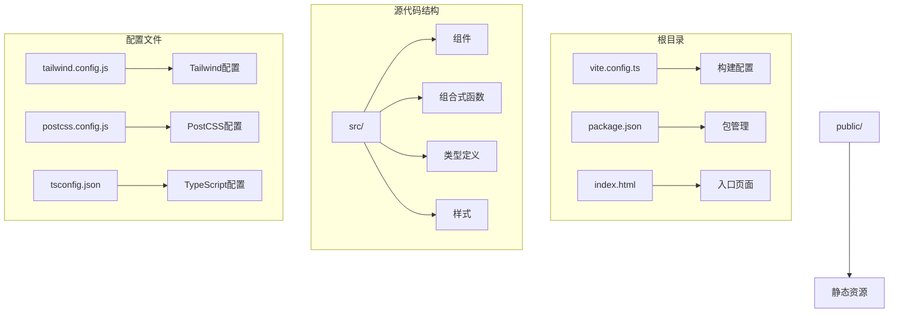

**图表来源**
- [vite.config.ts:1-8](file://vite.config.ts#L1-L8)
- [package.json:1-26](file://package.json#L1-L26)
- [index.html:1-14](file://index.html#L1-L14)

**章节来源**
- [vite.config.ts:1-8](file://vite.config.ts#L1-L8)
- [package.json:1-26](file://package.json#L1-L26)
- [index.html:1-14](file://index.html#L1-L14)

## 核心组件

### 构建系统配置

项目使用 Vite 作为主要构建工具，配置相对简洁但功能完整：

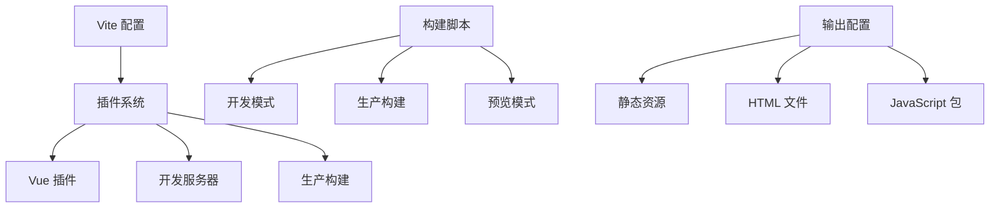

**图表来源**
- [vite.config.ts:5-7](file://vite.config.ts#L5-L7)
- [package.json:6-10](file://package.json#L6-L10)

### 样式系统架构

项目采用多层次的样式架构：

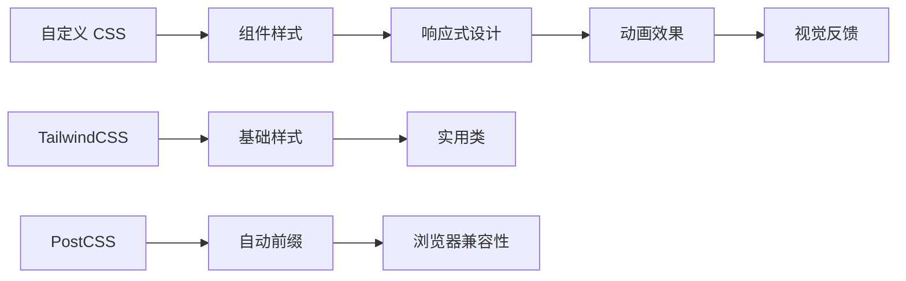

**图表来源**
- [tailwind.config.js:1-12](file://tailwind.config.js#L1-L12)
- [postcss.config.js:1-7](file://postcss.config.js#L1-L7)
- [src/style.css:1-439](file://src/style.css#L1-L439)

**章节来源**
- [vite.config.ts:1-8](file://vite.config.ts#L1-L8)
- [tailwind.config.js:1-12](file://tailwind.config.js#L1-L12)
- [postcss.config.js:1-7](file://postcss.config.js#L1-L7)
- [src/style.css:1-439](file://src/style.css#L1-L439)

## 架构概览

### 应用架构图

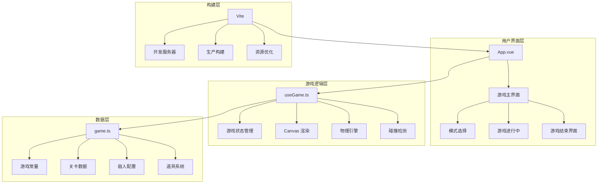

**图表来源**
- [src/App.vue:1-305](file://src/App.vue#L1-L305)
- [src/composables/useGame.ts:1-800](file://src/composables/useGame.ts#L1-L800)
- [src/types/game.ts:1-300](file://src/types/game.ts#L1-L300)

### 数据流架构

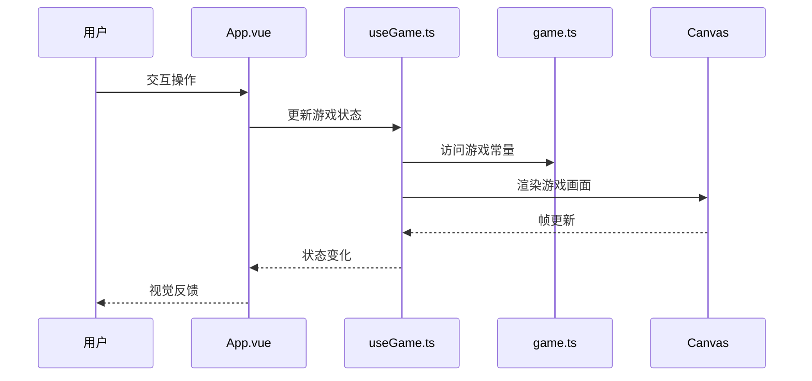

**图表来源**
- [src/App.vue:46-50](file://src/App.vue#L46-L50)
- [src/composables/useGame.ts:264-301](file://src/composables/useGame.ts#L264-L301)
- [src/types/game.ts:1-300](file://src/types/game.ts#L1-L300)

**章节来源**
- [src/App.vue:1-305](file://src/App.vue#L1-L305)
- [src/composables/useGame.ts:1-800](file://src/composables/useGame.ts#L1-L800)
- [src/types/game.ts:1-300](file://src/types/game.ts#L1-L300)

## 详细组件分析

### 游戏主组件分析

App.vue 作为应用的核心组件，实现了完整的用户界面逻辑：

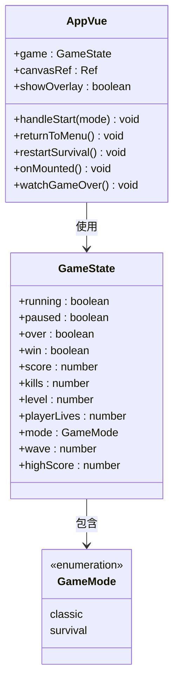

**图表来源**
- [src/App.vue:1-305](file://src/App.vue#L1-L305)
- [src/types/game.ts:23-24](file://src/types/game.ts#L23-L24)

### 游戏状态管理

useGame.ts 提供了复杂的游戏状态管理系统：

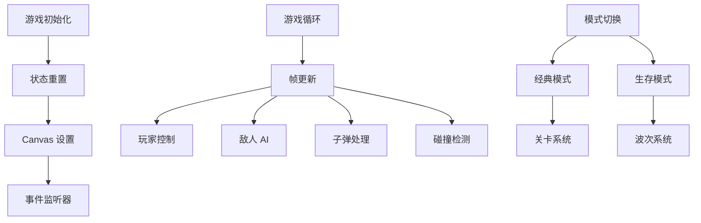

**图表来源**
- [src/composables/useGame.ts:264-301](file://src/composables/useGame.ts#L264-L301)
- [src/composables/useGame.ts:731-792](file://src/composables/useGame.ts#L731-L792)

### 样式系统实现

项目采用 TailwindCSS 与自定义 CSS 相结合的方式：

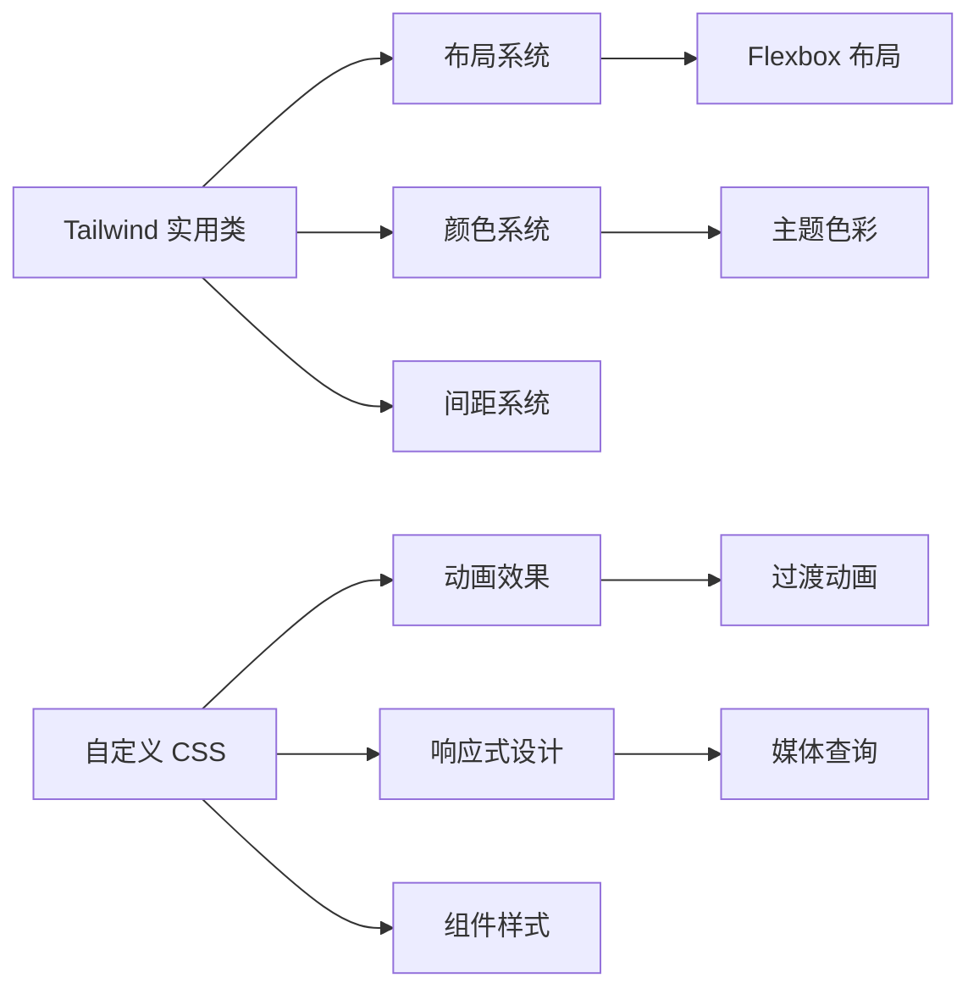

**图表来源**
- [src/style.css:1-439](file://src/style.css#L1-L439)
- [tailwind.config.js:1-12](file://tailwind.config.js#L1-L12)

**章节来源**
- [src/App.vue:1-305](file://src/App.vue#L1-L305)
- [src/composables/useGame.ts:1-800](file://src/composables/useGame.ts#L1-L800)
- [src/style.css:1-439](file://src/style.css#L1-L439)

## 依赖分析

### 开发依赖关系

```mermaid
graph TB
subgraph "运行时依赖"
A[Vue 3] --> B[核心框架]
C[Vue 3 Canvas] --> D[渲染支持]
end
subgraph "开发依赖"
E[Vite] --> F[构建工具]
G[@vitejs/plugin-vue] --> H[Vue 支持]
I[TypeScript] --> J[类型检查]
K[TailwindCSS] --> L[样式框架]
M[PostCSS] --> N[CSS 处理]
end
subgraph "工具链"
O[Autoprefixer] --> P[浏览器兼容]
Q[Vue TSConfig] --> R[TypeScript 配置]
end
F --> E
H --> G
J --> I
L --> K
N --> M
P --> O
R --> Q
```

**图表来源**
- [package.json:11-24](file://package.json#L11-L24)

### TypeScript 配置架构

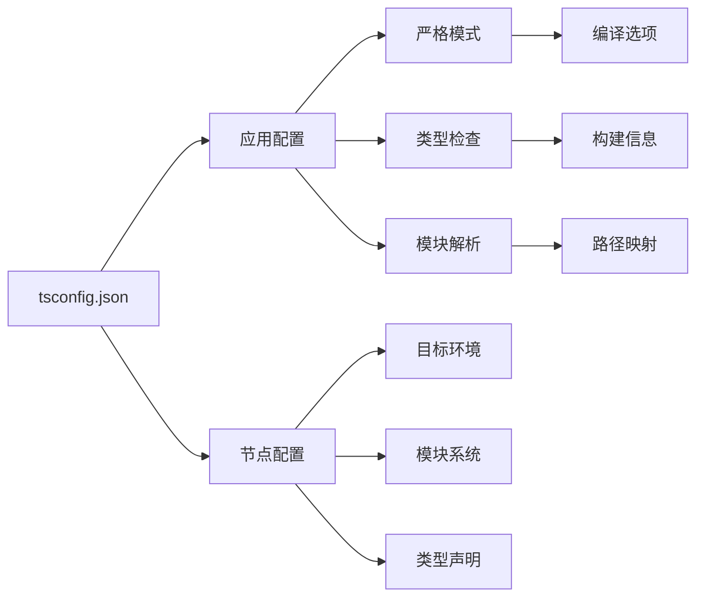

**图表来源**
- [tsconfig.json:1-8](file://tsconfig.json#L1-L8)
- [tsconfig.app.json:1-17](file://tsconfig.app.json#L1-L17)
- [tsconfig.node.json:1-27](file://tsconfig.node.json#L1-L27)

**章节来源**
- [package.json:1-26](file://package.json#L1-L26)
- [tsconfig.json:1-8](file://tsconfig.json#L1-L8)
- [tsconfig.app.json:1-17](file://tsconfig.app.json#L1-L17)
- [tsconfig.node.json:1-27](file://tsconfig.node.json#L1-L27)

## 性能考虑

### 构建优化策略

基于当前配置，建议实施以下性能优化：

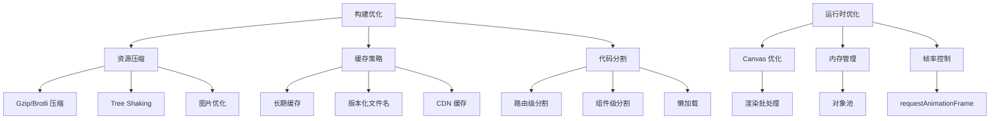

### 性能监控指标

建议实施以下监控指标：

| 指标类型 | 监控内容 | 建议阈值 |
|---------|---------|---------|
| 构建性能 | 打包时间 | < 30秒 |
| 运行时性能 | FPS | > 55 FPS |
| 内存使用 | 峰值内存 | < 150MB |
| 首屏加载 | TTFB | < 200ms |
| 交互响应 | 输入延迟 | < 16ms |

## 故障排除指南

### 常见构建问题

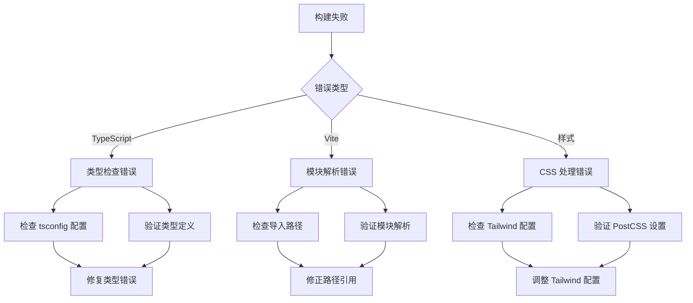

### 开发环境调试

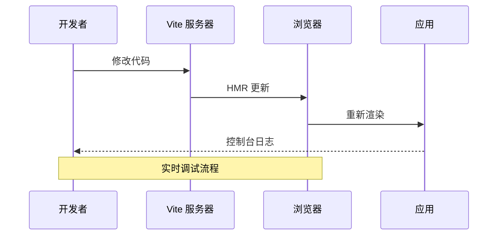

### 生产环境问题诊断

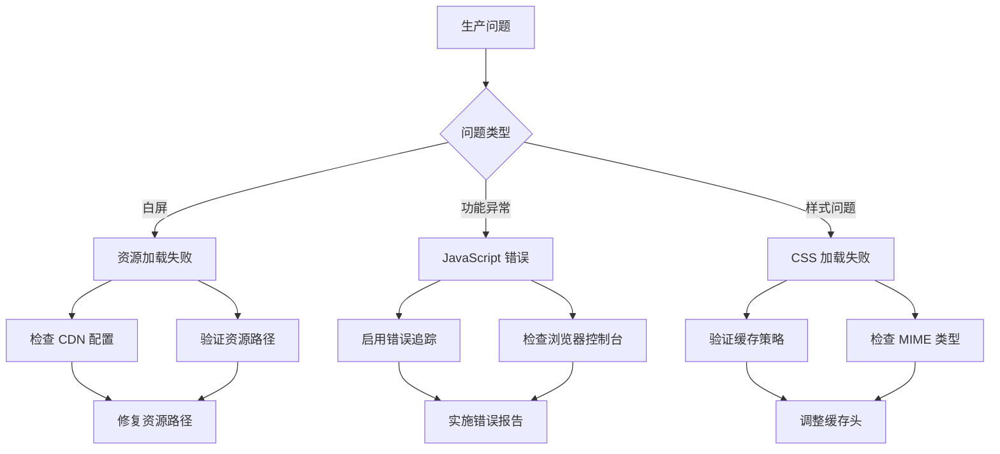

**章节来源**
- [vite.config.ts:1-8](file://vite.config.ts#L1-L8)
- [package.json:6-10](file://package.json#L6-L10)
- [src/App.vue:46-50](file://src/App.vue#L46-L50)

## 结论

Reimagined Journey 项目展现了现代前端开发的最佳实践，具有以下优势：

**技术优势**:
- 清晰的架构分离和职责划分
- 强类型的开发体验
- 高性能的构建工具链
- 完善的样式系统

**部署建议**:
- 实施渐进式缓存策略
- 优化资源加载优先级
- 配置适当的错误追踪
- 建立性能监控体系

**未来改进方向**:
- 添加 PWA 支持
- 实施更精细的代码分割
- 优化 Canvas 渲染性能
- 增强离线功能

## 附录

### 版本管理和发布流程

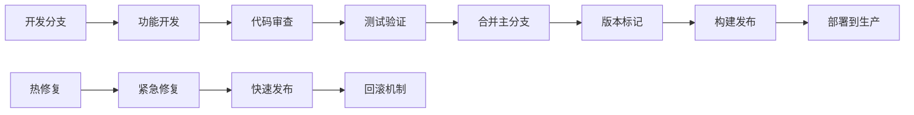

### 部署平台对比

| 平台类型 | 优点 | 缺点 | 适用场景 |
|---------|------|------|----------|
| 静态托管 | 部署简单、成本低 | 功能有限 | 小型应用 |
| CDN 分发 | 全球加速、缓存友好 | 成本较高 | 全球用户 |
| 本地服务器 | 完全控制、功能丰富 | 维护复杂 | 企业应用 |
| 容器化 | 可扩展性强 | 学习曲线 | 微服务架构 |

### 性能评估方法

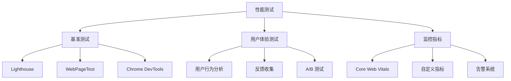