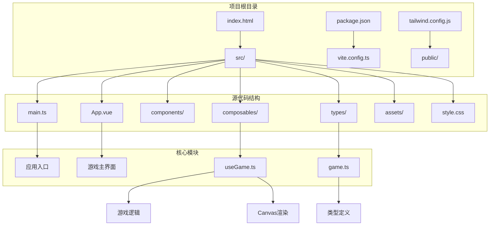
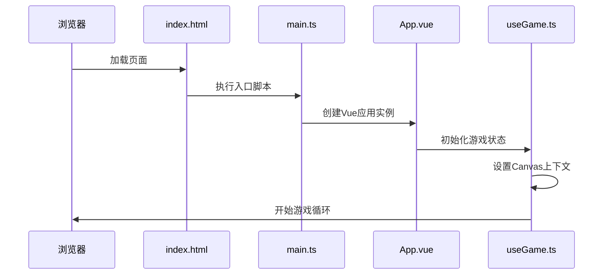
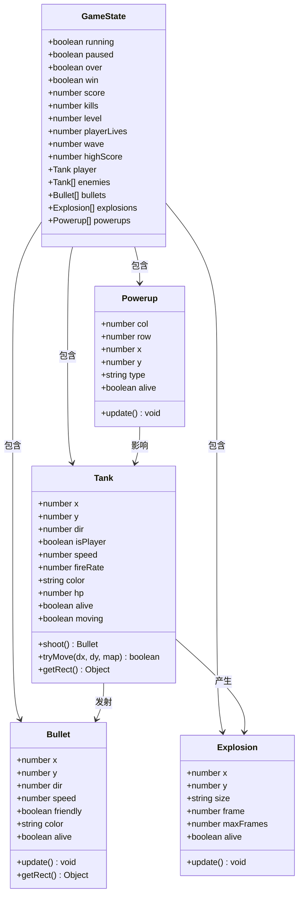
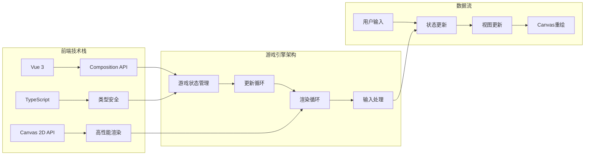
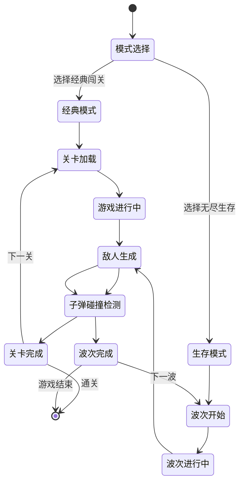
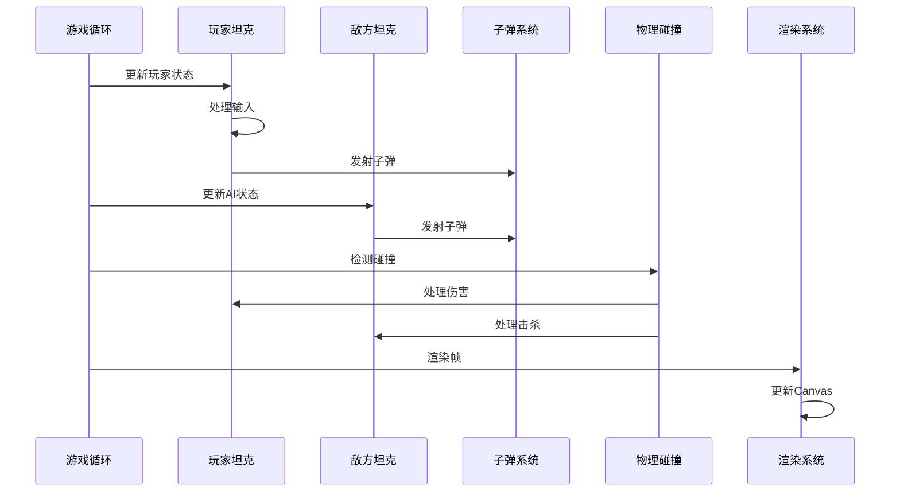
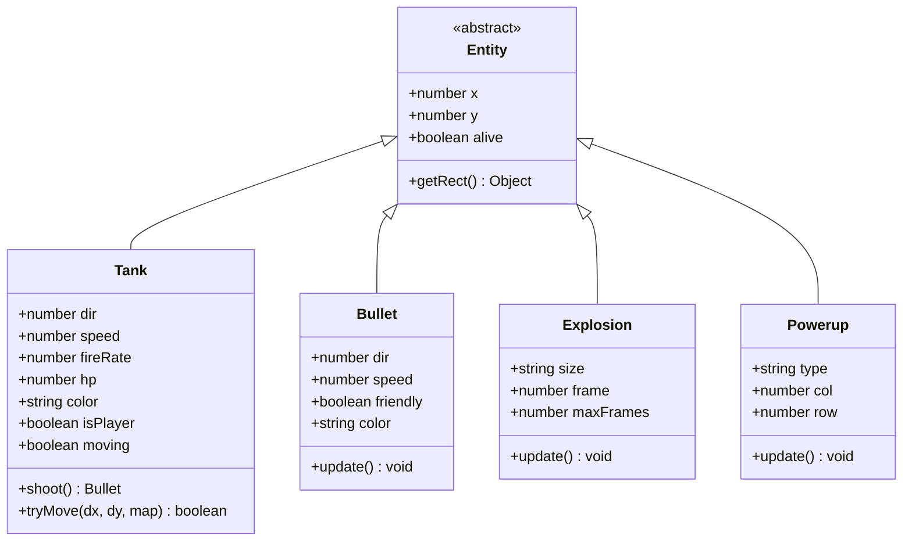
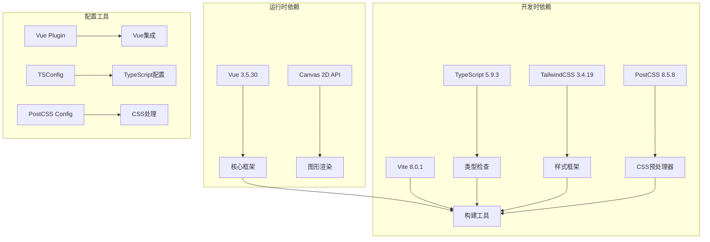
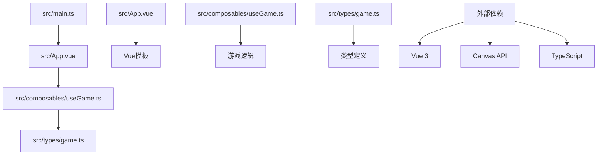

# 项目概述

<cite>
**本文档引用的文件**
- [README.md](file://README.md)
- [package.json](file://package.json)
- [src/main.ts](file://src/main.ts)
- [src/App.vue](file://src/App.vue)
- [src/composables/useGame.ts](file://src/composables/useGame.ts)
- [src/types/game.ts](file://src/types/game.ts)
- [index.html](file://index.html)
- [vite.config.ts](file://vite.config.ts)
- [tailwind.config.js](file://tailwind.config.js)
</cite>

## 目录
1. [项目简介](#项目简介)
2. [项目结构](#项目结构)
3. [核心组件](#核心组件)
4. [架构概览](#架构概览)
5. [详细组件分析](#详细组件分析)
6. [依赖关系分析](#依赖关系分析)
7. [性能考虑](#性能考虑)
8. [故障排除指南](#故障排除指南)
9. [结论](#结论)

## 项目简介

Reimagined Journey 是一个现代化的《坦克大战》游戏项目，采用 Vue 3 + TypeScript + Canvas 2D API 技术栈构建。该项目旨在为经典街机游戏提供现代化的用户体验，同时保持原作的核心玩法精髓。

### 核心目标
- 提供流畅的现代 Web 游戏体验
- 保持经典《坦克大战》的游戏机制和挑战性
- 展示现代前端技术在游戏开发中的应用
- 支持多种游戏模式，满足不同玩家需求

### 主要特性
- **双模式游戏系统**：经典闯关模式和无尽生存模式
- **丰富的视觉效果**：粒子爆炸、动态光影、地形渲染
- **智能 AI 系统**：不同类型的敌人具有独特的行为模式
- **道具系统**：护盾、快速射击、生命值、炸弹等增益效果
- **响应式设计**：适配各种屏幕尺寸和设备

### 技术亮点
- **Vue 3 Composition API**：提供更好的类型安全和代码组织
- **TypeScript 类型系统**：完整的类型定义和编译时错误检测
- **Canvas 2D API**：高性能的像素级图形渲染
- **模块化架构**：清晰的组件分离和职责划分

## 项目结构

项目采用现代化的前端项目结构，遵循 Vue 3 的最佳实践：



**图表来源**
- [src/main.ts:1-6](file://src/main.ts#L1-L6)
- [src/App.vue:1-305](file://src/App.vue#L1-L305)
- [src/composables/useGame.ts:1-1282](file://src/composables/useGame.ts#L1-L1282)
- [src/types/game.ts:1-300](file://src/types/game.ts#L1-L300)

**章节来源**
- [package.json:1-26](file://package.json#L1-L26)
- [index.html:1-14](file://index.html#L1-L14)

## 核心组件

### 应用入口与配置

项目采用标准的 Vue 3 应用结构，通过单一入口文件启动整个应用：



**图表来源**
- [src/main.ts:1-6](file://src/main.ts#L1-L6)
- [src/App.vue:1-305](file://src/App.vue#L1-L305)
- [src/composables/useGame.ts:1267-1282](file://src/composables/useGame.ts#L1267-L1282)

### 游戏核心系统

游戏采用模块化的架构设计，将不同的功能模块分离到独立的文件中：



**图表来源**
- [src/composables/useGame.ts:229-301](file://src/composables/useGame.ts#L229-L301)
- [src/composables/useGame.ts:16-138](file://src/composables/useGame.ts#L16-L138)
- [src/composables/useGame.ts:140-172](file://src/composables/useGame.ts#L140-L172)
- [src/composables/useGame.ts:174-195](file://src/composables/useGame.ts#L174-L195)
- [src/composables/useGame.ts:197-223](file://src/composables/useGame.ts#L197-L223)

**章节来源**
- [src/composables/useGame.ts:1-1282](file://src/composables/useGame.ts#L1-L1282)

## 架构概览

### 技术选型分析

项目选择了 Vue 3 + TypeScript + Canvas 2D API 的技术组合，这种组合在游戏开发领域具有独特的优势：



**图表来源**
- [src/App.vue:1-305](file://src/App.vue#L1-L305)
- [src/composables/useGame.ts:731-792](file://src/composables/useGame.ts#L731-L792)

### 游戏模式架构

项目实现了两种核心游戏模式，每种模式都有其独特的游戏流程和机制：



**图表来源**
- [src/App.vue:19-83](file://src/App.vue#L19-L83)
- [src/composables/useGame.ts:1162-1235](file://src/composables/useGame.ts#L1162-L1235)

**章节来源**
- [src/App.vue:19-83](file://src/App.vue#L19-L83)
- [src/types/game.ts:23-33](file://src/types/game.ts#L23-L33)

## 详细组件分析

### 游戏主界面组件

App.vue 作为游戏的主要界面组件，负责协调整个游戏的用户交互和状态展示：

```mermaid
flowchart TD
A[应用启动] --> B[初始化Canvas]
B --> C[显示模式选择界面]
C --> D{选择游戏模式}
D --> |经典模式| E[加载经典模式]
D --> |生存模式| F[加载生存模式]
E --> G[关卡界面]
F --> H[波次界面]
G --> I[游戏进行中]
H --> I
I --> J[键盘输入处理]
J --> K[游戏状态更新]
K --> L[Canvas渲染]
L --> M{游戏结束?}
M --> |否| J
M --> |是| N[显示结束界面]
N --> O{重新开始?}
O --> |是| C
O --> |否| [*]
```

**图表来源**
- [src/App.vue:46-83](file://src/App.vue#L46-L83)
- [src/App.vue:19-44](file://src/App.vue#L19-L44)

#### 用户界面元素

游戏界面包含了丰富的 UI 元素，为玩家提供直观的操作指导：

| UI 组件 | 功能描述 | 实现方式 |
|---------|----------|----------|
| 模式选择卡片 | 经典模式和生存模式的选择界面 | Vue 模板绑定和事件处理 |
| 游戏画布 | 主要的游戏渲染区域 | Canvas 2D API |
| 侧边栏面板 | 显示游戏状态和统计信息 | 响应式布局和条件渲染 |
| 控制提示 | 显示操作说明和按键映射 | 文本内容和样式类 |
| 结束界面 | 游戏结果展示和选项 | 条件显示和状态管理 |

**章节来源**
- [src/App.vue:86-305](file://src/App.vue#L86-L305)

### 游戏逻辑核心

useGame.ts 文件实现了游戏的核心逻辑，包括游戏状态管理、物理模拟、AI 行为等：



**图表来源**
- [src/composables/useGame.ts:731-792](file://src/composables/useGame.ts#L731-L792)
- [src/composables/useGame.ts:533-636](file://src/composables/useGame.ts#L533-L636)

#### 游戏实体系统

游戏包含多种不同类型的实体，每种实体都有其独特的属性和行为：



**图表来源**
- [src/composables/useGame.ts:16-138](file://src/composables/useGame.ts#L16-L138)
- [src/composables/useGame.ts:140-172](file://src/composables/useGame.ts#L140-L172)
- [src/composables/useGame.ts:174-195](file://src/composables/useGame.ts#L174-L195)
- [src/composables/useGame.ts:197-223](file://src/composables/useGame.ts#L197-L223)

**章节来源**
- [src/composables/useGame.ts:16-1282](file://src/composables/useGame.ts#L16-L1282)

### 游戏类型系统

game.ts 文件定义了游戏的基础类型和常量，为整个项目提供了类型安全保障：

```mermaid
graph TB
subgraph "基础类型定义"
A[GameMode] --> B['classic' | 'survival']
C[TankType] --> D[0-5]
E[PowerupType] --> F['shield' | 'rapidfire' | 'life' | 'bomb']
end
subgraph "游戏常量"
G[TILE_SIZE] --> H[48]
I[GRID_SIZE] --> J[13x13]
K[DIRECTIONS] --> L[UP, RIGHT, DOWN, LEFT]
end
subgraph "地图类型"
M[TerrainType] --> N[TILE_EMPTY, TILE_BRICK, TILE_STEEL, TILE_WATER, TILE_FOREST, TILE_BASE]
end
subgraph "配置接口"
O[WaveConfig] --> P[enemyCount, enemyTypes, speedMultiplier, hpMultiplier, hasBoss]
Q[GameState] --> R[运行状态, 暂停状态, 游戏结束状态]
end
```

**图表来源**
- [src/types/game.ts:23-33](file://src/types/game.ts#L23-L33)
- [src/types/game.ts:12-17](file://src/types/game.ts#L12-L17)
- [src/types/game.ts:19-21](file://src/types/game.ts#L19-L21)

**章节来源**
- [src/types/game.ts:1-300](file://src/types/game.ts#L1-L300)

## 依赖关系分析

### 项目依赖结构

项目采用了精简但功能完整的依赖体系，专注于游戏开发的核心需求：



**图表来源**
- [package.json:11-24](file://package.json#L11-L24)
- [vite.config.ts:1-8](file://vite.config.ts#L1-L8)
- [tailwind.config.js:1-12](file://tailwind.config.js#L1-L12)

### 模块导入关系

项目中的模块导入关系体现了清晰的分层架构：



**图表来源**
- [src/main.ts:1-6](file://src/main.ts#L1-L6)
- [src/App.vue:1-10](file://src/App.vue#L1-L10)
- [src/composables/useGame.ts:1-10](file://src/composables/useGame.ts#L1-L10)

**章节来源**
- [package.json:1-26](file://package.json#L1-L26)

## 性能考虑

### 游戏性能优化策略

项目在性能方面采用了多项优化措施，确保游戏在各种设备上都能流畅运行：

1. **Canvas 渲染优化**
   - 使用 requestAnimationFrame 实现高效的动画循环
   - 仅在必要时重绘 Canvas 内容
   - 合理的脏矩形更新策略

2. **内存管理**
   - 对象池模式避免频繁的对象创建和销毁
   - 及时清理不再使用的对象引用
   - 合理的垃圾回收策略

3. **算法优化**
   - 空间分割算法优化碰撞检测
   - 分帧处理大量实体的更新
   - 预计算和缓存常用数据

4. **资源管理**
   - Canvas 上下文状态最小化
   - 图形绘制命令批量化
   - 避免不必要的 DOM 操作

### 性能监控指标

| 性能指标 | 目标值 | 测量方法 |
|----------|--------|----------|
| FPS | ≥ 60 | requestAnimationFrame 回调间隔 |
| 渲染时间 | ≤ 16ms | 单帧渲染耗时测量 |
| 内存使用 | ≤ 50MB | 浏览器内存监控 |
| CPU 占用 | ≤ 50% | 性能分析工具 |

## 故障排除指南

### 常见问题及解决方案

#### 游戏无法启动

**症状**：页面空白或控制台报错
**可能原因**：
- Vue 应用实例创建失败
- Canvas 元素未正确初始化
- 类型定义错误

**解决步骤**：
1. 检查浏览器控制台错误信息
2. 验证 main.ts 中的应用入口配置
3. 确认 Canvas 元素的 DOM 结构
4. 检查 TypeScript 编译错误

#### 游戏画面异常

**症状**：画面闪烁或渲染错误
**可能原因**：
- Canvas 上下文丢失
- 渲染循环中断
- 内存泄漏

**解决步骤**：
1. 检查 Canvas 宽高设置
2. 验证渲染函数的执行状态
3. 监控内存使用情况
4. 确认 requestAnimationFrame 的正确使用

#### 输入响应问题

**症状**：键盘输入无响应或延迟
**可能原因**：
- 事件监听器重复绑定
- 键盘事件冒泡问题
- 浏览器焦点管理

**解决步骤**：
1. 检查键盘事件监听器的生命周期
2. 验证事件处理器的防抖机制
3. 确认 Canvas 元素的焦点状态
4. 测试不同浏览器的兼容性

**章节来源**
- [src/App.vue:46-50](file://src/App.vue#L46-L50)
- [src/composables/useGame.ts:1244-1265](file://src/composables/useGame.ts#L1244-L1265)

## 结论

Reimagined Journey 项目成功地将经典《坦克大战》游戏移植到了现代 Web 平台上，展现了 Vue 3 + TypeScript + Canvas 2D API 技术组合在游戏开发中的强大能力。

### 项目优势

1. **技术先进性**：采用最新的前端技术栈，确保项目的可维护性和扩展性
2. **游戏品质**：保持了经典游戏的核心乐趣，同时提供了现代化的视觉效果
3. **架构清晰**：模块化的设计使得代码易于理解和维护
4. **性能优秀**：通过合理的优化策略，在各种设备上都能提供流畅的游戏体验

### 创新之处

1. **双模式设计**：经典模式和生存模式的结合，满足不同玩家的需求
2. **智能 AI 系统**：多样化的敌人类型和行为模式
3. **道具系统**：丰富的增益效果增加了游戏的策略性
4. **响应式界面**：适配各种屏幕尺寸的用户界面设计

### 技术价值

该项目为 Web 游戏开发提供了优秀的参考案例，展示了如何在现代前端技术栈下实现复杂的游戏逻辑。其模块化的架构设计、完善的类型系统和性能优化策略，都为后续的项目开发提供了宝贵的经验。